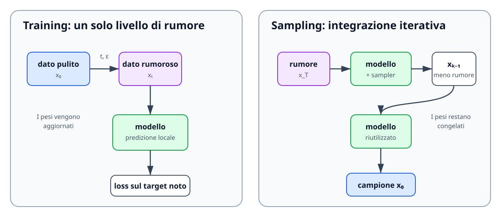

# Introduzione ai Diffusion Models

Un diffusion model apprende a generare dati trasformando progressivamente una variabile casuale semplice in un campione strutturato. L'immagine intuitiva è quella di un processo che parte da rumore gaussiano e lo converte, attraverso una successione di correzioni, in un'immagine, un segnale audio o una traiettoria robotica plausibile.

Il punto essenziale è distinguere **ciò che viene costruito matematicamente** da **ciò che deve essere appreso**. Il processo forward che corrompe i dati viene scelto dal progettista ed è direttamente campionabile. Il modello neurale apprende invece l'informazione necessaria per percorrere il cammino inverso.

## Dal dato al rumore

Sia $x_0\sim p_{\mathrm{data}}$ un campione pulito. Nel caso delle immagini, $x_0$ contiene i pixel; nel caso di una policy robotica può contenere un'azione $a_t$ o un action chunk. Il processo forward produce una sequenza

$$
x_0,x_1,\ldots,x_T,
$$

nella quale la struttura originaria viene progressivamente attenuata e sostituita da rumore. Idealmente, al termine del processo,

$$
x_T\sim\mathcal{N}(0,I).
$$

Questa trasformazione è deliberatamente semplice. Non occorre addestrare una rete per aggiungere rumore: è sufficiente campionare variabili gaussiane secondo uno schedule prestabilito. La difficoltà generativa viene trasferita al processo inverso, che deve ricostruire come la probabilità si distribuisce nello spazio dei dati.

Una rappresentazione schematica è

```text
dato pulito → dato parzialmente rumoroso → quasi rumore → rumore gaussiano
    x₀                    xₜ                         x_T
```

Il termine **diffusione** non indica quindi che il modello scopra autonomamente come distruggere il dato. Indica la famiglia di perturbazioni che collega la distribuzione dei dati a un prior trattabile.

## Il problema appreso durante il training

Durante il training non si esegue normalmente l'intera catena $x_0\rightarrow x_1\rightarrow\cdots\rightarrow x_t$. Per le perturbazioni gaussiane usate nei DDPM è possibile campionare direttamente un livello arbitrario:

$$
x_t
=
\sqrt{\bar\alpha_t}\,x_0
+
\sqrt{1-\bar\alpha_t}\,\epsilon,
\qquad
\epsilon\sim\mathcal{N}(0,I).
$$

La quantità $\bar\alpha_t$ misura quanta parte del segnale originario rimane al timestep $t$. Un singolo esempio di training segue quindi questa procedura:

```text
campione x₀
    ↓
scelta casuale di t e del rumore ε
    ↓
costruzione diretta di xₜ
    ↓
modello(xₜ, t, condizione)
    ↓
confronto con il target noto
```

Nella parametrizzazione più nota il target è proprio $\epsilon$. Il modello $\epsilon_\theta$ minimizza

$$
\mathcal{L}_{\epsilon}(\theta)
=
\mathbb{E}_{x_0,t,\epsilon}
\left[
\left\|\epsilon-\epsilon_\theta(x_t,t)\right\|_2^2
\right].
$$

Il task supervisionato appare come una semplice rimozione del rumore, ma richiede di apprendere regolarità della distribuzione. Per distinguere il segnale dalla perturbazione, il modello deve riconoscere quali configurazioni siano plausibili ai diversi livelli di rumore.

## La generazione è un processo iterativo

Durante l'inferenza il campione pulito non è disponibile. Si parte da

$$
x_T\sim\mathcal{N}(0,I)
$$

e si applica ripetutamente il modello attraverso un **sampler**:

```text
x_T → x_{T-1} → x_{T-2} → … → x₁ → x₀.
```

La rete fornisce a ogni passo una stima locale; è il sampler a convertirla nel prossimo stato. Per questo motivo modello e algoritmo di sampling non devono essere confusi. Lo stesso network può essere usato con aggiornamenti stocastici o deterministici, con un numero diverso di passi e con integratori di ordine differente.

Il training richiede normalmente una sola valutazione del modello per esempio, perché il timestep viene campionato. La generazione richiede invece più **network function evaluations**. Questa asimmetria spiega perché i diffusion model siano parallelizzabili durante il training ma possano presentare una latenza elevata in inferenza.



*Nel training si costruisce direttamente un livello rumoroso e si aggiorna il modello usando un target noto. Nel sampling gli stessi pesi rimangono congelati e vengono applicati più volte all'interno di una procedura iterativa.*

## Condizionamento

Un modello incondizionato apprende $p_\theta(x)$. Un modello condizionato rappresenta invece

$$
p_\theta(x\mid c),
$$

dove $c$ può essere una classe, un testo, un'immagine, una mappa di profondità oppure un'osservazione robotica. Nei sistemi text-to-image, un text encoder converte il prompt in embedding utilizzati dal denoiser, spesso mediante cross-attention.

Nel robot learning la condizione può essere scritta come

$$
c_t=(o_t,l),
$$

dove $o_t$ è l'osservazione e $l$ l'istruzione linguistica. Il campione generato può essere un action chunk

$$
A_t=[a_t,a_{t+1},\ldots,a_{t+H-1}].
$$

Il modello apprende così $p_\theta(A_t\mid o_t,l)$ anziché una sola regressione deterministica. Se due strategie sono entrambe compatibili con la scena, la distribuzione può assegnare probabilità a entrambe senza mediarle necessariamente in un'azione fisicamente scorretta.

## Pixel space, latent space e action space

La formulazione non impone che $x$ rappresenti pixel. Nei **pixel-space diffusion model** il processo opera direttamente sull'immagine, conservando tutti i dettagli ma sostenendo un costo elevato. Nei **latent diffusion model** un encoder produce una rappresentazione compressa $z_0$; la diffusione avviene su $z_t$ e un decoder ricostruisce infine l'immagine.

Nelle policy generative, $x$ può coincidere con azioni normalizzate. La nozione di rumore assume allora un significato geometrico nello spazio dei comandi: scale incoerenti tra traslazioni, rotazioni e gripper alterano la difficoltà del problema. La normalizzazione dell'action space non è quindi un dettaglio accessorio, ma definisce la metrica implicita della loss.

## Che cosa apprende realmente il modello

La frase «il modello rimuove il rumore» è utile ma incompleta. Una descrizione più precisa è che il network apprende un oggetto dipendente dal tempo che permette di muoversi tra distribuzioni intermedie. A seconda della formulazione, questo oggetto può essere:

- il rumore $\epsilon$ presente nel campione;
- il dato pulito $x_0$;
- una combinazione chiamata $v$;
- lo score $\nabla_x\log p_t(x)$;
- il campo di velocità $u_t(x)$ di una ODE.

Queste parametrizzazioni sono strettamente collegate, ma non sono intercambiabili senza applicare i corretti fattori dipendenti dal tempo. Il capitolo sui fondamenti matematici rende esplicite tali relazioni.

## Limiti dell'intuizione del denoising

Non esiste un'immagine nascosta nel rumore iniziale che il modello debba semplicemente scoprire. Il campione finale dipende dal rumore iniziale, dalla condizione e dalla traiettoria numerica seguita dal sampler. Il processo costruisce progressivamente un campione coerente con la distribuzione appresa.

Non è inoltre corretto identificare ogni metodo iterativo con un DDPM. DDPM, score-based SDE e Flow Matching possono usare network simili e produrre una sequenza visivamente analoga, ma differiscono per probability path, target di training e dinamica generativa. La distinzione tra questi elementi permette di confrontare i metodi senza affidarsi soltanto alla terminologia.

Il passaggio successivo consiste quindi nel descrivere la famiglia $p_t(x)$ e mostrare perché la predizione del rumore sia collegata allo score. Questo collegamento fornisce il ponte teorico tra la visione discreta dei DDPM e le formulazioni continue.
