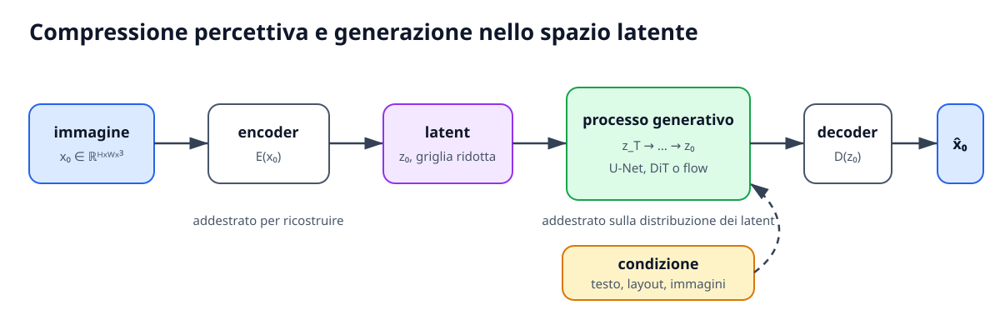

# VAE, Latent Diffusion e modelli moderni

Applicare la diffusione direttamente ai pixel impone al denoiser di elaborare tensori alla risoluzione finale in ogni passo di sampling. I **Latent Diffusion Models (LDM)** separano due problemi: un autoencoder apprende una rappresentazione compatta che conserva l'informazione percettivamente rilevante, mentre il modello generativo apprende la distribuzione di tali rappresentazioni.

Questa separazione non è soltanto un'ottimizzazione. Definisce lo spazio nel quale vengono misurate distanze, aggiunto rumore e appreso il campo generativo. La qualità del decoder pone inoltre un limite superiore alla qualità dell'immagine ricostruibile.

## Autoencoder e bottleneck latente

Un autoencoder contiene un encoder $E$ e un decoder $D$:

$$
z=E(x),
\qquad
\hat x=D(z).
$$

Il bottleneck $z$ deve essere abbastanza piccolo da eliminare ridondanza, ma abbastanza ricco da preservare struttura, semantica e dettagli. Una semplice loss di ricostruzione può produrre latent irregolari e difficili da modellare; per questo gli LDM utilizzano autoencoder regolarizzati, spesso con una formulazione variazionale o con quantizzazione vettoriale.

## Variational Autoencoder

Un **Variational Autoencoder (VAE)** non associa a $x$ un singolo punto, ma i parametri di una distribuzione approssimata:

$$
q_\phi(z\mid x)
=
\mathcal{N}
\left(
z;\mu_\phi(x),
\operatorname{diag}(\sigma_\phi(x)^2)
\right).
$$

Il prior è in genere $p(z)=\mathcal{N}(0,I)$ e il decoder definisce $p_\psi(x\mid z)$. La log-likelihood viene ottimizzata tramite la ELBO:

$$
\log p(x)
\geq
\mathbb{E}_{q_\phi(z\mid x)}
[\log p_\psi(x\mid z)]
-
D_{\mathrm{KL}}
\left(q_\phi(z\mid x)\|p(z)\right).
$$

Il primo termine premia la ricostruzione; la divergenza KL regolarizza lo spazio latente. Per propagare il gradiente attraverso il campionamento si usa il **reparameterization trick**:

$$
z
=
\mu_\phi(x)
+
\sigma_\phi(x)\odot\epsilon,
\qquad
\epsilon\sim\mathcal{N}(0,I).
$$

Negli autoencoder percettivi per latent diffusion, la ricostruzione può combinare errori nei pixel, feature percettive e loss adversarial. Una KL relativamente debole mantiene il latent continuo senza imporre una compressione tale da cancellare dettagli importanti.

## Diffusione nello spazio latente

Dopo l'addestramento dell'autoencoder, il dato viene codificato come

$$
z_0=E(x_0).
$$

Il forward process opera su $z_0$:

$$
z_t
=
\alpha(t)z_0
+
\sigma(t)\epsilon.
$$

Il denoiser apprende $p_\theta(z_0)$ o $p_\theta(z_0\mid c)$. In generazione si campiona $z_T$, si integra il processo inverso e si decodifica una sola volta:

$$
z_T
\longrightarrow
z_0
\xrightarrow{D}
\hat x_0.
$$

Se l'encoder riduce altezza e larghezza di un fattore $f$, il numero di posizioni elaborate dal denoiser diminuisce approssimativamente di $f^2$. Il guadagno rende praticabile il training ad alta risoluzione, ma una compressione troppo aggressiva trasferisce al decoder un problema impossibile: dettagli eliminati da $E$ non possono essere recuperati in modo fedele.

*L'autoencoder svolge la compressione percettiva, mentre il processo generativo opera sulla griglia latente e riceve le eventuali condizioni. Il decoder viene applicato soltanto dopo aver ottenuto il latent finale.*

Il lavoro [High-Resolution Image Synthesis with Latent Diffusion Models](https://arxiv.org/abs/2112.10752) mostra che uno spazio percettivo moderatamente compresso offre un compromesso efficace tra costo e qualità.

## Condizionamento tramite cross-attention

L'LDM può ricevere una condizione $c$, per esempio un testo codificato in token $C$. Nei blocchi di cross-attention, le feature latenti forniscono le query, mentre la condizione fornisce key e value:

$$
\operatorname{Attention}(Q,K,V)
=
\operatorname{softmax}
\left(
\frac{QK^\top}{\sqrt{d}}
\right)V.
$$

Questa interfaccia separa il formato della condizione dalla griglia visuale e consente di usare testo, layout, semantic map o altre modalità. Il modello non genera parole: usa rappresentazioni linguistiche per modificare il campo di denoising nel latent space.

## Stable Diffusion

**Stable Diffusion** rende popolare la pipeline latent diffusion text-to-image. La struttura essenziale comprende:

- un autoencoder percettivo che comprime e ricostruisce le immagini;
- un text encoder che produce embedding del prompt;
- una U-Net latente condizionata tramite cross-attention;
- un noise schedule, una parametrizzazione del target e un sampler;
- classifier-free guidance per controllare l'intensità del condizionamento.

Durante il training, il VAE e il text encoder sono tipicamente pre-addestrati e il denoiser apprende a predire il target su latent rumorosi. Durante l'inferenza il prompt viene codificato, il latent viene generato iterativamente e il decoder produce l'immagine RGB.

Il nome del modello non identifica una singola equazione. Versioni differenti possono cambiare text encoder, risoluzione, target, schedule, architettura e dati, pur mantenendo la stessa decomposizione generale.

## Dai denoiser convoluzionali ai Diffusion Transformer

Le U-Net incorporano un forte bias multiscala e sono efficienti sulle griglie. I **Diffusion Transformer (DiT)** trattano invece il latent come una sequenza di patch e usano blocchi Transformer condizionati sul timestep e sulla classe o sul testo. Il [paper DiT](https://arxiv.org/abs/2212.09748) mostra che l'aumento del compute del forward pass, ottenuto tramite profondità, larghezza o più token, è associato a un miglioramento sistematico della qualità nel setting studiato.

La sostituzione della U-Net non implica l'abbandono della diffusione. Un DiT può essere addestrato con noise prediction, velocity prediction o Flow Matching. **Backbone** e **obiettivo generativo** sono assi distinti.

## Modelli multimodali e rectified flow

Le architetture text-to-image moderne tendono a integrare più profondamente token testuali e visuali. Invece di usare soltanto cross-attention da immagine a testo, un Transformer può mantenere stream con parametri separati e consentire interazioni bidirezionali tra le modalità.

Il lavoro [Scaling Rectified Flow Transformers for High-Resolution Image Synthesis](https://arxiv.org/abs/2403.03206), associato a Stable Diffusion 3, combina un'architettura Transformer multimodale con **rectified flow**. Il modello non è quindi un DDPM classico pur conservando autoencoder, rappresentazione latente, condizionamento testuale e sampling iterativo. Questo esempio mostra perché «latent diffusion» venga talvolta usato informalmente per sistemi che, in senso matematico, apprendono un campo di velocità anziché una reverse chain discreta.

Per il video, l'autoencoder può comprimere anche la dimensione temporale e il backbone deve modellare coerenza tra frame. Il principio rimane lo stesso, ma gli artefatti del decoder diventano spazio-temporali e il numero di token cresce rapidamente con durata e risoluzione.

## Vantaggi e limiti dello spazio latente

Il vantaggio principale è la **riduzione del costo**: il modello generativo dedica capacità alla struttura semantica anziché riprodurre ripetutamente dettagli locali ad alta frequenza. Il latent facilita inoltre il riuso di un decoder e il training di backbone più grandi.

Il costo è una dipendenza forte dall'autoencoder. Errori cromatici, texture artificiali o perdita di testo minuto possono derivare dal decoder e non dal processo generativo. Inoltre, la distribuzione dei latent non è necessariamente gaussiana standard: scaling e normalizzazione devono essere coerenti tra training dell'autoencoder e training generativo.

Una valutazione corretta deve perciò distinguere **reconstruction quality** del VAE, qualità del modello nel latent space e qualità del sampling. Confrontare due denoiser che utilizzano autoencoder differenti non isola il contributo della sola architettura generativa.
