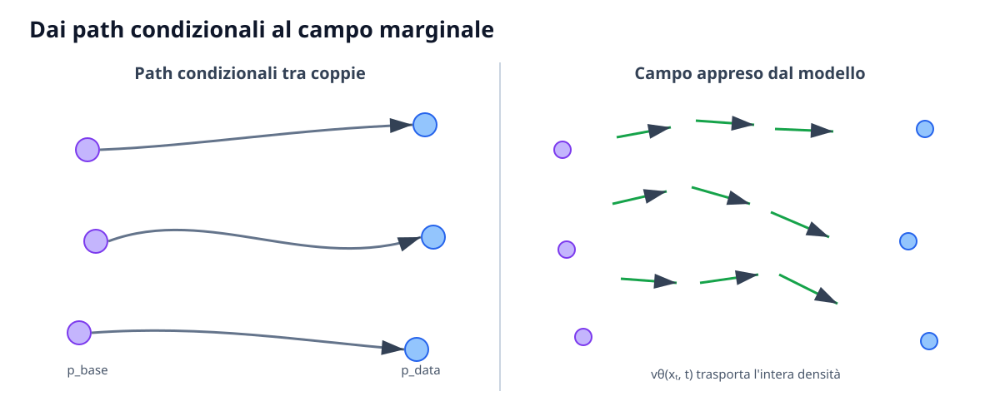

# Continuous Normalizing Flows e Flow Matching

Il **Flow Matching (FM)** apprende direttamente un campo di velocità che trasporta una distribuzione base verso la distribuzione dei dati. Rispetto alla prospettiva del denoising, la domanda cambia: non si chiede quale rumore sia presente nel campione, ma quale velocità debba avere una particella nella posizione $x$ e al tempo $t$ per seguire un probability path desiderato.

La formulazione nasce dai **Continuous Normalizing Flows (CNF)**. I CNF sono espressivi e consentono sampling deterministico, ma il loro addestramento tramite likelihood richiede tradizionalmente integrare una ODE e calcolare divergenze. Flow Matching sostituisce questo problema con una regressione supervisionata, simulation-free durante il training.

## Continuous Normalizing Flows

Un CNF definisce una ODE

$$
\frac{dx_t}{dt}
=
v_\theta(x_t,t)
\qquad
x_0\sim p_0
$$

dove $p_0$ è una distribuzione semplice e $v_\theta$ un campo vettoriale. La soluzione $\phi_t$ trasporta il campione iniziale:

$$
x_t=\phi_t(x_0)
$$

Se il flusso è regolare, la densità evolve secondo l'equazione di continuità:

$$
\partial_t p_t(x)
+
\nabla_x\cdot
\left(p_t(x)v_\theta(x,t)\right)
=0
$$

Lungo una traiettoria vale la instantaneous change of variables:

$$
\frac{d}{dt}\log p_t(x_t)
=
-\nabla_x\cdot v_\theta(x_t,t)
$$

Questa identità consente di calcolare likelihood integrando anche la variazione della log-densità. In alta dimensione, tuttavia, la divergenza e il backpropagation attraverso il solver possono essere costosi.

## Probability path e campo marginale

Flow Matching parte scegliendo una famiglia di densità

$$
p_t
\qquad t\in[0,1]
$$

con $p_0=p_{\mathrm{base}}$ e $p_1\approx p_{\mathrm{data}}$. Si assume che esista un campo target $u_t(x)$ che genera tale path mediante l'equazione di continuità.

Se $u_t$ fosse direttamente calcolabile, si potrebbe minimizzare

$$
\mathcal{L}_{\mathrm{FM}}(\theta)
=
\mathbb{E}_{t,x_t\sim p_t}
\left[
\left\|v_\theta(x_t,t)-u_t(x_t)\right\|_2^2
\right]
$$

Il problema è che il campo marginale dipende dalla distribuzione dei dati integrata su tutti i possibili endpoint e non è normalmente disponibile in forma chiusa.

## Conditional Flow Matching

Si introduce allora una variabile condizionante, per esempio un dato $x_1$. Per ogni endpoint si definisce un path condizionale $p_t(x\mid x_1)$ e un campo $u_t(x\mid x_1)$ calcolabile.

La loss diventa:

$$
\mathcal{L}_{\mathrm{CFM}}(\theta)
=
\mathbb{E}_{t,x_1,x_t}
\left[
\left\|
v_\theta(x_t,t)
-
u_t(x_t\mid x_1)
\right\|_2^2
\right].
$$

Il risultato chiave è che, sotto condizioni regolari, questa loss ha gli stessi gradienti della loss marginale a meno di una costante indipendente da $\theta$. Il network osserva soltanto $x_t$ e $t$, quindi la regressione media aggrega i campi condizionali nel corretto campo marginale.

Il training non richiede integrare la ODE. È sufficiente campionare endpoint, tempo e stato intermedio, da cui l'espressione **simulation-free training**.

## Interpolazione lineare

Il caso più semplice accoppia rumore $x_0$ e dato $x_1$ e definisce

$$
x_t
=
(1-t)x_0
+
t x_1.
$$

La derivata della traiettoria è costante:

$$
\frac{dx_t}{dt}=x_1-x_0.
$$

La loss condizionale è quindi

$$
\mathcal{L}(\theta)
=
\mathbb{E}
\left[
\left\|
v_\theta(x_t,t)-(x_1-x_0)
\right\|_2^2
\right].
$$

Questa semplicità è uno dei motivi della diffusione di rectified flow. Va però distinta la linearità dei path condizionali dalla geometria del campo marginale: quando molte coppie si sovrappongono, la velocità media può essere curva e complessa.

*I target sono costruiti su coppie tra distribuzione base e dati. Regressendo molte velocità condizionali, il modello apprende il campo marginale che trasporta l'intera densità.*

## Accoppiamento e Optimal Transport

Campionare $x_0$ e $x_1$ indipendentemente definisce un accoppiamento valido, ma non necessariamente efficiente. Coppie casuali possono attraversarsi e indurre campi con elevata curvatura. Un accoppiamento ispirato all'**Optimal Transport (OT)** cerca invece di associare endpoint riducendo il costo di trasporto.

Path più rettilinei sono interessanti perché una ODE meno curva può essere integrata accuratamente con meno passi. Nella pratica, ottenere l'accoppiamento OT esatto in alta dimensione è difficile; si usano approssimazioni su minibatch o procedure di reflow. L'efficienza del sampler dipende quindi sia dal solver sia dalla geometria appresa.

Il [paper Flow Matching](https://arxiv.org/abs/2210.02747) mostra che la formulazione supporta sia path diffusivi sia displacement interpolation di tipo OT.

## Relazione con diffusione e score

Un probability path gaussiano può essere scritto come

$$
x_t
=
\alpha(t)x_1
+
\sigma(t)\epsilon.
$$

Lo stesso path può essere descritto attraverso il suo score oppure attraverso un campo di velocità. Per coefficienti differenziabili, la velocity condizionale è

$$
u_t(x_t\mid x_1)
=
\dot\alpha(t)x_1
+
\dot\sigma(t)\epsilon.
$$

Sostituendo le stime di $x_1$ ed $\epsilon$ si può convertire tra noise prediction, score prediction e velocity prediction. **Diffusion e Flow Matching possono quindi condividere lo stesso probability path**, pur usando loss e interpretazioni differenti.

La probability flow ODE di uno score-based model è un ulteriore ponte: essa definisce già un campo deterministico con le stesse marginali della SDE. Flow Matching consente di apprendere un campo ODE direttamente, senza passare necessariamente dalla stima dello score.

## Sampling mediante ODE

Dopo il training si campiona $x_0\sim p_{\mathrm{base}}$ e si integra

$$
x_1
=
x_0
+
\int_0^1v_\theta(x_t,t)\,dt.
$$

Con Eulero e griglia $0=t_0<\cdots<t_K=1$,

$$
x_{k+1}
=
x_k
+
(t_{k+1}-t_k)v_\theta(x_k,t_k).
$$

Heun, Runge–Kutta e solver adattivi possono ridurre l'errore a parità di passi, ma ogni stadio addizionale richiede una nuova valutazione del network. Un solver adattivo offre controllo dell'errore, mentre in sistemi real-time una griglia fissa garantisce latenza prevedibile.

## Condizionamento e robot learning

Per una policy robotica il campo può essere condizionato su osservazione e istruzione:

$$
v_\theta(A_t^\tau,\tau,o_t,l),
$$

dove $A_t^\tau$ è un action chunk lungo il path generativo e $\tau$ distingue il tempo di flusso dal tempo fisico $t$. In inferenza, l'ODE trasforma rumore in una sequenza di azioni continue.

Il vantaggio rispetto a una regressione MSE deterministica è la capacità di rappresentare più strategie. Rispetto alla tokenizzazione, non viene imposta una quantizzazione delle coordinate. Il costo è che ogni decisione richiede più valutazioni, e piccoli errori di integrazione possono produrre comandi non validi se mancano clipping, normalizzazione o controlli di sicurezza.

## Limiti e scelte aperte

Flow Matching non elimina le scelte progettuali. Occorre specificare distribuzione base, orientamento temporale, probability path, accoppiamento, distribuzione di campionamento di $t$, target, condizionamento e solver. Cambiare convenzione da rumore-a-dato a dato-a-rumore cambia il segno della velocità; formule corrette prese da lavori con convenzioni opposte possono produrre implementazioni errate.

Un path teoricamente semplice non garantisce che il campo appreso lo sia, e un basso training loss non garantisce stabilità con pochi passi. La valutazione deve riportare qualità insieme al numero di network evaluations e, nelle policy, successo closed loop e latenza end-to-end.
