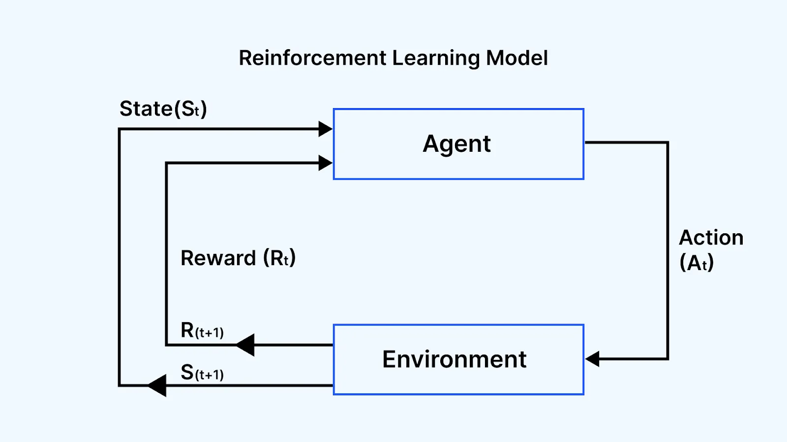
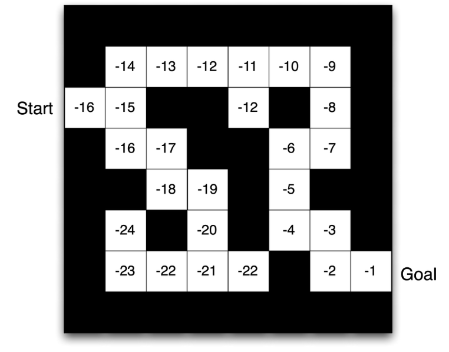

# Fondamenti del Reinforcement Learning

## Cos'è il Reinforcement Learning?

Il Reinforcement Learning non è solo un ramo dell'Informatica o dell'Ingegneria. Come mostrato nella mappa iniziale, si trova all'esatta intersezione di diverse discipline:

* **Psicologia e Neuroscienze:** Si ispira al *condizionamento operante* umano e animale (il concetto di "premio e punizione") e al sistema di ricompensa dopaminergico del nostro cervello.
* **Ingegneria e Matematica:** Condivide basi solide con la teoria del *Controllo Ottimo* (Optimal Control).
* **Economia:** Gestisce la *razionalità limitata* (Bounded Rationality) nel prendere decisioni in scenari di incertezza.

In sintesi, esseri umani e animali imparano interagendo con l'ambiente. L'RL cerca di replicare matematicamente questo processo.

### Differenze cruciali con altri paradigmi di Machine Learning

Se hai familiarità con l'Apprendimento Supervisionato (Supervised Learning), sai che l'algoritmo impara tramite "esempi esatti" forniti da un supervisore (es. una foto di un gatto con l'etichetta "gatto"). L'RL rompe questi schemi per quattro motivi fondamentali:

1. **Nessun supervisore:** Nessuno dice all'agente "qui dovevi girare a destra". L'unico segnale che riceve è una *ricompensa* (un punteggio).
2. **Feedback ritardato:** La ricompensa non è istantanea. Una mossa geniale fatta ora potrebbe portare a una ricompensa solo tra mille passaggi.
3. **Il tempo conta (Dati sequenziali):** Nel machine learning classico si assume che i dati siano *i.i.d.* (indipendenti e identicamente distribuiti). Nell'RL questa regola salta: i dati sono sequenziali e fortemente correlati nel tempo.
4. **Le azioni influenzano i dati futuri:** L'azione che l'agente sceglie di compiere modifica l'ambiente, determinando i dati che l'agente stesso vedrà nello step successivo.

## Il segnale di ricompensa e la reward hypothesis

Tutto l'RL ruota attorno a un numero scalare chiamato *Reward* ($r_t$), che indica quanto l'agente stia facendo bene in un preciso istante di tempo $t$.

L'obiettivo assoluto dell'agente è uno solo: **massimizzare la ricompensa cumulativa totale** nel lungo periodo, non solo quella immediata.

Questa idea è formalizzata dalla **Reward Hypothesis**: *"Tutti gli obiettivi possono essere descritti dalla massimizzazione della ricompensa cumulativa attesa"*.

Esempi pratici di Reward:

* **Elicottero acrobatico:** Ricompensa positiva se segue la traiettoria desiderata, negativa se si schianta.
* **Scacchi/Go:** Ricompensa positiva (+1) solo se si vince la partita alla fine, negativa (-1) se si perde. Tutte le mosse intermedie potrebbero avere reward 0.
* **Portafoglio finanziario:** Ricompensa positiva per ogni dollaro guadagnato.
* **Videogiochi:** Incremento/decremento basato sullo score a schermo.

### Sequential decision making

L'agente deve prendere decisioni sequenziali per massimizzare il ritorno futuro. Questo introduce due difficoltà fondamentali:

1. **Conseguenze a lungo termine:** Fare un "sacrificio" ora (es. perdere un pedone a scacchi, reward negativo a breve termine) potrebbe essere vitale per fare scacco matto 10 mosse dopo (reward massiccio a lungo termine).
2. **Il Credit Assignment Problem (Problema dell'assegnazione del credito):** Se ricevo un premio al tempo $t=100$, quale delle mie 99 azioni precedenti è stata quella veramente decisiva per ottenere quel premio?

## L'interazione agente–ambiente

L'architettura di base è un loop continuo. Ad ogni step temporale $t$:

1. L'**Agente** osserva l'ambiente ricevendo un'osservazione ($o_t$) e un segnale di ricompensa ($r_t$).
2. In base al suo "cervello" (la sua **strategia/policy**), l'agente decide ed esegue un'azione ($a_t$).
3. L'**Ambiente** riceve l'azione $a_t$, si aggiorna internamente ed emette la nuova osservazione ($o_{t+1}$) e la nuova ricompensa ($r_{t+1}$).
4. Il tempo $t$ avanza e il ciclo si ripete.

### Storia (History) vs Stato (State)

Per decidere cosa fare, l'agente ha bisogno di informazioni.

* La **storia** ($h_t$) è l'intera sequenza di osservazioni, azioni e ricompense disponibile fino al tempo corrente: $h_t=(o_0,a_0,r_1,\ldots,a_{t-1},r_t,o_t)$. La sua dimensione cresce con la durata dell'interazione.
* Lo **stato** ($s_t$) è una sintesi matematica della storia: $s_t=f(h_t)$. In un modello markoviano contiene le informazioni necessarie a descrivere la distribuzione dell'evoluzione futura.

Bisogna però distinguere tra:

* **Environment State ($s_t^e$):** La vera e completa rappresentazione interna dell'ambiente (es. le esatte coordinate fisiche di ogni singolo oggetto nel mondo reale). Spesso contiene informazioni irrilevanti o non è del tutto visibile all'agente.
* **Agent State ($s_t^a$):** L'informazione che l'agente *effettivamente usa* per prendere decisioni. È una rappresentazione interna costruita dall'agente stesso.

### Lo Stato Informativo e la Proprietà di Markov

Un concetto cardine dell'RL è lo ***Stato di Markov*** (o Information State).
Si dice che uno stato possiede la **Proprietà di Markov** se e solo se:

$$
p(s_{t+1}\mid s_t)=p(s_{t+1}\mid s_0,a_0,\ldots,s_t,a_t)
$$

In linguaggio semplice: **"Il futuro è indipendente dal passato, dato il presente"**.

Se lo stato attuale dell'agente *codifica perfettamente tutto ciò che di rilevante è successo in passato*, allora la probabilità di finire nel prossimo stato dipende **solo** dallo stato attuale, e possiamo ignorare l'intera storia precedente $H_t$.

## Osservabilità: MDP vs POMDP

La complessità del problema dipende da quanto l'agente percepisce dell'ambiente.

* **Fully Observable Environments (MDP):** L'agente vede tutto. La sua osservazione coincide perfettamente con lo stato dell'ambiente: $o_t=s_t^a=s_t^e$. Questo scenario modella un **Processo Decisionale di Markov (MDP)**. *Esempio: Una partita a scacchi. Vedi l'intera scacchiera, non ci sono informazioni nascoste.*
* **Partially Observable Environments (POMDP):** L'agente ha una vista parziale o rumorosa. Lo stato dell'agente **non** coincide con quello dell'ambiente. *Esempi: Un robot con una telecamera frontale che non sa cosa c'è dietro di lui; giocare a Poker (non vedi le carte avversarie); fare trading (vedi il prezzo attuale ma non le reali intenzioni dei grandi fondi di investimento)*.

In un POMDP, l'agente deve *costruire* attivamente il suo stato. Può farlo memorizzando l'intera storia, mantenendo una distribuzione di probabilità (credenze, *beliefs*) sui possibili veri stati dell'ambiente, o utilizzando Reti Neurali Ricorrenti (RNN) che fungono da "memoria" a breve termine.

## I Componenti Principali di un Agente RL

Non tutti gli agenti sono uguali, ma in generale sono formati da uno o più di questi tre componenti fondamentali:

### Policy

È il vero e proprio "cervello comportamentale" dell'agente, una mappa che associa a uno stato $S$ l'azione $A$ da intraprendere.

* **Deterministica:** A un dato stato corrisponde un'unica azione certa: $a=\pi(s)$.
* **Stocastica:** A un dato stato corrispondono probabilità diverse per azioni diverse: $\pi(a|s)=P[a_t=a|s_t=s]$. È vitale per favorire l'esplorazione.

### State-value function

Mentre il reward valuta l'esito immediato di una transizione, la **state-value function** misura quanto sia favorevole trovarsi in un determinato stato nel lungo periodo adottando una policy $\pi$.

In altre parole, la value function la **predizione** matematica di tutta la **ricompensa *futura*** accumulabile essendo in uno stato $s$:

$$
v_\pi(s)=\mathbb{E}_\pi\left[\sum_{k=0}^{\infty}\gamma^k r_{t+k+1}\mid s_t=s\right]
$$

Il parametro $\gamma\in[0,1]$ è il **discount factor**. Riduce il peso delle ricompense lontane e, nei problemi continuing con reward limitati, garantisce che il ritorno infinito sia finito.

Nei classici problemi "da tavolo" (es. piccoli labirinti o griglie), possiamo usare delle semplici tabelle (matrici) per memorizzare lo stato $A$, lo stato $B$, e i loro valori.
Ma cosa succede in applicazioni reali? Nel videogioco Atari ci sono milioni di combinazioni di pixel. A scacchi gli stati possibili superano il numero di atomi nell'universo. Le tabelle non bastano più.

È qui che nasce il **Deep Reinforcement Learning**. Non tabuliamo più i valori, ma approssimiamo tutte le nostre componenti usate finora (Policy, Value Function, Model) sostituendole con **Reti Neurali (Deep Learning)**.
Tuttavia, come introdotto all'inizio, l'RL viola le assunzioni classiche del Machine Learning supervisionato (i.i.d., stazionarietà). Pertanto, prendere una Rete Neurale standard e schiaffarla in un ciclo RL porterebbe la rete a "dimenticare" instabilmente le informazioni. Per questo motivo il corso proseguirà esplorando algoritmi e tool matematici creati specificamente per stabilizzare le reti neurali in ambienti di Reinforcement Learning.

### Modello

È la rappresentazione mentale che l'agente ha dell'ambiente circostante. Serve per *predire* cosa farà l'ambiente. Ha due parti:

- **Transizione** $P_{ss'}^a = P(s_{t+1} = s' | s_t = s, a_t = a)$: probabilità di trovarsi nello stato $s'$ partendo dallo stato $s$ compiendo l'azione $a$
- **Ricompensa** $R_s^a = E[r_{t+1} | s_t=s, a_t=a]$: valore atteso del reward che si ottiene essendo nello stato $s$ e compiendo l'azione $a$

## Tassonomia degli Agenti RL

Possiamo classificare gli agenti in base a quali di questi tre "organi" possiedono:

- **Value-Based:** Hanno solo la Value Function. La Policy non è esplicita, ma viene dedotta (es. scelgono semplicemente l'azione che porta allo stato con il Valore più alto).
- **Policy-Based:** Hanno una Policy esplicita parametrizzata, ma non calcolano la Value Function.
- **Actor-Critic:** Il "meglio" dei due mondi. Usano una Policy (Actor) per scegliere l'azione e una Value Function (Critic) per giudicare quell'azione e aggiornare l'Actor.

Inoltre si dividono in:

- **Model-Free:** L'agente non ha idea di come funzioni la fisica dell'ambiente. Apprende esclusivamente tramite trial-and-error puro e "istinto".
- **Model-Based:** L'agente impara (o gli viene fornita) una simulazione interna dell'ambiente per pianificare le mosse prima di eseguirle nel mondo reale.

È possibile schematizzare i metodi di Reinforcement Learning in tre macro-categorie:

- **Value-Based**: in cui si apprende la funzione di valore e si deriva la policy in modo implicito (e.g., $\epsilon$-greedy).
- **Policy-Based**: in cui si apprende direttamente la policy senza mantenere alcuna funzione di valore.
- **Actor-Critic**: un approccio ibrido che unisce i due mondi, apprendendo simultaneamente sia la funzione di valore (Critic) sia la policy (Actor).

## Learning vs Planning

L'RL affronta due scenari distinti nel prendere decisioni sequenziali:

1. **Reinforcement Learning puro (Learning):** L'ambiente è inizialmente sconosciuto. L'agente interagisce "al buio", agisce, sbaglia, riceve feedback e migliora la sua policy iterativamente. *Esempio Atari: Il giocatore gioca col joystick capendo le regole tentativamente tramite lo score a schermo*.
2. **Planning (Pianificazione):** Le regole del gioco (il modello) sono date. L'agente non compie mosse fisiche per imparare, ma usa la capacità di calcolo per esplorare mentalmente (Tree search) i possibili futuri ("se faccio A, succede B; se faccio C, succede D"). *Esempio Atari: Si usa un emulatore interno per simulare migliaia di scenari futuri senza mai muovere il joystick realmente*.

## Exploration vs Exploitation

L'apprendimento per prove ed errori nasconde un compromesso cruciale.

* **Esplorazione (Exploration):** Rinunciare alla ricompensa certa per esplorare l'ambiente nella speranza di trovare strategie o percorsi che generino ricompense molto più alte.
* **Sfruttamento (Exploitation):** Utilizzare la conoscenza attuale e sicura per massimizzare la ricompensa.

*Esempi pratici:*

* *Ristorante:* Vai nel tuo locale preferito e mangi sicuramente bene (Exploitation), oppure provi un locale nuovo rischiando di mangiare male, ma con la possibilità di scoprire un nuovo ristorante fantastico (Exploration).
* *Pubblicità Online (Banner):* Mostri l'annuncio che storicamente ha il tasso di click più alto (Exploitation) o testi un nuovo annuncio che potrebbe performare meglio (Exploration).

Se l'agente sfrutta e basta, rimane bloccato in comportamenti sub-ottimali. Se esplora e basta, muore o fallisce costantemente perché non capitalizza mai quello che ha imparato. Trovare il bilanciamento matematico è una delle vere sfide dell'RL.

## Predizione e Controllo

Quando progettiamo algoritmi RL, risolviamo essenzialmente due tipologie di problemi:

1. **Prediction (Predizione):** Vogliamo valutare il futuro. L'agente segue una *Policy data e fissa* e noi vogliamo calcolare quanto è buona (cioè calcolare la sua Value Function corretta per ogni stato).
2. **Control (Controllo):** Nessuna policy fissa. Il nostro scopo è l'ottimizzazione pura: navigare tra tutte le policy possibili per trovare quella ottimale ($\pi_*$) che restituisca i valori di Value Function massimi ($v_*$).
