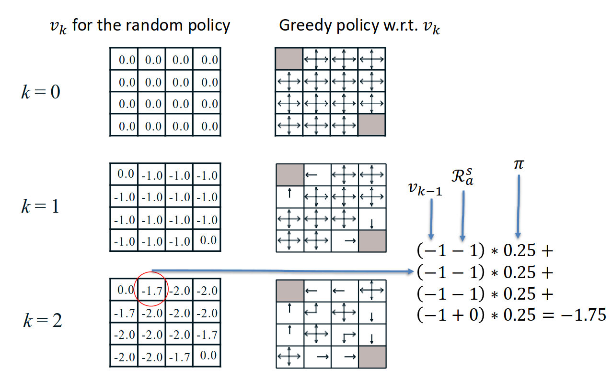
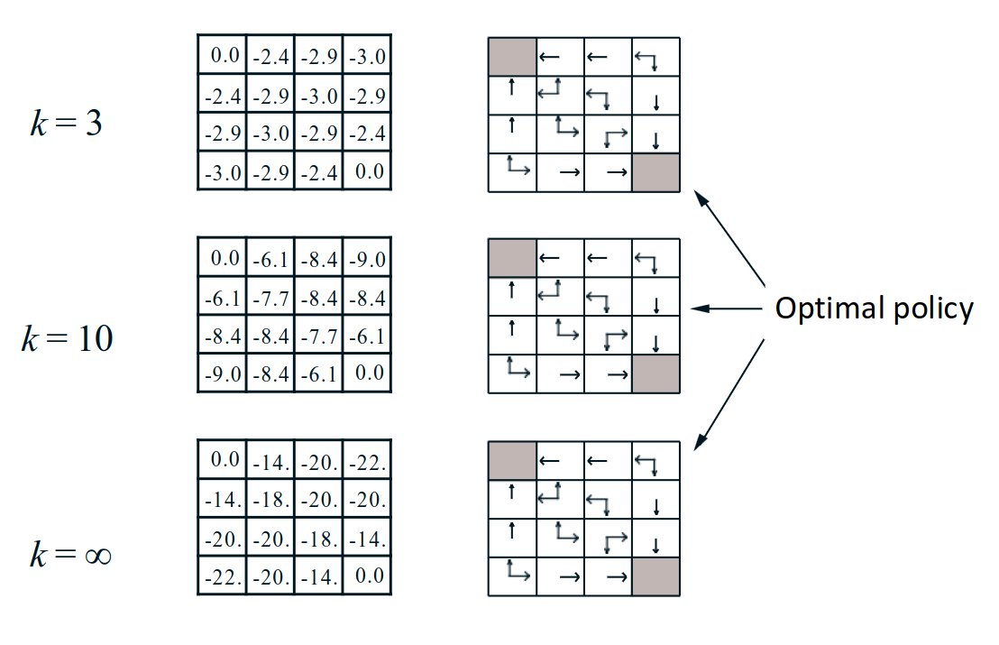
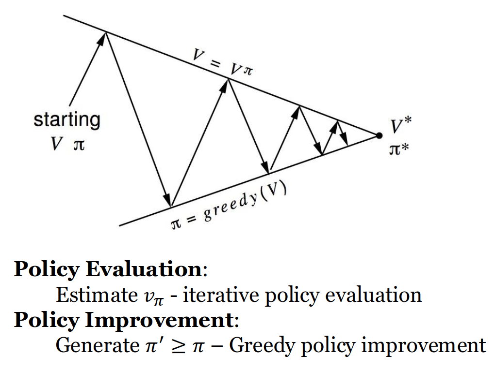
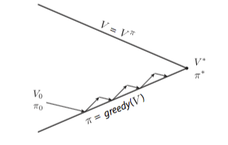

# Programmazione dinamica

Il termine "Programmazione Dinamica" (DP) fu coniato da Richard Bellman.

* **Dinamica:** Indica che c'è una componente sequenziale o temporale nel problema. Le decisioni prese ora influenzano il futuro.
* **Programmazione:** Non si intende la scrittura di codice, ma l'ottimizzazione di un "programma", ovvero una policy (una strategia decisionale).

La DP è un metodo per risolvere problemi complessi scomponendoli in sottoproblemi più semplici. Si risolvono i sottoproblemi e si combinano i risultati.

Tuttavia, per poter applicare la DP, il problema deve possedere due proprietà matematiche fondamentali:

1. **Sottostruttura Ottima (Optimal Substructure):** Questo principio stabilisce che la soluzione ottima del problema globale può essere costruita combinando le soluzioni ottime dei suoi sottoproblemi. Negli MDP, questa proprietà è garantita proprio dall'Equazione di Bellman, che scompone il valore di uno stato nel valore della ricompensa immediata più il valore dello stato successivo.
2. **Sottoproblemi Sovrapponibili (Overlapping Sub-problems):** Significa che gli stessi sottoproblemi si ripresentano continuamente durante il calcolo. Invece di ricalcolarli ogni volta, la DP calcola la soluzione una volta sola e la salva in una "cache" per riutilizzarla. In RL, questa cache è rappresentata dalla Value Function.

In questo contesto, utilizziamo la DP per il **Planning**. Questo significa che l'algoritmo non deve interagire con un mondo sconosciuto per imparare; assume invece di avere piena e perfetta conoscenza dell'MDP (conosce tutti gli stati, le azioni, le probabilità di transizione $\mathcal{P}$ e le ricompense $\mathcal{R}$).

Possiamo usare la DP per due scopi principali:

* **Prediction (Predizione):** Dato l'intero modello MDP e una policy specifica $\pi$, calcoliamo quanto vale quella policy (ovvero, calcoliamo la sua Value Function).
* **Control (Controllo):** Dato solo il modello MDP, l'obiettivo è trovare la policy ottima assoluta $\pi^*$ e la value function ottima $v^*$.

## Iterative Policy Evaluation (Valutazione Iterativa della Policy)

Supponiamo di avere una policy $\pi$ fissa. Vogliamo calcolare il suo valore in ogni stato, ossia **calcolare la state-value function** $v_{\pi}$ associata. La soluzione consiste nell'applicare l'Equazione di Bellman (versione Expectation) in modo iterativo tramite la **Iterative Policy Evaluation**.

Iniziamo con una stima iniziale dei valori per ogni stato (spesso tutti zero), che chiamiamo $v_1$.

Poi eseguiamo un aggiornamento sincrono (synchronous backup): ad ogni iterazione $k+1$, calcoliamo il nuovo valore di ogni singolo stato $v_{k+1}(s)$ basandoci sui vecchi valori $v_k(s')$ degli stati successivi.

Continuando ad applicare questa equazione, la sequenza di funzioni di valore $v_1 \rightarrow v_2 \rightarrow \dots$ convergerà gradualmente e matematicamente al vero valore della policy $v_\pi$.

$$
v_{\pi}^{k+1} = \mathcal{R}_{\pi} + \gamma \mathcal{P}_{\pi} v_{\pi}^k
$$

### Esempio: La Small Gridworld

Immaginiamo una griglia 4x4.

- **Stati:** 14 stati non terminali e due stati terminali.
- **Azioni:** Su, giù, destra, sinistra. Le azioni che porterebbero fuori dalla griglia mantengono l'agente nello stesso stato.
- **Reward:** -1 per ogni transizione, fino a quando non si raggiunge lo stato terminale (il gioco è "non scontato", quindi $\gamma=1$).
- **Policy:** policy completamente casuale (probabilità del 25% per ogni direzione).

A $k=0$, tutti i valori sono $0.0$.

A $k=1$, l'algoritmo valuta ogni stato. Per gli stati adiacenti al terminale, guardarsi intorno significa calcolare la media delle azioni. Ad esempio, spostarsi verso il terminale costa -1 (e poi si finisce in uno stato che vale 0). Spostarsi altrove costa -1 (e si finisce in uno stato che attualmente vale 0). Il risultato per tutti gli stati sarà -1.0.

Man mano che $k$ avanza ($k=2, k=3, k=10$), l'informazione del "costo" si propaga all'indietro dagli stati terminali.

All'infinito ($k=\infty$), la griglia mostrerà il vero valore (il costo atteso) per raggiungere il terminale partendo da ogni specifica cella, seguendo azioni puramente casuali. Noterai che se estraniamo una policy "avida" (Greedy Policy) guardando questi valori (cioè scegliamo l'azione che punta verso la cella adiacente con il valore meno negativo), questa nuova policy risulta essere nettamente migliore di quella casuale.

## Policy Iteration

Iterative Policy Evaluation ci permette di calcolare il valore di una policy (generica). **Policy Iteration** serve per **trovare la policy *ottima***.

È un processo in due fasi che si ripete in loop:

1. **Valutazione** (Policy Evaluation): Data l'attuale policy $\pi$, calcoliamo la sua vera value function $v_{\pi}$ tramite Iterative Policy Evaluation.
2. **Miglioramento** (Policy Improvement): Creiamo una nuova policy $\pi'$ agendo in modo "avido" (*greedy*) rispetto ai valori appena calcolati. Per ogni stato, la nuova policy impone di scegliere l'azione che porta allo stato adiacente con il valore più alto

$$
\pi'(s) = \argmax_{a \in \mathcal{A}} \; q_\pi(s,a)
$$

Il Teorema del Miglioramento della Policy ci assicura matematicamente che, agendo in modo avido, la nuova policy sarà strettamente migliore (o al limite uguale) alla precedente.

Se la ripetizione di questi due step non porta più ad alcun cambiamento (la policy "nuova" è identica a quella "vecchia"), significa che l'Equazione di Bellman Optimality è stata soddisfatta e abbiamo trovato la policy ottima assoluta $\pi^*$.

## Value Iteration

In realtà non è davvero necessario aspettare che la *Policy Evaluation* converga perfettamente prima di procedere al *Policy Improvement*, ma possiamo introdurre condizioni di stop anticipate (ad esempio fermarci quando i valori cambiano di pochissimo), oppure fermarci dopo un numero prefissato $k$ di iterazioni. Questa interazione fluida e flessibile tra valutazione e miglioramento è nota come **Generalized Policy Iteration**.

Cosa succede se estremizziamo questo concetto e decidiamo di fermare la valutazione dopo **una sola iterazione** ($k=1$)? Otteniamo un algoritmo fondamentale chiamato **Value Iteration**.

La Value Iteration si basa sul **Principio di Ottimalità**: una policy raggiunge il valore ottimo a partire da uno stato $s$, se e solo se riesce a compiere un'azione ottima iniziale, seguita da un percorso ottimo a partire dal nuovo stato raggiunto $s'$.

Invece di valutare esplicitamente una policy, la Value Iteration applica iterativamente l'**Equazione di Bellman Optimality** per le value function:

$$
v_{k+1}(s) = \max_{a \in \mathcal{A}} \; \mathcal{R}_s^a + \gamma \sum_{s' \in S} \mathcal{P}_{ss'}^a \, v_k(s')
$$

L'intuizione è che partiamo lavorando all'indietro partendo dalle ricompense. Ad ogni passo $k$, non manteniamo in memoria una policy specifica. Aggiorniamo semplicemente il valore di ogni stato scegliendo l'azione massima.

La policy ottima viene estratta solo alla fine, guardando la value function convergente operando in modo *greedy*.

## Programmazione Dinamica Asincrona (Asynchronous DP)

Iterative Policy Evaluation, Policy Iteration e Value Iteration sono algoritmi *sincroni* della Dynamic Programming (Synchronous DP). Questo significa che, per ogni iterazione, *tutti* gli stati dell'MDP vengono aggiornati in parallelo (o prima di passare all'iterazione successiva). Questo richiede il salvataggio in memoria di due tabelle di valori distinte (quella vecchia $v_{old}$ e quella in calcolo $v_{new}$) per evitare incongruenze durante l'aggiornamento.

Tuttavia, quando gli stati sono milioni, spazzare via l'intero insieme di stati ad ogni iterazione diventa computazionalmente problematico (la complessità per iterazione è $O(mn^2)$, dove $m$ sono le azioni e $n$ gli stati).

La **Programmazione Dinamica Asincrona (Asynchronous DP)** risolve questo problema aggiornando gli stati singolarmente, in un ordine qualsiasi, e permettendo di risparmiare enormi quantità di calcolo. L'algoritmo convergerà comunque alla soluzione ottima, a patto che nessun singolo stato venga ignorato all'infinito. Ci sono tre varianti principali per decidere come aggiornare gli stati: *In-place DP, Prioritized Sweeping, Real-Time DP*.

### In-place DP

Invece di tenere due array in memoria (uno per l'iterazione passata e uno per quella corrente), si usa un solo array. Gli stati vengono aggiornati direttamente "sul posto". Questo significa che il calcolo del valore di uno stato potrebbe usare il valore "vecchio" di uno stato adiacente, oppure il valore "nuovo" se quello adiacente è già stato aggiornato nel ciclo in corso. Accelera molto la convergenza ed è più efficiente in termini di memoria.

Value Iteration *sincrona*:

$$
v_{new}(s) = \max_{a \in \mathcal{A}} \; \mathcal{R}_s^a + \gamma \sum_{s' \in S} \mathcal{P}_{ss'}^a \, v_{old}(s')
$$

In-place Value Iteration:

$$
v(s) = \max_{a \in \mathcal{A}} \; \mathcal{R}_s^a + \gamma \sum_{s' \in S} \mathcal{P}_{ss'}^a \, v(s')
$$

### Prioritized Sweeping
Aggiornare tutti gli stati casualmente è inefficiente, poiché in alcune aree i valori potrebbero non cambiare mai. Questo metodo si concentra sugli stati in cui c'è più bisogno di ricalcolo. Per fare ciò, calcola l'Errore di Bellman (la differenza tra il valore attuale e il nuovo valore calcolato) per ogni stato. Gli stati vengono messi in una coda di priorità (Priority Queue), aggiornando per primi quelli con l'errore assoluto più alto.

$$
| \max_{a \in \mathcal{A}} \; \mathcal{R}_s^a + \gamma \sum_{s' \in S} \mathcal{P}_{ss'}^a \, v(s') - v(s) |
$$

### Real-Time Dynamic Programming

Si simula un agente che si muove nell'ambiente. Si aggiornano solo i valori degli stati che l'agente attraversa effettivamente durante la sua traiettoria. Si ignora completamente l'aggiornamento di aree dell'ambiente che l'agente non visiterà mai perché irrilevanti per l'obiettivo.

## I Limiti della DP e la Necessità di Campionare

La Programmazione Dinamica è estremamente potente e in grado di risolvere problemi di medie dimensioni. Tuttavia, utilizza quello che viene definito un **Full-width backup**. Questo significa che per aggiornare un singolo stato, l'equazione deve sbirciare e calcolare le probabilità per *ogni singolo stato e azione successiva possibile* guardando la matrice delle dinamiche $\mathcal{P}$.

Nei problemi del mondo reale ad alta dimensionalità (come il gioco del Go o il controllo di un braccio robotico), il numero di stati cresce in modo esponenziale rispetto al numero di variabili. Questo fenomeno devastante è noto come **Bellman's Curse of Dimensionality (La Maledizione della Dimensionalità)**. Quando gli stati sono miliardi di miliardi, eseguire anche solo *un* aggiornamento full-width diventa fisicamente e temporalmente impossibile.

La soluzione consiste nel passare a **Sample Backups (Aggiornamenti a Campionamento)**. Invece di guardare a tutti i futuri possibili in parallelo simulandoli con la matematica esatta, l'agente proverà fisicamente un'azione, otterrà una ricompensa singola campionata, e aggiornerà il suo valore basandosi solo su quell'esperienza. Questo ci libererà dalla necessità di conoscere a priori il modello dell'ambiente (rendendo gli algoritmi *Model-Free*) e sconfiggerà la maledizione della dimensionalità.