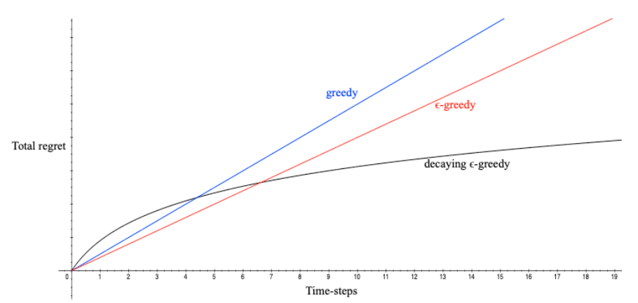

# Esplorazione ed exploitation

Il processo decisionale *online* pone l'agente di fronte a un problema fondamentale e ricorrente, noto come il dilemma tra **Exploration ed Exploitation** (esplorazione e sfruttamento). In ogni istante, il sistema deve operare una scelta critica:

- **Exploitation**: prendere la decisione migliore sulla base delle informazioni attualmente a disposizione, al fine di massimizzare il profitto immediato.

- **Exploration**: raccogliere nuove informazioni sull'ambiente, testando opzioni meno note.

La strategia ottimale a lungo termine può richiedere il sacrificio di guadagni a breve termine per raccogliere informazioni sufficienti a prendere le decisioni migliori nel lungo periodo. Molti scenari reali risentono di questo dilemma: la scelta di un ristorante (tornare nel proprio locale preferito contro il provarne uno nuovo), la visualizzazione di banner pubblicitari (mostrare il banner storicamente più redditizio contro testarne uno inedito), o lo svolgimento di un gioco (scegliere la mossa nota come migliore contro il provare una variante sperimentale).

Per affrontare questo problema, esistono diverse famiglie di approcci:

- **Random Exploration**: esplorazione basata sulla casualità, ad esempio aggiungendo rumore alla policy deterministica o scegliendo azioni casuali con una certa probabilità.

- **Optimism in the Face of Uncertainty**: stima dell'incertezza sul valore delle azioni, accordando una preferenza alle opzioni con valori incerti (ottimismo verso l'ignoto).

- **Information State Search**: ricerca basata sullo stato dell'informazione, in cui la conoscenza dell'agente diventa parte del suo stato, quantificando esplicitamente quanto la nuova informazione aiuti a incrementare la ricompensa.

## Il framework dei Multi-Armed Bandit

Per analizzare il dilemma dell'esplorazione nella sua forma più pura (senza la complessità delle transizioni di stato), si introduce il problema del **Multi-Armed Bandit**.

Il problema prende il nome dalle slot machine (in inglese "one-armed bandit"), in cui un giocatore deve decidere quale leva tirare tra $m$ opzioni, ognuna con una distribuzione di ricompensa ignota. L'obiettivo è massimizzare la ricompensa cumulativa nel tempo, bilanciando l'esplorazione delle leve meno conosciute con lo sfruttamento di quelle che hanno storicamente fornito le migliori ricompense.

Formalmente, esso è definito dalla tupla $(A, R)$, dove $A$ è un insieme noto di $m$ azioni (le "braccia" della slot machine) e $\mathcal{R}^a(r) = P(R=r | A=a)$ è una distribuzione di probabilità, inizialmente ignota, che governa le ricompense erogate compiendo la specifica azione $a$.

Ad ogni passo temporale $t$, l'agente seleziona un'azione $a_t \in A$ e l'ambiente genera una ricompensa campionata dalla distribuzione associata $r_t \sim \mathcal{R}^{a_t}$.

L'obiettivo finale è massimizzare la ricompensa cumulativa $\sum_{\tau=1}^t r_\tau$.

### Regret: La misura della perdita di opportunità

Per quantificare matematicamente le performance di esplorazione, si definisce il concetto di **Regret** (rimpianto).

Assumendo che il valore atteso (mean reward) di un'azione sia $Q(a) = \mathbb{E}[r \vert{} a]$, si definisce il valore ottimale $V^*$ come il valore della migliore azione possibile: $V^* = Q(a^*) = \max_{a \in A} Q(a)$.

Il regret associato a un singolo passo è la perdita di opportunità generata dal non aver scelto l'azione ottimale: $l_t = \mathbb{E}[V^* - Q(a_t)]$. Conseguentemente, il **total regret** (regret totale) accumulato nel tempo è:

$$
L_t = \mathbb{E} \left[ \sum_{\tau=1}^t (V^* - Q(a_\tau)) \right]
$$

Massimizzare la ricompensa cumulativa equivale analiticamente a **minimizzare il regret totale**.

Introducendo il parametro $N_t(a)$, che rappresenta il numero atteso di selezioni dell'azione $a$, e il "gap" $\Delta_a = V^* - Q(a)$, che quantifica la differenza di valore tra l'azione ottimale e la specifica azione $a$, il regret totale può essere riscritto come funzione dei conteggi e dei gap:

$$
L_t = \sum_{a \in A} \mathbb{E}[N_t(a)] \Delta_a
$$

Un buon algoritmo esplorativo dovrebbe garantire conteggi piccoli per gap ampi, tuttavia, nella pratica, i **gap non sono noti a priori**.

### Limiti degli algoritmi base

Gli approcci più semplici per la gestione del Multi-Armed Bandit si dimostrano teoricamente inefficienti sul lungo periodo: se un algoritmo esplora per sempre o, al contrario, non esplora mai, andrà inevitabilmente incontro a un regret totale lineare (crescente indefinitamente nel tempo).

- **Algoritmo Greedy**: seleziona costantemente l'azione con la stima Monte-Carlo più alta, $a_t^* = \argmax_{a \in A} \hat{Q}_t(a)$. Corre il rischio di bloccarsi per sempre su un'azione subottimale a causa di campionamenti sfortunati iniziali, generando un regret lineare.

- **Optimistic Initialization**: consiste nell'inizializzare le stime $Q_t(a)$ al massimo valore possibile $r_{max}$, per poi agire in modo greedy. Questo incentiva l'esplorazione delle incognite, ma un numero di campioni sfortunato può comunque estromettere prematuramente l'azione ottimale, portando a regret lineare.

- **Algoritmo $\epsilon$-greedy**: con probabilità $\epsilon$ esplora casualmente e con probabilità $1 - \epsilon$ sfrutta l'azione migliore nota. Mantenendo un $\epsilon$ costante, esplora all'infinito e subisce un regret lineare. Adottando un **Decaying $\epsilon_t$-greedy** (riducendo progressivamente la probabilità di esplorare), è possibile ottenere un regret asintotico logaritmico, che rappresenta l'obiettivo di sub-linearità desiderato, ma questa strategia richiede la conoscenza pregressa dei gap $\Delta_a$, condizione inattuabile in scenari ignoti.

## Optimism in the Face of Uncertainty

Il limite inferiore teorico (lower bound) delle prestazioni di qualsiasi algoritmo dipende dalla somiglianza tra le azioni subottimali e l'azione ottimale, descritta matematicamente dalla divergenza di Kullback-Leibler: $KL(R^a || R^{a*})$.

Il teorema di Lai e Robbins dimostra che **il regret asintotico totale cresce sempre**, nel migliore dei casi, con un andamento logaritmico rispetto al numero di passi.

Per raggiungere questo traguardo di ottimalità senza conoscere a priori le dinamiche, si ricorre al principio dell'**Optimism in the Face of Uncertainty**. L'idea centrale è che **maggiore è l'incertezza sul valore di un'azione, maggiore risulta l'importanza di esplorarla**, poiché potrebbe rivelarsi l'azione ottima.

Questo principio viene formalizzato calcolando un **Upper Confidence Bound (UCB)**, indicato con $U_t(a)$, per ogni stima.

L'algoritmo non si basa solo sul valore atteso, ma su un limite superiore, stabilendo con alta probabilità che il valore reale $q(a)$ sia minore o uguale a $Q_t(a) + U_t(a)$.

$$
q(a) \le Q_t(a) + U_t(a)
$$

Il termine di incertezza $U_t(a)$ è inversamente proporzionale al numero di visite $N_t(a)$: un numero limitato di visite implica un'alta incertezza (dunque un grande $U_t(a)$), spingendo l'algoritmo a esplorare l'azione.

La regola di selezione diventa:

$$
a_t = \argmax [Q_t(a) + U_t(a)]
$$

Per calcolare il valore esatto di $U_t(a)$, si fa ricorso alla **disuguaglianza di Hoeffding**, un teorema statistico che definisce un limite superiore alla probabilità che la media campionaria $\mathbb{E}[X]$ si discosti dal valore reale $\bar{X_t}$ di una quantità $u$:

$$
P(\mathbb{E}[X] > \bar{X_t} + u) \le e^{-2tu^2}
$$

Applicando questa disuguaglianza alle ricompense e imponendo una diminuzione progressiva della probabilità di errore nel tempo, si deriva matematicamente l'algoritmo **UCB1**:

$$
a_t = \argmax \left[ Q(a) + \sqrt{\frac{2 \log t}{N_t(a)}} \;\right]
$$

Questo specifico algoritmo garantisce in modo dimostrabile l'ottenimento di un regret asintotico logaritmico, raggiungendo il limite teorico di efficienza esplorativa.

## Bayesian Bandits e il Valore dell'Informazione

Nei metodi bayesiani, l'agente parte con un'idea iniziale (una distribuzione di probabilità prior $p[\mathcal{R}^a]$) su come potrebbero essere distribuite le ricompense per ogni azione. Man mano che l'agente interagisce con l'ambiente, utilizza il Teorema di Bayes per aggiornare questa conoscenza, ottenendo una distribuzione a posteriori (posterior) sulla funzione di valore delle azioni, indicata come $p[Q\vert{}w]$.

Questo approccio permette di estrarre metriche precise sull'incertezza. Due sono le principali tecniche che sfruttano questa conoscenza:

### Bayesian UCB

Se assumiamo che le ricompense seguano una distribuzione Gaussiana (Normale), possiamo stimare per ogni azione non solo il valore medio atteso $\mu_a$, ma anche la sua varianza (o deviazione standard $\sigma_a$), che rappresenta matematicamente il nostro grado di incertezza.

L'algoritmo **Bayesian UCB** seleziona l'azione che massimizza la somma tra il valore atteso e un limite di confidenza proporzionale ($c$) alla deviazione standard:

$$
U_t(a) = c\sigma_a
$$

$$
a_t = \argmax [Q_t(a) + c\sigma_a]
$$

Per esempio si immagini di provare due macchinari di produzione. Del Macchinario A conosciamo bene la resa media (alta confidenza, $\sigma$ piccolo). Il Macchinario B è nuovo: potrebbe essere molto peggiore o molto migliore (bassa confidenza, $\sigma$ grande). Il Bayesian UCB aggiungerà un "premio esplorativo" $c\sigma_a$ molto alto al Macchinario B, forzando il sistema a testarlo finché l'incertezza non si riduce.

### Probability Matching

**Probability Matching** seleziona un'azione con una probabilità pari alla probabilità che quell'azione sia effettivamente quella ottimale.

In particolare, ad ogni istante $t$, l'algoritmo campiona un valore casuale per ogni azione direttamente dalla rispettiva distribuzione a posteriori.

Seleziona l'azione che ha ottenuto il valore campionato più alto.
Se un'azione ha un'alta varianza (tanta incertezza), il suo valore campionato potrà essere occasionalmente molto alto, inducendo l'agente a esplorarla.

$$
\pi(a) = \mathbb{P}[Q(a) = \max Q(a') \vert{} r_1, \dots, r_{t-1}]
$$

Il Probability Matching implementa in modo naturale il principio dell'Optimism in the Face of Uncertainty (ottimismo di fronte all'incertezza). Questo accade per le proprietà geometriche delle distribuzioni di probabilità.

Se un'azione è stata esplorata raramente, la distribuzione a posteriori del suo valore $Q(a)$ sarà ampia e avrà varianza elevata. Le sue code assegneranno quindi probabilità non trascurabile anche a valori estremi.

Grazie a questa coda destra molto estesa, l'azione incerta possiede una probabilità matematica non trascurabile di superare il valore massimo stimato delle altre azioni ben note. Pertanto, le azioni più incerte ottengono automaticamente una maggiore probabilità di essere selezionate (esplorate).

Man mano che un'azione viene testata, la sua distribuzione si restringe: se il suo valore reale è basso, la probabilità che venga estratta come valore massimo crolla a zero, interrompendone l'esplorazione.

Nonostante la sua validità teorica, calcolare analiticamente l'esatta probabilità dalla distribuzione a posteriori risulta spesso estremamente complesso o del tutto intrattabile.

Per superare questo limite computazionale, si ricorre al **Thompson Sampling**, che costituisce a tutti gli effetti un'implementazione basata sul campionamento (sample-based) del Probability Matching.

Invece di risolvere l'equazione probabilistica, il Thompson Sampling procede secondo questi passaggi algoritmici:

1. Utilizza la legge di Bayes per calcolare e mantenere aggiornata la distribuzione a posteriori dei valori $p_w(Q \vert{} r_1, \dots, r_{t-1})$
2. Campiona (ossia estrae casualmente) un singolo valore scalare $Q(a)$ da questa distribuzione a posteriori per ciascuna azione possibile
3. Seleziona in modo greedy l'azione che, nel campionamento appena effettuato, ha ottenuto il valore più alto:

$$
a_t = \argmax Q(a)
$$

Se un'azione ha alta incertezza, il campionamento produrrà valori molto variabili ad ogni iterazione, permettendole di "vincere" ed essere selezionata con una frequenza pari alla sua effettiva probabilità di essere la scelta ottimale.

### Bayes-Adaptive

L'esplorazione acquisisce valore intrinseco poiché fornisce informazioni. Il **Valore dell'Informazione** è definibile come la quantità di ricompensa futura che un decisore è disposto a cedere pur di possedere quell'informazione prima di compiere una scelta.

Per modellare questo concetto in modo rigoroso, i Multi-Armed Bandits possono essere riconcettualizzati da un problema decisionale a passo singolo a un vero e proprio problema sequenziale (MDP).

Si introduce lo **Spazio degli Stati dell'Informazione** (Information State Space), indicato con $\tilde{S}$, che riassume tutta la *storia delle interazioni accumulate*. Per esempio in un bandit di Bernoulli, lo stato $\tilde{s} = (\alpha, \beta)$ conta i successi e i fallimenti aggiornando una distribuzione Beta.

Questo porta alla definizione di un **Bayes-Adaptive MDP** su questo spazio informativo aumentato: ogni azione scatena una transizione in un nuovo stato di informazione con una certa probabilità, integrando esplicitamente il guadagno di conoscenza.

Sebbene formulazioni come gli Indici di Gittins offrano soluzioni esatte tramite programmazione dinamica, gli MDP Bayes-Adattivi risultano solitamente enormi e intrattabili, spingendo all'uso di tecniche di Simulation-based search come l'algoritmo MCTS per esplorare l'albero decisionale in avanti trovando un trade-off ottimale e approssimato.

### Estensione a MDP Completi

Tutti i principi esplorativi originati nei Multi-Armed Bandits sono direttamente estendibili ad ambienti con stati e transizioni dinamiche (MDP completi).

- **Optimistic Initialization**: nel Model-Free RL (come Q-learning o Sarsa), i valori $Q(s,a)$ iniziali possono essere impostati ottimisticamente a $\dfrac{r_{max}}{1-\gamma}$. Nel Model-Based RL, il modello dell'ambiente stesso può essere costruito in modo ottimistico, assegnando ricompense fittizie massime $r_{max}$ alle transizioni verso stati poco esplorati prima di applicare la pianificazione (come la Value Iteration).

- **Upper Confidence Bounds (UCB) per MDP**: si ricerca la massimizzazione di un $UCB$ sui valori $Q^\pi(s,a)$ aggiungendo un termine $U(s,a)$. Tuttavia, in contesti Model-Free, la formulazione risulta più ostica poiché l'incertezza deriva sia dalla valutazione della policy sia dal suo conseguente miglioramento.

- **Bayesian Model-Based RL e Thompson Sampling**: l'agente modella la sua incertezza non solo sulle ricompense, ma anche sulle matrici di probabilità di transizione dell'intero ambiente, mantenendo una distribuzione a posteriori $p[\mathcal{P}, \mathcal{R} \vert{} h_t]$. Applicando il Thompson Sampling su MDP, l'agente campiona un intero modello (matrici di transizione e ricompense) dalla distribuzione a posteriori, risolve questo MDP campionato trovando l'azione ottimale temporanea per quel modello specifico, e la esegue nell'ambiente reale, realizzando un bilanciamento tra esplorazione e sfruttamento di altissimo livello matematico.
