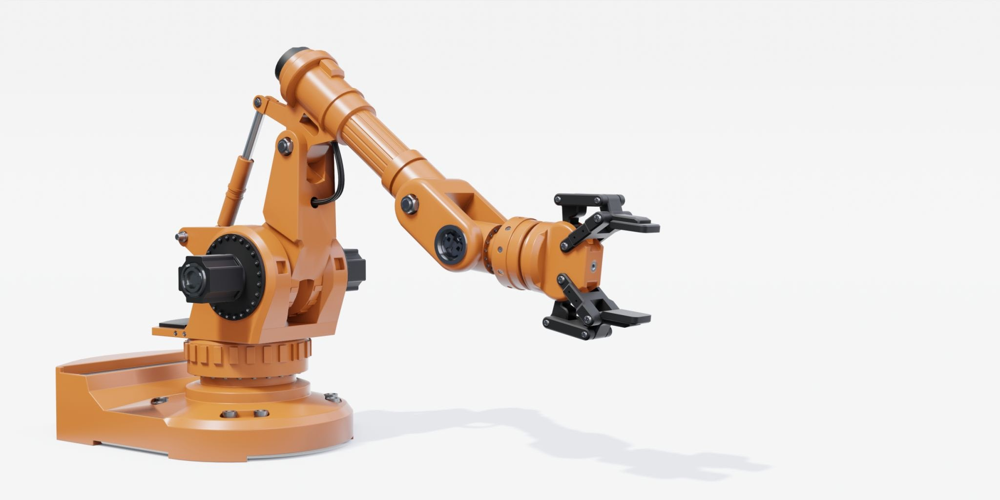

# Controllo Robotico

Una **policy robotica non controlla necessariamente i motori in modo diretto**.

Nella maggior parte dei sistemi produce un riferimento, come una posa dell'end-effector o una configurazione articolare, che viene trasformato in movimento da componenti di controllo eseguite a frequenza più elevata.

Una pipeline semplificata assume quindi la forma:

$$\begin{gathered} \text{policy} \\ \big\downarrow \\ \text{riferimento} \\ \big\downarrow \\ \text{generazione della traiettoria / cinematica inversa} \\ \big\downarrow \\ \text{controller} \\ \big\downarrow \\ \text{attuatori} \end{gathered}$$

## Configurazione articolare e posa cartesiana

Un robot manipolatore è composto da **giunti**, o *joint*, descritti dalla configurazione articolare $q$ e collegati tra loro mediante segmenti rigidi chiamati *link*:

$$
q
=
[q_1,q_2,\ldots,q_n]^\top.
$$

L'**end-effector** è il componente finale del braccio robotico, responsabile dell'interazione con l'ambiente. Può essere un gripper, una pinza, un utensile o qualsiasi altro dispositivo.

Solitamente l'end-effector è equipaggiato con un sensore, come una camera o un force-torque sensor, che fornisce osservazioni utili alla policy.

La **cinematica diretta**, o *forward kinematics*, determina la posa dell'end-effector a partire dalla configurazione articolare:

$$
\mathbf{x}=f(q).
$$

La posa $\mathbf{x}$ comprende **posizione e orientazione**.

Nel **joint space**, target e traiettorie sono espressi direttamente mediante variabili articolari:

$$
q_{\mathrm{des}},
\qquad
\dot q_{\mathrm{des}},
\qquad
\boldsymbol{\tau}_{\mathrm{des}}.
$$

Nel **task space**, chiamato anche Cartesian space o operational space, il comando descrive invece il comportamento di un elemento rilevante per il task, normalmente l'end-effector:

$$
\mathbf{x}_{\mathrm{des}}
=
(\mathbf{p}_{\mathrm{des}},\mathbf{R}_{\mathrm{des}}).
$$

Il **task space è spesso più intuitivo per una policy**: un comando come “sposta il gripper di cinque centimetri verso l'oggetto” non dipende direttamente dalla morfologia del braccio.

Prima dell'esecuzione, tuttavia, il target cartesiano deve essere convertito in un movimento articolare compatibile con la cinematica e con i limiti del robot.

**Joint space — vantaggi.** I comandi sono direttamente compatibili con i riferimenti dei controller articolari, rendono immediata l'imposizione dei limiti dei giunti e non richiedono di scegliere una soluzione di cinematica inversa.

**Joint space — svantaggi.** Le azioni dipendono dalla morfologia del robot e hanno un significato meno intuitivo rispetto al task. La stessa variazione articolare può inoltre produrre movimenti cartesiani molto diversi in configurazioni differenti.

**Task space — vantaggi.** Le azioni descrivono direttamente il movimento rilevante per il task e possono trasferire meglio tra robot con cinematica diversa, purché condividano una semantica comune dell'end-effector e dei frame.

**Task space — svantaggi.** Ogni comando deve essere trasformato in un movimento articolare mediante IK o controllo cartesiano. Singolarità, target irraggiungibili, collisioni e ambiguità tra soluzioni devono quindi essere gestiti prima dell'esecuzione.

### Cinematica inversa

La **cinematica inversa**, o *inverse kinematics* (IK), cerca una configurazione articolare che realizzi una posa desiderata:

$$
f(q)=\mathbf{x}_{\mathrm{des}}.
$$

Il problema può **non avere soluzione** se il target è fuori dal workspace, può avere **più soluzioni** se il robot è ridondante e può diventare numericamente difficile vicino alle **singolarità**.

Per gestire queste possibilità, la cinematica inversa viene spesso formulata come un problema di ottimizzazione:

$$
q^*
=
\arg\min_q
\left\|\mathbf{e}_{\mathrm{pose}}\!\left(f(q),\mathbf{x}_{\mathrm{des}}\right)\right\|_{\mathbf{W}}^2
+
\lambda\,r(q),
$$

soggetto ai limiti dei giunti e ad altri vincoli.

Il vettore $\mathbf{e}_{\mathrm{pose}}$ misura separatamente **errore di posizione ed errore di orientazione**, evitando di trattare una rotazione come un comune vettore euclideo. La matrice $\mathbf{W}$ assegna invece un peso alle diverse componenti dell'errore.

Il termine di regolarizzazione $r(q)$ può favorire configurazioni lontane dai limiti articolari, vicine alla configurazione corrente oppure prive di collisioni.

Per comandi di velocità, una soluzione locale può essere ottenuta mediante la pseudoinversa del Jacobiano:

$$
\dot q
=
\mathbf{J}^{\dagger}\dot{\mathbf{x}}_{\mathrm{des}}.
$$

Una **pseudoinversa smorzata** è normalmente preferibile vicino alle singolarità, dove la soluzione non regolarizzata può richiedere velocità articolari molto elevate.

## Posizione, velocità e coppia

Lo **spazio delle azioni** deve specificare quale grandezza viene comandata:

- un **position command** definisce una configurazione o una posa desiderata;
- un **velocity command** definisce la velocità desiderata per i giunti o per l'end-effector;
- un **torque command** agisce sulle coppie applicate ai giunti ed espone direttamente la dinamica del robot;
- un comando di **impedenza** definisce un comportamento elastico rispetto a una posa desiderata, eventualmente insieme a rigidezza e smorzamento.

### Comandi di posizione

Con un **position command**, la policy specifica una configurazione articolare o una posa cartesiana desiderata, mentre un controller sottostante calcola i comandi necessari per raggiungerla.

**Vantaggi.** Questo spazio è semplice da apprendere, facilmente interpretabile e compatibile con le interfacce di molti robot. Il controller a bassa quota assorbe parte delle perturbazioni e permette alla policy di operare a una frequenza inferiore.

**Svantaggi.** La policy controlla solo indirettamente velocità, forza e modalità di avvicinamento al target. Cambiamenti improvvisi del riferimento possono generare movimenti aggressivi se non vengono interpolati, mentre un controllo rigido di posizione è poco adatto al contatto con oggetti o persone.

### Comandi di velocità

Con un **velocity command**, la policy determina la velocità articolare o cartesiana da mantenere durante il successivo intervallo di controllo.

**Vantaggi.** Le azioni descrivono direttamente la direzione e la rapidità del movimento, consentono correzioni incrementali fluide e si integrano bene con policy closed loop che osservano frequentemente la scena.

**Svantaggi.** Le velocità devono essere integrate nel tempo per ottenere la posizione, per cui bias e piccoli errori producono deriva. Se la policy rallenta, perde osservazioni o smette di aggiornare il comando, il sistema deve disporre di timeout e meccanismi indipendenti di arresto.

### Comandi di coppia

Con un **torque command**, la policy agisce direttamente sulle coppie articolari e quindi sulla dinamica del robot.

**Vantaggi.** Questo spazio offre il controllo più diretto su accelerazioni, forze di interazione e comportamenti dinamici. Può essere utile per movimenti rapidi, locomozione e task di contatto nei quali una policy deve modulare attivamente le forze.

**Svantaggi.** Richiede frequenze elevate, osservazioni dinamiche accurate e una gestione esplicita di gravità, inerzia, attrito e accoppiamenti tra giunti. Gli errori della policy raggiungono più direttamente l'hardware, aumentando difficoltà di training e rischio operativo.

### Comandi di impedenza

Un **comando di impedenza** definisce il comportamento elastico del robot rispetto a una posa desiderata. A seconda dell'interfaccia, la policy può produrre anche rigidezza e smorzamento.

**Vantaggi.** Il robot può cedere quando incontra un vincolo, mantenendo precisione nello spazio libero e maggiore robustezza durante contatti incerti. Questo compromesso è particolarmente utile per inserimenti, grasping e interazione fisica con l'ambiente.

**Svantaggi.** La risposta dipende dalla scelta dei guadagni e dalla qualità della stima di posizione, velocità e forza. Parametri troppo rigidi riducono la sicurezza, mentre parametri troppo cedevoli degradano precisione e tracking; permettere alla policy di predirli amplia inoltre lo spazio delle azioni e rende più difficile imporre limiti sicuri.

Per contenere complessità e rischio, molti VLA producono **target di posizione o incrementi cartesiani**, delegando stabilità e tracking a un controller sottostante.

## Azioni assolute e relative

Un **comando assoluto** esprime direttamente il target in un sistema di riferimento:

$$
\mathbf{x}_{\mathrm{des}}=\mathbf{x}_{\mathrm{policy}}.
$$

Un **comando relativo** esprime invece una variazione rispetto alla posa corrente:

$$
\mathbf{x}_{\mathrm{des}}
=
\mathbf{x}_t \oplus \Delta\mathbf{x}_t,
$$

dove $\oplus$ indica la composizione appropriata di traslazioni e rotazioni.

Non è sufficiente sommare sempre le componenti numeriche: la composizione delle orientazioni dipende dalla rappresentazione e dal frame in cui viene espresso l'incremento.

**Azioni relative — vantaggi.** Hanno spesso range più limitati, descrivono correzioni locali e trasferiscono meglio tra scene con origini diverse.

**Azioni relative — svantaggi.** Richiedono integrazione nel tempo, per cui bias ed errori possono accumularsi. La stessa azione può inoltre produrre effetti diversi a seconda del frame locale in cui viene interpretata.

**Azioni assolute — vantaggi.** Esprimono direttamente l'obiettivo e non accumulano deriva dovuta all'integrazione di una sequenza di incrementi.

**Azioni assolute — svantaggi.** Dipendono più direttamente dalla calibrazione e dal sistema di riferimento scelto. Possono inoltre generalizzare peggio quando cambiano la posizione del robot, l'origine della scena o la disposizione del workspace.

## Generazione delle traiettorie

Un target definisce dove arrivare, ma non necessariamente come raggiungerlo.

La **generazione della traiettoria** costruisce una sequenza temporalmente parametrizzata di configurazioni, velocità e accelerazioni:

$$
q_{\mathrm{des}}(t),
\qquad
\dot q_{\mathrm{des}}(t),
\qquad
\ddot q_{\mathrm{des}}(t).
$$

L'interpolazione deve rispettare i **limiti di velocità, accelerazione e jerk**. In assenza di questa fase, due target geometricamente validi possono generare un movimento brusco o fisicamente irrealizzabile.

Un **motion planner** aggiunge un livello ulteriore e cerca un percorso privo di collisioni. Il **trajectory generator** assegna poi al percorso una legge temporale compatibile con il robot.

## Controllo in feedback

Un **controller in feedback** confronta continuamente il riferimento desiderato con la misura corrente. Per una variabile scalare, l'errore è

$$
e(t)=x_{\mathrm{des}}(t)-x(t).
$$

Un controller proporzionale applica un comando proporzionale all'errore:

$$
u(t)=K_P e(t).
$$

Il **termine derivativo** reagisce alla variazione dell'errore e introduce smorzamento:

$$
u(t)=K_Pe(t)+K_D\dot e(t).
$$

Si ottiene così un controller **PD**, molto comune nel controllo di posizione dei giunti.

Aggiungendo l'integrale dell'errore si ottiene un controller **PID**:

$$
u(t)
=
K_Pe(t)
+
K_I\int_0^t e(\xi)\,d\xi
+
K_D\dot e(t).
$$

Il **termine integrale** può eliminare errori persistenti, ma può anche accumularsi quando l'attuatore è saturo. Le tecniche di *anti-windup* ne limitano l'effetto.

I guadagni $K_P$, $K_I$ e $K_D$ determinano rapidità, smorzamento e sensibilità al rumore, ma non possono essere scelti indipendentemente dalla dinamica del sistema e dalla frequenza di controllo.

Per un robot a più giunti, errori e guadagni diventano vettori e matrici. Un semplice controller PD in joint space può produrre coppie della forma

$$
\boldsymbol{\tau}
=
\mathbf{K}_P
(q_{\mathrm{des}}-q)
+
\mathbf{K}_D
(\dot q_{\mathrm{des}}-\dot q).
$$

Controller più completi compensano **gravità, inerzia, attriti e accoppiamenti dinamici** tra i giunti.

## Servo control e closed-loop control

Il termine **servo control** indica il controllo in feedback di una variabile verso un riferimento, come posizione o velocità.

Nel **visual servoing**, l'errore viene invece definito interamente o parzialmente nello spazio delle feature visive. Il movimento può così correggersi sulla base delle immagini ricevute durante l'esecuzione.

Un sistema è **open loop** quando esegue un comando senza usare nuove misure per correggerlo.

È invece **closed loop** quando le osservazioni aggiornate modificano i comandi successivi:

$$
\text{misura}
\longrightarrow
\text{errore}
\longrightarrow
\text{controllo}
\longrightarrow
\text{robot}
\longrightarrow
\text{nuova misura}.
$$

Una policy VLA che osserva nuovamente la scena dopo ogni azione opera in **closed loop a livello decisionale**.

Ciò non significa che possa sostituire il loop di controllo dei giunti: la policy può funzionare a pochi hertz, mentre il servo controller opera spesso a frequenze di centinaia o migliaia di hertz.

## Frequenze e gerarchia del controllo

In un sistema robotico convivono tipicamente **più scale temporali**:

- il VLA o la policy decide target semantici o cartesiani a frequenza relativamente bassa;
- un planner locale o un interpolatore aggiorna la traiettoria a frequenza intermedia;
- il controller dei giunti calcola i comandi degli attuatori a frequenza elevata;
- i dispositivi hardware possono mantenere loop interni ancora più rapidi.

La frequenza non determina da sola se un sistema sia closed loop. Una policy lenta rimane closed loop se usa osservazioni aggiornate, ma può non reagire abbastanza rapidamente a una perturbazione.

**Latenza di inferenza, timestamp dei sensori e durata associata a ogni azione** devono quindi essere considerati insieme.

## Vincoli e sicurezza

Prima di raggiungere gli attuatori, i comandi prodotti da una policy vengono normalmente filtrati mediante **limiti di posizione, velocità, accelerazione, coppia e workspace**.

Possono inoltre essere presenti controlli di collisione, arresti di emergenza e supervisori indipendenti dal modello.

Il **clipping componente per componente** è una protezione minima, ma può cambiare la direzione del comando e non garantisce che il moto risultante sia sicuro.

Un target cartesiano all'interno del workspace può comunque attraversare un ostacolo, essere vicino a una singolarità oppure richiedere velocità incompatibili con il periodo di controllo.

Quando si descrive un VLA è quindi necessario specificare non soltanto il vettore predetto dal modello, ma anche:

- il **frame di riferimento**;
- le **unità di misura** e la normalizzazione;
- l'interpretazione **assoluta o relativa**;
- la **frequenza e la durata** del comando;
- la procedura di **de-normalizzazione e discretizzazione**;
- il controller, l'IK o il planner che trasformano il comando in movimento;
- le **saturazioni e verifiche di sicurezza** applicate prima dell'esecuzione.
