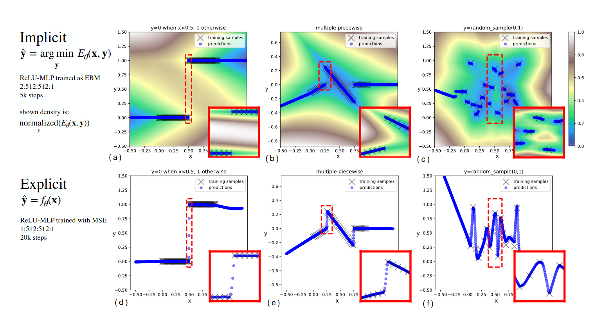
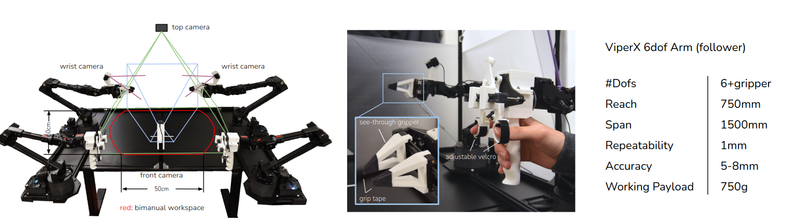
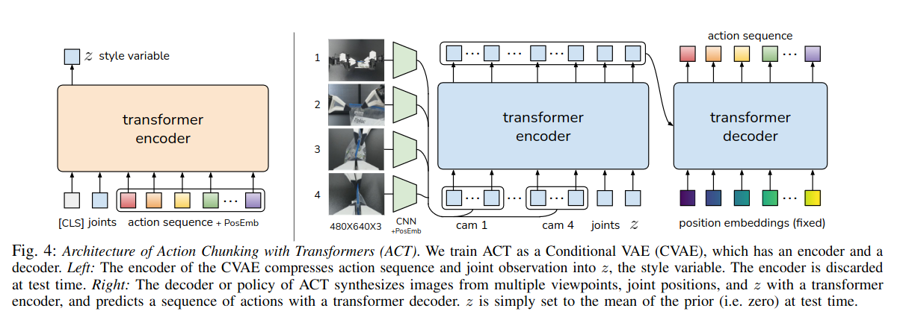
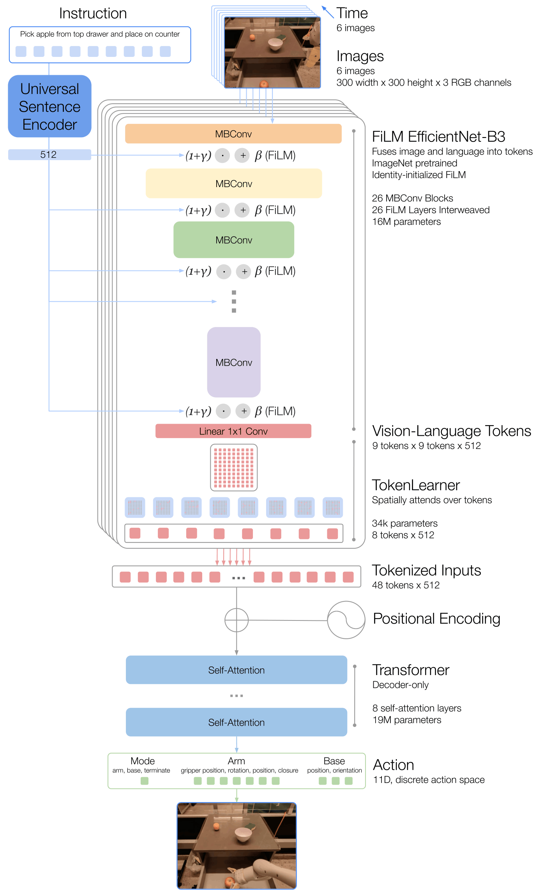
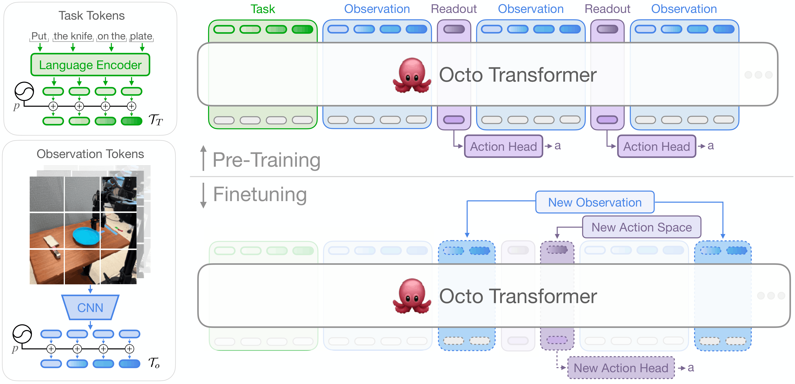

# VLA

I **Vision-Language-Action model (VLA)** estendono i modelli multimodali verso il controllo robotico, integrando percezione visiva, comprensione del linguaggio e generazione di azioni nella stessa pipeline.

Una policy $\pi$ determina quale azione deve eseguire un agente dato ciò che osserva. L'idea di base consiste nel trasformare una generica policy robotica

$$
\pi(a_t\mid o_t)
$$

in una policy condizionata anche da un'istruzione linguistica:

$$
\pi(a_t\mid o_t,q),
$$

dove $o_t$ rappresenta l'osservazione al tempo $t$, $q$ l'istruzione e $a_t$ l'azione prodotta dal modello.

## Precursori

L'evoluzione dei VLA deriva dalla **convergenza di modelli multimodali, language-based planning, imitation learning e visuomotor control**. I primi lavori non sono ancora VLA nel senso moderno del termine, ma introducono separatamente elementi che verranno poi riuniti in policy end-to-end.

### Gato (2022)

**Gato** mostra che task molto diversi possono essere ricondotti a un'**unica interfaccia** sequenziale: immagini, testo, propriocezione e azioni vengono convertiti in token ed elaborati dallo stesso Transformer autoregressivo. 

Il modello è addestrato su **604 task** provenienti da controllo simulato, Atari, ambienti 3D, linguaggio e vision-language.

La componente robotica usa RGB-Stacking con dati sia simulati sia reali e osservazioni visive e propriocettive di un braccio manipolatore.

#### Novelty

La novelty consiste nell'**unificazione di modalità**, embodiment e action space differenti all'interno di un solo sequence model. 

#### Limiti

Il limite principale è che **il linguaggio non condiziona esplicitamente una policy robotica**: la robotica costituisce solo una parte del training e la generalizzazione vision-language-action rimane lontana da quella dei VLA successivi.

L'[approfondimento su Gato](models/gato/README.md) descrive composizione dei dati, tokenizzazione e obiettivo di training.

### SayCan (2022)

**SayCan** collega conoscenza linguistica e fattibilità fisica senza produrre direttamente low-level action. 

Un LLM assegna una plausibilità $P_{LLM}$ alle skill compatibili con l'istruzione $q$ tramite log-likelihood.

Una value function $P_{value}$ ne stima invece l'**affordance**, cioè la fattibilità nello stato corrente; il prodotto dei due punteggi determina la skill da eseguire. 

$$
P_{LLM}(skill \mid q, history) \cdot P_{value}(skill\mid state) \longrightarrow \text{most feasible skill}
$$

Le skill sono addestrate separatamente e vengono eseguite da un Everyday Robots mobile manipulator dotato di base mobile, braccio a 7 DoF, gripper e camera RGB. Il sistema è studiato in una mock kitchen e valutato anche in una seconda office kitchen, su 101 istruzioni reali.

#### Novelty

La novelty è l'uso della conoscenza di un LLM per comporre skill robotiche tenendo conto delle affordance apprese. 

#### Limiti

La modularità è anche il limite principale: il language model può scegliere soltanto tra skill definite e addestrate in precedenza, mentre eventuali errori delle policy sottostanti si accumulano nell'esecuzione di task lunghi.

L'[approfondimento su SayCan](models/saycan/README.md) ricostruisce il meccanismo di scoring, l'esecuzione iterativa e il setup sperimentale.

## Policy visuomotorie da imitation learning

Prima che i VLA integrassero linguaggio, visione e controllo su larga scala, una linea di ricerca complementare ha studiato **come rappresentare distribuzioni di azioni complesse** e come ridurre l'accumulo degli errori nel behavioral cloning. IBC e ACT non sono VLA in senso stretto, ma introducono principi riutilizzati nella progettazione delle action head e delle policy robotiche successive.

### IBC (2021)

**Implicit Behavioral Cloning (IBC)** sostituisce la regressione diretta dell'azione con un **energy-based model**. 

Invece di produrre immediatamente $a_t$ da $o_t$, la rete assegna un'energia $E_\theta(o_t,a)$ alle azioni candidate e seleziona quella con energia minima:

$$
\hat{a}_t = \arg\min_{a \in \mathcal{A}} E_\theta(o_t,a),
$$

dove $\mathcal{A}$ è lo spazio delle azioni ed $E_\theta$ è la funzione appresa con parametri $\theta$. 

Questa formulazione può rappresentare meglio dimostrazioni multimodali o mapping discontinui, nei quali più azioni diverse risultano valide per la stessa osservazione.

Gli esperimenti comprendono task D4RL con dimostrazioni umane, ambienti simulati di pushing e sweeping e quattro task reali eseguiti da un **xArm6** con **end-effector cilindrico**. 

Per i task reali vengono raccolte da 95 a 502 dimostrazioni teleoperate e la policy riceve soltanto immagini RGB prospettiche a 5 Hz.

#### Novelty

La novelty consiste nel formulare il behavioral cloning come **regressione implicita condizionale**: la policy apprende la compatibilità tra osservazione e azione, anziché comprimere l'intera distribuzione delle dimostrazioni in un singolo output prodotto per regressione.

#### Limiti

La scelta dell'azione richiede un processo di ottimizzazione o campionamento nello spazio $\mathcal{A}$. **Training e inferenza sono quindi più costosi** di una policy feed-forward esplicita e la difficoltà cresce con dimensionalità e vincoli dell'action space. 

Inoltre, IBC **non usa istruzioni linguistiche** e viene addestrato separatamente per i task considerati.

L'[approfondimento su IBC](models/ibc/README.md) sviluppa energy-based modeling, negative sampling, inferenza e risultati simulati e real-world.

### ACT (2023)

**Action Chunking with Transformers (ACT)** è una policy di imitation learning introdotta insieme alla piattaforma bimanuale ALOHA. 

A partire dalle immagini di quattro camere e dalle posizioni articolari correnti, predice un **chunk di azioni future** invece della sola azione successiva:

$$
\pi_\theta(a_{t:t+k-1}\mid o_t),
$$

dove $k$ è la lunghezza del chunk. Durante l'esecuzione, chunk sovrapposti forniscono più predizioni per lo stesso istante e un *temporal ensemble* le combina per ottenere movimenti più fluidi.

ACT è valutato su due task simulati e sei task reali di manipolazione bimanuale fine. Le dimostrazioni sono raccolte con ALOHA, un sistema leader-follower formato da due bracci per l'operatore e due bracci follower a 7 DoF; l'action space della policy contiene quindi 14 target articolari. 

Il lavoro mostra che circa dieci minuti di dimostrazioni possono essere sufficienti per alcuni task contact-rich, come inserire una batteria o aprire un contenitore.

#### Novelty

La novelty è la combinazione di **action chunking, Transformer, conditional VAE e temporal ensembling**. Il chunking riduce l'orizzonte decisionale effettivo, mentre la variabile latente modella la variabilità delle dimostrazioni umane e l'ensemble temporale attenua le discontinuità tra pianificazioni successive.

#### Limiti

ACT viene **addestrato da zero e separatamente per ciascun task** del lavoro originario. Non riceve un'istruzione linguistica, **non trasferisce automaticamente skill tra task** e rimane legato alle osservazioni e all'action space articolare di ALOHA. 

Chunk molto lunghi riducono inoltre la reattività alle nuove osservazioni, mentre chunk brevi recuperano parte dei problemi del behavioral cloning step-by-step.

L'[approfondimento su ACT](models/act/README.md) descrive dataset, architettura CVAE, action chunking, temporal ensembling ed evaluation su ALOHA.

## Dalle skill modulari alle policy end-to-end

### RT-1 (2022)

**RT-1** sostituisce la composizione di skill separate con una singola policy che riceve una breve storia di immagini e un'istruzione $q$, quindi produce direttamente token di azione. 

Il dataset principale contiene oltre 130.000 episodi reali raccolti in 17 mesi con 13 Everyday Robots mobile manipulators e copre più di 700 task in ambienti di tipo office kitchen. 

La policy controlla braccio, gripper e base mobile mediante componenti continue discretizzate in 256 bin, oltre a un mode token che seleziona braccio, base o terminazione.

#### Novelty

La novelty risiede nella dimostrazione che una **Transformer policy relativamente compatta** può assorbire un dataset robotico ampio ed eterogeneo e operare in closed loop a 3 Hz.

#### Limiti

I limiti derivano dal **behavioral cloning**, dalla quantizzazione e dalla conoscenza semantica appresa quasi esclusivamente dalle dimostrazioni robotiche.

Le prestazioni diminuiscono sensibilmente quando cambiano background, oggetti o configurazioni.

L'[approfondimento su RT-1](models/rt1/README.md) presenta dataset, architettura FiLM-EfficientNet/TokenLearner, action space, training ed evaluation.

### RT-2 (2023)

**RT-2** parte da un Vision-Language Model pre-addestrato sul web e lo trasforma in una policy rappresentando anche le azioni come **token linguistici**.

Il training combina i dati vision-language originali di PaLI-X o PaLM-E con le oltre 130.000 traiettorie robotiche di RT-1, raccolte con 13 Everyday Robots mobile manipulators.

Il lavoro considera modelli da 5 a 55 miliardi di parametri e include anche una valutazione sul diverso embodiment di Language Table.

#### Novelty

La novelty è il **co-fine-tuning di conoscenza vision-language e controllo robotico nella stessa output head autoregressiva**: concetti appresi dal web possono così guidare skill fisiche apprese dalle dimostrazioni.

RT-2 mostra miglioramenti su oggetti, ambienti e richieste semantiche non presenti nei robot data.

#### Limiti

Il web amplia la conoscenza semantica ma **non crea nuove primitive motorie**, mentre la discretizzazione delle azioni introduce errore.

Il decoding autoregressivo di modelli molto grandi limita il controllo a circa 1–3 Hz e il dataset motorio resta prevalentemente legato a un solo embodiment.

L'[approfondimento su RT-2](models/rt2/README.md) sviluppa tokenizzazione, co-fine-tuning, constrained decoding, controllo closed loop ed esperimenti di generalizzazione.

## Cross-embodiment VLA

I **Vision-Language-Action model cross-embodiment** cercano di superare uno dei vincoli storici del robot learning: la tendenza ad addestrare una policy separata per ogni robot, configurazione sensoriale e insieme di task.

L'obiettivo è invece costruire modelli che possano apprendere da esperienze raccolte con **embodiment differenti**, sfruttando regolarità condivise tra piattaforme diverse e trasferendo conoscenza da un robot all'altro.

In questo contesto, il termine *embodiment* comprende non soltanto la morfologia del robot, ma anche il suo spazio delle azioni, la disposizione delle camere, i sensori disponibili e il tipo di controllo utilizzato. 

Una policy cross-embodiment deve quindi affrontare un problema più difficile della normale generalizzazione tra task: deve **trovare una rappresentazione sufficientemente comune da permettere il trasferimento** tra diverse piattaforme, pur conservando le informazioni specifiche necessarie a controllare ciascuna piattaforma.

Una formulazione generale considera una policy

$$
\pi(a_t \mid o_{\leq t}, q, e),
$$

dove $o_{\leq t}$ rappresenta la storia delle osservazioni fino al tempo $t$, $q$ l'istruzione linguistica, $a_t$ l'azione e $e$ l'embodiment o, più in generale, l'insieme delle informazioni che determinano come l'azione debba essere interpretata dal robot. 

I diversi lavori differiscono soprattutto nel modo in cui rendono confrontabili dati eterogenei, nel tipo di backbone utilizzato per collegare percezione e linguaggio e nella rappresentazione con cui vengono generate le azioni.

L'evoluzione della linea di ricerca può essere letta come un passaggio da **dataset unificati e action space standardizzati**, come [Open X-Embodiment](datasets/README.md#open-x-embodiment) e RT-X, verso policy generaliste progettate esplicitamente per essere riadattate, come Octo, e successivamente verso veri **Vision-Language-Action foundation model**, come OpenVLA, $\pi_0$ e GR00T, nei quali conoscenza semantica pre-addestrata e generazione di azioni continue vengono integrate sempre più strettamente.

### RT-X (2023)

**RT-X** indica i modelli addestrati sul mixture cross-embodiment di Open X-Embodiment. Nel lavoro originale vengono studiati due casi: **RT-1-X**, ottenuto addestrando l'architettura RT-1 sui dati aggregati, e **RT-2-X**, che estende la stessa idea a RT-2, cioè a un Vision-Language-Action model derivato da un grande Vision-Language Model.

RT-1-X serve soprattutto a verificare se il **co-training su robot differenti produca vantaggi** rispetto a policy addestrate esclusivamente sui dati di ciascuna piattaforma. 

RT-2-X aggiunge una seconda sorgente di trasferimento: oltre alla diversità robotica, sfrutta la conoscenza visivo-semantica acquisita durante il pre-training su dati web. Le azioni vengono ricondotte a una rappresentazione comune dell'end-effector; nel caso di RT-2-X vengono rappresentate all'interno dello stesso paradigma token-based utilizzato dal modello vision-language.

Gli esperimenti mostrano che il training con dati provenienti da altre piattaforme può migliorare il comportamento sul robot target. In particolare, RT-2-X evidenzia capacità emergenti di comprensione spaziale e linguistica più forti rispetto al corrispondente modello addestrato su un insieme robotico meno diversificato. Il risultato importante non è che gli embodiment diventino intercambiabili, ma che **esperienze raccolte su un robot possono contribuire ad apprendere skill utilizzabili da un altro**.

#### Novelty

RT-X fornisce una delle prime dimostrazioni su larga scala di **positive cross-embodiment transfer** in policy Transformer per il controllo reale. Il risultato cambia il ruolo dei dataset robotici: invece di essere esclusivamente dati specifici della piattaforma che li ha prodotti, possono diventare componenti di un corpus condiviso.

RT-2-X mostra inoltre che il **trasferimento cross-embodiment e il trasferimento da dati vision-language web possono essere complementari**. La generalizzazione del robot deriva quindi sia da conoscenza semantica esterna alla robotica sia dalla varietà di esperienze motorie presenti nel mixture.

#### Limiti

RT-X dipende da una **forte normalizzazione delle azioni e non risolve in modo generale il problema di spazi d'azione incompatibili**. Il lavoro originale non studia in modo esaustivo la generalizzazione zero-shot verso robot completamente nuovi e riconosce che embodiment con sensing e actuation molto differenti rimangono una sfida aperta.

RT-2-X presenta inoltre i costi tipici dei grandi VLA autoregressivi: la capacità semantica cresce con la scala del backbone, ma aumentano anche memoria, costo di training e costo di inferenza. La rappresentazione discreta delle azioni attraverso token costituisce infine una scelta progettuale diversa dalle successive policy generative continue basate su diffusion o flow matching.

L'architettura, la costruzione del mixture e il confronto tra RT-1-X e RT-2-X sono sviluppati in [RT-X](models/rtx/README.md).

### Octo

**Octo** passa da un semplice co-training cross-robot alla costruzione di una **generalist robot policy aperta e facilmente adattabile**. 

Octo è una policy Transformer pre-addestrata su circa **800 mila traiettorie** provenienti da 25 dataset di Open X-Embodiment ed è progettata fin dall'inizio per **accettare combinazioni differenti di osservazioni**, task specification e spazi delle azioni.

A differenza di RT-X, Octo **non assume che l'interfaccia del robot debba rimanere identica** in ogni utilizzo. L'architettura organizza gli input in token e utilizza blocchi di attenzione che consentono di modificare durante il fine-tuning quali sensori siano presenti.

Il task può essere specificato attraverso **linguaggio naturale oppure goal image**, mentre le azioni vengono prodotte con un decoder generativo basato su diffusion.

Questo design rende Octo particolarmente interessante come **pretrained policy initialization**. Il modello non deve necessariamente risolvere zero-shot ogni nuovo robot; l'obiettivo è fornire una rappresentazione e una policy di partenza che possano essere adattate rapidamente a nuove camere, segnali propriocettivi e action space con una quantità relativamente ridotta di dati target.

#### Novelty

La novità principale di Octo è la combinazione tra **pre-training cross-embodiment e modularità dell'interfaccia**. Il modello è esplicitamente progettato affinché nuovi input o nuovi action head possano essere introdotti senza ricostruire l'intera policy da zero.

Octo mostra un percorso alternativo ai VLA molto grandi: una policy relativamente compatta può acquisire una forte utilità pratica se il pre-training è sufficientemente diversificato e il modello è costruito per il fine-tuning.

#### Limiti

Octo rimane fortemente dipendente dalla distribuzione dei dati di robot manipulation su cui viene pre-addestrato. Il modello può adattarsi a nuovi embodiment, ma tale adattamento richiede normalmente **dati del robot target e fine-tuning**; non equivale quindi a un controller universale capace di controllare direttamente qualsiasi piattaforma.

La policy possiede inoltre una componente semantica meno ampia rispetto ai VLA costruiti a partire da grandi VLM pre-addestrati su Internet. Questo trade-off tra dimensione, apertura, adattabilità e conoscenza semantica costituisce uno dei punti di confronto principali con OpenVLA e con i modelli successivi.

### OpenVLA

### Pi-0

### GR00T

## Dataset per VLA

I dataset determinano quali oggetti, ambienti, skill ed embodiment una policy può osservare durante il training.

Una traiettoria robotica associa tipicamente una sequenza di osservazioni $o_t$, un'istruzione linguistica $q$ e le azioni $a_t$ eseguite dal robot.

La quantità di dati è importante, ma non sostituisce la varietà delle situazioni né la qualità delle dimostrazioni.

### Dataset real-world generalisti

Questa famiglia comprende raccolte ottenute su robot fisici e mixture costruiti per superare il singolo laboratorio o il singolo task.

**Open X-Embodiment** aggrega dataset eterogenei in un formato comune.

**DROID**, **BridgeData V2**, **RH20T** e **RoboSet** privilegiano, con scale e sensori diversi, la varietà delle dimostrazioni reali.

**AgiBot World/Colosseo** sposta ulteriormente la scala della raccolta bimanuale.

L'[approfondimento sui dataset per VLA](datasets/README.md#dataset-real-world-generalisti) confronta origine dei dati, robot, copertura, accessibilità e principali limiti.

### Dataset simulati

I dataset simulati sono prodotti attraverso infrastrutture che controllano scene, fisica, sensori e procedure di raccolta. **NVIDIA Isaac Sim e Replicator** generano osservazioni annotate e variazioni percettive; **Isaac Lab** aggiunge ambienti vettorializzati e pipeline di robot learning; **Isaac Lab Mimic** e **MimicGen** ampliano poche dimostrazioni ricombinandone i segmenti in nuove configurazioni. **robosuite/MuJoCo** e **Genesis** rappresentano ulteriori basi per creare traiettorie sintetiche.

L'[approfondimento sui dataset per VLA](datasets/README.md#dataset-simulati-e-pipeline-di-generazione) distingue il simulatore dal corpus effettivamente generato e descrive quali informazioni servono per rendere riproducibile una raccolta sintetica.

### Dataset più specifici

Alcuni dati sono preziosi proprio perché restringono il problema. I dataset **ALOHA/ACT** osservano coordinazione bimanuale e interazioni contact-rich; i **dataset per umanoidi** devono includere locomozione, equilibrio e controllo whole-body; i **video umani** forniscono grande varietà semantica senza azioni robotiche direttamente eseguibili; i **video egocentrici** avvicinano il punto di vista a quello di un agente incorporato, ma non eliminano l'embodiment gap.

L'[approfondimento sui dataset per VLA](datasets/README.md#dataset-più-specifici) descrive queste sorgenti e il modo in cui possono integrare, senza sostituirle direttamente, le traiettorie robotiche.

## Benchmark per VLA

### Benchmark simulati

I benchmark simulati rendono **ripetibili reset, perturbazioni e condizioni di successo**.

In breve **LIBERO** privilegia il trasferimento tra fattori semantici, **CALVIN** la persistenza su sequenze di skill, **SimplerEnv** la correlazione sim-to-real, **RoboCasa** la composizionalità domestica, **RLBench** l'ampiezza dei task e **ManiSkill** la manipolazione fisica scalabile.

Dettagli specifici [qui](benchmark/README.md).
