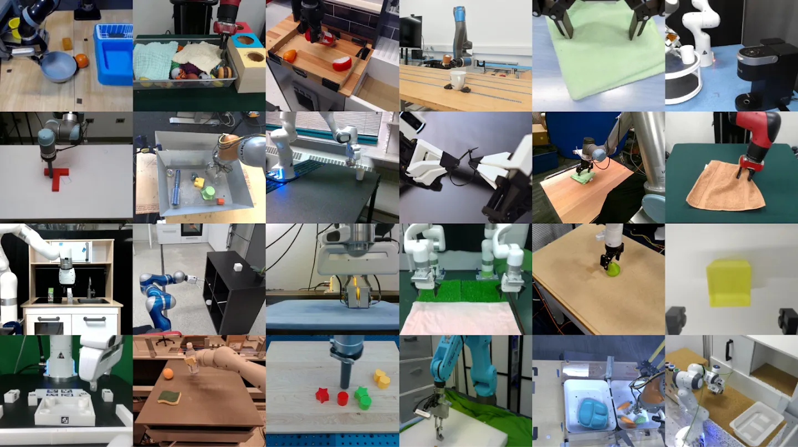
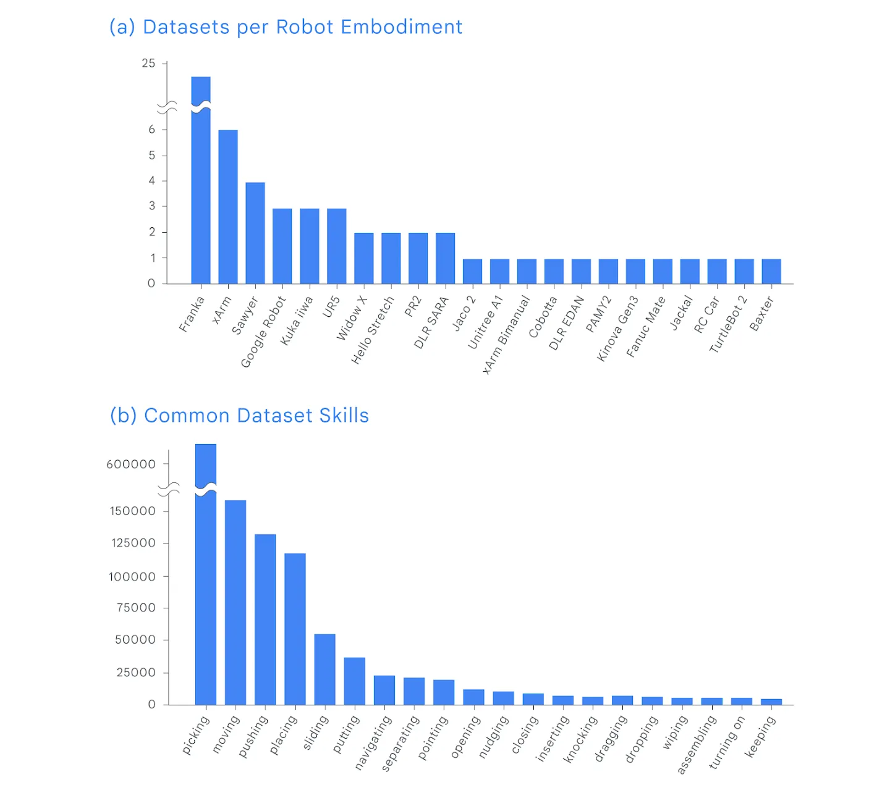

# VLA

I **Vision-Language-Action model (VLA)** estendono i modelli multimodali verso il controllo robotico, integrando percezione visiva, comprensione del linguaggio e generazione di azioni nella stessa pipeline.

Una policy $\pi$ determina quale azione deve eseguire un agente dato ciò che osserva. L'idea di base consiste nel trasformare una generica policy robotica

$$
\pi(a_t\mid o_t)
$$

in una policy condizionata anche da un'istruzione linguistica:

$$
\pi(a_t\mid o_t,q),
$$

dove $o_t$ rappresenta l'osservazione al tempo $t$, $q$ l'istruzione e $a_t$ l'azione prodotta dal modello.

## Precursori

L'evoluzione dei VLA deriva dalla **convergenza di modelli multimodali, language-based planning, imitation learning e visuomotor control**. I primi lavori non sono ancora VLA nel senso moderno del termine, ma introducono separatamente elementi che verranno poi riuniti in policy end-to-end.

### Gato (2022)

**Gato** mostra che task molto diversi possono essere ricondotti a un'**unica interfaccia** sequenziale: immagini, testo, propriocezione e azioni vengono convertiti in token ed elaborati dallo stesso Transformer autoregressivo. 

Il modello è addestrato su **604 task** provenienti da controllo simulato, Atari, ambienti 3D, linguaggio e vision-language.

La componente robotica usa RGB-Stacking con dati sia simulati sia reali e osservazioni visive e propriocettive di un braccio manipolatore.

#### Novelty

La novelty consiste nell'**unificazione di modalità**, embodiment e action space differenti all'interno di un solo sequence model. 

#### Limiti

Il limite principale è che **il linguaggio non condiziona esplicitamente una policy robotica**: la robotica costituisce solo una parte del training e la generalizzazione vision-language-action rimane lontana da quella dei VLA successivi.

L'[approfondimento su Gato](gato/README.md) descrive composizione dei dati, tokenizzazione e obiettivo di training.

### SayCan (2022)

**SayCan** collega conoscenza linguistica e fattibilità fisica senza produrre direttamente low-level action. 

Un LLM assegna una plausibilità $P_{LLM}$ alle skill compatibili con l'istruzione $q$ tramite log-likelihood.

Una value function $P_{value}$ ne stima invece l'**affordance**, cioè la fattibilità nello stato corrente; il prodotto dei due punteggi determina la skill da eseguire. 

$$
P_{LLM}(skill \mid q, history) \cdot P_{value}(skill\mid state) \longrightarrow \text{most feasible skill}
$$

Le skill sono addestrate separatamente e vengono eseguite da un Everyday Robots mobile manipulator dotato di base mobile, braccio a 7 DoF, gripper e camera RGB. Il sistema è studiato in una mock kitchen e valutato anche in una seconda office kitchen, su 101 istruzioni reali.

#### Novelty

La novelty è l'uso della conoscenza di un LLM per comporre skill robotiche tenendo conto delle affordance apprese. 

#### Limiti

La modularità è anche il limite principale: il language model può scegliere soltanto tra skill definite e addestrate in precedenza, mentre eventuali errori delle policy sottostanti si accumulano nell'esecuzione di task lunghi.

L'[approfondimento su SayCan](saycan/README.md) ricostruisce il meccanismo di scoring, l'esecuzione iterativa e il setup sperimentale.

## Dalle skill modulari alle policy end-to-end

### RT-1 (2022)

**RT-1** sostituisce la composizione di skill separate con una singola policy che riceve una breve storia di immagini e un'istruzione $q$, quindi produce direttamente token di azione. 

Il dataset principale contiene oltre 130.000 episodi reali raccolti in 17 mesi con 13 Everyday Robots mobile manipulators e copre più di 700 task in ambienti di tipo office kitchen. 

La policy controlla braccio, gripper e base mobile mediante componenti continue discretizzate in 256 bin, oltre a un mode token che seleziona braccio, base o terminazione.

#### Novelty

La novelty risiede nella dimostrazione che una **Transformer policy relativamente compatta** può assorbire un dataset robotico ampio ed eterogeneo e operare in closed loop a 3 Hz.

#### Limiti

I limiti derivano dal **behavioral cloning**, dalla quantizzazione e dalla conoscenza semantica appresa quasi esclusivamente dalle dimostrazioni robotiche.

Le prestazioni diminuiscono sensibilmente quando cambiano background, oggetti o configurazioni.

L'[approfondimento su RT-1](rt1/README.md) presenta dataset, architettura FiLM-EfficientNet/TokenLearner, action space, training ed evaluation.

### RT-2 (2023)

**RT-2** parte da un Vision-Language Model pre-addestrato sul web e lo trasforma in una policy rappresentando anche le azioni come **token linguistici**.

Il training combina i dati vision-language originali di PaLI-X o PaLM-E con le oltre 130.000 traiettorie robotiche di RT-1, raccolte con 13 Everyday Robots mobile manipulators.

Il lavoro considera modelli da 5 a 55 miliardi di parametri e include anche una valutazione sul diverso embodiment di Language Table.

#### Novelty

La novelty è il **co-fine-tuning di conoscenza vision-language e controllo robotico nella stessa output head autoregressiva**: concetti appresi dal web possono così guidare skill fisiche apprese dalle dimostrazioni.

RT-2 mostra miglioramenti su oggetti, ambienti e richieste semantiche non presenti nei robot data.

#### Limiti

Il web amplia la conoscenza semantica ma **non crea nuove primitive motorie**, mentre la discretizzazione delle azioni introduce errore.

Il decoding autoregressivo di modelli molto grandi limita il controllo a circa 1–3 Hz e il dataset motorio resta prevalentemente legato a un solo embodiment.

L'[approfondimento su RT-2](rt2/README.md) sviluppa tokenizzazione, co-fine-tuning, constrained decoding, controllo closed loop ed esperimenti di generalizzazione.

## Cross-embodiment VLA

I **Vision-Language-Action model cross-embodiment** cercano di superare uno dei vincoli storici del robot learning: la tendenza ad addestrare una policy separata per ogni robot, configurazione sensoriale e insieme di task.

L'obiettivo è invece costruire modelli che possano apprendere da esperienze raccolte con **embodiment differenti**, sfruttando regolarità condivise tra piattaforme diverse e trasferendo conoscenza da un robot all'altro.

In questo contesto, il termine *embodiment* comprende non soltanto la morfologia del robot, ma anche il suo spazio delle azioni, la disposizione delle camere, i sensori disponibili e il tipo di controllo utilizzato. 

Una policy cross-embodiment deve quindi affrontare un problema più difficile della normale generalizzazione tra task: deve **trovare una rappresentazione sufficientemente comune da permettere il trasferimento** tra diverse piattaforme, pur conservando le informazioni specifiche necessarie a controllare ciascuna piattaforma.

Una formulazione generale considera una policy

$$
\pi(a_t \mid o_{\leq t}, q, e),
$$

dove $o_{\leq t}$ rappresenta la storia delle osservazioni fino al tempo $t$, $q$ l'istruzione linguistica, $a_t$ l'azione e $e$ l'embodiment o, più in generale, l'insieme delle informazioni che determinano come l'azione debba essere interpretata dal robot. 

I diversi lavori differiscono soprattutto nel modo in cui rendono confrontabili dati eterogenei, nel tipo di backbone utilizzato per collegare percezione e linguaggio e nella rappresentazione con cui vengono generate le azioni.

L'evoluzione della linea di ricerca può essere letta come un passaggio da **dataset unificati e action space standardizzati**, come [Open X-Embodiment](#open-x-embodiment) e RT-X, verso policy generaliste progettate esplicitamente per essere riadattate, come Octo, e successivamente verso veri **Vision-Language-Action foundation model**, come OpenVLA, $\pi_0$ e GR00T, nei quali conoscenza semantica pre-addestrata e generazione di azioni continue vengono integrate sempre più strettamente.

### RT-X (2023)

**RT-X** indica i modelli addestrati sul mixture cross-embodiment di Open X-Embodiment. Nel lavoro originale vengono studiati due casi: **RT-1-X**, ottenuto addestrando l'architettura RT-1 sui dati aggregati, e **RT-2-X**, che estende la stessa idea a RT-2, cioè a un Vision-Language-Action model derivato da un grande Vision-Language Model.

RT-1-X serve soprattutto a verificare se il **co-training su robot differenti produca vantaggi** rispetto a policy addestrate esclusivamente sui dati di ciascuna piattaforma. 

RT-2-X aggiunge una seconda sorgente di trasferimento: oltre alla diversità robotica, sfrutta la conoscenza visivo-semantica acquisita durante il pre-training su dati web. Le azioni vengono ricondotte a una rappresentazione comune dell'end-effector; nel caso di RT-2-X vengono rappresentate all'interno dello stesso paradigma token-based utilizzato dal modello vision-language.

Gli esperimenti mostrano che il training con dati provenienti da altre piattaforme può migliorare il comportamento sul robot target. In particolare, RT-2-X evidenzia capacità emergenti di comprensione spaziale e linguistica più forti rispetto al corrispondente modello addestrato su un insieme robotico meno diversificato. Il risultato importante non è che gli embodiment diventino intercambiabili, ma che **esperienze raccolte su un robot possono contribuire ad apprendere skill utilizzabili da un altro**.

#### Novelty

RT-X fornisce una delle prime dimostrazioni su larga scala di **positive cross-embodiment transfer** in policy Transformer per il controllo reale. Il risultato cambia il ruolo dei dataset robotici: invece di essere esclusivamente dati specifici della piattaforma che li ha prodotti, possono diventare componenti di un corpus condiviso.

RT-2-X mostra inoltre che il **trasferimento cross-embodiment e il trasferimento da dati vision-language web possono essere complementari**. La generalizzazione del robot deriva quindi sia da conoscenza semantica esterna alla robotica sia dalla varietà di esperienze motorie presenti nel mixture.

#### Limiti

RT-X dipende da una **forte normalizzazione delle azioni e non risolve in modo generale il problema di spazi d'azione incompatibili**. Il lavoro originale non studia in modo esaustivo la generalizzazione zero-shot verso robot completamente nuovi e riconosce che embodiment con sensing e actuation molto differenti rimangono una sfida aperta.

RT-2-X presenta inoltre i costi tipici dei grandi VLA autoregressivi: la capacità semantica cresce con la scala del backbone, ma aumentano anche memoria, costo di training e costo di inferenza. La rappresentazione discreta delle azioni attraverso token costituisce infine una scelta progettuale diversa dalle successive policy generative continue basate su diffusion o flow matching.

L'architettura, la costruzione del mixture e il confronto tra RT-1-X e RT-2-X sono sviluppati in [RT-X](./rtx/README.md).

### Octo

**Octo** passa da un semplice co-training cross-robot alla costruzione di una **generalist robot policy aperta e facilmente adattabile**. 

Octo è una policy Transformer pre-addestrata su circa **800 mila traiettorie** provenienti da 25 dataset di Open X-Embodiment ed è progettata fin dall'inizio per **accettare combinazioni differenti di osservazioni**, task specification e spazi delle azioni.

A differenza di RT-X, Octo **non assume che l'interfaccia del robot debba rimanere identica** in ogni utilizzo. L'architettura organizza gli input in token e utilizza blocchi di attenzione che consentono di modificare durante il fine-tuning quali sensori siano presenti.

Il task può essere specificato attraverso **linguaggio naturale oppure goal image**, mentre le azioni vengono prodotte con un decoder generativo basato su diffusion.

Questo design rende Octo particolarmente interessante come **pretrained policy initialization**. Il modello non deve necessariamente risolvere zero-shot ogni nuovo robot; l'obiettivo è fornire una rappresentazione e una policy di partenza che possano essere adattate rapidamente a nuove camere, segnali propriocettivi e action space con una quantità relativamente ridotta di dati target.

#### Novelty

La novità principale di Octo è la combinazione tra **pre-training cross-embodiment e modularità dell'interfaccia**. Il modello è esplicitamente progettato affinché nuovi input o nuovi action head possano essere introdotti senza ricostruire l'intera policy da zero.

Octo mostra un percorso alternativo ai VLA molto grandi: una policy relativamente compatta può acquisire una forte utilità pratica se il pre-training è sufficientemente diversificato e il modello è costruito per il fine-tuning.

#### Limiti

Octo rimane fortemente dipendente dalla distribuzione dei dati di robot manipulation su cui viene pre-addestrato. Il modello può adattarsi a nuovi embodiment, ma tale adattamento richiede normalmente **dati del robot target e fine-tuning**; non equivale quindi a un controller universale capace di controllare direttamente qualsiasi piattaforma.

La policy possiede inoltre una componente semantica meno ampia rispetto ai VLA costruiti a partire da grandi VLM pre-addestrati su Internet. Questo trade-off tra dimensione, apertura, adattabilità e conoscenza semantica costituisce uno dei punti di confronto principali con OpenVLA e con i modelli successivi.

L'architettura Transformer, il diffusion readout e la strategia di fine-tuning sono approfonditi in [Octo](./octo/README.md).

### OpenVLA

### Pi-0

### GR00T

## Dataset per VLA

### Open X-Embodiment (2023)

**Open X-Embodiment** è soprattutto un'iniziativa di **data aggregation e standardizzazione**. 

Il progetto nasce dalla constatazione che la robotica dispone di molti dataset relativamente piccoli, raccolti da laboratori differenti e con robot, sensori, task e formati incompatibili. Invece di trattare ciascun dataset come un dominio isolato, Open X-Embodiment costruisce un grande insieme comune con cui studiare se l'esperienza acquisita da un embodiment possa migliorare il controllo di altri robot.

Open X-Embodiment aggrega dati provenienti da **22 embodiment robotici** e 21 istituzioni, includendo 527 skill e oltre un milione di traiettorie nella release del dataset. Sono presenti manipolatori singoli, sistemi bimanuali e piattaforme con caratteristiche cinematiche differenti..

Uno dei problemi centrali è la **diversa semantica delle azioni**. Per rendere possibile il co-training, il lavoro converte dove possibile il controllo in una **rappresentazione comune *riferita all'end-effector***, descritta attraverso traslazione, rotazione e apertura della pinza. Questa scelta permette di condividere una parte significativa della struttura del controllo tra manipolatori diversi, ma implica anche che robot con modalità di attuazione radicalmente differenti siano più difficili da includere nello stesso schema.

#### Novelty

La principale novità è aver trasformato il cross-embodiment learning da un'ipotesi studiata su poche piattaforme a un problema affrontabile su scala molto più ampia.

Open X-Embodiment introduce un'infrastruttura che sarà riutilizzata da numerosi lavori successivi. Octo e OpenVLA, per esempio, vengono pre-addestrati su subset o rielaborazioni di questo corpus, rendendo Open X-Embodiment un elemento fondamentale nella transizione verso i robot foundation model.

#### Limiti

L'unificazione non elimina completamente la dipendenza dall'embodiment. La **standardizzazione funziona meglio quando i robot condividono una struttura di controllo sufficientemente simile**, mentre sensori, attuatori o morfologie molto differenti richiedono trasformazioni ulteriori o non possono essere rappresentati senza perdita di informazione.

Il paper mostra soprattutto positive transfer tra robot presenti nel mixture di training; **non dimostra invece che una singola policy possa controllare senza adattamento un embodiment arbitrario** mai osservato. 

La **copertura** del dataset rimane inoltre fortemente **concentrata sulla manipolazione**, per cui il concetto di generalità va interpretato rispetto al dominio rappresentato dai dati.

