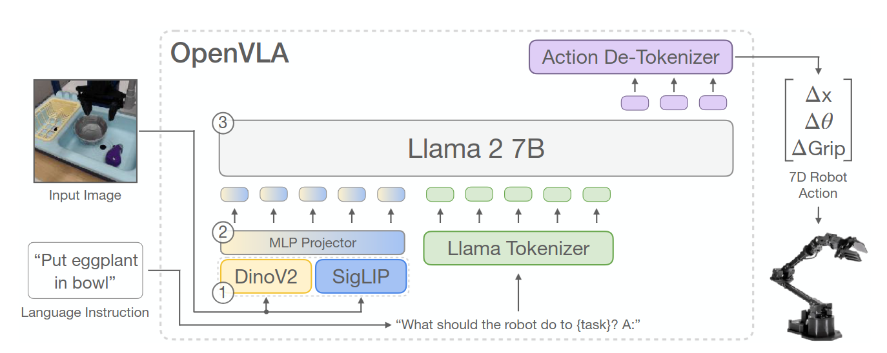

# VLA

I **Vision-Language-Action model (VLA)** estendono i modelli multimodali verso il controllo robotico, integrando percezione visiva, comprensione del linguaggio e generazione di azioni nella stessa pipeline.

Una policy $\pi$ determina quale azione deve eseguire un agente dato ciò che osserva. L'idea di base consiste nel trasformare una generica policy robotica

$$
\pi(a_t\mid o_t)
$$

in una policy condizionata anche da un'istruzione linguistica:

$$
\pi(a_t\mid o_t,q),
$$

dove $o_t$ rappresenta l'osservazione al tempo $t$, $q$ l'istruzione e $a_t$ l'azione prodotta dal modello.

## Precursori

L'evoluzione dei VLA deriva dalla **convergenza di modelli multimodali, language-based planning, imitation learning e visuomotor control**. I primi lavori non sono ancora VLA nel senso moderno del termine, ma introducono separatamente elementi che verranno poi riuniti in policy end-to-end.

### Gato (2022)

**Gato** mostra che task molto diversi possono essere ricondotti a un'**unica interfaccia** sequenziale: immagini, testo, propriocezione e azioni vengono convertiti in token ed elaborati dallo stesso Transformer autoregressivo. 

Il modello è addestrato su **604 task** provenienti da controllo simulato, Atari, ambienti 3D, linguaggio e vision-language.

La componente robotica usa RGB-Stacking con dati sia simulati sia reali e osservazioni visive e propriocettive di un braccio manipolatore.

#### Novelty

La novelty consiste nell'**unificazione di modalità**, embodiment e action space differenti all'interno di un solo sequence model. 

#### Limiti

Il limite principale è che **il linguaggio non condiziona esplicitamente una policy robotica**: la robotica costituisce solo una parte del training e la generalizzazione vision-language-action rimane lontana da quella dei VLA successivi.

L'[approfondimento su Gato](models/gato/README.md) descrive composizione dei dati, tokenizzazione e obiettivo di training.

### SayCan (2022)

**SayCan** collega conoscenza linguistica e fattibilità fisica senza produrre direttamente low-level action. 

Un LLM assegna una plausibilità $P_{LLM}$ alle skill compatibili con l'istruzione $q$ tramite log-likelihood.

Una value function $P_{value}$ ne stima invece l'**affordance**, cioè la fattibilità nello stato corrente; il prodotto dei due punteggi determina la skill da eseguire. 

$$
P_{LLM}(skill \mid q, history) \cdot P_{value}(skill\mid state) \longrightarrow \text{most feasible skill}
$$

Le skill sono addestrate separatamente e vengono eseguite da un Everyday Robots mobile manipulator dotato di base mobile, braccio a 7 DoF, gripper e camera RGB. Il sistema è studiato in una mock kitchen e valutato anche in una seconda office kitchen, su 101 istruzioni reali.

#### Novelty

La novelty è l'uso della conoscenza di un LLM per comporre skill robotiche tenendo conto delle affordance apprese. 

#### Limiti

La modularità è anche il limite principale: il language model può scegliere soltanto tra skill definite e addestrate in precedenza, mentre eventuali errori delle policy sottostanti si accumulano nell'esecuzione di task lunghi.

L'[approfondimento su SayCan](models/saycan/README.md) ricostruisce il meccanismo di scoring, l'esecuzione iterativa e il setup sperimentale.

## Policy visuomotorie da imitation learning

Prima che i VLA integrassero linguaggio, visione e controllo su larga scala, una linea di ricerca complementare ha studiato **come rappresentare distribuzioni di azioni complesse** e come ridurre l'accumulo degli errori nel behavioral cloning. IBC e ACT non sono VLA in senso stretto, ma introducono principi riutilizzati nella progettazione delle action head e delle policy robotiche successive.

### IBC (2021)

**Implicit Behavioral Cloning (IBC)** sostituisce la regressione diretta dell'azione con un **energy-based model**. 

Invece di produrre immediatamente $a_t$ da $o_t$, la rete assegna un'energia $E_\theta(o_t,a)$ alle azioni candidate e seleziona quella con energia minima:

$$
\hat{a}_t = \arg\min_{a \in \mathcal{A}} E_\theta(o_t,a),
$$

dove $\mathcal{A}$ è lo spazio delle azioni ed $E_\theta$ è la funzione appresa con parametri $\theta$. 

Questa formulazione può rappresentare meglio dimostrazioni multimodali o mapping discontinui, nei quali più azioni diverse risultano valide per la stessa osservazione.

Gli esperimenti comprendono task D4RL con dimostrazioni umane, ambienti simulati di pushing e sweeping e quattro task reali eseguiti da un **xArm6** con **end-effector cilindrico**. 

Per i task reali vengono raccolte da 95 a 502 dimostrazioni teleoperate e la policy riceve soltanto immagini RGB prospettiche a 5 Hz.

#### Novelty

La novelty consiste nel formulare il behavioral cloning come **regressione implicita condizionale**: la policy apprende la compatibilità tra osservazione e azione, anziché comprimere l'intera distribuzione delle dimostrazioni in un singolo output prodotto per regressione.

#### Limiti

La scelta dell'azione richiede un processo di ottimizzazione o campionamento nello spazio $\mathcal{A}$. **Training e inferenza sono quindi più costosi** di una policy feed-forward esplicita e la difficoltà cresce con dimensionalità e vincoli dell'action space. 

Inoltre, IBC **non usa istruzioni linguistiche** e viene addestrato separatamente per i task considerati.

L'[approfondimento su IBC](models/ibc/README.md) sviluppa energy-based modeling, negative sampling, inferenza e risultati simulati e real-world.

### ACT (2023)

**Action Chunking with Transformers (ACT)** è una policy di imitation learning introdotta insieme alla piattaforma bimanuale ALOHA. 

A partire dalle immagini di quattro camere e dalle posizioni articolari correnti, predice un **chunk di azioni future** invece della sola azione successiva:

$$
\pi_\theta(a_{t:t+k-1}\mid o_t),
$$

dove $k$ è la lunghezza del chunk. Durante l'esecuzione, chunk sovrapposti forniscono più predizioni per lo stesso istante e un *temporal ensemble* le combina per ottenere movimenti più fluidi.

ACT è valutato su due task simulati e sei task reali di manipolazione bimanuale fine. Le dimostrazioni sono raccolte con ALOHA, un sistema leader-follower formato da due bracci per l'operatore e due bracci follower a 7 DoF; l'action space della policy contiene quindi 14 target articolari. 

Il lavoro mostra che circa dieci minuti di dimostrazioni possono essere sufficienti per alcuni task contact-rich, come inserire una batteria o aprire un contenitore.

#### Novelty

La novelty è la combinazione di **action chunking, Transformer, conditional VAE e temporal ensembling**. Il chunking riduce l'orizzonte decisionale effettivo, mentre la variabile latente modella la variabilità delle dimostrazioni umane e l'ensemble temporale attenua le discontinuità tra pianificazioni successive.

#### Limiti

ACT viene **addestrato da zero e separatamente per ciascun task** del lavoro originario. Non riceve un'istruzione linguistica, **non trasferisce automaticamente skill tra task** e rimane legato alle osservazioni e all'action space articolare di ALOHA. 

Chunk molto lunghi riducono inoltre la reattività alle nuove osservazioni, mentre chunk brevi recuperano parte dei problemi del behavioral cloning step-by-step.

L'[approfondimento su ACT](models/act/README.md) descrive dataset, architettura CVAE, action chunking, temporal ensembling ed evaluation su ALOHA.

## Dalle skill modulari alle policy end-to-end

### RT-1 (2022)

**RT-1** sostituisce la composizione di skill separate con una singola policy che riceve una breve storia di immagini e un'istruzione $q$, quindi produce direttamente token di azione. 

Il dataset principale contiene oltre 130.000 episodi reali raccolti in 17 mesi con 13 Everyday Robots mobile manipulators e copre più di 700 task in ambienti di tipo office kitchen. 

La policy controlla braccio, gripper e base mobile mediante componenti continue discretizzate in 256 bin, oltre a un mode token che seleziona braccio, base o terminazione.

#### Novelty

La novelty risiede nella dimostrazione che una **Transformer policy relativamente compatta** può assorbire un dataset robotico ampio ed eterogeneo e operare in closed loop a 3 Hz.

#### Limiti

I limiti derivano dal **behavioral cloning**, dalla quantizzazione e dalla conoscenza semantica appresa quasi esclusivamente dalle dimostrazioni robotiche.

Le prestazioni diminuiscono sensibilmente quando cambiano background, oggetti o configurazioni.

L'[approfondimento su RT-1](models/rt1/README.md) presenta dataset, architettura FiLM-EfficientNet/TokenLearner, action space, training ed evaluation.

### RT-2 (2023)

**RT-2** parte da un Vision-Language Model pre-addestrato sul web e lo trasforma in una policy rappresentando anche le azioni come **token linguistici**.

Il training combina i dati vision-language originali di PaLI-X o PaLM-E con le oltre 130.000 traiettorie robotiche di RT-1, raccolte con 13 Everyday Robots mobile manipulators.

Il lavoro considera modelli da 5 a 55 miliardi di parametri e include anche una valutazione sul diverso embodiment di Language Table.

#### Novelty

La novelty è il **co-fine-tuning di conoscenza vision-language e controllo robotico nella stessa output head autoregressiva**: concetti appresi dal web possono così guidare skill fisiche apprese dalle dimostrazioni.

RT-2 mostra miglioramenti su oggetti, ambienti e richieste semantiche non presenti nei robot data.

#### Limiti

Il web amplia la conoscenza semantica ma **non crea nuove primitive motorie**, mentre la discretizzazione delle azioni introduce errore.

Il decoding autoregressivo di modelli molto grandi limita il controllo a circa 1–3 Hz e il dataset motorio resta prevalentemente legato a un solo embodiment.

L'[approfondimento su RT-2](models/rt2/README.md) sviluppa tokenizzazione, co-fine-tuning, constrained decoding, controllo closed loop ed esperimenti di generalizzazione.

## Cross-embodiment VLA

I **Vision-Language-Action model cross-embodiment** cercano di superare uno dei vincoli storici del robot learning: la tendenza ad addestrare una policy separata per ogni robot, configurazione sensoriale e insieme di task.

L'obiettivo è invece costruire modelli che possano apprendere da esperienze raccolte con **embodiment differenti**, sfruttando regolarità condivise tra piattaforme diverse e trasferendo conoscenza da un robot all'altro.

In questo contesto, il termine *embodiment* comprende non soltanto la morfologia del robot, ma anche il suo spazio delle azioni, la disposizione delle camere, i sensori disponibili e il tipo di controllo utilizzato. 

Una policy cross-embodiment deve quindi affrontare un problema più difficile della normale generalizzazione tra task: deve **trovare una rappresentazione sufficientemente comune da permettere il trasferimento** tra diverse piattaforme, pur conservando le informazioni specifiche necessarie a controllare ciascuna piattaforma.

Una formulazione generale considera una policy

$$
\pi(a_t \mid o_{\leq t}, q, e),
$$

dove $o_{\leq t}$ rappresenta la storia delle osservazioni fino al tempo $t$, $q$ l'istruzione linguistica, $a_t$ l'azione e $e$ l'embodiment o, più in generale, l'insieme delle informazioni che determinano come l'azione debba essere interpretata dal robot. 

I diversi lavori differiscono soprattutto nel modo in cui rendono confrontabili dati eterogenei, nel tipo di backbone utilizzato per collegare percezione e linguaggio e nella rappresentazione con cui vengono generate le azioni.

L'evoluzione della linea di ricerca può essere letta come un passaggio da **dataset unificati e action space standardizzati**, come [Open X-Embodiment](datasets/README.md#open-x-embodiment) e RT-X, verso policy generaliste progettate esplicitamente per essere riadattate, come Octo, e successivamente verso veri **Vision-Language-Action foundation model**, come OpenVLA, $\pi_0$ e GR00T, nei quali conoscenza semantica pre-addestrata e generazione di azioni continue vengono integrate sempre più strettamente.

### RT-X (2023)

**RT-X** indica i modelli addestrati sul mixture cross-embodiment di Open X-Embodiment. Nel lavoro originale vengono studiati due casi: **RT-1-X**, ottenuto addestrando l'architettura RT-1 sui dati aggregati, e **RT-2-X**, che estende la stessa idea a RT-2, cioè a un Vision-Language-Action model derivato da un grande Vision-Language Model.

RT-1-X serve soprattutto a verificare se il **co-training su robot differenti produca vantaggi** rispetto a policy addestrate esclusivamente sui dati di ciascuna piattaforma. 

RT-2-X aggiunge una seconda sorgente di trasferimento: oltre alla diversità robotica, sfrutta la conoscenza visivo-semantica acquisita durante il pre-training su dati web. Le azioni vengono ricondotte a una rappresentazione comune dell'end-effector; nel caso di RT-2-X vengono rappresentate all'interno dello stesso paradigma token-based utilizzato dal modello vision-language.

Gli esperimenti mostrano che il training con dati provenienti da altre piattaforme può migliorare il comportamento sul robot target. In particolare, RT-2-X evidenzia capacità emergenti di comprensione spaziale e linguistica più forti rispetto al corrispondente modello addestrato su un insieme robotico meno diversificato. Il risultato importante non è che gli embodiment diventino intercambiabili, ma che **esperienze raccolte su un robot possono contribuire ad apprendere skill utilizzabili da un altro**.

#### Novelty

RT-X fornisce una delle prime dimostrazioni su larga scala di **positive cross-embodiment transfer** in policy Transformer per il controllo reale. Il risultato cambia il ruolo dei dataset robotici: invece di essere esclusivamente dati specifici della piattaforma che li ha prodotti, possono diventare componenti di un corpus condiviso.

RT-2-X mostra inoltre che il **trasferimento cross-embodiment e il trasferimento da dati vision-language web possono essere complementari**. La generalizzazione del robot deriva quindi sia da conoscenza semantica esterna alla robotica sia dalla varietà di esperienze motorie presenti nel mixture.

#### Limiti

RT-X dipende da una **forte normalizzazione delle azioni e non risolve in modo generale il problema di spazi d'azione incompatibili**. Il lavoro originale non studia in modo esaustivo la generalizzazione zero-shot verso robot completamente nuovi e riconosce che embodiment con sensing e actuation molto differenti rimangono una sfida aperta.

RT-2-X presenta inoltre i costi tipici dei grandi VLA autoregressivi: la capacità semantica cresce con la scala del backbone, ma aumentano anche memoria, costo di training e costo di inferenza. La rappresentazione discreta delle azioni attraverso token costituisce infine una scelta progettuale diversa dalle successive policy generative continue basate su diffusion o flow matching.

L'architettura, la costruzione del mixture e il confronto tra RT-1-X e RT-2-X sono sviluppati in [RT-X](models/rtx/README.md).

### Octo

**Octo** passa da un semplice co-training cross-robot alla costruzione di una **generalist robot policy aperta e facilmente adattabile**. 

Octo è una policy Transformer pre-addestrata su circa **800 mila traiettorie** provenienti da 25 dataset di Open X-Embodiment ed è progettata fin dall'inizio per **accettare combinazioni differenti di osservazioni**, task specification e spazi delle azioni.

A differenza di RT-X, Octo **non assume che l'interfaccia del robot debba rimanere identica** in ogni utilizzo. L'architettura organizza gli input in token e utilizza blocchi di attenzione che consentono di modificare durante il fine-tuning quali sensori siano presenti.

Il task può essere specificato attraverso **linguaggio naturale oppure goal image**, mentre le azioni vengono prodotte con un decoder generativo basato su diffusion.

Questo design rende Octo particolarmente interessante come **pretrained policy initialization**. Il modello non deve necessariamente risolvere zero-shot ogni nuovo robot; l'obiettivo è fornire una rappresentazione e una policy di partenza che possano essere adattate rapidamente a nuove camere, segnali propriocettivi e action space con una quantità relativamente ridotta di dati target.

#### Novelty

La novità principale di Octo è la combinazione tra **pre-training cross-embodiment e modularità dell'interfaccia**. Il modello è esplicitamente progettato affinché nuovi input o nuovi action head possano essere introdotti senza ricostruire l'intera policy da zero.

Octo mostra un percorso alternativo ai VLA molto grandi: una policy relativamente compatta può acquisire una forte utilità pratica se il pre-training è sufficientemente diversificato e il modello è costruito per il fine-tuning.

#### Limiti

Octo rimane fortemente dipendente dalla distribuzione dei dati di robot manipulation su cui viene pre-addestrato. Il modello può adattarsi a nuovi embodiment, ma tale adattamento richiede normalmente **dati del robot target e fine-tuning**; non equivale quindi a un controller universale capace di controllare direttamente qualsiasi piattaforma.

La policy possiede inoltre una componente semantica meno ampia rispetto ai VLA costruiti a partire da grandi VLM pre-addestrati su Internet. Questo trade-off tra dimensione, apertura, adattabilità e conoscenza semantica costituisce uno dei punti di confronto principali con OpenVLA e con i modelli successivi.

### OpenVLA (2024)

**OpenVLA** porta l'impostazione di RT-2 in un modello interamente aperto e progettato per il fine-tuning. Parte dal VLM *Prismatic-7B*, che combina encoder visuali **DINOv2 e SigLIP** con un backbone **Llama 2** da 7 miliardi di parametri, e lo addestra a generare **azioni robotiche come token discreti**.

Il training utilizza circa **970.000 traiettorie *real-world*** selezionate da Open X-Embodiment. Il mixture copre task, scene ed embodiment differenti. 

Il modello viene valutato direttamente sui setup *WidowX* di BridgeData V2 e *Google Robot* della famiglia RT; viene inoltre adattato a due setup Franka, Franka-Tabletop a 5 Hz e Franka-DROID a 15 Hz.

Ogni componente continua dell'azione viene **normalizzata, discretizzata in 256 bin** e associata a uno dei token meno usati del vocabolario Llama. 

Il language model può così apprendere con lo stesso **obiettivo autoregressivo** la sequenza che rappresenta:

$$
a_t=(\Delta x_t,\Delta y_t,\Delta z_t,
\Delta\phi_t,\Delta\theta_t,\Delta\psi_t,g_t),
$$

dove le prime sei componenti descrivono la variazione di posa dell'end-effector e $g_t$ il gripper.

#### Novelty

OpenVLA offre una delle prime implementazioni **open-source e riproducibili di un VLA da 7B parametri**, includendo checkpoint, pipeline PyTorch, training su mixture RLDS e supporto al fine-tuning. 

La **fusione di DINOv2 e SigLIP** combina feature sensibili alla struttura spaziale con rappresentazioni allineate semanticamente al linguaggio.

Il modello mostra inoltre che una **policy molto più piccola di RT-2-X può beneficiare congiuntamente del pre-training web del VLM e del pre-training su un grande corpus robotico**. 

Tramite LoRA è possibile adattare soltanto una piccola frazione dei parametri mantenendo, nel protocollo studiato, prestazioni vicine al full fine-tuning.

#### Limiti

La discretizzazione introduce errore di quantizzazione e la **generazione autoregressiva di più token per ogni azione limita la frequenza di controllo**. La versione originaria predice inoltre una **singola azione per query**, senza un action chunk temporale esplicito.

Il **fine-tuning del VLM esclusivamente sui robot data può degradare parte della conoscenza semantica acquisita sul web**: RT-2-X, che mantiene il co-fine-tuning vision-language, rimane più forte su alcune richieste basate su concetti Internet molto lontani dai dati robotici. Dimensione e costo di inferenza restano infine elevati rispetto a policy robotiche specializzate.

L'[approfondimento su OpenVLA](models/openvla/README.md) descrive backbone Prismatic, tokenizzazione delle azioni, training mixture, evaluation e adattamento tramite LoRA.

## Flow Matching VLA

### Pi-0

## Reasoning e planning nei VLA

### Gemini Robotics

### Pi 0.5

### GR00T

## Real-time VLA

### SmolVLA

### TinyVLA

### FAST

### OpenVLA-OFT

## Tassonomia trasversale dei VLA

### Rappresentazione delle azioni

La rappresentazione dell'azione determina che **cosa viene predetto dal modello** e quale loss collega la rappresentazione multimodale al controllo.

| Famiglia | Rappresentazione | Esempi | Conseguenza principale |
| --- | --- | --- | --- |
| **Regressione o generazione continua** | Il decoder produce direttamente valori continui o parametri di una distribuzione | ACT | Evita la quantizzazione, ma deve modellare esplicitamente multimodalità e precisione |
| **Policy implicita** | L'azione minimizza una funzione energetica $E_\theta(o_t,a)$ | IBC | Rappresenta bene modalità separate, ma richiede ottimizzazione durante l'inferenza |
| **Token discreti per dimensione** | Ogni componente continua viene assegnata a un bin e generata come token | RT-1, RT-2, OpenVLA | Riusa l'obiettivo next-token del Transformer, introducendo quantizzazione e decoding sequenziale |
| **Tokenizzazione di traiettorie** | Un tokenizer comprime un intero action chunk in una sequenza discreta più corta | FAST e FAST+ | Mantiene un'interfaccia autoregressiva riducendo il numero di token necessari |
| **Diffusion action head** | Una sequenza continua viene ottenuta rimuovendo progressivamente rumore | Octo | Modella distribuzioni multimodali e action chunk, ma richiede più passi di denoising |
| **Flow matching** | Il decoder apprende un campo di velocità che trasporta rumore verso una traiettoria di azioni | $\pi_0$, $\pi_{0.5}$, GR00T N1 | Produce chunk continui con pochi passi di integrazione, separando spesso il VLM dall'action expert |

### Modellazione temporale e action chunking

La seconda distinzione riguarda **quanta dinamica futura viene rappresentata in una singola inferenza** e come la policy incorpora nuove osservazioni.

| Schema temporale | Forma concettuale | Esempi e ruolo |
| --- | --- | --- |
| **Single-step action prediction** | $\pi(a_t\mid o_t,q)$ | RT-1, RT-2 e OpenVLA originario producono l'azione del passo corrente |
| **History window** | $\pi(a_t\mid o_{t-h:t},q)$ | Una breve sequenza di osservazioni disambigua velocità, contatti e fase del task; RT-1 e Octo ne sono esempi |
| **Trajectory prediction** | $\pi(a_{t:t+H}\mid o_{\leq t},q)$ | Il modello rappresenta esplicitamente l'evoluzione futura locale, anziché azioni indipendenti |
| **Action chunks** | Un blocco di $H$ comandi viene generato congiuntamente | ACT, Octo, $\pi_0$ e GR00T riducono l'orizzonte decisionale effettivo e migliorano la coerenza del moto |
| **Receding-horizon control** | Si genera un chunk, se ne esegue soltanto un prefisso e si pianifica di nuovo | Recupera reattività rispetto all'esecuzione open loop dell'intero chunk |
| **Closed-loop replanning** | Nuove osservazioni aggiornano continuamente la decisione | È il principio generale che accomuna policy single-step e chunked quando vengono rieseguite durante il task |

**Action chunking e closed loop non sono opposti**. Un modello può prevedere una traiettoria di $H$ passi, eseguire solo i primi $h<H$ comandi e poi produrre un nuovo chunk. La scelta di $H$ e $h$ bilancia coerenza temporale, costo di inferenza e capacità di reagire agli errori.

### Pre-training e adaptation

I VLA differiscono anche per il punto da cui nasce la policy. Le categorie sono sovrapposte perché molti sistemi moderni combinano conoscenza web, video umani e traiettorie robotiche.

| Strategia | Punto di partenza | Modelli rappresentativi | Cosa viene trasferito |
| --- | --- | --- | --- |
| **Web-pretrained VLM to robot policy** | Un VLM già addestrato su immagini, testo o video viene adattato alle azioni | RT-2, OpenVLA, Gemini Robotics | Semantica, riconoscimento visuale e capacità linguistiche |
| **Robot-data pretraining** | Una policy viene pre-addestrata direttamente su mixture di traiettorie | Octo | Primitive visuomotorie, dinamica locale e struttura degli action space |
| **Pre-training ibrido** | VLM e action expert vengono combinati o co-addestrati con dati robotici e altre modalità | $\pi_0$, GR00T | Conoscenza semantica più prior motori continui e multi-embodiment |
| **Downstream adaptation** | Un checkpoint generalista viene specializzato con poche dimostrazioni target | Octo, OpenVLA, $\pi_0$, GR00T | Nuovo task, sensore, action space o embodiment |

RT-2, OpenVLA e Gemini Robotics illustrano la trasformazione diretta di una base vision-language in controller. Octo isola meglio il valore del robot-data pretraining. $\pi_0$ e GR00T non appartengono esclusivamente a una sola colonna: usano componenti vision-language pre-addestrati, ma la loro capacità di controllo dipende da grandi mixture robotici e da action expert dedicati.

### Reasoning e planning nei VLA

Il termine **reasoning** può indicare capacità molto diverse. È utile separare il ragionamento semantico necessario a interpretare $q$ dalla pianificazione temporale e dalla generazione dei comandi motori.

$$
q,o_{\leq t}
\rightarrow
\text{high-level reasoning}
\rightarrow
\text{subgoal o skill}
\rightarrow
\text{low-level action decoding}
$$

- **Task decomposition** trasforma un obiettivo lungo in una catena di skill
- **Subgoal prediction** produce uno stato intermedio, una frase o una rappresentazione latente
- **Language planning** costruisce una sequenza simbolica
- **Controller low-level** traduce infine il passo corrente in azioni. 

Ragionare prima dell'action decoding rende più leggibile la separazione tra *"che cosa fare"* e *"come muoversi"*, ma introduce latenza e nuovi punti di errore.

Tuttavia non ogni output testuale costituisce vero planning e non ogni action chunk implica reasoning.

| Famiglia | Organizzazione del reasoning | Caratteristica |
| --- | --- | --- |
| **Gemini Robotics** | Un VLA Gemini-based integra comprensione multimodale, decomposizione e controllo; la variante Gemini Robotics-ER enfatizza reasoning spaziale, planning e progress estimation | Collega capacità web-scale a pianificazione e azione multi-embodiment |
| **$\pi_{0.5}$** | Lo stesso modello viene co-addestrato a produrre azioni e target semantici di alto livello | Può alternare predizione di subtask e controllo low-level, favorendo generalizzazione open-world |
| **GR00T** | Architettura dual-system: un VLM interpreta contesto e istruzione, mentre un action expert generativo produce traiettorie | Separa rappresentazione vision-language e generazione motoria per umanoidi e altri embodiment |
| **Reasoning-augmented VLA** | Il VLA riceve piani, chain of skills, affordance o subgoal generati esplicitamente | Migliora task lunghi se le rappresentazioni intermedie sono verificabili e grounded |
| **World-model-assisted VLA** | Un world model predice conseguenze o video futuri e aiuta a scegliere piano o azione | Introduce look-ahead, ma efficacia e costo dipendono dalla fedeltà della dinamica appresa |

## Dataset per VLA

I dataset determinano quali oggetti, ambienti, skill ed embodiment una policy può osservare durante il training.

Una traiettoria robotica associa tipicamente una sequenza di osservazioni $o_t$, un'istruzione linguistica $q$ e le azioni $a_t$ eseguite dal robot.

La quantità di dati è importante, ma non sostituisce la varietà delle situazioni né la qualità delle dimostrazioni.

### Dataset real-world generalisti

Questa famiglia comprende raccolte ottenute su robot fisici e mixture costruiti per superare il singolo laboratorio o il singolo task.

**Open X-Embodiment** aggrega dataset eterogenei in un formato comune.

**DROID**, **BridgeData V2**, **RH20T** e **RoboSet** privilegiano, con scale e sensori diversi, la varietà delle dimostrazioni reali.

**AgiBot World/Colosseo** sposta ulteriormente la scala della raccolta bimanuale.

L'[approfondimento sui dataset per VLA](datasets/README.md#dataset-real-world-generalisti) confronta origine dei dati, robot, copertura, accessibilità e principali limiti.

### Dataset simulati

I dataset simulati sono prodotti attraverso infrastrutture che controllano scene, fisica, sensori e procedure di raccolta. **NVIDIA Isaac Sim e Replicator** generano osservazioni annotate e variazioni percettive; **Isaac Lab** aggiunge ambienti vettorializzati e pipeline di robot learning; **Isaac Lab Mimic** e **MimicGen** ampliano poche dimostrazioni ricombinandone i segmenti in nuove configurazioni. **robosuite/MuJoCo** e **Genesis** rappresentano ulteriori basi per creare traiettorie sintetiche.

L'[approfondimento sui dataset per VLA](datasets/README.md#dataset-simulati-e-pipeline-di-generazione) distingue il simulatore dal corpus effettivamente generato e descrive quali informazioni servono per rendere riproducibile una raccolta sintetica.

### Dataset più specifici

Alcuni dati sono preziosi proprio perché restringono il problema. I dataset **ALOHA/ACT** osservano coordinazione bimanuale e interazioni contact-rich; i **dataset per umanoidi** devono includere locomozione, equilibrio e controllo whole-body; i **video umani** forniscono grande varietà semantica senza azioni robotiche direttamente eseguibili; i **video egocentrici** avvicinano il punto di vista a quello di un agente incorporato, ma non eliminano l'embodiment gap.

L'[approfondimento sui dataset per VLA](datasets/README.md#dataset-più-specifici) descrive queste sorgenti e il modo in cui possono integrare, senza sostituirle direttamente, le traiettorie robotiche.

## Evaluation per VLA

### Benchmark simulati

I benchmark simulati rendono **ripetibili reset, perturbazioni e condizioni di successo**.

In breve **LIBERO** privilegia il trasferimento tra fattori semantici, **CALVIN** la persistenza su sequenze di skill, **SimplerEnv** la correlazione sim-to-real, **RoboCasa** la composizionalità domestica, **RLBench** l'ampiezza dei task e **ManiSkill** la manipolazione fisica scalabile.

Dettagli specifici [qui](evaluation/README.md).

### RobotEval (2025)

**RoboEval** è un framework di valutazione per la manipolazione bimanuale che affianca al *success rate* una descrizione strutturata della qualità dell'esecuzione. La prima release comprende otto task simulati, da operazioni relativamente brevi come sollevare un vassoio o ruotare una valvola fino ad attività multistadio come impacchettare oggetti, ciascuno proposto con variazioni controllate di posizione e orientamento. Il benchmark usa un embodiment a due bracci e mette a disposizione oltre 3.000 dimostrazioni esperte raccolte tramite teleoperazione in realtà virtuale, con osservazioni visive, propriocezione e stato annotato della scena.

La valutazione separa **efficienza**, **sicurezza e stabilità**, **coordinazione bimanuale** ed **esito del task**. Lunghezze dei percorsi, tempo di completamento, jerk, collisioni, perdite della presa e disallineamento tra i due end-effector permettono di distinguere policy che hanno lo stesso successo binario ma movimenti molto diversi. Indicatori di avanzamento per stadi mostrano inoltre fin dove arriva una policy quando non conclude il task. Gli esperimenti confrontano ACT, Diffusion Policy, GR00T N1.6, X-VLA e $\pi_0.5$, usando le traiettorie umane come riferimento comportamentale.

#### Novelty

Il contributo distintivo consiste nel trattare la valutazione come un problema **multidimensionale e diagnostico**: il successo stabilisce se il goal è stato raggiunto, mentre le metriche comportamentali spiegano con quale efficienza, fluidità, stabilità e coordinazione. Il lavoro verifica empiricamente che tali misure siano complementari, discriminative tra policy e informative anche al variare della difficoltà spaziale.

#### Limiti

La release iniziale è interamente simulata, usa un solo setup bimanuale e varia soprattutto posizione e orientamento degli oggetti. Non copre ancora in modo sistematico illuminazione, distrattori, proprietà fisiche o trasferimento all'hardware reale; alcune metriche sono inoltre fortemente dipendenti dal task e una traiettoria più liscia non implica necessariamente un controllo più competente, come mostra il confronto tra policy e teleoperazione umana.

L'[approfondimento su RoboEval](roboeval/README.md) descrive formalizzazione dei task, dataset, famiglie di metriche, protocollo sperimentale, risultati e limiti interpretativi del benchmark.

### RoboPlayground (2026)

**RoboPlayground** propone di trasformare la costruzione di un benchmark da attività di programmazione riservata agli esperti a processo interattivo guidato dal linguaggio. Una richiesta testuale viene compilata in una specifica eseguibile che rende espliciti asset, distribuzione degli stati iniziali, predicato di successo, istruzione canonica e parafrasi. Il sistema non produce soltanto una scena isolata: genera una **famiglia versionata di task** in un dominio fisico strutturato di manipolazione di blocchi in MuJoCo, così che modifiche semantiche, visuali e comportamentali restino controllabili e riproducibili.

La pipeline usa uno schema intermedio, generazione di codice assistita da esempi e API, controlli di fattibilità, validazione sintattica e fisica, agenti specializzati di riparazione e uno storico che collega ogni variante al task di origine. La valutazione comprende uno studio con 26 utenti, un confronto di sei policy addestrate sullo stesso insieme di dimostrazioni generate con CuTAMP e un'analisi della diversità dei task prodotti da autori differenti. Gli esperimenti mostrano che le perturbazioni comportamentali, come disfare e ricostruire una pila o rispettare una sequenza composizionale, espongono fallimenti non visibili sui task in-distribution.

#### Novelty

La novità non è soltanto usare un LLM per generare ambienti, ma fare del linguaggio una **interfaccia eseguibile e partecipativa per la valutazione**. RoboPlayground conserva lineage, condizioni di successo e distribuzioni iniziali, conciliando l'apertura a contributori non esperti con la necessità scientifica di rieseguire e confrontare le prove.

#### Limiti

L'istanza studiata è volutamente circoscritta a blocchi rigidi, una camera fissa e una configurazione MuJoCo standardizzata. La varietà linguistica non coincide quindi con varietà di oggetti, contatti o embodiment reali; inoltre la correttezza semantica dipende ancora da giudizi umani o da un valutatore LLM, mentre la validazione automatica garantisce soprattutto eseguibilità e stabilità del goal, non che ogni task generato sia significativo o che la soluzione sia raggiungibile da una policy concreta.

L'[approfondimento su RoboPlayground](roboplayground/README.md) ricostruisce rappresentazione dei task, pipeline di compilazione e riparazione, steering contestuale, studio di usabilità, dati di training e risultati di generalizzazione.
