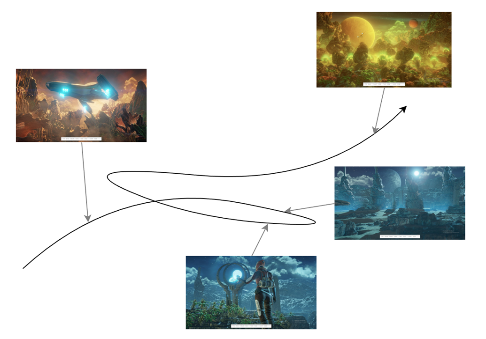
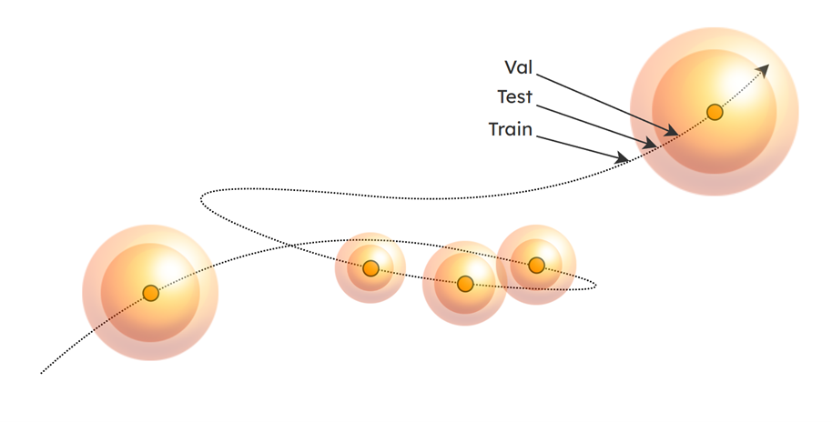
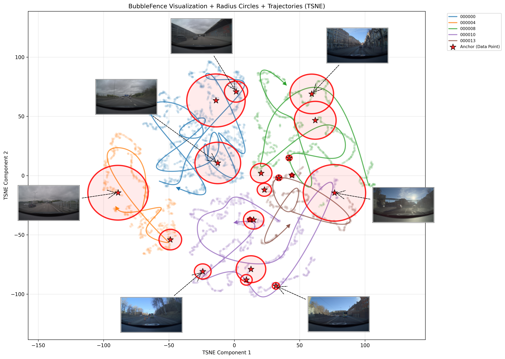

# BubbleFence

**BubbleFence** è una pipeline open source per costruire split di training, validation e test a partire dalla **geometria semantica di un dataset visuale**. 

Il progetto nasce da un problema frequente nei flussi video: frame consecutivi, visite ripetute dello stesso luogo e scene quasi duplicate possono essere distribuiti casualmente tra training e valutazione, producendo **semantic leakage**. Una metrica calcolata in queste condizioni può sovrastimare la generalizzazione, perché il modello viene valutato su osservazioni molto vicine a quelle già incontrate durante il training.

L'idea centrale è sostituire, o almeno affiancare, gli split casuali e le regole basate sui metadati con uno **split nello spazio degli embedding**. Un vision foundation model rappresenta ogni immagine come un punto; regioni limitate dello spazio latente, chiamate ***bubble***, vengono riservate alla valutazione, mentre i punti esterni rimangono nel training set.

## Perché uno split casuale può essere fuorviante

Si consideri una sequenza di osservazioni visuali $o_1, \ldots, o_T$. 

In un video, $o_t$ e $o_{t+1}$ differiscono spesso soltanto per un piccolo movimento della camera o degli oggetti. 

Se ogni frame viene assegnato indipendentemente, una delle due immagini può entrare nel training set e l'altra nel test set. Il test non misura allora il comportamento su una situazione realmente nuova, ma la capacità di interpolare tra quasi duplicati.

Le strategie di *geofencing*, *time-fencing* e *route-fencing* cercano di evitare questa contaminazione separando città, periodi o percorsi. Sono efficaci quando i metadati rappresentano davvero il fattore di generalizzazione desiderato, ma diventano fragili quando tali informazioni sono incomplete oppure quando la similarità visuale attraversa i confini scelti. Due tragitti distinti possono contenere lo stesso tipo di incrocio; viceversa, uno stesso tragitto può includere condizioni visive radicalmente diverse.

BubbleFence assume che un encoder visuale $f_\theta$ renda almeno in parte osservabile questa struttura. 

Per ogni osservazione calcola un embedding normalizzato:

$$
z_t = \frac{f_\theta(o_t)}{\left\|f_\theta(o_t)\right\|_2}
$$

Con embedding normalizzati, la distanza coseno tra due frame è:

$$
d_{\mathrm{cos}}(z_i,z_j) = 1-z_i^\top z_j
$$

La pipeline predefinita usa `openai/clip-vit-base-patch32`, ma il codice prevede anche encoder aggiuntivi, come DINO o SigLIP, e meccanismi di consenso. **Lo split eredita inevitabilmente la nozione di similarità dell'encoder**: se il backbone ignora un dettaglio importante per il task, BubbleFence non può recuperarlo dalla sola geometria latente.

## Dalle traiettorie alle bubble semantiche

Una bubble $B_j$ è una ipersfera centrata nell'anchor $c_j$ e dotata di raggio $r_j$:

$$
B_j = \left\{z \mid d(z,c_j)\leq r_j\right\}
$$

I punti esterni all'unione delle bubble vengono assegnati al training set. Ogni bubble è invece divisa in due regioni concentriche: una regione interna e una corona compresa tra il raggio interno e $r_j$. Queste regioni formano validation e test. La configurazione `inner_val` colloca validation all'interno e test all'esterno, `inner_test` inverte i ruoli, mentre l'impostazione predefinita `random` sceglie per ogni anchor quale split occupi la regione interna. Quest'ultima opzione evita che validation o test siano sistematicamente più vicini al centro delle regioni selezionate.

Indicando con $D$ la dimensione dell'embedding, con $\rho$ la frazione dello split interno rispetto all'insieme di valutazione e con $r_j$ il raggio della bubble, l'implementazione calcola il confine interno nella forma:

$$
r_{j,\mathrm{inner}} = 0.7\,r_j\rho^{1/D}
$$

Il fattore $\rho^{1/D}$ deriva dalla dipendenza del volume di una ipersfera dal raggio elevato a $D$. Il coefficiente $0.7$ è però una scelta euristica del codice: il rapporto effettivo tra validation e test dipende anche dalla distribuzione non uniforme dei punti, non soltanto dai volumi geometrici.

## Selezione degli anchor

BubbleFence genera candidati nello spazio latente mediante sequenze **Quasi-Monte Carlo (QMC)**. Rispetto a campioni pseudocasuali indipendenti, queste sequenze mirano a coprire in modo più uniforme l'iperrettangolo delimitato dai valori minimi e massimi degli embedding. I candidati troppo vicini tra loro vengono filtrati e ogni candidato rimanente viene riportato su un punto realmente osservato.

Lo *snap* non deve necessariamente scegliere il vicino in assoluto più vicino. La configurazione predefinita considera i $k$ vicini più prossimi e li pesa usando l'inverso della **Local Intrinsic Dimensionality (LID)**, favorendo aree localmente dense e rappresentative. Dati i raggi $r_1,ldots,r_k$ dei vicini ordinati attorno a un punto, con $r_k$ distanza dal $k$-esimo vicino, lo stimatore implementato può essere scritto come:

$$
\widehat{\operatorname{LID}}(z) =
\left[
\frac{1}{k-1}
\sum_{i=1}^{k-1}
\log\left(\frac{r_k}{r_i}\right)
\right]^{-1}
$$

Un valore basso indica una regione che localmente si comporta come una varietà di dimensione ridotta e relativamente regolare; un valore alto suggerisce geometria più complessa o dispersa. BubbleFence usa quindi pesi proporzionali a $1/\widehat{\operatorname{LID}}(z)$ durante lo snap.

Questa procedura non equivale a trovare cluster con un algoritmo classico. QMC propone una copertura globale, la LID influenza quali punti reali diventino anchor e un ciclo successivo accetta soltanto le bubble utili a colmare la quota di valutazione. Sono disponibili anche placement casuale e K-means, ma la configurazione documentata usa Sobol con snap LID-weighted.

## Raggi adattivi e controllo della quota

Il raggio iniziale comune viene ricavato da un quantile delle distanze a coppie. Indicando con $Q_p$ il quantile di ordine $p$, con $s$ un fattore di scala e con $r_{\min}$ e $r_{\max}$ i limiti configurati, il valore di base è:

$$
r_{\mathrm{base}} =
\operatorname{clip}\!\left(
s\,Q_p\!\left(\left\{d(z_i,z_j)\right\}_{i<j}\right),
r_{\min},r_{\max}
\right)
$$

Nella modalità adattiva predefinita, la pipeline stima poi la LID nell'intorno dell'anchor. Regioni a LID maggiore ricevono un raggio più ampio, mentre regioni dense e regolari ricevono bubble più piccole, così da non assorbire una quantità eccessiva di dati simili. Il risultato viene nuovamente limitato tra $r_{\min}$ e $r_{\max}$.

Il solo adattamento locale non garantirebbe il rapporto globale richiesto. BubbleFence calcola pertanto il **deficit di esempi di valutazione** rispetto a `eval_ratio`, sovrapropone candidati e li esamina uno alla volta. Una bubble che intercetta punti già fissati come training viene ridotta ripetutamente o scartata. Se cattura troppi punti rispetto al deficit residuo, il raggio viene ristretto mediante ricerca binaria. Il processo termina quando la quota è soddisfatta entro la tolleranza configurata; i punti ancora non assegnati diventano training.

La configurazione mostrata nell'articolo richiede circa **80% training e 20% evaluation**, dividendo poi l'evaluation tra validation e test. Questi valori sono obiettivi controllati dal feedback, non una garanzia esatta: densità locale, raggio minimo e granularità delle bubble possono produrre piccoli scostamenti.

## Deduplicazione e ingestione incrementale

Prima del placement, la pipeline rimuove i duplicati confrontando gli embedding mediante similarità coseno. Il controllo avviene sia all'interno del batch corrente sia rispetto agli embedding persistiti dai batch precedenti. La soglia `0.9999` usata nella dimostrazione è intenzionalmente conservativa per mantenere traiettorie facilmente visualizzabili; l'articolo suggerisce, a titolo di esempio, `0.98` per una deduplicazione più aggressiva.

La caratteristica più rilevante per raccolte in crescita è la **persistenza dello stato**. Dopo ogni ingestione vengono salvati anchor, embedding e assegnazioni. Un nuovo frame che cade dentro una bubble esistente eredita direttamente lo split determinato dalla shell; nuovi anchor vengono aggiunti soltanto quando i dati non coperti rendono insufficiente la quota di valutazione. Il metodo evita così di ricalcolare da zero l'intera partizione a ogni acquisizione.

Questa stabilità ha anche un costo concettuale. Le prime osservazioni influenzano la geometria che governerà gli arrivi successivi e una scelta iniziale poco rappresentativa può persistere. Salvare lo stato rende lo split riproducibile soltanto se vengono versionati insieme **encoder, preprocessing, metrica, configurazione, seed e registry degli anchor**.

*Proiezione t-SNE dopo il secondo round di ingestione: cinque drive formano traiettorie latenti e le stelle indicano gli anchor persistenti o aggiunti per mantenere la quota. I cerchi sono approssimazioni bidimensionali delle bubble e non le proiezioni esatte delle ipersfere originali. Fonte: articolo AMD su BubbleFence, Figura 6.*

## Esperimenti dimostrativi

Il walkthrough principale usa il subset **Drives dello Zenseact Open Dataset (ZOD)**, quindi sequenze frontali da dashcam e non traiettorie robotiche. Gli esperimenti dell'articolo sono eseguiti su una GPU AMD Instinct MI325X; il repository supporta anche CPU e dichiara ROCm come backend GPU verificato.

Nel primo round vengono elaborati due drive per un totale di **4,808 frame**. Il risultato contiene 3,825 esempi di training, 398 di validation e 585 di test, con cinque anchor. La quota complessiva di evaluation è quindi circa 20.4%, vicina al target del 20%.

Nel secondo round vengono aggiunti tre drive senza ricostruire lo split precedente. Su **10,758 frame** complessivi, BubbleFence assegna 8,596 esempi al training, 1,118 alla validation e 1,044 al test, usando 19 anchor. L'evaluation rappresenta circa 20.1% del totale. Nella proiezione t-SNE, scene autostradali e urbane occupano regioni differenti e le nuove traiettorie possono essere catturate da bubble persistenti oppure richiedere nuovi anchor.

La seconda dimostrazione usa frame estratti da quattro video di gameplay Minecraft del dataset **Video PreTraining (VPT)**. Senza cambiare il principio della pipeline, 12,932 punti vengono divisi in 10,226 esempi di training, 1,997 di validation e 709 di test. Gli embedding separano visivamente aree esterne, caverne e interni. Questo esperimento suggerisce portabilità tra due domini visuali, ma non costituisce una misura quantitativa di generalizzazione: non viene addestrato un modello downstream per confrontare lo split con random split, group split o fencing basato su metadati.

Le visualizzazioni richiedono inoltre cautela. Bubble e distanze vengono calcolate nello spazio originale, mentre t-SNE produce una mappa non lineare in due dimensioni. I cerchi mostrati sono costruiti dalla distanza media proiettata dei punti assegnati e possono apparire sovrapposti o contenuti l'uno nell'altro senza riflettere fedelmente la geometria ad alta dimensione.

## Rilevanza per dataset VLA

I dataset robotici condividono molti dei problemi che motivano BubbleFence. Una teleoperazione produce frame consecutivi fortemente correlati; reset quasi identici generano episodi ridondanti; la stessa cucina o lo stesso oggetto può ricomparire in sessioni diverse. Uno split casuale per frame può quindi far trapelare nel test non soltanto l'aspetto della scena, ma anche porzioni della stessa esecuzione.

Applicare BubbleFence direttamente ai frame RGB può aiutare a individuare vicinanza visuale e quasi duplicati, ma **non è sufficiente per definire da solo uno split VLA rigoroso**. Due osservazioni visivamente simili possono richiedere azioni differenti a causa dell'istruzione $l$, dello stato del robot $q_t$, della dinamica o della storia; due viste diverse possono invece appartenere allo stesso episodio e condividere la medesima traiettoria di azioni. Una partizione frame-level rischia inoltre di separare timestep dello stesso rollout.

Per un impiego robotico prudente, l'unità minima di assegnazione dovrebbe essere l'**episodio o un gruppo semanticamente indivisibile**, propagando a tutto il gruppo lo split deciso dai suoi frame o da un embedding aggregato. Il semantic fencing visuale dovrebbe essere combinato con vincoli su task, istruzione, embodiment, ambiente, oggetti e sessione di raccolta. In questa lettura BubbleFence è uno strumento aggiuntivo di audit e curation, non un sostituto universale del protocollo sperimentale.

#### Novelty

BubbleFence combina **embedding di foundation model, regioni semantiche limitate, placement QMC, adattamento alla densità e controllo closed-loop delle quote** in una pipeline unica. La novelty pratica non risiede nell'uso isolato della similarità coseno o delle ipersfere, ma nel trasformarle in uno split persistente che può accogliere nuovi batch senza riassegnare sistematicamente i dati precedenti.

Un secondo elemento distintivo è la separazione tra copertura globale e struttura locale. QMC distribuisce i candidati nello spazio, la LID orienta anchor e raggi verso la geometria osservata, mentre il feedback sul deficit mantiene il rapporto train/eval. Le shell concentriche rendono inoltre esplicita una distanza semantica interna all'evaluation e la randomizzazione evita di privilegiare sempre lo stesso split.

#### Limiti

La dimostrazione disponibile è **esplorativa**. Mostra che il metodo produce regioni interpretabili e rapporti vicini al target su ZOD e Minecraft, ma **non misura quanto riduca effettivamente il leakage né se conduca a stime più affidabili delle prestazioni downstream**. Mancano confronti controllati con random split, split per sequenza, clustering e fencing basato su metadati, insieme a intervalli di variabilità su seed ed encoder.

La **validità dipende dalla rappresentazione**. CLIP può privilegiare oggetti e contesto globale ignorando dettagli geometrici, temporali o dinamici decisivi per la robotica. In domini specialistici occorre verificare l'encoder e, possibilmente, confrontare più rappresentazioni. Se gli embedding sono quasi uniformi o privi di cluster informativi, le bubble offrono poco vantaggio rispetto a una partizione casuale.

La pipeline richiede **una forward pass dell'encoder per ogni immagine e confronti di distanza** che possono diventare onerosi su grandi collezioni. Il file di configurazione menziona un indice ANN, ma il repository lo indica come pianificato e non ancora implementato; non va quindi assunto che la ricerca approssimata scalabile faccia già parte della pipeline operativa.

Infine, preservare una quota numerica non garantisce rappresentatività. La **divisione in shell è geometrica ed euristica**, gli anchor iniziali introducono dipendenza dall'ordine di ingestione e uno split stabile può conservare errori precoci. 

Nei dataset VLA restano fuori dal criterio visuale linguaggio, azioni, reward, successo, embodiment e dipendenze tra timestep. Questi fattori devono essere controllati separatamente prima di interpretare validation e test come misura della generalizzazione robotica.
