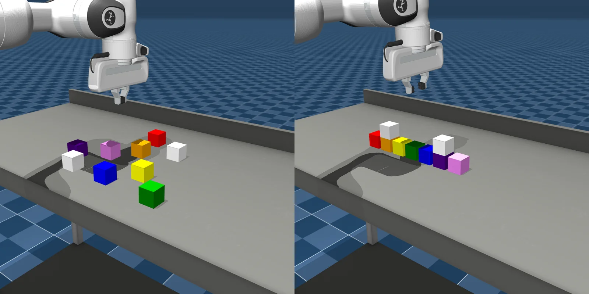
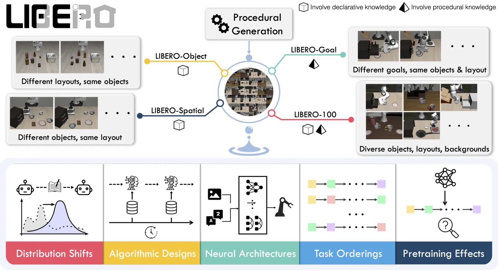
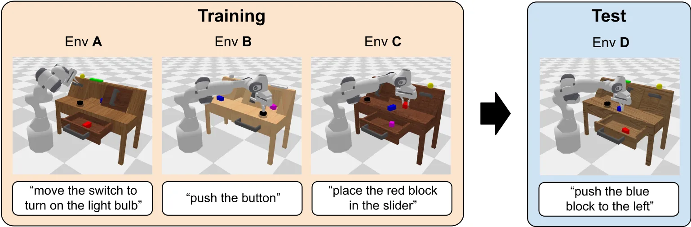
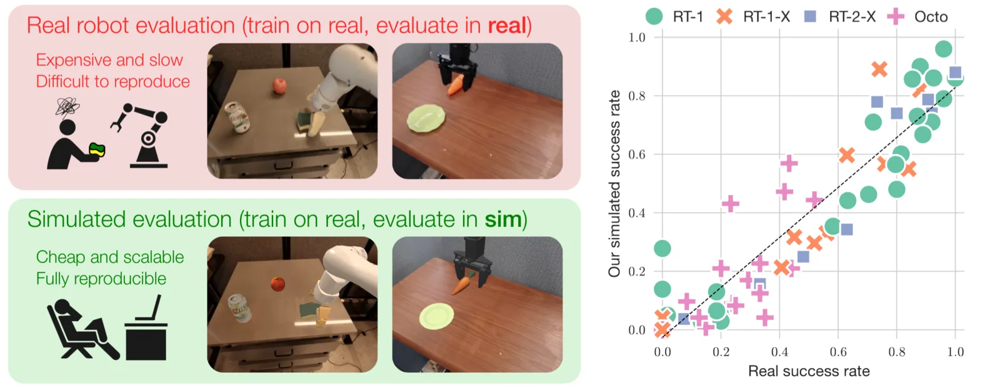
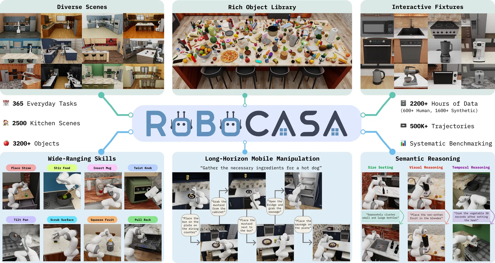
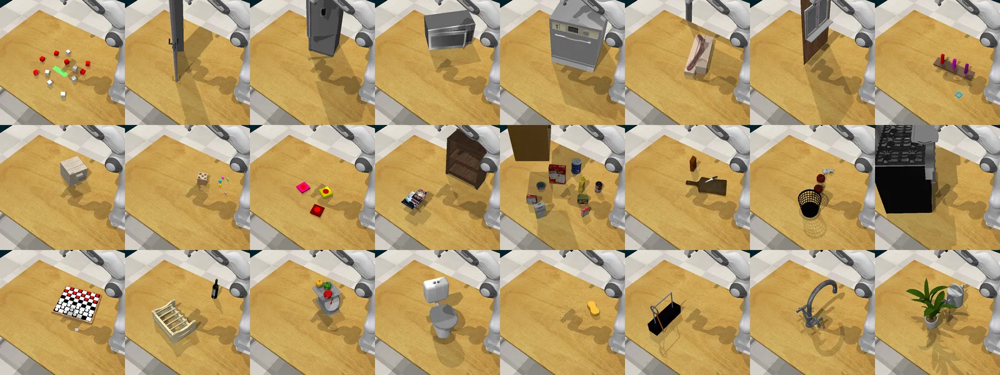
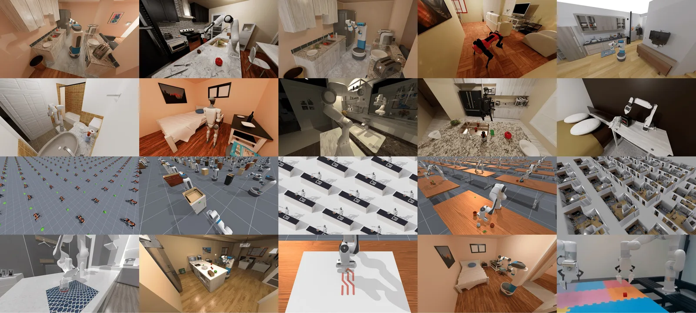

# Benchmark

## Benchmark basati su simulazione

### RoboEval

**RoboEval** valuta policy di manipolazione bimanuale affiancando al successo binario una descrizione strutturata della qualità dell'esecuzione. La prima release comprende otto task simulati, da operazioni brevi come sollevare un recipiente o ruotare una valvola fino ad attività multistadio come riporre un libro o chiudere una scatola. Ogni task presenta variazioni controllate di posizione e orientamento e dispone di dimostrazioni raccolte tramite teleoperazione in realtà virtuale.


*RoboEval collega task bimanuali a metriche di efficienza, sicurezza, stabilità, coordinazione e avanzamento.*

Il punto centrale è che due policy con lo stesso *success rate* possono produrre movimenti molto diversi. RoboEval registra quindi lunghezza e durata della traiettoria, jerk, collisioni, slip, coordinazione dei bracci e progressione attraverso gli stadi del task. L'interfaccia seguente è pseudocodice e ne mostra l'idea essenziale:

```python
report = evaluator.run(policy, task="LiftTray", variation="position")

print(report.success_rate)
print(report.task_progression)
print(report.cartesian_jerk, report.self_collisions)
```

Il benchmark usa un solo setup bimanuale simulato e varia soprattutto la posa degli oggetti; non stabilisce quindi che le stesse metriche mantengano identico significato su hardware reale o in domini fisici differenti. L'[approfondimento su RoboEval](roboeval/README.md) discute task, dataset, formalizzazione delle metriche e risultati sperimentali.

### RoboPlayground

**RoboPlayground** rende la costruzione delle prove un processo guidato dal linguaggio. L'utente descrive un'attività di manipolazione e il sistema la compila in una specifica eseguibile che include asset, distribuzione degli stati iniziali e predicato di successo. Richieste successive possono modificare oggetti, relazioni o vincoli mantenendo uno storico esplicito delle versioni.



*Una richiesta linguistica viene trasformata in una famiglia riproducibile di task: qui i blocchi inizialmente dispersi devono essere organizzati in pile ordinate per colore. Fonte: [sito RoboPlayground](https://roboplayground.github.io/).*

L'esempio seguente è pseudocodice, perché il paper descrive una pipeline modulare e non una API Python stabile di poche righe. Evidenzia però la distinzione tra compilare l'istruzione, validare il goal e istanziare una particolare variante:

```python
task = playground.compile("Raggruppa i cubi in pile ordinate per colore")
task.validate_physics()
env = task.make(seed=0)
```

Il dominio sperimentale è volutamente circoscritto a blocchi rigidi in MuJoCo. La validazione garantisce soprattutto correttezza software e stabilità della configurazione finale, non che ogni task sia facilmente raggiungibile da una policy. L'[approfondimento su RoboPlayground](roboplayground/README.md) analizza compilazione, riparazione, versionamento, studio di usabilità e generalizzazione.

### LIBERO

**LIBERO** nasce per misurare il trasferimento nel *lifelong robot learning* ed è oggi molto usato anche per confrontare VLA nella manipolazione. Le quattro suite più comuni contengono task complementari:



*Le suite separano variazioni di relazioni spaziali, oggetti, goal e task long-horizon, consentendo di attribuire più chiaramente il tipo di trasferimento richiesto. Fonte: [paper LIBERO](https://arxiv.org/abs/2306.03310).*

- **LIBERO-Spatial** varia le relazioni spaziali richieste mantenendo familiari oggetti e comportamenti;

- **LIBERO-Object** verifica il trasferimento verso combinazioni e identità di oggetti differenti;

- **LIBERO-Goal** cambia il goal linguistico associato alla scena;

- **LIBERO-Long**, spesso indicato nel protocollo VLA come **LIBERO-10**, raccoglie attività più lunghe che richiedono più passaggi coordinati.

La metrica normalmente riportata è il **success rate** medio sui task, calcolato su più stati iniziali. Octo fine-tuned e OpenVLA vengono confrontati sulle quattro suite nel lavoro di OpenVLA, rendendo LIBERO uno dei punti di riferimento più diffusi per la generalizzazione dopo adattamento. Il benchmark resta però interamente simulato e può premiare dettagli del controller o del rendering; non misura direttamente il trasferimento su hardware.

La API ufficiale espone ogni suite come un insieme di task con istruzione linguistica e stati iniziali fissati per la valutazione:

```python
from libero.libero import benchmark

suite = benchmark.get_benchmark_dict()["libero_spatial"]()
task = suite.get_task(0)
print(task.language)
```

### CALVIN

**CALVIN** valuta policy language-conditioned in un ambiente tabletop continuo. Il tratto distintivo è la valutazione **long-horizon**: il modello riceve una sequenza di istruzioni e deve completare più subtask consecutivi senza che l'ambiente venga riportato allo stato iniziale dopo ogni skill. La suite mette quindi in evidenza errori di grounding, esecuzioni parziali e compounding error.



*Nel protocollo ABC→D la policy apprende negli ambienti A, B e C e viene valutata nell'ambiente D, dove deve eseguire catene di istruzioni senza reset intermedi. Fonte: [paper CALVIN](https://arxiv.org/abs/2112.03227).*

Il protocollo CALVIN ABC→D addestra o adatta la policy sugli ambienti A, B e C e ne misura la generalizzazione nell'ambiente D. Oltre al successo per singolo subtask, viene riportata la lunghezza media della catena completata e la percentuale di sequenze risolte fino a ciascuna profondità. Questa metrica è più informativa del solo successo one-step, ma rimane legata a un insieme finito di primitive e scene.

Una policy personalizzata deve mantenere stato tra gli step e azzerarlo soltanto all'inizio della sequenza di valutazione:

```python
class CustomModel:
    def __init__(self, policy):
        self.policy = policy

    def reset(self):
        self.policy.reset()

    def step(self, obs, goal):
        return self.policy(obs, goal)
```

### SimplerEnv

**SimplerEnv**, associato al benchmark **SIMPLER**, valuta in simulazione policy originariamente addestrate con dati real-world. Ricostruisce setup correlati al **Google Robot** impiegato nella linea RT e al **WidowX** di BridgeData V2, quindi esegue le policy senza richiedere necessariamente un nuovo training esclusivamente simulato.



*SIMPLER ricostruisce robot, camera e oggetti delle prove fisiche e verifica quanto il successo simulato preservi il ranking osservato nel mondo reale. Fonte: [paper SIMPLER](https://arxiv.org/abs/2405.05941).*

Il benchmark propone due strategie complementari. *Visual matching* cerca configurazioni della simulazione visivamente vicine al dominio reale; *variant aggregation* valuta molte varianti e aggrega i risultati per ridurre la dipendenza da una singola ricostruzione. Lo scopo è ottenere ranking correlati alle valutazioni fisiche a un costo inferiore, non sostituire universalmente i test reali. Correlazione e validità dipendono infatti da robot, task e policy inclusi nell'analisi.

La API permette di caricare direttamente una delle ricostruzioni preconfigurate e recuperare l'istruzione associata:

```python
import simpler_env

env = simpler_env.make("google_robot_pick_coke_can")
obs, info = env.reset()
l = env.get_language_instruction()
```

### RoboCasa

**RoboCasa** è un framework e benchmark per attività domestiche, con particolare attenzione alle cucine. Varia layout, asset, posizioni degli oggetti e istruzioni e comprende skill atomiche e **task composizionali** che richiedono di concatenare più operazioni semanticamente coerenti.



*RoboCasa combina centinaia di cucine, migliaia di asset e task atomici o composizionali, producendo scene domestiche molto più varie di un singolo setup tabletop. Fonte: [paper RoboCasa](https://arxiv.org/abs/2406.02523).*

La ricchezza delle scene lo rende utile per valutare generalizzazione visiva e ragionamento operativo in un dominio household. I risultati dipendono però dalla release e dallo split: numero di task, dimostrazioni e protocolli sono evoluti nel tempo e devono essere riportati esplicitamente. Inoltre, la diversità procedurale delle cucine virtuali non elimina il sim-to-real gap.

Il wrapper Gym distingue esplicitamente tra scene e oggetti di pre-training e quelli dello split target:

```python
import gymnasium as gym
import robocasa

env = gym.make(
    "robocasa/PickPlaceCounterToCabinet",
    split="target",
    seed=0,
)
obs, info = env.reset()
```

### RLBench

**RLBench** offre un ampio catalogo di task di manipolazione in CoppeliaSim, con descrizioni linguistiche, condizioni di successo e variazioni procedurali. Le osservazioni possono includere viste RGB-D multiple, maschere e stato propriocettivo; le dimostrazioni sono prodotte tramite motion planning.



*RLBench raccoglie task hand-designed con lo stesso braccio robotico ma oggetti, scene e condizioni di successo molto differenti. Fonte: [paper RLBench](https://arxiv.org/abs/1909.12271).*

La varietà dei task lo rende adatto a valutazioni multi-task, few-shot e language-conditioned. Le dimostrazioni pianificate sono però più regolari delle teleoperazioni umane e non tutti i lavori usano lo stesso sottoinsieme, la stessa modalità osservativa o lo stesso action space. Un confronto richiede pertanto di dichiarare task e protocollo, non soltanto il nome RLBench.

Un task può essere istanziato come oggetto dedicato; `reset()` restituisce sia le descrizioni linguistiche sia la prima osservazione:

```python
from rlbench.action_modes.action_mode import MoveArmThenGripper
from rlbench.action_modes.arm_action_modes import JointVelocity
from rlbench.action_modes.gripper_action_modes import Discrete
from rlbench.environment import Environment
from rlbench.tasks import ReachTarget

action_mode = MoveArmThenGripper(
    arm_action_mode=JointVelocity(), gripper_action_mode=Discrete()
)
env = Environment(action_mode)
env.launch()
task = env.get_task(ReachTarget)
descriptions, obs = task.reset()
```

### ManiSkill

**ManiSkill** comprende ambienti e benchmark di manipolazione GPU-accelerated con enfasi su contatti, geometrie e variazioni degli asset. Supporta osservazioni state-based e visuali, robot differenti e task che vanno dal controllo di primitive alla manipolazione più articolata.



*La famiglia ManiSkill comprende task con corpi rigidi e articolati, mobili, oggetti deformabili e interazioni whole-body. Fonte: [paper ManiSkill2](https://arxiv.org/abs/2302.04659).*

L'elevato parallelismo rende praticabili molte prove e permette di valutare robustezza a inizializzazioni diverse. Al tempo stesso, “ManiSkill” identifica una famiglia in evoluzione: versione, task set, modalità sensoriale, controller e budget di training devono essere specificati per rendere il risultato interpretabile.

L'interfaccia Gym rende espliciti modalità osservativa e controller, due scelte che devono essere riportate insieme al risultato:

```python
import gymnasium as gym
import mani_skill.envs

env = gym.make(
    "PickCube-v1",
    obs_mode="rgbd",
    control_mode="pd_ee_delta_pose",
)
obs, info = env.reset(seed=0)
```
