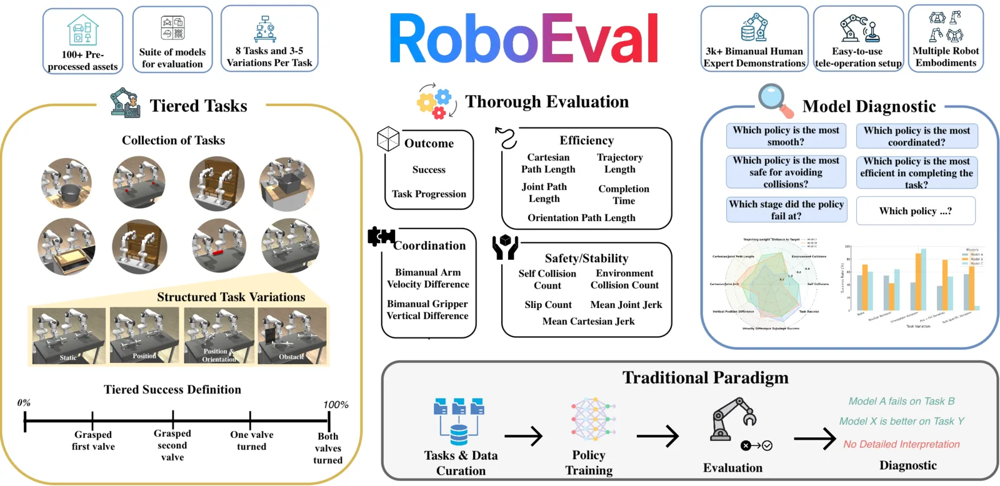
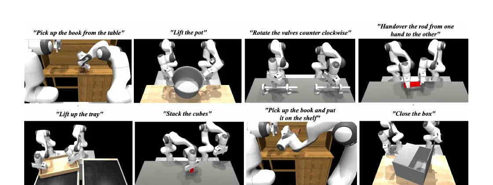

# RoboEval

**RoboEval** parte da una critica precisa: due policy possono ottenere lo stesso numero di successi pur differendo radicalmente per durata, percorso seguito, fluidità, collisioni, stabilità della presa e sincronizzazione dei bracci.

Un benchmark che registra soltanto l'esito finale non permette quindi di stabilire ***come*** la policy ha avuto successo, né di localizzare il punto in cui un tentativo fallito si è interrotto.

RoboEval affronta il problema combinando: una **suite simulata di task bimanuali con variazioni controllate**, un **dataset di dimostrazioni umane** e una strumentazione uniforme di metriche comportamentali e di outcome.

Il contributo non consiste nel sostituire il successo binario con un nuovo punteggio unico. Al contrario, **mantiene separate misure che descrivono proprietà differenti**, perché aggregarle prematuramente nasconderebbe gli stessi trade-off che il benchmark vuole rendere osservabili.

## Obiettivo e principi di progetto

Il framework è costruito attorno a **diversità, interpretabilità ed estensibilità**.

La diversità riguarda sia la struttura temporale dei task sia le capacità motorie richieste: azioni a un solo braccio, coordinazione stretta tra due bracci, trasferimenti, sollevamento, rotazione e attività composte.

L'interpretabilità deriva dalla **possibilità di associare un fallimento a uno stadio del task o a una proprietà misurabile del moto**.

L'estensibilità è ottenuta **separando definizione del task, generazione delle varianti e logica di valutazione**, così da poter aggiungere ambienti e metriche senza cambiare l'intero protocollo.

## Formalizzazione dei task

Un task è rappresentato dalla tupla:

$$
\mathcal{T}=(\mathcal{S},\mathcal{A},P,\mathcal{G},\rho_0,\mathcal{S}_{\mathrm{success}})
$$

- $\mathcal{S}$ è lo spazio degli stati, comprendente configurazione del robot, pose degli oggetti e contesto ambientale
- $\mathcal{A}$ è lo spazio delle azioni continue
- $P$ descrive la dinamica del simulatore
- $\mathcal{G}$ specifica il goal
- $\rho_0$ è la distribuzione degli stati iniziali
-  $\mathcal{S}_{\mathrm{success}}\subset\mathcal{S}$ raccoglie gli stati che soddisfano le condizioni geometriche o di contatto usate per dichiarare il successo

L'azione $a_t\in\mathcal{A}$ può essere espressa come target articolare oppure come spostamento dell'end-effector, a seconda della policy e dell'interfaccia di controllo.

Lo stato $s_t\in\mathcal{S}$ è disponibile al simulatore per calcolare condizioni di successo e metriche, mentre l'osservazione $o_t$ fornita alla policy può includere immagini e propriocezione. La distinzione tra le due grandezze può essere espressa come segue:

$$
o_t \ne s_t\in\mathcal{S}
$$

Questa distinzione evita di confondere le informazioni impiegate per valutare un rollout con quelle effettivamente accessibili al modello durante l'inferenza.

### Come vengono scelti gli stati di successo

L'insieme $\mathcal{S}_{\mathrm{success}}$ **non viene appreso dai dati e non coincide con un singolo stato target**.

Per ciascun task gli autori traducono l'obiettivo semantico in un predicato deterministico sullo stato privilegiato del simulatore.

La forma generale è:

$$
\mathcal{S}_{\mathrm{success}}
=
\left\{s\in\mathcal{S}\mid C_1(s)\land C_2(s)\land\cdots\land C_K(s)\right\}
$$

In questa definizione, ciascuna $C_k$ verifica una relazione fisicamente significativa: contatto tra due oggetti, assenza di contatto con il supporto, presa da parte di uno o di entrambi i gripper, superamento di una quota, orientamento entro una tolleranza oppure posizione di un giunto entro un intervallo.

Le soglie sono quindi **scelte dagli autori in base alla semantica del task e alla geometria degli asset**, poi implementate direttamente nell'ambiente.

Posizione e orientamento iniziali possono cambiare tra le varianti, mentre il significato del predicato finale resta invariato.

La condizione di successo viene valutata usando pose, contatti e stati dei giunti forniti da MuJoCo. Queste informazioni non devono necessariamente comparire in $o_t$: una policy può ricevere soltanto immagini e propriocezione, mentre il valutatore usa lo stato completo $s_t$ per decidere se $s_t\in\mathcal{S}_{\mathrm{success}}$.

Il **success rate** su $M$ rollout è pertanto:

$$
\mathrm{SR}
=
\frac{1}{M}
\sum_{i=1}^{M}
\mathbb{1}\!\left[s_{T_i}^{(i)}\in\mathcal{S}_{\mathrm{success}}\right]
$$

In questa espressione, $T_i$ è l'istante terminale dell'episodio $i$ e $\mathbb{1}[\cdot]$ vale $1$ quando il predicato è vero. La logica è intenzionalmente più severa del semplice raggiungimento di una posizione: per esempio, un cubo appoggiato sull'altro ma ancora trattenuto non costituisce un impilamento completato.

Gli **stadi di progressione** sono distinti da $\mathcal{S}_{\mathrm{success}}$. Ogni ambiente mantiene flag binari che diventano veri quando viene raggiunto un sotto-obiettivo, come afferrare, sollevare o stabilire il contatto corretto. I flag restano registrati anche se in seguito la policy perde l'oggetto. Se un task ha $K$ stadi, la progressione dell'episodio è:

$$
P_{\mathrm{task}}
=
\frac{1}{K}
\sum_{k=1}^{K} b_k
$$

In questa espressione, $b_k\in\{0,1\}$ indica se lo stadio $k$ è stato raggiunto **almeno una volta**. Questa scelta misura le capacità dimostrate durante il rollout, ma **non impone che tutti i sotto-obiettivi siano ancora veri nello stato finale**.

Il dataset associato a un task può essere scritto come:

$$
\mathcal{D}_{\mathcal{T}}
=
\left\{(s_0,a_0,\ldots,s_T)^{(i)}\right\}_{i=1}^{N}
$$

In questa definizione, $N$ è il numero di dimostrazioni e $T$ può variare tra episodi.

Ogni task base genera inoltre una famiglia $\mathcal{T}_{\boldsymbol{\eta}}$, nella quale il vettore $\boldsymbol{\eta}\in\mathcal{H}$ controlla perturbazioni come posizione e orientamento degli oggetti. La notazione $\boldsymbol{\eta}$ distingue il parametro della variante sia dall'istruzione linguistica $l$ sia dalla configurazione articolare, indicata nel seguito con $q_t$.

## Task, condizioni di successo e metriche

La prima release comprende **otto task di manipolazione bimanuale**. Tutti registrano successo, progressione, tempo e numero di step, lunghezze dei percorsi cartesiano, articolare e orientazionale, jerk cartesiano e articolare, collisioni, slip e misure di coordinazione. Il significato diagnostico di queste grandezze cambia però con il task; per questo di seguito le metriche comuni sono collegate alle condizioni di successo e agli errori che devono rendere osservabili.

### Lift Tray

La policy deve raggiungere i due lati di un vassoio, afferrarlo con entrambi i gripper e separarlo dal tavolo. È un task di **coordinazione stretta e simmetrica**: una differenza di quota o velocità tra le mani tende a inclinare il vassoio e a destabilizzare le prese.

<video controls playsinline preload="metadata" width="100%">
  <source src="media/lift_tray.mp4" type="video/mp4">
</video>

Uno stato appartiene a $\mathcal{S}_{\mathrm{success}}$ quando entrambi i gripper trattengono il vassoio e questo non è più in contatto con il tavolo. I tre stadi verificano, nell'ordine logico, presa sinistra, presa destra e sollevamento bimanuale senza contatto con tavolo o pavimento.

Oltre a successo e progressione, **differenza verticale $\Delta z$ e divergenza di velocità $\Delta v$ sono centrali**, perché misurano se i due lati vengono sollevati insieme. Slip e collisioni rivelano perdita della presa o urti; distanze gripper-vassoio e distanza di sollevamento localizzano un fallimento di avvicinamento. Percorsi, tempo e jerk distinguono invece un sollevamento diretto da uno oscillatorio o ricco di correzioni.

**Esempio.** Se il braccio sinistro afferra il vassoio e il destro lo raggiunge senza chiudere la presa, il benchmark assegna il primo stadio ma non il secondo né il successo. Se entrambi afferrano e sollevano con quote molto diverse, l'episodio può riuscire, ma mostra valori elevati di $\Delta z$, jerk e possibilmente slip: il successo binario non nasconde così la scarsa qualità del moto.

### Stack Two Cubes

Il task richiede di manipolare entrambi i cubi e produrre una pila stabile sul tavolo. La coordinazione è **lasca**: i bracci possono operare in momenti differenti, purché realizzino la relazione geometrica finale.

<video controls playsinline preload="metadata" width="100%">
  <source src="media/stack_cubes.mp4" type="video/mp4">
</video>

Il successo richiede che il cubo inferiore tocchi il tavolo, quello superiore tocchi il cubo inferiore senza toccare direttamente il tavolo e nessun cubo sia ancora trattenuto da un gripper. Gli stadi registrano la presa di un primo cubo, la successiva presa dell'altro e la configurazione impilata.

La progressione separa quindi i problemi di presa da quelli di posa. Le distanze tra ciascun cubo e i due gripper e le rispettive altezze di sollevamento descrivono quanto la policy si sia avvicinata alla soluzione. Slip e collisioni sono rilevanti per la stabilità, mentre lunghezze dei percorsi, jerk e tempo quantificano l'efficienza delle due manipolazioni. Le metriche bimanuali vanno lette con cautela: qui una differenza di quota non è necessariamente un difetto, poiché un braccio può stabilizzare o attendere mentre l'altro posa.

**Esempio.** Una policy può afferrare entrambi i cubi e appoggiarne uno sull'altro, raggiungendo tutti gli stadi, ma mantenere ancora chiuso un gripper sul cubo superiore. La progressione risulta completa, mentre il successo resta falso: il benchmark distingue così l'ottenimento transitorio della geometria dalla conclusione autonoma del task.

### Stack Single Book Shelf

Questo è il task con l'orizzonte medio più lungo. Il robot deve afferrare il libro sul piano, sollevarlo, trasportarlo verso lo scaffale, inserirlo fino al contatto con un ripiano e rilasciarlo. La difficoltà deriva dalla sequenza **presa–trasporto–allineamento–rilascio** e dallo spazio ristretto vicino allo scaffale.

<video controls playsinline preload="metadata" width="100%">
  <source src="media/stack_single_book.mp4" type="video/mp4">
</video>

Lo stato finale è valido quando il libro tocca il ripiano superiore o inferiore e non è più trattenuto da alcun gripper. I quattro stadi sono presa, sollevamento di almeno $0.1$ m rispetto alla quota iniziale, contatto con un ripiano e rilascio sul ripiano.

Successo e progressione indicano fino a quale fase è arrivata la policy; distanza del libro dai due ripiani e altezza di sollevamento precisano l'errore residuo. Collisioni con scaffale e ambiente sono particolarmente informative durante l'inserimento, mentre percorso orientazionale e jerk descrivono le correzioni necessarie per allineare il libro. Tempo e lunghezze dei percorsi devono essere confrontati con task dello stesso tipo, dato l'orizzonte naturalmente lungo.

**Esempio.** Se il robot afferra e solleva il libro, arriva davanti allo scaffale ma urta il bordo senza stabilire il contatto corretto, completa due stadi su quattro. Il benchmark riporta $P_{\mathrm{task}}=0.5$, una distanza residua dal ripiano e una collisione, invece di ridurre l'esecuzione al solo fallimento finale.

### Rod Handover

La policy deve prendere un oggetto allungato con un braccio e trasferirlo all'altro senza farlo cadere. Il task isola la **sovrapposizione temporale delle prese** e la capacità di cedere il controllo dell'oggetto.

<video controls playsinline preload="metadata" width="100%">
  <source src="media/lift_bar.mp4" type="video/mp4">
</video>

L'ambiente identifica quale gripper stabilisce per primo la presa. Il successo si verifica quando il gripper opposto trattiene l'oggetto e quello iniziale lo ha rilasciato. I due stadi registrano l'esistenza di una prima presa e l'avvenuto trasferimento al lato opposto; la caduta sul pavimento termina il tentativo come fallimento.

Slip count e distanze dell'oggetto dai due gripper sono le misure più direttamente legate all'handover. La divergenza di velocità aiuta a rilevare un incontro mal sincronizzato, mentre $\Delta z$ va interpretata rispetto alla posa dell'oggetto e non come requisito di simmetria. Jerk, collisioni e percorsi descrivono la qualità del trasferimento e le eventuali correzioni.

**Esempio.** Se il braccio sinistro solleva l'oggetto e il destro lo tocca, ma il sinistro apre prima che la presa destra sia stabile, viene raggiunto soltanto il primo stadio e la caduta produce un fallimento. Lo slip count aiuta a individuare perdite involontarie della presa, ma va distinto da un rilascio comandato nel momento sbagliato. Se il passaggio riesce dopo molte oscillazioni, il successo vale comunque $1$, ma jerk, tempo e percorso rendono visibile l'esecuzione instabile.

### Lift Pot

Il robot deve afferrare le due maniglie di un recipiente e sollevarlo mantenendolo sufficientemente diritto. È, insieme a Lift Tray, un task di **coordinazione bimanuale stretta**, ma aggiunge un vincolo esplicito sull'orientamento dell'oggetto.

<video controls playsinline preload="metadata" width="100%">
  <source src="media/lift_pot.mp4" type="video/mp4">
</video>

Il recipiente deve trovarsi almeno $0.1$ m sopra la quota iniziale, non deve toccare i due mobili di supporto e il suo asse verticale deve rimanere entro una tolleranza di $20^\circ$ dalla postura ammessa, senza capovolgersi. Gli stadi registrano separatamente presa sinistra, presa destra, superamento della quota e sollevamento bimanuale con orientamento valido.

La valutazione include errore di posa, distanza di sollevamento e distanze tra gripper e recipiente. $\Delta z$ e $\Delta v$ misurano la simmetria del sollevamento; slip e collisioni ne misurano stabilità e sicurezza. Percorso orientazionale e jerk sono importanti perché un recipiente può raggiungere la quota richiesta con rotazioni o accelerazioni che, in un'applicazione fisica, ne rovescerebbero il contenuto.

**Esempio.** Se entrambi i gripper prendono le maniglie e superano la quota, ma il recipiente è inclinato oltre $20^\circ$, i primi tre stadi risultano raggiunti mentre il quarto e il successo restano falsi. Il pose error esplicita che il collo di bottiglia non è la presa, bensì il controllo dell'assetto.

### Pack Box

La scena contiene una scatola con due falde inizialmente aperte. I bracci devono interagire con le falde e portare entrambi i relativi giunti nella configurazione chiusa. Non è necessario imporre una sincronizzazione simmetrica: le due falde possono essere chiuse in sequenza.

<video controls playsinline preload="metadata" width="100%">
  <source src="media/pack_box.mp4" type="video/mp4">
</video>

Lo stato è di successo quando i due valori articolari della scatola sono entrambi prossimi a zero con tolleranza assoluta $0.1$. I cinque stadi sono presa della falda sinistra, presa della falda destra, chiusura della falda destra, chiusura della falda sinistra e chiusura simultanea dell'intera scatola.

La progressione individua quale falda causa il fallimento e le distanze gripper-falda distinguono mancato raggiungimento e mancata chiusura. Percorsi cartesiani e articolari, jerk e tempo sono particolarmente utili perché policy con successo simile possono adottare strategie molto diverse. Collisioni e slip segnalano interazioni aggressive; le metriche di sincronizzazione hanno invece valore secondario, dato che una strategia sequenziale è pienamente valida.

**Esempio.** Se la policy chiude completamente la falda destra ma lascia quella sinistra fuori tolleranza, raggiunge gli stadi di presa pertinenti e quello di chiusura destra, ma non lo stadio finale né il successo. Due policy che chiudono entrambe la scatola vengono ulteriormente separate se una usa un percorso $2.7$ volte più lungo o un jerk molto maggiore.

### Pick Book From Table

La policy deve afferrare un libro e staccarlo dal piano, mantenendone il controllo. È un task più breve di Stack Single Book Shelf e isola principalmente **raggiungimento, presa e sollevamento**.

<video controls playsinline preload="metadata" width="100%">
  <source src="media/lift_single_book.mp4" type="video/mp4">
</video>

Il successo richiede che almeno un gripper trattenga il libro, che la sua quota sia almeno $0.77$ m e che il libro non tocchi né il piano di appoggio né il pavimento. I due stadi sono presa e sollevamento con distacco dai supporti.

Le distanze libro-gripper e la quota di sollevamento permettono di distinguere mancato raggiungimento, presa inefficace e sollevamento insufficiente. Slip count è direttamente legato alla tenuta; collisioni, jerk e lunghezze dei percorsi descrivono sicurezza, fluidità ed efficienza. Le metriche bimanuali non implicano che entrambi i bracci debbano operare: una soluzione valida può usare un solo gripper.

**Esempio.** Se il robot raggiunge il libro ma lo spinge sul tavolo senza afferrarlo, la progressione rimane a zero anche se la distanza gripper-libro è piccola. Se lo afferra e lo solleva appena, ottiene il primo stadio ma non il secondo né il successo; la quota registrata mostra quanto manca al distacco richiesto.

### Rotate Valve

Il task presenta due valvole che devono essere ruotate oltre una soglia. Richiede presa o contatto efficace, generazione di moto attorno a un asse e passaggio da una valvola all'altra; i due bracci possono agire indipendentemente.

<video controls playsinline preload="metadata" width="100%">
  <source src="media/rotate_valve.mp4" type="video/mp4">
</video>

Il successo è dichiarato quando lo stato di ciascuna valvola supera $0.10$ nella direzione prevista. I quattro stadi registrano presa della prima valvola, superamento della soglia per la prima, presa della seconda e superamento della soglia per la seconda.

La progressione per valvola localizza immediatamente una soluzione incompleta. Le distanze tra ciascuna valvola e ciascun gripper misurano l'avvicinamento; percorso orientazionale e articolare sono sensibili al gesto rotatorio, mentre jerk, collisioni e slip descrivono continuità e stabilità del contatto. $\Delta z$ e $\Delta v$ non devono essere minimizzate in assoluto, perché i bracci possono ruotare le due valvole in tempi o a quote differenti.

**Esempio.** Se la policy ruota la prima valvola oltre soglia ma non raggiunge la seconda, completa due stadi su quattro e ottiene $P_{\mathrm{task}}=0.5$. Se entrambe superano la soglia il rollout è riuscito, ma ripetute riprese della presa compaiono come percorso più lungo, jerk più elevato e possibili slip.

Gli otto task richiedono quindi combinazioni differenti di presa, trasferimento, rotazione e coordinazione. Gli esempi mostrano perché RoboEval non ordina le policy con una singola somma pesata: **lo stesso valore numerico può avere significati diversi in task simmetrici, asimmetrici o sequenziali**.

I task coprono contesti tabletop, di servizio e industriali e sono eseguiti con un **embodiment simulato formato da due bracci Franka Panda con gripper paralleli**. Lo spazio di controllo continuo supporta target articolari e pose degli end-effector, in forma assoluta o incrementale. Il benchmark valuta questo setup in MuJoCo e non presenta esperimenti equivalenti su hardware reale: i risultati descrivono quindi l'embodiment bimanuale simulato, non il comportamento fisico dei Panda.

Le varianti sono costruite in modo sistematico:

- **Static** mantiene quasi invariata la configurazione
- **Pos** perturba la posizione
- **Rot** l'orientamento
- **PR** combina entrambi i cambiamenti

Lift Tray, Stack Two Cubes, Rod Handover, Lift Pot, Pack Box e Pick Book From Table includono tutte e quattro le condizioni; Stack Single Book Shelf e Rotate Valve non includono la variante di sola rotazione.

Ogni task dispone quindi di tre o quattro livelli di variazione spaziale che preservano la semantica dell'attività.

## Dataset di dimostrazioni

RoboEval distribuisce **oltre 3.000 dimostrazioni** raccolte con teleoperazione in realtà virtuale. La ripartizione riportata è di 543 traiettorie per Lift Tray, 492 per Stack Two Cubes, 202 per Stack Single Book Shelf, 408 per Rod Handover, 176 per Lift Pot, 394 per Pack Box, 366 per Pick Book From Table e 349 per Rotate Valve.

Le lunghezze medie variano sensibilmente: Lift Pot richiede circa 53 step, Lift Tray circa 68, Rod Handover circa 94, mentre Stack Single Book Shelf supera in media 172 step. Questa differenza è importante perché impedisce di interpretare allo stesso modo durata e lunghezza del percorso su task con orizzonti intrinsecamente differenti.

### Raccolta umana con realtà virtuale

L'interfaccia di teleoperazione usa un visore **Oculus Quest** e i due controller tracciati per comandare il setup con due Franka Panda simulati. Le pose dei controller vengono trasformate in target cartesiani per i due end-effector: il movimento della mano destra controlla il braccio destro e quello della mano sinistra il braccio sinistro, mentre i trigger comandano apertura e chiusura dei rispettivi gripper. Il mapping conserva così la struttura bimanuale del gesto umano, evitando di scomporre a priori una dimostrazione coordinata in due traiettorie indipendenti.

Il controllo è relativo, non un'identificazione assoluta tra coordinate del controller e workspace del robot. L'operatore tiene premuto il pulsante *grip* del controller principale per abilitare il movimento; in quel momento il sistema memorizza l'origine corrente dei controller e dei polsi robotici, e applica gli spostamenti successivi rispetto a tale calibrazione. Rilasciare e premere nuovamente *grip* consente di **ricentrare l'origine**, utile quando il workspace virtuale eccede il movimento fisico confortevole. L'implementazione limita inoltre velocità lineare, rotazionale e del gripper prima di produrre il comando robotico.

La registrazione viene avviata con il pulsante A e arrestata e salvata con B. A ogni timestep vengono memorizzati l'azione inviata e il corrispondente timestep dell'ambiente, che può contenere immagini RGB, profondità o point cloud secondo la configurazione, insieme a propriocezione e stato degli oggetti. Le dimostrazioni possono essere riprodotte nel simulatore e convertite tra controllo articolare ed end-effector e tra azioni assolute e incrementali. Questo rende il dataset utilizzabile da policy con interfacce d'azione differenti, fermo restando che una conversione cinematica non aggiunge informazione assente nella raccolta originale.

La VR è particolarmente utile per i task strettamente coordinati. In Lift Tray e Lift Pot l'operatore può regolare simultaneamente quota e velocità delle due mani; in Rod Handover può sovrapporre temporalmente presa ricevente e rilascio; nei task sequenziali può invece lasciare inattivo un braccio mentre muove l'altro. Il dataset contiene quindi **strategie umane eterogenee ma fisicamente plausibili**, non traiettorie sintetiche ottenute da un pianificatore ottimo.

Le traiettorie registrano osservazioni visuali, propriocezione e stati di interazione annotati nella scena. La teleoperazione introduce variazioni naturali nei percorsi, nei tempi di reazione e nelle strategie di coordinazione, utili sia per l'*imitation learning* sia come fascia di riferimento per le metriche. Gli episodi umani impiegati come riferimento comportamentale nei risultati sono dimostrazioni teleoperate riuscite: la loro media descrive dunque come gli operatori completano il task, non la frequenza con cui un utente inesperto fallisce durante la raccolta.

Le dimostrazioni umane **non vanno però considerate un limite superiore** per ogni misura: correzioni discrete dell'operatore possono aumentare il jerk, facendo apparire una policy molto filtrata più liscia di un umano pur essendo meno efficiente e meno efficace.

Esistono inoltre fonti di variabilità proprie dell'interfaccia: ricentramenti, latenza, quantizzazione dei comandi e correzioni manuali possono allungare il percorso o introdurre discontinuità. Di conseguenza, il confronto umano-policy è più solido per evidenziare ordini di grandezza in tempo, percorso, collisioni e slip che per dichiarare una superiorità assoluta sulla sola fluidità.

## Architettura della valutazione

RoboEval distingue:

- **Metriche comportamentali**: organizzate lungo efficienza, sicurezza e stabilità, e coordinazione
- **Metriche di outcome**: descrivono avanzamento e successo

Non tutte devono essere minimizzate nello stesso modo e nessuna, presa isolatamente, rappresenta la competenza complessiva.

### Efficienza temporale e spaziale

L'**efficienza temporale** viene misurata mediante **numero di step e tempo di completamento**.

L'**efficienza spaziale** viene misurata mediante la **lunghezza cumulativa del percorso** nello spazio articolare, cartesiano e delle orientazioni.

Indicando con $q_t$ la configurazione articolare e con $x_t\in\mathbb{R}^3$ la posizione cartesiana dell'end-effector al tempo $t$, le prime due grandezze sono:

$$
L_{\mathrm{joint}}
=
\sum_{t=1}^{T-1}
\left\|q_{t+1}-q_t\right\|_2
\qquad
L_{\mathrm{cart}}
=
\sum_{t=1}^{T-1}
\left\|x_{t+1}-x_t\right\|_2
$$

Una quantità minore indica un** percorso più diretto, ma soltanto a parità di task e di esito**. Una traiettoria breve che interrompe precocemente il tentativo non è preferibile a una traiettoria più lunga che completa l'attività. Per questo le metriche di efficienza devono essere lette insieme a progressione e successo.

### Sicurezza, stabilità e fluidità

La fluidità viene caratterizzata tramite il **jerk**, cioè la derivata terza della posizione rispetto al tempo, approssimata con differenze finite.

Per la traiettoria cartesiana:

$$
J_{\mathrm{cart}}
=
\frac{1}{T-3}
\sum_{t=1}^{T-3}
\left\|
\frac{x_{t+3}-3x_{t+2}+3x_{t+1}-x_t}{(\Delta t)^3}
\right\|_2
$$

In questa espressione, $\Delta t$ è l'intervallo di controllo.

La stessa costruzione applicata a $q_t$ produce $J_{\mathrm{joint}}$.

Valori bassi indicano un segnale **meno brusco**, ma possono dipendere anche da smoothing, action chunking o frequenza del controller; non costituiscono da soli una prova di destrezza.

Alle misure cinematiche si aggiungono tre conteggi di contatto: **self-collision** tra link del robot, collisioni con l'ambiente e **slip**, cioè perdita involontaria del contatto tra gripper e oggetto afferrato. Questi segnali distinguono, per esempio, una soluzione efficace ma aggressiva da una soluzione altrettanto efficace e stabile.

### Coordinazione tra i bracci

Per misurare l'accoppiamento spaziale, il benchmark calcola la discrepanza verticale media tra end-effector sinistro e destro.

Se $x_t^{(L)},x_t^{(R)}\in\mathbb{R}^3$ sono le rispettive posizioni, la discrepanza verticale $\Delta z$ è definita come segue:

$$
\Delta z
=
\frac{1}{T}
\sum_{t=1}^{T}
\left|x_t^{(L)}[z]-x_t^{(R)}[z]\right|
$$

Per l'accoppiamento temporale considera invece la divergenza delle velocità.

Le velocità cartesiane discrete dei due end-effector sono definite come segue:

$$
v_t^{(L)}=\frac{x_{t+1}^{(L)}-x_t^{(L)}}{\Delta t}
\qquad
v_t^{(R)}=\frac{x_{t+1}^{(R)}-x_t^{(R)}}{\Delta t}
$$

La divergenza media delle velocità si ottiene quindi come segue:

$$
\Delta v
=
\frac{1}{T-1}
\sum_{t=1}^{T-1}
\left\|v_t^{(L)}-v_t^{(R)}\right\|_2
$$

Valori ridotti di $\Delta z$ e $\Delta v$ indicano rispettivamente maggiore allineamento verticale e maggiore sincronizzazione delle velocità.

**L'interpretazione resta task-dependent**: bracci che svolgono ruoli volutamente asimmetrici non devono necessariamente mantenere la stessa quota o velocità.

### Progressione ed esito

Ogni attività è scomposta in stadi verificabili, registrati tramite flag binari. La **task progression** indica la porzione di procedura completata, mentre il successo resta la proporzione di rollout conclusi. Questa scomposizione rende distinguibili una policy che non localizza o non afferra l'oggetto e una che completa quasi tutta la sequenza ma fallisce l'ultimo passaggio.

Il vantaggio è particolarmente netto nei regimi a basso successo. Se più modelli ottengono zero, il risultato binario produce un pareggio non informativo; la progressione rivela invece **capacità parziali e colli di bottiglia differenti**.

La definizione degli stadi incorpora però conoscenza specifica del task e richiede lavoro manuale quando si aggiunge una nuova attività.

## Risultati principali

Il risultato centrale è che **la policy con il success rate più alto domina soltanto 34 delle 104 comparazioni sulle metriche comportamentali**, cioè il 32.7%. Il successo rimane il discriminatore singolo più forte, ma non identifica necessariamente la soluzione più fluida, sicura, efficiente o coordinata.

La differenza emerge anche tra policy con outcome simili. In Pack Box, $\pi_{0.5}$ e ACT ottengono rispettivamente circa 0.54 e 0.48 di successo, ma ACT presenta un jerk cartesiano circa quattro volte inferiore e un percorso 2.7 volte più corto. La **task progression** rende inoltre confrontabili i fallimenti: in Lift Tray tre policy ferme allo 0% di successo completano comunque circa il 35–48% degli stadi, mentre in Pick Book From Table la progressione delle policy con successo nullo varia dal 2% al 22%.

L'analisi delle correlazioni individua gruppi parzialmente **ridondanti** (lunghezze dei percorsi, jerk, durata e numero di step), ma colloca le metriche di coordinazione in gruppi distinti. Queste ultime aggiungono quindi informazione, purché siano interpretate rispetto alla struttura del task e non come criteri universali.

Rispetto alle dimostrazioni umane, le policy risultano generalmente **da tre a dieci volte più lente** e seguono percorsi **da due a nove volte più lunghi**, producendo anche più collisioni e slip. Alcuni modelli mostrano però un jerk inferiore agli operatori perché generano azioni più smussate: ciò conferma che **una buona misura locale non equivale, da sola, a una migliore competenza complessiva**. RoboEval va quindi letto come un insieme diagnostico che completa il success rate, non come un nuovo punteggio scalare con cui ordinare universalmente le policy.

#### Novelty

RoboEval integra in un solo protocollo **task bimanuali, variazioni controllate, dimostrazioni teleoperate, progressione per stadi e metriche comportamentali standardizzate**. Rispetto a benchmark che pubblicano soltanto un catalogo di ambienti e condizioni di successo, fornisce una lente diagnostica per studiare la qualità del moto e la struttura dei fallimenti.

Un secondo contributo è la validazione empirica delle metriche. Il lavoro non presume che qualsiasi segnale continuo sia utile: ne studia correlazioni, stabilità al crescere della perturbazione e capacità di separare policy. Questa analisi mostra sia la complementarità delle famiglie sia la ridondanza interna di alcune misure.

#### Limiti

La **copertura è limitata a otto task simulati** e a un **embodiment bimanuale**. 

Le **varianti agiscono soprattutto su posa e orientamento**, lasciando fuori cambiamenti sistematici di apparenza, illuminazione, proprietà fisiche, sensori e dinamiche. **Non viene quindi dimostrato che il ranking o la qualità diagnostica delle metriche si trasferiscano invariati su robot reali**.

Molte **metriche dipendono dal contesto**. Una differenza verticale ridotta è desiderabile nel sollevamento di un vassoio, ma non necessariamente in un handover asimmetrico; un percorso breve può indicare efficienza oppure fallimento precoce; un jerk basso può derivare da eccessivo smoothing. Per un confronto corretto occorre condizionare l'analisi almeno su task, successo e frequenza di controllo.

La task progression richiede una **decomposizione discreta progettata dagli autori**. Stadi troppo grossolani nascondono fallimenti, mentre stadi troppo dettagliati possono incorporare una strategia specifica e penalizzare soluzioni alternative valide. Anche i conteggi di collisione dipendono dalla geometria, dal motore fisico e dalle soglie con cui un contatto viene registrato.

Infine, la molteplicità delle metriche migliora la diagnosi ma **complica il ranking**. Il benchmark non giustifica una somma pesata universale e non dovrebbe essere ridotto a un nuovo scalar score senza dichiarare preferenze applicative. In scenari safety-critical, per esempio, una collisione può dominare qualsiasi guadagno di velocità; in altri contesti il trade-off può essere diverso.
