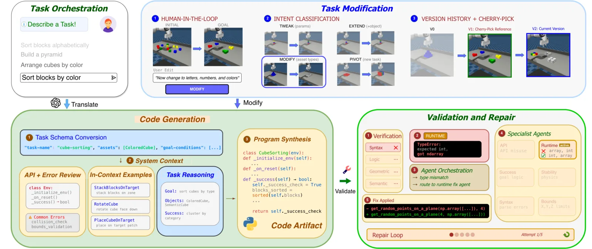

# RoboPlayground

**RoboPlayground: Democratizing Robotic Evaluation through Structured Physical Domains** mette in discussione un presupposto comune dei benchmark robotici: che task, vincoli e criteri di successo debbano essere fissati una volta per tutte da un piccolo gruppo di esperti. Questa impostazione favorisce la comparabilità, ma restringe lo spazio delle domande che il benchmark può porre e rende costosa ogni estensione, perché una nuova variante richiede di intervenire direttamente sul codice dell'ambiente.

RoboPlayground propone una soluzione diversa: usare il linguaggio naturale come **interfaccia di authoring eseguibile** sopra un dominio fisico strutturato. L'utente descrive l'attività e può successivamente modificarne oggetti, relazioni, vincoli o criterio di successo. Il sistema traduce la richiesta in codice MuJoCo, verifica che la scena sia eseguibile e fisicamente coerente e conserva la genealogia delle versioni. Il risultato non è una descrizione libera né un singolo episodio, ma un artefatto condivisibile che definisce una famiglia riproducibile di task.

*Una specifica linguistica può trasformare la disposizione casuale iniziale in un goal strutturato, in questo caso pile ordinate per colore. Fonte: [sito RoboPlayground](https://roboplayground.github.io/).*

## Dalla valutazione statica alla valutazione partecipativa

Il lavoro persegue quattro proprietà. **Accessibilità** significa permettere anche a chi non conosce le API del simulatore di esprimere il comportamento da testare. **Crescita continua** indica che lo spazio di valutazione può ampliarsi attraverso contributi successivi. **Riproducibilità** richiede che una specifica possa essere rieseguita su policy diverse. **Controllo strutturato** limita la libertà linguistica affinché variazioni e failure mode restino interpretabili.

Quest'ultimo punto è essenziale. Un LLM capace di generare arbitrariamente scene e codice può produrre task plausibili nel testo ma ambigui, instabili o impossibili da verificare. RoboPlayground sacrifica parte dell'apertura del mondo in favore di un dominio con asset, relazioni e interfacce note. La democratizzazione riguarda quindi **chi può formulare le prove**, non l'assenza di vincoli sulla loro forma.

## Rappresentazione di un task

Un task viene formalizzato come

$$
\mathcal{T}=(\mathcal{A},\rho_0,G,l_{\mathrm{ref}},\mathcal{V}),
$$

dove $\mathcal{A}$ è l'insieme degli asset, $\rho_0$ la distribuzione degli stati iniziali, $G:\mathcal{S}\rightarrow\{0,1\}$ il predicato di successo sullo stato del simulatore $s\in\mathcal{S}$, $l_{\mathrm{ref}}$ l'istruzione canonica e $\mathcal{V}$ un insieme di parafrasi per testare la robustezza linguistica. L'istruzione effettivamente fornita alla policy è indicata con $l\in\{l_{\mathrm{ref}}\}\cup\mathcal{V}$; il pedice distingue soltanto la formulazione di riferimento conservata nell'artefatto.

La separazione tra questi componenti risolve un'ambiguità importante. Due frasi semanticamente equivalenti possono produrre valutazioni diverse se cambiano tolleranze, distribuzione di reset o istante in cui si controlla il successo. **Il testo non è quindi, da solo, un'unità sperimentale sufficiente**: l'artefatto deve rendere esplicite anche inizializzazione, asset e logica di verifica.

Ogni implementazione estende una stessa interfaccia e definisce metodi per inizializzare l'ambiente, campionare da $\rho_0$ e calcolare $G$. La struttura comune riduce le differenze accidentali dovute allo stile di programmazione dell'autore e rende possibile applicare validatori uniformi.

## Dominio fisico ed embodiment

L'istanza presentata nel paper usa **MuJoCo** e un dominio tabletop basato su blocchi. Gli asset includono cubi colorati e cubi semantici con lettere, cifre o simboli visibili, oltre a regioni target. I task comprendono impilamento, ordinamento, allineamento, costruzione di forme, relazioni spaziali, rotazioni e sequenze temporali.

La configurazione è standardizzata: il piano si trova a quota $z=0{,}95\,\mathrm{m}$, gli oggetti vengono collocati entro

$$
x\in[0{,}40,0{,}70]\,\mathrm{m},
\qquad
y\in[-0{,}25,0{,}25]\,\mathrm{m},
$$

e camera, gravità, attrito e parametri del solver rimangono fissi. La policy controlla un manipolatore simulato mediante azioni cartesiane a sette dimensioni: sei componenti descrivono il delta di posa dell'end-effector e una il gripper. Gli esperimenti non costituiscono una validazione su hardware reale né un confronto cross-embodiment.

La camera fissa è anche parte della semantica del dominio. Nei task con simboli, una configurazione è corretta solo se le facce rilevanti risultano geometricamente visibili e leggibili. Il sistema usa ray casting verso cinque punti di ogni faccia e la considera visibile quando almeno tre raggi non sono occlusi. Verifica inoltre l'allineamento della normale e l'orientamento nel piano del glifo, evitando che un predicato simbolico accetti lettere rivolte nella direzione sbagliata.

## Pipeline di compilazione dal linguaggio

La trasformazione della richiesta in un task eseguibile attraversa quattro blocchi: **orchestrazione**, **generazione del codice**, **validazione con riparazione** e **context steering**. La modularità consente di distinguere gli errori di comprensione dell'intento da quelli sintattici, fisici o relativi allo storico della conversazione.

*La descrizione dell'utente viene prima strutturata, poi compilata in codice e infine sottoposta a validatori e agenti di riparazione. Lo steering conserva storia e lineage delle varianti. Fonte: [paper RoboPlayground](https://arxiv.org/abs/2604.05226).*

### Orchestrazione e schema intermedio

Data una descrizione naturale $u$, il primo modulo costruisce un `TaskSchema` con nome, asset, goal e logica di inizializzazione. Prima della generazione del codice, un agente di fattibilità controlla limiti del workspace, compatibilità degli asset e capacità del robot. Per esempio, una richiesta di ordinamento alfabetico deve selezionare cubi dotati di lettere leggibili, non semplici cubi colorati.

La proposta viene confrontata con vincoli del dominio. Il sistema verifica che numero e tipo degli oggetti siano disponibili, che relazioni spaziali e visibilità possano essere soddisfatte insieme e che il goal rientri nell'area raggiungibile. Quando rileva un conflitto, suggerisce una riparazione strutturata, come ridurre il numero di etichette preservando la geometria oppure sostituire un ordinamento non realizzabile.

### Generazione del codice

Un LLM riceve lo schema validato insieme alla documentazione delle API, a errori ricorrenti e a implementazioni di riferimento recuperate per similarità. Gli esempi vengono selezionati in base a classe degli asset, tipo di ragionamento, complessità e primitive di manipolazione. In questo modo un task di rotazione non viene guidato da una API adatta soltanto all'impilamento e un predicato semantico non viene confuso con una semplice tolleranza geometrica.

Il modello produce prima una specifica intermedia in linguaggio naturale, poi la classe eseguibile con inizializzazione e metodo di successo. Questo passaggio rende ispezionabile l'intento prima che venga incorporato nel codice, ma non elimina il rischio che implementazione e descrizione divergano: per questo è necessaria la fase successiva.

### Validazione software e fisica

La validazione di base applica analisi dell'Abstract Syntax Tree, ricerca di pattern proibiti, compilazione in ambiente isolato, istanziazione e *smoke test*. Superare questi controlli dimostra che il task può essere caricato ed eseguito, non che il goal abbia senso.

Il predicato $G$ viene perciò analizzato anche come insieme di vincoli. Le relazioni di supporto, per esempio `On(A,B)`, formano un grafo diretto. Il validatore cerca cicli fisicamente impossibili, controlla che ogni oggetto mobile abbia una catena di supporto che termini su una superficie fissa e segnala condizioni ridondanti o conflittuali.

La verifica del goal istanzia direttamente la configurazione finale, esegue 50 step a comando nullo per lasciare assestare i contatti e richiede che $G$ sia vero. Seguono altri 50 step di stabilità: uno spostamento superiore a un centimetro o una variazione verticale oltre due centimetri, interpretata come possibile caduta, causa il rifiuto. Il test mostra che il goal campionato è stabile nel simulatore; non dimostra necessariamente che esista una traiettoria raggiungibile dalla configurazione iniziale.

Quando un controllo fallisce, l'orchestratore instrada l'errore verso agenti specializzati per sintassi, API, runtime, logica di successo, stabilità della struttura o limiti geometrici. Ogni agente riceve traceback, pose e strategie già fallite, così da ridurre correzioni oscillanti. Sono consentiti fino a cinque cicli di validazione e riparazione, con un massimo di tre tentativi per specialista.

## Modifiche controllate e versionamento

Dopo la validazione, l'utente può chiedere una variante. Il router classifica la richiesta in cinque categorie: **Tweak** modifica parametri locali; **Extend** aggiunge elementi; **Modify** cambia proprietà mantenendo la struttura generale; **Pivot** riscrive in modo più profondo la struttura o il goal; **Fresh** avvia un task indipendente. La categoria determina quali parti di $(\mathcal{A},\rho_0,G)$ debbano essere preservate.

Ogni versione validata viene salvata come snapshot immutabile con identificatore, descrizione della modifica, asset utilizzati, riassunto del goal e hash SHA-256 del codice. Lo storico permette richieste come «torna alla versione con tre blocchi» o «riprendi quella con le lettere», anche quando la variante corrente usa asset incompatibili.

L'hash evita rigenerazioni identiche e identifica cicli nello steering. Soprattutto, la lineage esplicita conserva la relazione tra una prova e il task di riferimento. Questa relazione è necessaria per attribuire una variazione di performance a uno specifico cambiamento semantico, visuale o comportamentale.

## Studio di usabilità

Lo studio coinvolge **26 partecipanti** in un disegno within-subject: ogni persona usa GenSim, Cursor e RoboPlayground per costruire task equivalenti di strutture tridimensionali con vincoli sui blocchi. Vengono misurati System Usability Scale (SUS), carico NASA-TLX, tempo, tasso di mancato completamento, ranking e preferenza.

RoboPlayground ottiene un SUS medio di 83,4, rispetto a 68,8 per Cursor e 52,5 per GenSim. Il carico medio normalizzato è 18,6, contro 36,7 e 41,8. Il 69% dei partecipanti lo seleziona come sistema preferito, mentre Cursor riceve il 23% e GenSim l'8%. I test non parametrici riportati indicano differenze significative sia nell'usabilità sia nel carico rispetto a entrambe le baseline.

Questi risultati sostengono l'accessibilità dell'interfaccia, ma vanno letti nel perimetro dello studio: campione piccolo, ambiente controllato, task sui blocchi e partecipanti con livelli eterogenei ma non rappresentativi dell'intera comunità di utenti finali. La preferenza per l'interfaccia non dimostra inoltre che i task prodotti siano automaticamente più validi dal punto di vista scientifico.

## Dataset e policy valutate

Per isolare il comportamento delle policy, tutte vengono addestrate sullo stesso insieme di dimostrazioni generate automaticamente con **CuTAMP**. I dieci task di training includono relazioni davanti/dietro e destra/sinistra, impilamenti di due o tre blocchi, allineamento per colore e collocamento su target. Le dimensioni variano da 280 traiettorie per Color Block Alignment a 3.549 per Red on Yellow Stack, per un totale di **24.117 traiettorie**.

Le quattro varianti **StarVLA** condividono Qwen3-VL-4B-Instruct e predicono chunk $a_{t:t+15}$ di 16 azioni cartesiane a sette dimensioni. Adapter usa 64 query apprendibili e una testa MLP-ResNet con loss $L_1$; GR00T aggiunge un Diffusion Transformer flow-matching; Dual affianca a quest'ultimo un encoder DINOv2; Qwen-OFT regredisce le azioni dalle posizioni di token speciali secondo l'impostazione OpenVLA-OFT.

Le baseline esterne sono due adattamenti di **$\pi_0.5$**, inizializzati dal checkpoint DROID: uno aggiorna tutti i parametri, l'altro usa LoRA. Entrambi combinano un backbone PaliGemma da 2 miliardi di parametri con un action expert Gemma da 300 milioni e producono horizon di dieci step. Il confronto include quindi action head e strategie di adattamento differenti, ma non isola perfettamente ciascun fattore architetturale.

## Famiglie di generalizzazione

I task di valutazione derivano dai task base tramite modifiche generate da RoboPlayground e vengono classificati lungo tre assi. Le perturbazioni **semantiche** cambiano relazioni o specifiche linguistiche; quelle **visuali** alterano attributi percettivi o configurazione iniziale preservando la struttura dell'esecuzione; quelle **comportamentali** richiedono una diversa sequenza di azioni, più stadi o progressi non monotoni.

Esempi visuali sono il cambio di colore di un target o dei blocchi. Esempi semantici sono «il blocco rosso a sinistra di quello blu» o una diversa coppia di colori da impilare. Varianti comportamentali comprendono costruire due torri, impilare blocchi su una patch, oppure disfare e ricostruire una pila. Alcuni task combinano più assi, rendendo possibile osservare interazioni tra percezione, linguaggio e pianificazione.

## Risultati sulle policy

In-distribution, i modelli raggiungono risultati medio-alti sui task di semplice collocamento e relazione spaziale. GR00T arriva al 96% in Place Two Blocks on Patch. Le prestazioni cadono però già sui task di training più composizionali: negli impilamenti articolati e nell'allineamento per colore anche il modello migliore non supera il 22%.

Le perturbazioni visuali sono generalmente le meno distruttive. GR00T raggiunge il 90% nel posizionamento di due blocchi su una patch verde e l'86% con due blocchi blu; Dual ottiene rispettivamente 72% e 80%. Le modifiche semantiche producono risultati più misti ma non nulli: GR00T raggiunge il 78% nel collocamento a sinistra di un blocco giallo e il 62% nell'impilamento verde su blu, mentre Dual ottiene 74% e 56%.

Le variazioni comportamentali espongono il limite più netto. Nessuna architettura supera il 2% nei task che richiedono di disimpilare e reimpilare o di collocare due blocchi impilati su una patch; Blue Block Stacking produce lo 0% per tutti i modelli. Poiché le stesse policy sanno eseguire primitive correlate in configurazioni più semplici, il fallimento indica soprattutto scarsa **generalizzazione procedurale e composizionale**, non completa assenza della skill motoria elementare.

Adapter è particolarmente fragile ai cambiamenti semantici, compatibilmente con un adattamento che può essersi legato a feature superficiali dei task di training. $\pi_0.5$ con LoRA è quasi sempre inferiore al full fine-tuning, suggerendo che in questo setup l'aggiornamento a basso rango non è sufficiente ad allineare completamente la distribuzione di azioni e le nuove skill. Il dato non autorizza però una conclusione generale contro LoRA: dipende da checkpoint, rank, dati e protocollo adottati.

## Crescita dello spazio di valutazione

RoboPlayground misura la diversità attraverso la distanza coseno media tra embedding testuali dei task. Quando si aggiungono compiti dello stesso autore, la diversità cresce rapidamente all'inizio e poi tende a saturare. Quando si uniscono dieci task per ciascuno di più autori, la diversità aumenta invece in modo monotono anche dopo le prime aggiunte.

L'interpretazione proposta è che ciascun autore esplori una regione coerente con le proprie astrazioni e preferenze linguistiche, mentre autori differenti introducano combinazioni complementari di vincoli e intenti. **Il numero di contributori risulta quindi più importante del solo numero di task** per ampliare la copertura semantica.

La metrica resta tuttavia un proxy. Distanza tra sentence embedding non garantisce differenza fisica, difficoltà motoria o copertura uniforme delle failure mode. Due descrizioni linguisticamente distanti possono compilare in goal quasi equivalenti; viceversa una piccola modifica testuale può cambiare radicalmente la procedura richiesta.

## Ablation della pipeline

Le ablation separano proposta, generazione del codice, validazione e steering. Il risultato più forte riguarda la validazione: senza di essa il successo end-to-end dei task generati scende al 12% nonostante un tasso di compilazione elevato; la validazione testuale lo porta al 96,2% e lo stack completo raggiunge il 100% nel campione di 26 casi.

Inferenza degli asset e controllo di fattibilità migliorano soprattutto la verifica umana. Documentazione delle API, catalogo degli errori ed esempi in-context aumentano robustezza e allineamento senza cambiare molto la compilabilità, già alta. Nello steering, interpretazione dell'intento e storico delle versioni preservano coerenza tra turni; il solo routing privo di storia può invece peggiorare la verifica semantica.

Le metriche dell'ablation distinguono compilazione, smoke test, successo del predicato, verifica umana e **LLM Alignment**, un voto tra 0 e 100 assegnato confrontando il metodo `_success()` con la descrizione. Il fatto che queste grandezze non migliorino sempre insieme mostra perché l'eseguibilità non possa essere assunta come sinonimo di fedeltà all'intento.

#### Novelty

RoboPlayground unisce **task authoring linguistico, rappresentazione strutturata, validazione fisica, riparazione automatica e versionamento** in un'interfaccia unica per la valutazione robotica. A differenza della generazione libera di ambienti, ogni output conserva asset, reset distribution, criterio di successo e lineage necessari a una prova rieseguibile.

Il secondo contributo è concettuale: la copertura del benchmark può crescere tramite partecipazione distribuita. Lo studio mostra che autori diversi aggiungono regioni semantiche complementari e che varianti controllate fanno emergere fragilità non osservabili su un set fisso di task in-distribution.

#### Limiti

Il dominio sperimentale è intenzionalmente ristretto a blocchi rigidi, camera fissa e fisica MuJoCo. Non comprende oggetti deformabili, strumenti, contatti complessi, scene domestiche ricche, embodiment multipli o rumore real-world. L'efficacia della pipeline in questi regimi rimane da dimostrare e richiederebbe nuove API, asset, controlli di fattibilità e validatori.

La verifica del goal parte da una configurazione finale campionata e ne controlla la stabilità, ma **goal stabile non significa goal raggiungibile** dalla distribuzione iniziale con il robot disponibile. Un task può superare compilazione, smoke test e success check pur richiedendo una traiettoria impraticabile o una precisione non realistica.

L'allineamento semantico non è completamente automatico. La verifica umana è costosa, mentre un LLM usato come giudice può condividere errori e bias con il generatore. Le soglie geometriche, gli esempi recuperati e le classi di steering incorporano inoltre decisioni degli autori che limitano ciò che gli utenti possono esprimere.

Lo studio di usabilità coinvolge 26 persone e due esercizi centrati su strutture di blocchi; non stabilisce ancora come l'interfaccia si comporti con utenti di domini industriali o task molto più lunghi. Analogamente, la misura di diversità basata sul testo non equivale a copertura fisica o comportamentale.

Infine, la valutazione delle policy usa dimostrazioni sintetiche CuTAMP e un unico action space cartesiano. I risultati diagnosticano bene le perturbazioni costruite nel playground, ma non provano trasferimento su hardware, generalizzazione cross-embodiment o robustezza a distribuzioni percettive realistiche.

Il riferimento primario è il [paper RoboPlayground](https://arxiv.org/abs/2604.05226); il [sito del progetto](https://roboplayground.github.io/) raccoglie l'interfaccia e le risorse collegate.
