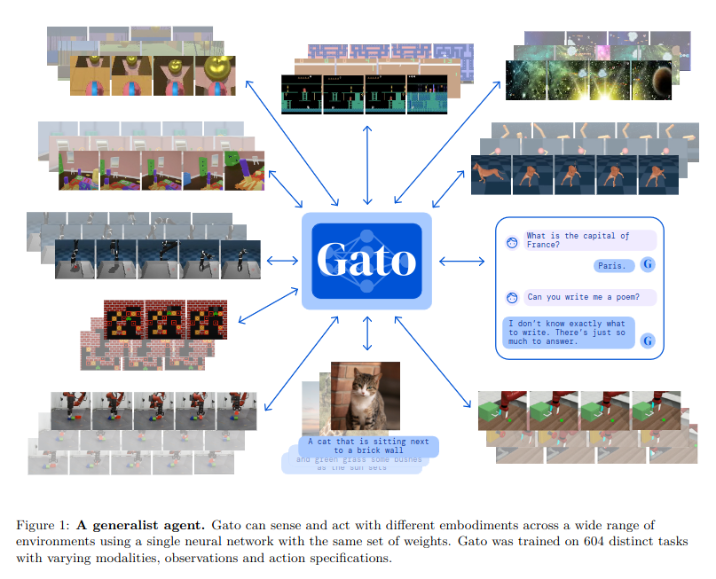
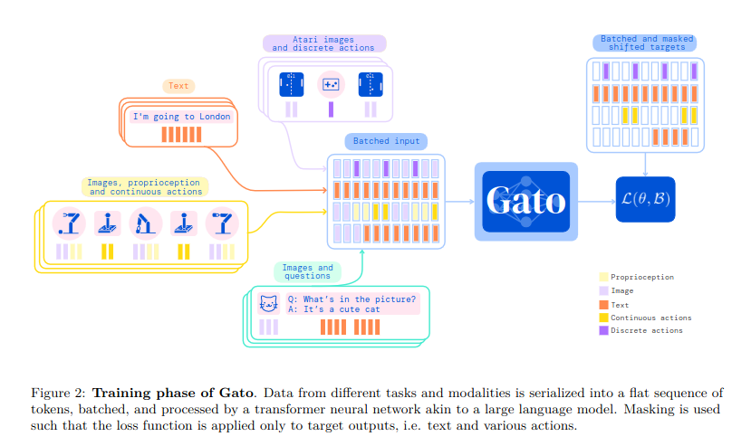

# Gato (2022)

**Gato** propone uno dei primi tentativi di costruire un unico Transformer capace di gestire task molto diversi rappresentando osservazioni e azioni attraverso una sequenza comune di token.

Gato viene addestrato su un **dataset molto eterogeneo** proveniente da **604 task**, con modalità, observation space e action space differenti. Il dataset non è quindi un singolo dataset robotico, ma una combinazione di esperienze raccolte in ambienti simulati e reali, dati linguistici e dataset vision-language.

Le principali categorie sono:

- Simulated control, con task provenienti da ambienti come Atari, DeepMind Control Suite, Meta-World, DeepMind Lab, BabyAI e Sokoban;
- Robotics, con task di manipolazione basati sul dataset RGB-Stacking, sia in simulazione sia su robot reale;
- Vision-language, con dataset di image captioning e visual question answering;
- Language puro, con grandi corpora testuali utilizzati per language modeling e dialogo.

Gato non è considerato VLA nel senso moderno del termine per il modo in cui viene integrato il linguaggio.
Nei VLA moderni, il linguaggio viene usato esplicitamente per condizionare una policy robotica.
In Gato, invece, tutte le modalità vengono trattate come una sequenza generica di token all’interno di un agente generalista, quindi **il linguaggio non è esplicitamente utilizzato per condizionare una policy robotica**.

**Novelty:** unificazione di percezione, linguaggio e controllo attraverso un unico sequence model.

**Limiti:** il linguaggio non viene utilizzato come istruzione per condizionare una policy robotica; inoltre, le performance dipendono fortemente dal task e non viene ancora sfruttato il pre-training multimodale su scala comparabile ai VLM successivi.

Per i task di controllo simulato, i dati vengono principalmente generati da policy specialistiche già addestrate, spesso tramite reinforcement learning. Per ogni ambiente vengono registrate **traiettorie contenenti osservazioni, azioni e reward prodotti durante l’interazione dell’agente con l’ambiente**. Gato apprende quindi prevalentemente per behavioral cloning da esperienze generate da agenti esperti, invece di apprendere direttamente tramite reinforcement learning.

La componente robotica utilizza principalmente il task RGB-Stacking, nel quale un braccio robotico deve manipolare blocchi colorati a partire da osservazioni visive e propriocezione. Sono presenti **dati sia simulati sia raccolti su robot reale**. Le osservazioni comprendono immagini RGB e stato propriocezionale, mentre le azioni sono continue e vengono convertite in token prima di essere processate dal Transformer.

La caratteristica più importante del dataset consiste infatti nel fatto che **tutte le modalità vengono trasformate in una rappresentazione sequenziale comune**:

$$
\text{image patches + proprioception + text + actions}
\rightarrow
\text{sequence of tokens}
$$

Le immagini vengono suddivise in patch, il testo viene tokenizzato e le variabili continue, come propriocezione e azioni, vengono quantizzate. Questo permette di utilizzare lo stesso Transformer su task che possono avere output completamente diversi, come:

$$
\text{text token}, \qquad
\text{Atari button}, \qquad
\text{continuous robot action}
$$

Durante il training, le sequenze provenienti dai diversi dataset vengono mescolate nello stesso training batch. La loss viene però mascherata in modo che il modello venga ottimizzato principalmente sulla predizione dei token di azione e dei token testuali, invece di dover ricostruire tutte le osservazioni ricevute.

La composizione del dataset è quindi fondamentale per interpretare correttamente Gato. Il modello non viene addestrato su un grande corpus di traiettorie robotiche linguisticamente condizionate, come avverrà successivamente con i VLA. La maggior parte dei 604 task appartiene invece a domini di controllo e percezione differenti, mentre la robotica costituisce soltanto una parte del training complessivo.

Per questo motivo, Gato dimostra soprattutto che un’unica architettura autoregressiva può apprendere contemporaneamente task con embodiment e action space differenti, più che dimostrare una forte generalizzazione vision-language-action nel senso moderno del termine.
