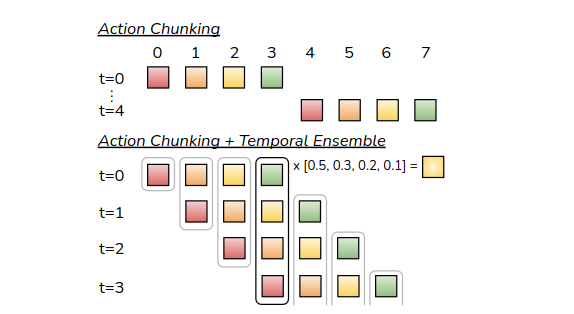
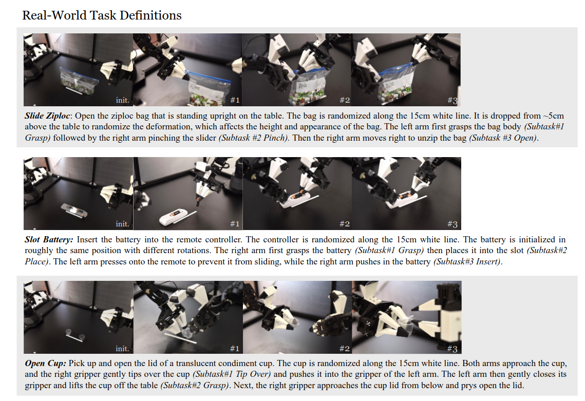

# Action Chunking with Transformers

**Action Chunking with Transformers (ACT)** è una policy visuomotoria di imitation learning introdotta con **ALOHA**, una piattaforma low-cost per teleoperazione bimanuale.

ACT non è un VLA in senso stretto: il modello originario **non riceve un'istruzione linguistica** $l$ e viene **addestrato separatamente per ciascun task**.

ACT ha però reso centrali due idee poi adottate da molte policy robotiche: **predire sequenze di azioni continue** e riconciliare online pianificazioni temporali sovrapposte.

Il problema affrontato è la **manipolazione fine e contact-rich**. In task come inserire una batteria, aprire un contenitore o infilare una fascetta, piccoli errori modificano i contatti e portano il robot verso stati poco rappresentati nelle dimostrazioni.

Una policy che decide un'azione alla volta deve quindi sostenere un lungo orizzonte closed loop, durante il quale gli errori di behavioral cloning possono accumularsi.

## ALOHA e raccolta dei dati

ALOHA usa **due bracci** *leader*, mossi direttamente dall'operatore, per comandare due bracci *follower* che interagiscono con gli oggetti. La somiglianza cinematica rende possibile mappare le posizioni articolari dei leader sui follower senza un sistema di motion capture esterno.

Il setup comprende **quattro camere RGB** da $480\times640$ pixel: una vista frontale, una dall'alto e due wrist camera.

L'osservazione $o_t$ contiene le **immagini e le posizioni dei giunti** dei follower.

Le azioni vengono ricavate dalle posizioni dei giunti leader, perché la differenza tra target e posizione follower determina implicitamente, attraverso il controller PID, l'azione esercitata durante il contatto.

Ciascun braccio contribuisce con sei giunti e un comando del gripper. L'azione è quindi un vettore di **14 target articolari**:

$$
a_t\in\mathbb{R}^{14}.
$$

Le dimostrazioni sono registrate a 50 Hz. Il lavoro valuta due task simulati e sei task reali bimanuali; per diversi task reali vengono raccolti circa dieci minuti di teleoperazione, mostrando un regime molto diverso dai grandi mixture generalisti.

## Action chunking

Una policy standard approssima $\pi_\theta(a_t\mid o_t)$, mentre ACT predice una sequenza di $k$ azioni future:

$$
\pi_\theta(a_{t:t+k-1}\mid o_t).
$$

Il parametro $k$ è la lunghezza del chunk.

Se il robot eseguisse l'intero blocco prima di interrogare nuovamente la policy, l'orizzonte decisionale effettivo si ridurrebbe approssimativamente di un fattore $k$.

Il **chunk può inoltre catturare correlazioni temporali nelle dimostrazioni**, distinguendo una pausa intenzionale o una fase del task da un semplice rumore istantaneo.

Un **chunk troppo lungo avvicina però il comportamento al controllo open loop**: la policy non può reagire rapidamente a contatti inattesi o errori.

ACT conserva il **feedback interrogando il modello a ogni step**, così che le finestre previste in istanti consecutivi si sovrappongano.

### Temporal ensembling

Con query ripetute, la stessa azione $a_t$ viene prevista da più chunk generati in momenti precedenti. Indichiamo con $\hat{a}_t^{(i)}$ la predizione per l'istante $t$ prodotta dalla query effettuata all'istante $i$. **ACT combina le predizioni** disponibili mediante una media pesata:

$$
\bar{a}_t
=
\frac{\sum_{i} w_i\hat{a}_t^{(i)}}{\sum_i w_i},
\qquad
w_i=\exp(-m i),
$$

dove $m$ controlla il decadimento esponenziale dei pesi secondo l'età relativa delle predizioni. A differenza di uno smoothing tra azioni appartenenti a istanti diversi, il temporal ensemble media stime riferite allo **stesso istante futuro**. In questo modo attenua errori del modello e transizioni brusche tra chunk senza introdurre una loss aggiuntiva.

## Architettura conditional VAE

ACT modella le dimostrazioni come un **conditional variational autoencoder (CVAE)**. Durante il training, un encoder riceve le posizioni articolari correnti e il chunk di azioni target e produce i parametri di una **distribuzione latente**:

$$
q_\phi(z\mid o_t,a_{t:t+k-1}),
$$

dove $z$ rappresenta lo stile o la variabilità non deterministica della dimostrazione.

Il decoder costituisce la policy e predice il chunk condizionandosi su osservazione e variabile latente.

L'obiettivo combina ricostruzione e regolarizzazione:

$$
\mathcal{L}_{\mathrm{ACT}}
=
\left\|a_{t:t+k-1}-\hat{a}_{t:t+k-1}\right\|_1
+
\beta D_{\mathrm{KL}}
\left(q_\phi(z\mid o_t,a_{t:t+k-1})\,\|\,\mathcal{N}(0,I)\right),
$$

dove $\|\cdot\|_1$ è la loss di ricostruzione, $D_{\mathrm{KL}}$ la divergenza di Kullback-Leibler, $\mathcal{N}(0,I)$ una normale standard e $\beta$ il peso della regolarizzazione. Durante l'inferenza l'encoder CVAE viene rimosso e $z$ viene fissato al centro della prior, ottenendo un rollout deterministico.

Le quattro immagini vengono elaborate da backbone **ResNet-18**. Le feature map sono appiattite in token spaziali e combinate con propriocezione, positional embedding e variabile latente.

Un **Transformer encoder fonde le viste e lo stato del robot**.

Un Transformer decoder usa $k$ **query posizionali per produrre una rappresentazione per ciascuna azione futura**.

Una proiezione finale converte l'output in un tensore

$$
\hat{A}_t\in\mathbb{R}^{k\times14},
$$

che contiene i target articolari dei due bracci. Il modello originario ha circa 80 milioni di parametri ed è addestrato da zero per ogni task.

## Dataset ed evaluation

I due task simulati sono **cube transfer** e **bimanual insertion**, per i quali vengono considerate dimostrazioni scripted e umane. I sei task reali richiedono coordinazione bimanuale, percezione da più viste e contatti precisi: aprire una busta con zip, inserire una batteria, aprire un contenitore, infilare una fascetta, preparare del nastro e calzare una scarpa su un piede artificiale.

ACT raggiunge risultati elevati su diversi task, tra cui l'88% per l'apertura della busta e il 96% per l'inserimento della batteria nel protocollo riportato.

Il task di **infilare la fascetta rimane molto più difficile**, soprattutto perché l'**oggetto sottile occupa pochi pixel e richiede un allineamento preciso**.

Le ablation mostrano che l'action chunking produce il contributo principale, il temporal ensemble migliora la fluidità e la stabilità e l'obiettivo CVAE è particolarmente importante sulle dimostrazioni umane multimodali. Il beneficio non deriva quindi dal solo uso del Transformer.

#### Limiti

Il modello originario è **task-specific** e richiede un nuovo training per ogni comportamento. **Non usa linguaggio**, non trasferisce esplicitamente tra oggetti o embodiment e dipende dalla corrispondenza cinematica e sensoriale del setup ALOHA.

Il compromesso tra reattività e coerenza dipende dalla lunghezza $k$: **chunk brevi riducono meno l'orizzonte, mentre chunk lunghi incorporano più struttura temporale ma rischiano di reagire lentamente**. Il temporal ensemble aumenta inoltre il costo di inferenza perché la policy viene interrogata a ogni step e mantiene predizioni sovrapposte.
