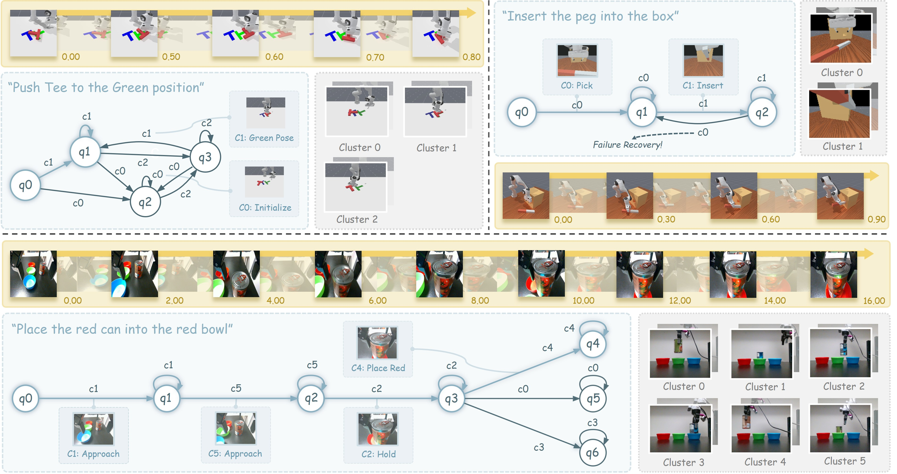
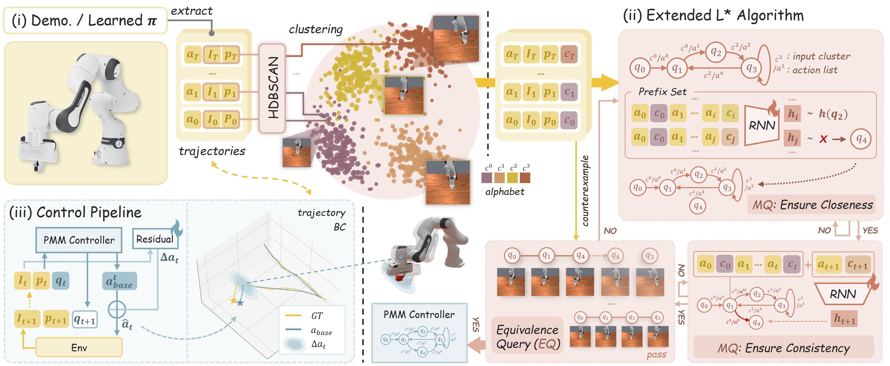
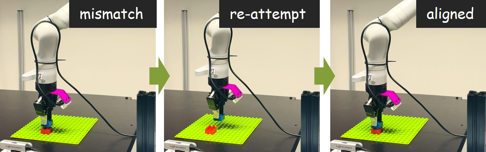
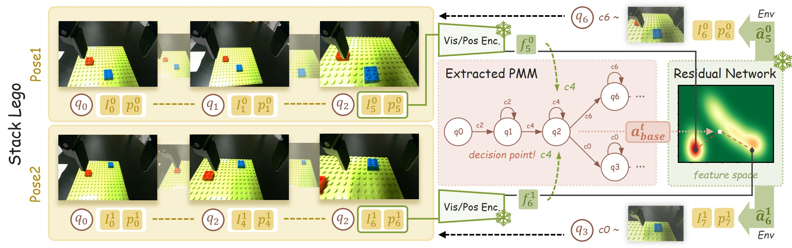

# ENAP

**ENAP**, acronimo di *Emergent Neural Automaton Policy*, propone una rappresentazione ibrida per le policy robotiche long-horizon: un **Probabilistic Mealy Machine (PMM)** descrive le fasi discrete del task e le transizioni ammesse, mentre una rete neurale residuale realizza il controllo continuo. 

La struttura simbolica non viene specificata manualmente e non richiede etichette come "raggiungi", "afferra" o "allinea"; emerge invece dalle traiettorie visuomotorie attraverso clustering, modellazione della storia ed estrazione di un automa.

Il lavoro occupa una posizione intermedia tra **Behavioral Cloning end-to-end** e **Task and Motion Planning (TAMP)**. Una policy neurale monolitica può apprendere direttamente la relazione tra osservazioni e azioni, ma non espone necessariamente la decomposizione del task. Un planner simbolico rende esplicite fasi e dipendenze, ma richiede normalmente predicati, operatori e modelli di transizione progettati da un esperto. ENAP cerca di ottenere una struttura discreta leggibile senza imporla a priori, lasciando alla componente neurale le correzioni motorie che un automa finito non può rappresentare con precisione.

## Dalla policy monolitica alla Neural Automaton Policy

Il punto di partenza è che un task complesso alterna regimi qualitativamente differenti. Durante un inserimento, per esempio, il robot prima raggiunge il pezzo, poi lo afferra, lo porta vicino alla sede, corregge l'allineamento e infine applica il movimento di inserimento. In ciascuna fase sono appropriate azioni locali diverse, mentre la sequenza complessiva segue una struttura discreta.

ENAP rappresenta questa struttura mediante stati dell'automa, archi condizionati da simboli percettivi e distribuzioni di azioni associate agli archi. Le dimostrazioni determinano quali fasi esistano, quando possano ripetersi e dove siano presenti ramificazioni. **La componente simbolica descrive l'intento grossolano; quella neurale compensa la variabilità continua di immagini, pose e geometrie**.

La figura usa $q_i$ per gli stati dell'automa, seguendo il paper. Nel testo di questo capitolo viene invece adottato $m_t$ per lo stato discreto della macchina, perché le convenzioni della wiki riservano $q_t$ allo **stato del robot**.

## Formulazione del problema

Il task viene modellato come un Partially Observable Markov Decision Process. Le dimostrazioni formano un dataset:

$$
\mathcal{D} = \left\{\tau_i\right\}_{i=1}^{N}
$$

Ogni traiettoria contiene osservazioni e azioni dell'esperto:

$$
\tau_i = \left(o_0,a_0,\ldots,o_{T_i},a_{T_i}\right)
$$

L'osservazione $o_t$ comprende l'immagine $I_t$ e lo stato propriocettivo del robot $q_t$; nei task language-conditioned comprende anche l'istruzione $l$. L'azione continua $a_t\in\mathbb{R}^d$ dipende dall'interfaccia del robot e può rappresentare un comando cartesiano, il gripper oppure un action chunk.

L'obiettivo non è soltanto apprendere una policy $\pi(a_t\mid o_t,l)$, ma ricostruire una policy strutturata composta da un automa $\mathcal{M}$ e da una rete residuale $\pi_\psi$. La storia dell'esecuzione viene compressa nello stato discreto $m_t$, che dovrebbe distinguere fasi con futuri operativi differenti.

## Probabilistic Mealy Machine

La struttura high-level è definita come un Probabilistic Mealy Machine:

$$
\mathcal{M} = \left(Q,\Sigma,\Gamma,\delta,\lambda,m_0\right)
$$

In questa definizione, $Q$ è l'insieme finito degli stati o modi del task, $\Sigma$ è l'alfabeto dei simboli percettivi, $\Gamma$ rappresenta gli output, $m_0\in Q$ è lo stato iniziale, $\delta(m'\mid m,c)$ è la probabilità di passare da $m$ a $m'$ dopo aver osservato il simbolo $c$, mentre $\lambda(a\mid m,c)$ descrive la distribuzione delle azioni associate alla coppia stato-simbolo.

La relazione con il POMDP è concettuale. I simboli discretizzano l'osservazione, gli stati dell'automa sintetizzano la storia e gli archi descrivono la progressione della policy. Il PMM non è però un world model completo: **modella la logica della policy dimostrata, non la dinamica generale dell'ambiente**. Non predice cosa accadrebbe sotto azioni arbitrarie lontane dalle traiettorie osservate.

Una macchina di Mealy condiziona l'output sia sullo stato corrente sia sul simbolo in ingresso. Questa scelta permette di mantenere un numero contenuto di stati pur reagendo a osservazioni differenti. Il carattere probabilistico consente inoltre che la stessa fase e lo stesso simbolo conducano a più destinazioni, come avviene nelle dimostrazioni multimodali.

## Pipeline di apprendimento

ENAP divide l'apprendimento in tre passaggi: **astrazione simbolica**, **estrazione della struttura mediante una variante di $L^*$** e **controllo bi-level con correzione residuale**.

Le traiettorie vengono codificate e discretizzate con HDBSCAN; una versione estesa di $L^*$ costruisce e verifica il PMM usando il dataset come sorgente delle query; il controller combina infine l'azione media proposta dall'arco con una correzione neurale.

### Astrazione simbolica adattiva

Un encoder $\phi_\theta$ trasforma l'osservazione in una feature continua:

$$
z_t = \phi_\theta(o_t)
$$

HDBSCAN raggruppa le feature senza richiedere a priori il numero dei cluster. A ogni punto viene assegnato un simbolo $c_t\in\Sigma$, ottenendo una traiettoria aumentata $(o_t,a_t,c_t)$. I cluster intendono catturare configurazioni percettive e cinematiche ricorrenti, non concetti forniti da annotatori.

Il paper distingue due scenari. In **policy discovery**, le traiettorie provengono direttamente da dimostrazioni e l'encoder visuale, per esempio DINOv2, viene adattato insieme alla policy. In **policy enhancement**, le traiettorie sono rollout di una policy già addestrata e ENAP riusa le sue rappresentazioni interne. L'esperimento ENAP(FLOWER) appartiene al secondo caso: l'automa viene estratto dai token multimodali di un VLA che osserva immagini e istruzione $l$.

HDBSCAN risolve soltanto la discretizzazione istantanea. Lo stesso simbolo visuale può assumere significati differenti a seconda di ciò che il robot ha già fatto; per esempio, trovarsi vicino a un oggetto prima o dopo averlo rilasciato non rappresenta necessariamente la stessa fase. ENAP introduce quindi una rappresentazione esplicita della storia.

### RNN come rappresentazione della storia

Una RNN $h_\kappa$ comprime la sequenza di azioni e simboli fino al tempo $t$:

$$
h_t = h_\kappa\!\left(a_{0:t},c_{0:t}\right)
$$

L'embedding $h_t$ funge da surrogato continuo dello stato discreto dell'automa. La RNN viene addestrata a predire l'azione e il simbolo successivi e, contemporaneamente, a rendere la geometria latente coerente con le transizioni di fase:

$$
\mathcal{L}_{\mathrm{RNN}} =
\mathcal{L}_{\mathrm{act}}
+
\mathcal{L}_{\mathrm{state}}
+
\lambda\mathcal{L}_{\mathrm{contrast}}
$$

$\mathcal{L}_{\mathrm{act}}$ è una loss MSE sull'azione successiva, $\mathcal{L}_{\mathrm{state}}$ è una cross-entropy sul simbolo successivo e $\mathcal{L}_{\mathrm{contrast}}$ è una loss contrastiva phase-aware. Quest'ultima avvicina $h_t$ e $h_{t+1}$ quando $c_t=c_{t+1}$ e li separa durante un cambio di simbolo. L'ablation mostra che rimuovere tale termine produce automi frammentati e transizioni ambigue.

Gli autori motivano inoltre l'uso di una RNN con attivazioni `tanh` osservando che gli hidden state tendono a concentrarsi vicino ai vertici dell'ipercubo $\{-1,+1\}^d$. Sotto un'ipotesi di saturazione, una soglia sulla similarità coseno permette allora di associare storie vicine allo stesso stato discreto. La proposizione fornisce una giustificazione locale, ma la qualità dell'astrazione empirica continua a dipendere da ottimizzazione e soglie.

## Estensione di $L^*$ ai dati robotici

L'algoritmo classico $L^*$ di Angluin apprende automi interrogando un *teacher* mediante membership query ed equivalence query. Questa impostazione non è direttamente disponibile nell'imitation learning offline: il robot non può chiedere a un oracolo il risultato di qualsiasi sequenza ipotetica, e molte combinazioni stato-simbolo non compaiono nelle dimostrazioni.

ENAP sostituisce l'oracolo con il dataset. L'insieme $U$ contiene rappresentanti di storie candidate a diventare stati dell'automa. Data una storia rappresentativa $u\in U$, la **Generalized Membership Query** recupera tutti i segmenti la cui rappresentazione ha similarità coseno almeno $\tau_{\mathrm{sim}}$ con $u$:

$$
\operatorname{MQ}_{\mathcal{D}}(u) =
\left\{
\left(a_t^{(i)},h_{t+1}^{(i)}\right)
\mid
\cos\!\left(h_t^{(i)},u\right)\geq\tau_{\mathrm{sim}}
\right\}
$$

La **closedness** richiede che ogni embedding successivo recuperato sia vicino a un rappresentante già presente in $U$. Quando nessuno stato noto soddisfa la soglia, l'embedding viene promosso a nuovo candidato. Il processo espande così l'automa finché ogni transizione osservata conduce a uno stato conosciuto.

La **consistency** richiede che storie attribuite allo stesso stato e accompagnate dallo stesso simbolo presentino transizioni compatibili. Per ogni coppia $(m,c)$, ENAP associa gli embedding successivi ai rappresentanti più vicini, stima $\delta(m'\mid m,c)$ dalla frequenza delle destinazioni e calcola come action prior la media delle azioni osservate su quello specifico arco.

L'equivalence query diventa una verifica non deterministica su traiettorie trattenute per il test strutturale. L'algoritmo segue tutti i cammini compatibili con i simboli osservati e controlla anche che le azioni della dimostrazione siano vicine alle prior degli archi. Se nessun cammino sopravvive, il prefisso minimo che causa l'errore diventa un controesempio e introduce nuovi stati o transizioni. Una fase finale di **stable phase pruning** unisce nodi ridondanti prodotti dall'espansione temporale.

Questo adattamento conserva l'intuizione di $L^*$, ma non le garanzie del caso classico con teacher onnisciente. La macchina può rappresentare soltanto transizioni supportate dal dataset e una equivalence query su un insieme finito non dimostra equivalenza per tutte le sequenze possibili.

## Controllo bi-level

Durante l'esecuzione, lo stato dell'automa $m_t$ e il simbolo $c_t$ selezionano un arco. La media della distribuzione empirica associata all'arco fornisce un comando grossolano:

$$
a_t^{\mathrm{base}} =
\mathbb{E}\!\left[\lambda\!\left(\cdot\mid m_t,c_t\right)\right]
$$

La rete residuale usa stato discreto, osservazione e prior per calcolare la correzione continua:

$$
\Delta a_t =
\pi_\psi\!\left(m_t,o_t,a_t^{\mathrm{base}}\right)
$$

Il comando finale è quindi:

$$
\hat a_t = a_t^{\mathrm{base}}+\Delta a_t
$$

Il PMM restringe il comportamento a una modalità coerente con la storia, mentre la rete risolve pose, contatti e differenze visive locali. Dopo l'azione, il nuovo simbolo $c_{t+1}$ aiuta a disambiguare il successore: tra le transizioni possibili vengono privilegiate quelle il cui stato di arrivo ammette il simbolo appena osservato, usando la probabilità $\delta$ come criterio secondario.

Nel caso di FLOWER, la correzione produce un **action chunk di dieci azioni a sette dimensioni**, quindi 70 valori. Nelle prove reali con Kinova Gen3, la rete produce invece comandi traslazionali e un head separato per il gripper, seguiti da un controller cartesiano PID.

## Co-evoluzione di struttura e policy

Clustering e costruzione dell'automa non sono differenziabili. ENAP usa pertanto un procedimento iterativo in stile Expectation-Maximization. Nell'E-step congela l'encoder, ricalcola feature e simboli, addestra la RNN ed estrae un nuovo PMM. Nell'M-step congela il PMM e ottimizza encoder e policy residuale mediante Behavioral Cloning.

La funzione obiettivo combina ricostruzione dell'azione e compattezza dei cluster:

$$
\mathcal{J}(\theta,\psi) =
\mathbb{E}_{\tau\sim\mathcal{D}}
\left[
\left\|a_t-\hat a_t\right\|_2^2
+
\lambda_{\mathrm{reg}}\mathcal{L}_{\mathrm{center}}
\right]
$$

La center loss avvicina la feature al centro $\mu_{c_t}$ del cluster assegnato:

$$
\mathcal{L}_{\mathrm{center}} =
\frac{1}{2}
\left\|z_t-\mu_{c_t}\right\|_2^2
$$

L'alternanza cerca una rappresentazione che sia al tempo stesso utile al controllo e separabile in fasi discrete. Non si tratta di EM probabilistico in senso stretto: è una procedura alternata ispirata a EM, nella quale l'E-step ricostruisce una struttura discreta e l'M-step aggiorna reti neurali rispetto alla struttura corrente.

## Ramificazioni e recovery

Il vantaggio operativo di un automa non consiste soltanto nella visualizzazione. Una transizione può formare un self-loop quando l'osservazione indica che una fase non è ancora completata, oppure tornare a uno stato precedente quando l'esecuzione devia dal percorso previsto. In StackLego, se l'allineamento non produce la configurazione percettiva associata all'inserimento, la policy resta nella fase di correzione e riprova.

*Una mancata corrispondenza percettiva impedisce l'avanzamento dell'automa; la policy ripete l'allineamento e completa l'assemblaggio.*

Le ramificazioni affrontano invece la multimodalità. In StackLego, pose iniziali differenti possono richiedere traiettorie opposte pur condividendo le fasi di presa e inserimento. Il PMM conserva più archi possibili, mentre la rete residuale condizionata dall'osservazione guida il sistema verso il ramo compatibile con la posa corrente.

*Due pose iniziali raggiungono lo stesso decision point ma vengono indirizzate verso modi differenti dell'automa. La prior dell'arco resta grossolana e la feature corrente determina la correzione continua.*

Gli autori studiano anche MultiGoalPushT mescolando dimostrazioni di due policy specialiste, una per ciascun target. ENAP raggiunge una delle due regioni valide nel 94% dei casi e quella più vicina nell'84%, contro rispettivamente 25% e 13% di $\pi_0$. Il risultato suggerisce che la struttura separi strategie divergenti senza mediare direttamente azioni incompatibili.

## Dataset, task ed embodiment

Gli esperimenti coprono tre domini e due manipolatori. Le prove simulate di manipolazione usano **ManiSkill con un Franka Emika Panda**, osservazioni RGB e propriocezione. Comprendono **DualStackCube**, nel quale due cubi possono essere impilati in entrambi gli ordini, **PegInsertionSide**, che accetta l'inserimento di una delle due estremità del peg, e **MultiGoalPushT**, con due goal alternativi.

La valutazione long-horizon usa **CALVIN**, ancora con un Franka Panda, due camere e istruzioni linguistiche. Il task Sequential concatena rotazione, pushing, slider, switch e lampadina in ordine fisso. Il task Hierarchical richiede di aprire un cassetto, inserire un blocco e impilarne un altro rispettando dipendenze tra subgoal. Le metriche distinguono il completamento dei primi tre subtask da quello dell'intera sequenza di cinque.

Le prove reali usano un **Kinova Gen3** con camera base, camera wrist e posa dell'end-effector. **StackLego** richiede assemblaggio preciso senza feedback di forza, **MultiPickPlace** ordina tre lattine nei contenitori dello stesso colore e **Hanger** trasferisce una gruccia oltre un ostacolo. Il paper riporta circa **400 traiettorie per ciascun task simulato** e circa **25 per ciascun task reale**.

ENAP(DINO) usa DINOv2 ViT-S/14 congelato come visual backbone e apprende da dimostrazioni. ENAP(Oracle) estrae invece la struttura dalle feature di una policy esperta ottenuta tramite reward shaping o motion planning e rappresenta un limite superiore sull'informatività dell'encoder. ENAP(FLOWER) riusa le rappresentazioni vision-language di FLOWER per verificare se la struttura possa migliorare un VLA preesistente.

## Risultati sperimentali

### Manipolazione complessa in simulazione

Tutti i modelli della tabella vengono addestrati sugli stessi insiemi di dimostrazioni ManiSkill. I valori sono success rate percentuali:

| Metodo | Parametri | DualStackCube | PegInsert |
| --- | ---: | ---: | ---: |
| Transformer | 63.81M | $38.7\pm6.0$ | $51.8\pm5.5$ |
| GMM | 46.11M | $73.6\pm2.3$ | $53.1\pm2.6$ |
| Diffusion Policy | 114.39M | $41.2\pm7.2$ | $31.1\pm6.8$ |
| OpenVLA | 7,652.10M | $69.8\pm2.0$ | $42.3\pm2.8$ |
| $\pi_0$ | 3,288.52M | $73.4\pm1.2$ | $51.6\pm1.4$ |
| ENAP(Oracle) | 2.66M | $98.8\pm0.3$ | $85.6\pm0.6$ |
| ENAP(DINO) | 22.94M | $76.0\pm2.0$ | $63.2\pm2.4$ |

ENAP(DINO) supera le baseline apprese da dati negli stessi due task pur usando un modello molto più piccolo dei VLA generalisti. La distanza rispetto a ENAP(Oracle) mostra però che una parte rilevante del risultato dipende dalla qualità delle feature con cui viene ricostruita la struttura.

L'esperimento di data scaling su DualStackCube indica che il vantaggio cresce riducendo le dimostrazioni, con il margine maggiore al 25% dei dati. Il paper attribuisce questa sample efficiency alla prior strutturale del PMM, ma il test riguarda un singolo task e non stabilisce una legge di scala generale.

### Task CALVIN long-horizon

ENAP viene applicato sopra FLOWER e confrontato con policy language-conditioned. `3/5` indica il completamento dei primi tre subtask, mentre `5/5` richiede l'intera catena:

| Metodo | Sequential 3/5 | Sequential 5/5 | Hierarchical 3/5 | Hierarchical 5/5 |
| --- | ---: | ---: | ---: | ---: |
| HULC | $3.0\pm0.3$ | $3.0\pm0.2$ | $87.0\pm0.6$ | $2.0\pm0.2$ |
| LCD | $11.0\pm0.5$ | $9.0\pm0.4$ | $57.2\pm0.7$ | $5.0\pm0.3$ |
| MDT | $78.4\pm0.9$ | $53.7\pm1.1$ | $93.8\pm0.8$ | $21.9\pm0.6$ |
| FLOWER | $91.0\pm0.6$ | $90.6\pm0.5$ | $90.8\pm0.7$ | $15.9\pm0.4$ |
| ENAP(FLOWER) | $97.0\pm0.4$ | $96.8\pm0.3$ | $95.5\pm0.5$ | $28.2\pm0.6$ |

Il miglioramento più netto riguarda la sequenza gerarchica completa, dove la struttura esplicita aiuta a conservare dipendenze tra fasi. ENAP(FLOWER) contiene 571 milioni di parametri contro 947 milioni di FLOWER secondo il paper, perché utilizza una configurazione distillata; il confronto mostra un buon trade-off, ma non isola perfettamente l'effetto dell'automa da quello della diversa architettura complessiva.

### Manipolazione reale

Il confronto reale usa una versione fine-tuned di $\pi_{0.5}$ come baseline:

| Metodo | Parametri | Inferenza | StackLego | MultiPickPlace | Hanger |
| --- | ---: | ---: | ---: | ---: | ---: |
| $\pi_{0.5}$ | 3,403M | 6,841 ms | 58.82 | 76.47 | 64.71 |
| ENAP(DINO) | 23M | 281 ms | 88.24 | 94.12 | 94.12 |

StackLego adotta una metrica graduata: assegna $1$ all'incastro completo e $0.5$ a un appoggio stabile privo di incastro. I valori non sono quindi tutti successi binari omogenei. Inoltre, ogni task reale dispone di circa 25 dimostrazioni e la tabella non sostituisce una valutazione più ampia su ambienti, robot e seed differenti.

## Interpretare la struttura appresa

Il paper non valuta soltanto il success rate. Introduce misure come il successo normalizzato per numero di nodi, la fedeltà dell'action prior, il rapporto tra self-loop e archi, la separabilità semantica dei cluster e la distanza tra le azioni medie degli archi. Queste quantità cercano di distinguere un automa compatto e operativo da una semplice segmentazione della traiettoria.

Non tutte devono essere massimizzate. Una action prior estremamente fedele può indicare che ogni arco sta memorizzando dettagli locali anziché rappresentare un intento riutilizzabile; troppi self-loop producono una macchina statica, mentre troppo pochi eliminano persistenza e retry. Gli autori osservano infatti che ENAP(Oracle) bilancia stabilità delle fasi e capacità di transizione più che dominare ogni metrica strutturale.

La soglia $\tau_{\mathrm{sim}}$ controlla direttamente la granularità: valori bassi fondono storie differenti, valori alti frammentano la macchina in molti stati. L'ablation trova un regime intermedio migliore e conferma l'utilità congiunta delle loss predittive e contrastive. La struttura risultante non è quindi completamente parameter-free, anche se non richiede label simboliche task-specifiche.

#### Novelty

ENAP combina per la prima volta nel framework proposto **astrazione simbolica adattiva, inferenza di un Probabilistic Mealy Machine tramite $L^*$ esteso e controllo continuo residuale**. Il contributo centrale è trattare l'automa non come una specifica fornita dall'esperto, ma come una rappresentazione della policy che emerge dalle dimostrazioni.

La stessa procedura supporta due usi: apprendere una policy compatta da un encoder generico oppure estrarre struttura dalle rappresentazioni di un VLA esistente. Gli stati e gli archi rendono osservabili branching, cicli e ritorni a fasi precedenti; la rete residuale impedisce che questa interpretabilità richieda di discretizzare completamente il controllo motorio.

Il training alternato lega inoltre qualità dell'astrazione e performance downstream. I cluster non vengono ottimizzati soltanto per separare immagini, ma per ridurre l'errore della policy e il carico affidato alla correzione residuale. Questo distingue ENAP da una segmentazione post hoc usata esclusivamente per visualizzare rollout già prodotti.

#### Limiti

La struttura dipende sensibilmente da **encoder, HDBSCAN, soglia $\tau_{\mathrm{sim}}$, loss contrastiva e copertura delle dimostrazioni**. Una transizione non osservata non può essere inventata dalla membership query offline; una equivalence query su traiettorie trattenute non offre le garanzie del $L^*$ classico con accesso a un teacher completo.

Le fasi sono latenti e non possiedono automaticamente un significato linguistico. Le etichette mostrate nelle figure vengono generate a posteriori da GPT osservando esempi dei cluster. L'automa migliora l'ispezionabilità della sequenza decisionale, ma **non rende formalmente verificati sicurezza, completezza o correttezza semantica**.

Gli esperimenti imparano strutture soprattutto task-specifiche. Il paper identifica esplicitamente come lavoro futuro lo scaling cross-task e cross-embodiment; non mostra una singola macchina capace di rappresentare un ampio repertorio di istruzioni, robot e ambienti. Anche il confronto con VLA da miliardi di parametri combina differenze di pre-training, architettura, action space e latenza, quindi non dimostra che una piccola ENAP sostituisca universalmente un foundation model generalista.

Le prove reali impiegano un solo Kinova Gen3, circa 25 dimostrazioni per task e tre attività da tavolo. Il recovery di StackLego è convincente come meccanismo qualitativo, ma manca un'analisi statistica dedicata alla frequenza dei fallimenti, al numero dei retry e ai casi in cui un ciclo impedisce invece di terminare.

Infine, la release pubblica corrente è dichiarata dagli autori come **implementazione semplificata**: include la pipeline su una variante di PegInsertionSide in ManiSkill, mentre gli altri ambienti e script sperimentali devono essere aggiunti successivamente. Il paper è quindi più ampio di quanto il repository consenta oggi di riprodurre direttamente.
