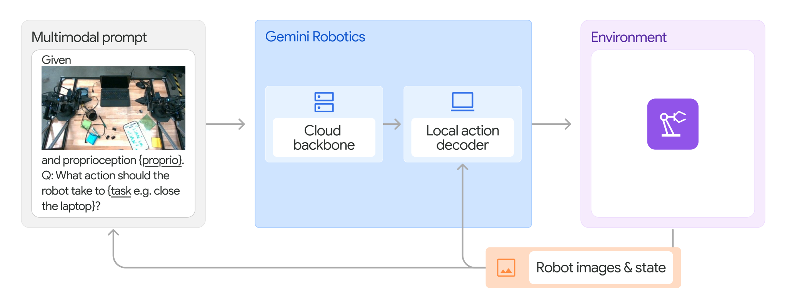
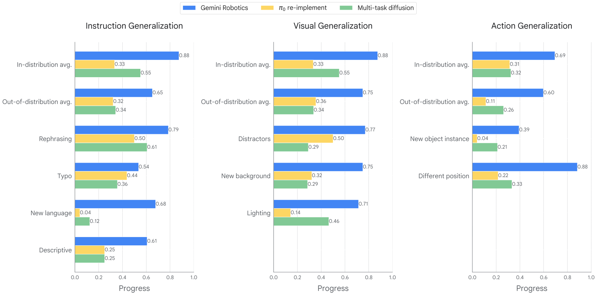
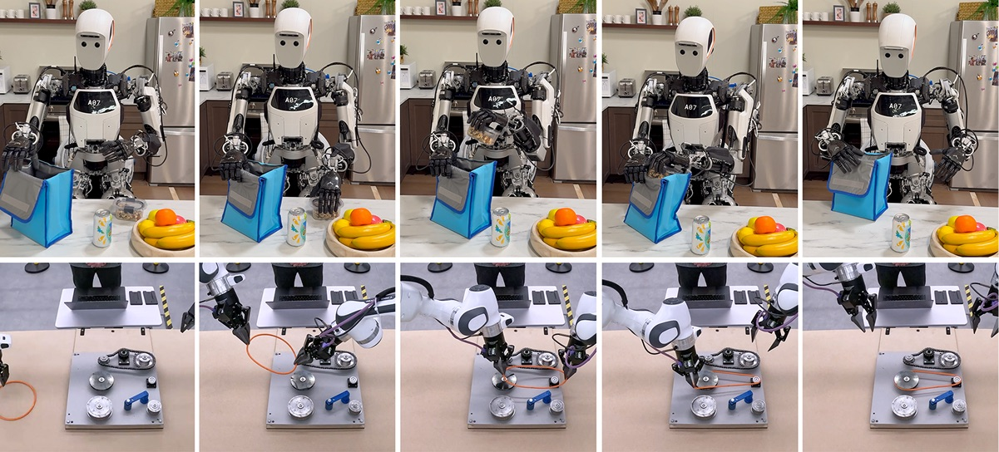

# Gemini Robotics

**Gemini Robotics** è una famiglia di modelli costruita a partire da Gemini 2.0 per collegare comprensione multimodale, ragionamento sul mondo fisico e controllo robotico. Il relativo [technical report](https://arxiv.org/abs/2503.20020) presenta due sistemi distinti ma complementari: **Gemini Robotics-ER**, un Vision-Language Model specializzato nell'*embodied reasoning*, e **Gemini Robotics**, un Vision-Language-Action model che produce direttamente action chunk.

La distinzione è essenziale. Gemini Robotics-ER può localizzare oggetti, stimare affordance, proporre grasp, traiettorie o codice di controllo, ma non è di per sé la policy low-level usata nei principali esperimenti di destrezza. Gemini Robotics trasforma invece immagini, stato propriocettivo e istruzione linguistica $l$ in comandi eseguibili, mantenendo parte della conoscenza e delle capacità di generalizzazione del modello ER.

## Embodied reasoning

Il paper definisce **embodied reasoning** come la capacità di collegare concetti, oggetti e relazioni spaziali a un mondo nel quale un agente deve agire. Non basta riconoscere una tazza: il modello deve capire dove afferrarla, se sia raggiungibile, come si relazioni agli altri oggetti e quale traiettoria possa realizzare l'obiettivo.

Gemini Robotics-ER estende Gemini 2.0 lungo più assi: object detection e pointing open-vocabulary, localizzazione di parti e spazi liberi, predizione di grasp top-down, traiettorie 2D, corrispondenza tra viste e bounding box 3D. Le coordinate vengono emesse come testo strutturato, rendendo il VLM utilizzabile da moduli robotici esterni.

Per valutare queste capacità il lavoro introduce **ERQA**, un benchmark aperto di 400 domande visuali a scelta multipla. Il 28% degli esempi contiene più immagini e le categorie comprendono ragionamento spaziale, traiettorie, azioni, stima dello stato, pointing, comprensione multi-view e task reasoning. ERQA misura quindi composizione e grounding, non soltanto riconoscimento visuale atomico.

## Dal reasoning al controllo

Il report studia tre modi diversi di trasformare il ragionamento in azione. Nel primo, Gemini Robotics-ER genera codice che chiama API di percezione e movimento; un loop osserva l'esito e consente re-planning. Nel secondo, alcune traiettorie teleoperate vengono inserite nel prompt come esempi e il modello predice pose dell'end-effector tramite **in-context learning**. Nel terzo, Gemini Robotics viene fine-tuned end-to-end su robot action data e produce direttamente action chunk.

I primi due esperimenti servono a mostrare la trasferibilità delle rappresentazioni del VLM, ma introducono passaggi intermedi e non raggiungono la precisione necessaria per tutti i task ad alta destrezza. Su ALOHA 2 reale, per esempio, Gemini Robotics-ER in zero-shot non completa il folding di un vestito; con dieci dimostrazioni in-context migliora, ma resta una pipeline differente dal VLA addestrato sulle azioni.

## Architettura di Gemini Robotics

La policy può essere rappresentata in forma generale come:

$$
A_t\sim\pi_\theta(\cdot\mid o_t,q_t,l)
$$

$o_t$ indica le immagini correnti, $q_t$ lo stato propriocettivo, $l$ l'istruzione e $A_t=[a_t,\ldots,a_{t+H-1}]$ il chunk di azioni future. Il report non pubblica la dimensionalità precisa del backbone, la parametrizzazione completa del decoder né la loss usata per gli action chunk; descrive invece l'organizzazione del sistema e le latenze misurate.

*Il prompt multimodale viene elaborato dal backbone in cloud; il decoder locale usa anche immagini e stato aggiornati per produrre gli action chunk. Fonte: paper “Gemini Robotics: Bringing AI into the Physical World”, Figura 14.*

Il **Gemini Robotics backbone** è una versione distillata di Gemini Robotics-ER ed è ospitato nel cloud. La latenza query-to-response viene ridotta da secondi a meno di 160 ms. Sul computer del robot opera un **local action decoder**, che compensa la latenza del backbone e incorpora il feedback percettivo più recente.

La latenza end-to-end dichiarata, dall'osservazione grezza al chunk low-level, è circa **250 ms**. Poiché ogni inferenza genera più comandi, la policy raggiunge una frequenza di controllo effettiva di **50 Hz**. Il chunking non significa che il backbone cloud venga interrogato 50 volte al secondo: il decoder locale e l'esecuzione temporale del chunk colmano l'intervallo tra aggiornamenti più costosi.

Questa separazione combina un modello semantico grande con un loop motorio rapido, ma crea una dipendenza infrastrutturale. Connessione, latenza variabile e disponibilità del servizio diventano parte del sistema di controllo e devono essere considerate separatamente dalla frequenza nominale degli attuatori.

## Dati e robot principale

Il robot principale è **ALOHA 2**, una piattaforma bimanuale a basso costo derivata da ALOHA. Google DeepMind raccoglie per dodici mesi **migliaia di ore di dimostrazioni reali teleoperate**, distribuite su migliaia di task con oggetti, orizzonti e requisiti di destrezza differenti.

Il report non fornisce il numero esatto di episodi o ore, né una lista completa dei dataset robotici. La formulazione “migliaia” comunica la scala ma impedisce di ricostruire il mixture con precisione. Alle azioni vengono affiancati documenti web, codice, immagini, audio, video, esempi di embodied reasoning e visual question answering.

Questi dati non-action preservano conoscenza semantica e capacità linguistiche che una policy addestrata esclusivamente sulle dimostrazioni potrebbe perdere. Il confronto sperimentale usa una reimplementazione di $\pi_0$ e una multi-task Diffusion Policy addestrate sulla stessa composizione di robot data, cercando di separare il contributo del backbone da quello del corpus motorio.

## Manipolazione generalista out of the box

La prima valutazione seleziona 20 task brevi dal corpus e non applica fine-tuning specifico. Gli ambienti includono lavanderia, cucina, scrivania in clutter e oggetti articolati; le azioni spaziano dal pick-and-place alla manipolazione bimanuale di cavi, tessuti e contenitori.

Gemini Robotics supera l'80% di successo in metà dei task e risulta l'unico modello con successo non nullo in alcune condizioni difficili, come aprire una cartellina, inserire un blocco o avvolgere un cavo attorno alle cuffie. Altri task, come inserire un laccio, restano difficili anche per il modello generalista e motivano una successiva specializzazione.

Una seconda valutazione usa 25 istruzioni in cinque scene, includendo oggetti e ricettacoli non osservati. I prompt richiedono di distinguere attributi, relazioni spaziali e parti di un contenitore. Il risultato mostra che un backbone linguistico forte migliora la steerability, ma non consente di dedurre quale quota del vantaggio dipenda da architettura, dati web o processo di distillazione.

## Generalizzazione visuale, linguistica e motoria

Il benchmark di generalizzazione comprende **85 task**. Il 20% è in-distribution, il 28% introduce variazioni visive, il 28% varia l'istruzione e il 24% richiede action generalization. La metrica principale è un *progress score* continuo, affiancato dal success rate in appendice.

La **visual generalization** modifica background, illuminazione, texture o distrattori senza cambiare l'azione corretta. La **instruction generalization** usa parafrasi, errori di battitura, livelli di dettaglio differenti e lingue nuove. La **action generalization** varia pose iniziali e istanze fisiche, richiedendo di adattare una traiettoria nota a geometrie diverse.

*Progress score sulle tre famiglie di distribution shift e sulle condizioni in-distribution. Fonte: paper “Gemini Robotics: Bringing AI into the Physical World”, Figura 21.*

Gemini Robotics supera le due baseline in tutte le categorie e mantiene prestazioni non nulle in condizioni nelle quali esse falliscono, come istruzioni in una lingua nuova. Il risultato supporta il trasferimento della conoscenza vision-language, ma il benchmark rimane costruito attorno a task e hardware vicini al training ALOHA 2; non misura deployment aperto su ambienti arbitrari.

## Specializzazione per task lunghi e ad alta destrezza

Il generalista viene specializzato su sei task: costruire una testa di volpe origami, preparare un lunch-box, comporre parole con tessere, giocare a carte, usare pinze per aggiungere taccole a un'insalata e versare frutta secca con un cucchiaio. Ogni task riceve **2,000–5,000 dimostrazioni di alta qualità**.

La specializzazione raggiunge in media il **79% di successo**. Il lunch-box, un task di oltre due minuti con inserimento del pane, zip, contenitori e coordinazione bimanuale, raggiunge il 100% nei 20 trial riportati. Nel gioco ortografico il modello riconosce anche quattro dei sei disegni a mano non presenti nel fine-tuning.

Il successo specialistico non va interpretato come una capacità già presente out of the box. Le migliaia di dimostrazioni per task sono consistenti, e un errore iniziale nell'origami può rendere irrecuperabile l'intero episodio. L'esperimento mostra soprattutto che il checkpoint generalista costituisce un'inizializzazione efficace: la stessa architettura addestrata da zero sui soli dati specialistici ottiene 0% sui sei task.

## Adattamento con poche dimostrazioni

Su otto subtask brevi derivati dalle attività precedenti, il fine-tuning con al massimo **100 dimostrazioni** supera il 70% di successo in sette casi e raggiunge il 100% in due. A seconda della durata del task, 100 dimostrazioni corrispondono a circa 15 minuti–1 ora di raccolta.

Le baseline rimangono competitive sui movimenti più semplici, mentre il vantaggio di Gemini Robotics cresce su task che combinano precisione, semantica e interazioni articolate. Il regime è quindi *few-shot* rispetto al fine-tuning robotico, non zero-shot: ogni nuovo comportamento riceve azioni target sull'embodiment di destinazione.

## Reasoning-enhanced action prediction

Una variante del VLA viene addestrata su dati d'azione riannotati per avvicinare il controllo alle capacità di Gemini Robotics-ER. Le supervisioni intermedie comprendono traiettorie visuali dei keypoint e ragionamento su proprietà, affordance e relazioni spaziali.

Questa variante migliora task out-of-distribution nei quali l'istruzione indica l'oggetto indirettamente, per esempio attraverso colore, dimensione o conoscenza culturale. Le tracce intermedie rendono più leggibile il processo, ma non costituiscono una prova che ogni token del ragionamento sia causalmente necessario o fedele al calcolo interno del modello.

## Adattamento a nuovi embodiment

Sebbene il pre-training delle azioni sia centrato su ALOHA 2, il modello viene fine-tuned su due piattaforme nuove: un **Franka bimanuale con gripper paralleli** e **Apollo di Apptronik**, un umanoide full-size con mani a cinque dita.

*Apollo prepara un lunch bag e il sistema Franka bimanuale assembla una cinghia su pulegge. Fonte: paper “Gemini Robotics: Bringing AI into the Physical World”, Figura 27.*

Sul Franka bimanuale la policy adattata ottiene in media il **63% di successo** sui task in-distribution e supera una Diffusion Policy single-task quando vengono introdotte perturbazioni visuali o motorie. Per Apollo il report mostra task di manipolazione, ma non presenta una valutazione altrettanto ampia e non dimostra locomozione o whole-body control.

Il trasferimento richiede dati e fine-tuning sull'hardware target. È quindi **cross-embodiment adaptation**, non controllo zero-shot di un robot nuovo. Gli autori indicano esplicitamente lo zero-shot cross-embodiment come obiettivo futuro.

## Sicurezza semantica e fisica

Il report distingue la sicurezza semantica dai vincoli fisici. Gemini Robotics-ER viene post-trained su scenari nei quali il modello deve riconoscere richieste pericolose, come collocare materiali infiammabili su una superficie calda o passare un oggetto in modo rischioso. I dataset ASIMOV valutano domande testuali e visuali derivate anche da incidenti reali.

Questa capacità non sostituisce collision avoidance, workspace limits, controllo di forza o arresti di emergenza. Il paper afferma che il VLA deve essere integrato con controller low-level safety-critical adeguati all'hardware. La conoscenza semantica può rifiutare un obiettivo improprio; soltanto lo stack fisico può imporre in modo deterministico limiti su velocità, coppie e contatti.

## Novelty

Gemini Robotics collega un **frontier VLM con embodied reasoning** a un controller bimanuale ad alta destrezza, mostrando trasferimento di open-vocabulary understanding, relazioni spaziali e conoscenza web verso azioni reali. Il contributo riguarda una famiglia coerente: ER per percezione e planning, VLA per il controllo diretto e fine-tuning per task o embodiment.

L'architettura **cloud backbone più local action decoder** affronta esplicitamente il conflitto tra scala del modello e frequenza di controllo. Il backbone conserva capacità semantiche ampie; il decoder locale usa feedback aggiornato e action chunk per raggiungere 50 Hz nonostante una latenza end-to-end di circa 250 ms.

Il lavoro amplia inoltre la valutazione dei VLA lungo assi separati di generalizzazione visuale, linguistica e motoria, includendo manipolazione di deformabili, task bimanuali lunghi, adattamento rapido e trasferimento verso piattaforme dalla morfologia differente.

## Limiti

Il sistema è **proprietario**. Non sono pubblicati pesi, codice di training, dimensione del modello, parametrizzazione completa delle azioni, numero esatto di dimostrazioni del pre-training o composizione riproducibile del mixture. Questo rende difficile attribuire i guadagni alla sola architettura e impedisce una replica indipendente su scala comparabile.

L'inferenza principale dipende da un backbone in cloud. Le latenze riportate descrivono il setup degli autori e non garantiscono comportamento identico con rete congestionata o interrotta. Privacy delle immagini, disponibilità del servizio e gestione dei timeout diventano requisiti del deployment, soprattutto in ambienti domestici.

Le capacità generaliste rimangono concentrate sulla **manipolazione bimanuale tabletop**. I task più lunghi richiedono 2,000–5,000 episodi di specializzazione; i nuovi embodiment richiedono fine-tuning; per Apollo non vengono dimostrati locomozione, equilibrio dinamico o loco-manipulation autonoma.

Gemini Robotics-ER può ancora produrre punti e bounding box insufficientemente precisi e fatica a mantenere relazioni spaziali lungo video estesi. Gemini Robotics deve quindi migliorare l'integrazione tra ragionamento multi-step e controllo preciso, soprattutto quando entrambi devono generalizzare simultaneamente.

Infine, semantic safety e benchmark ASIMOV non offrono garanzie di sicurezza fisica. Il report stesso richiede controller e meccanismi classici a valle del VLA; l'interazione sicura con persone e ambienti non strutturati resta un problema di sistema, non una proprietà assicurata dal modello multimodale.
