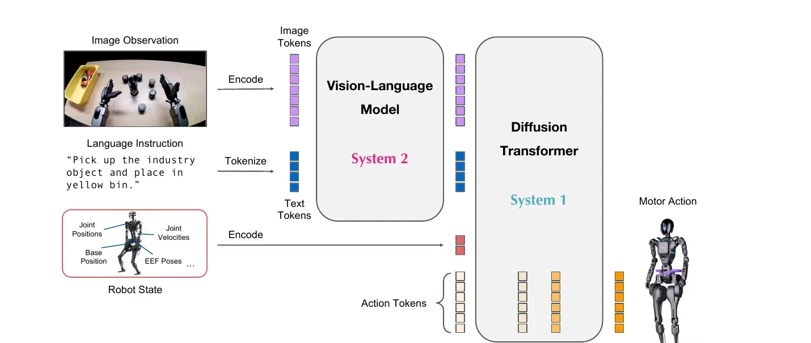
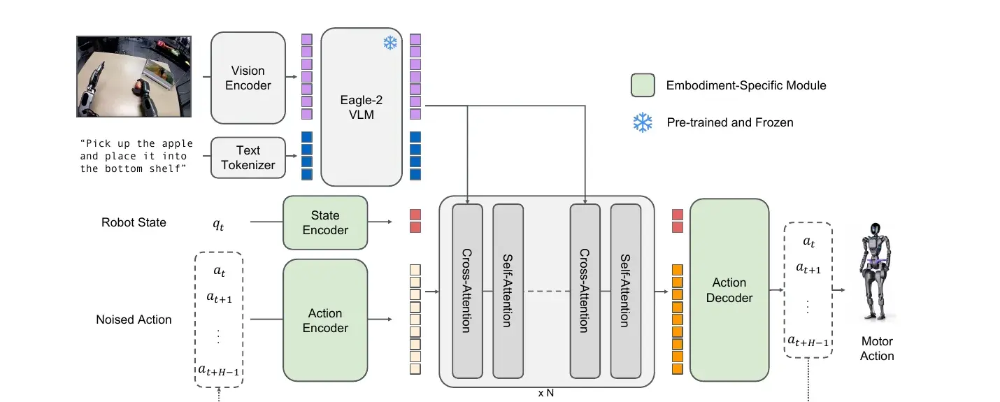
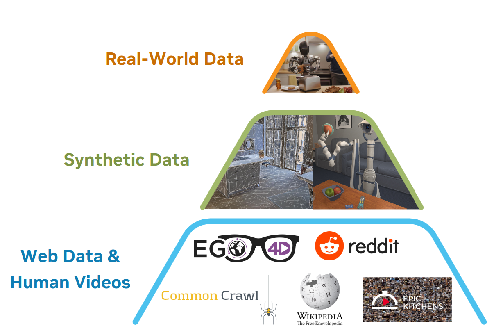

# GR00T N1

**GR00T N1** propone un VLA aperto orientato alla manipolazione generalista e, in particolare, agli embodiment umanoidi. Il problema di partenza è la scarsità dei dati: nessuna singola piattaforma dispone di una quantità di traiettorie paragonabile ai corpus web usati dai foundation model. GR00T N1 cerca quindi di apprendere da una **piramide di sorgenti** che comprende robot reali, simulazione, video umani e video robotici generati neuralmente.

Il pre-training non è focalizzato solo su umanoidi, ma include bracci singoli, sistemi bimanuali e piattaforme con mani destre.

**Moduli specifici per embodiment** traducono stati e azioni eterogenei in uno spazio condiviso. Il robot umanoide Fourier GR-1 costituisce però il principale target real-world e il banco di prova per coordinazione tra mani, oggetti articolati e attività industriali.

## Architettura dual-system

GR00T N1 separa semanticamente due funzioni:

- **System 2** interpreta osservazione e linguaggio attraverso un VLM
- **System 1** produce il movimento tramite un Diffusion Transformer addestrato con flow matching, condizionato da immagini, istruzione e stato del robot

I nomi richiamano la distinzione tra ragionamento deliberativo e risposta rapida, ma entrambi i blocchi sono Transformer strettamente connessi all'interno della stessa policy.

La variante pubblica **GR00T-N1-2B** contiene circa 2.2 miliardi di parametri, 1.34 miliardi dei quali appartengono al VLM. Su una GPU NVIDIA L40 in bf16, il paper riporta 63.9 ms per campionare un chunk di 16 azioni. Il VLM può aggiornare le rappresentazioni a una frequenza inferiore, mentre i chunk permettono al livello motorio di produrre comandi a frequenze più alte.

## Eagle-2 come System 2

Il backbone vision-language è **Eagle-2**, costruito con un language model **SmolLM2** e un encoder visuale **SigLIP-2**.

Ogni frame viene ridimensionato a $224\times224$ pixel; un pixel shuffle riduce la rappresentazione a **64 token visuali per immagine**. Questi token vengono elaborati insieme ai token dell'istruzione $l$ nel formato conversazionale usato durante il pre-training multimodale.

**GR00T N1 non usa l'ultimo layer del language model** come feature per la policy. Gli esperimenti degli autori indicano che **una rappresentazione intermedia migliora sia velocità sia successo**; nel checkpoint 2B vengono estratte le feature del dodicesimo layer. L'interpretazione è che **gli strati finali siano più specializzati verso l'output linguistico**, mentre un livello intermedio conservi segnali visuali e semantici più adatti al controllo.

Durante entrambe le fasi di training, il **language model rimane frozen**. Nella configurazione standard sono invece **trainable l'encoder visuale e i moduli della policy**; la variante compute-constrained può congelare anche la visione, come precisato nella sezione dedicata al training.

Questa scelta riduce il rischio di perdere completamente la conoscenza linguistica, ma limita quanto il language model possa adattarsi alle particolarità della semantica robotica.

## System 1 e moduli specifici per embodiment

Lo stato propriocettivo $q_t$, che può comprendere configurazioni articolari, pose e altre variabili dipendenti dall'embodiment, viene proiettato da un **MLP specifico dell'embodiment**.

Un secondo encoder riceve il chunk di azioni rumorose e il timestep del processo generativo. Il Diffusion Transformer alterna self-attention sui token di stato e azione e cross-attention verso le feature vision-language.

L'output è

$$
A_t=[a_t,a_{t+1},\ldots,a_{t+H-1}],
$$

con $H=16$.

Dopo l'ultimo blocco DiT, un **action decoder specifico dell'embodiment** riporta i token condivisi nella dimensionalità e convenzione del robot corrente.

Questa interfaccia è più flessibile del solo padding: permette a ogni piattaforma di possedere proiezioni dedicate pur condividendo la maggior parte del modello.

La specializzazione ha un costo: **aggiungere un embodiment richiede definire e addestrare encoder e decoder ad hoc**.

GR00T N1 non controlla quindi automaticamente un nuovo robot soltanto perché il numero di gradi di libertà è simile.

*Encoder e decoder verdi dipendono dall'embodiment; il DiT e le feature Eagle-2 costituiscono la parte ampiamente condivisa.*

## Flow matching e inferenza

Dato un chunk dimostrato $A_t$, si campionano $\epsilon\sim\mathcal{N}(0,I)$ e $\tau\in[0,1]$, quindi si interpola

$$
A_t^{\tau}=(1-\tau)\epsilon+\tau A_t.
$$

Il DiT $V_\psi$ riceve $A_t^{\tau}$, lo stato del robot e le feature multimodali $\varphi_t$ e apprende il campo che conduce dal rumore ai comandi:

$$
\mathcal{L}_{\mathrm{FM}}(\psi)
=
\mathbb{E}
\left[
\left\|V_\psi(\varphi_t,A_t^{\tau},q_t)
-(A_t-\epsilon)\right\|_2^2
\right].
$$

Come per $\pi_0$, il segno può essere espresso in modo opposto scegliendo la convenzione temporale inversa. Ciò che conta è l'apprendimento di un campo coerente con la direzione usata nell'integrazione.

In inferenza il paper usa **quattro passi di denoising** con Eulero. Il numero è inferiore ai dieci passi di $\pi_0$ e contribuisce alla latenza ridotta. La comparazione diretta non è però controllata: cambiano backbone, orizzonte, dati, action space e hardware di misura.

## La piramide dei dati

La strategia organizza le fonti in base a scala e specificità. Alla base si trovano web data e video umani, numerosi ma privi di comandi robotici. Il livello intermedio contiene traiettorie simulate e video generati neuralmente. Al vertice stanno le dimostrazioni su robot reale, più costose ma direttamente allineate all'embodiment target.

Le statistiche complessive riportano circa **3,288.8 ore di robot data**, **2,517.0 ore di video umani**, **1,742.6 ore simulate** e **827.3 ore di neural trajectories**. Queste categorie non hanno la stessa qualità né lo stesso tipo di supervisione: il loro valore non può essere valutato sommando semplicemente le ore.

### Dati robotici reali

Il dataset interno GR-1 contiene 88.4 ore di teleoperazione a 20 Hz, con immagini egocentriche, propriocezione e azioni. VIVE Ultimate Tracker e Xsens Metagloves catturano polsi e dita dell'operatore; il moto viene retargetizzato tramite inverse kinematics. Le annotazioni distinguono azioni atomiche, come afferrare e spostare, da descrizioni coarse-grained del task.

Il mixture include inoltre subset di **Open X-Embodiment** — RT-1, BridgeData V2, Language Table, DROID, MUTEX, RoboSet e Plex — insieme a RH20T e ad **AgiBot-Alpha**. Per quest'ultimo erano disponibili 140,000 traiettorie provenienti da una raccolta su cento robot al momento dell'avvio del training.

### Traiettorie simulate

DexMimicGen trasforma poche dimostrazioni in molte varianti object-centric. I segmenti vengono riallineati alle nuove pose, concatenati e conservati soltanto se soddisfano il criterio di successo. Per il pre-training GR-1 vengono generate 10,000 dimostrazioni per ciascuna di 54 coppie tra categoria sorgente e ricettacolo target, per un totale di **540,000 traiettorie**.

Considerando anche i dati di post-training, il sistema produce circa **780,000 traiettorie simulate**, equivalenti secondo il paper a 6,500 ore, in undici ore di generazione parallela. Questa velocità non elimina il sim-to-real gap: controller, contatti e distribuzione degli oggetti restano determinati dal simulatore.

### Video umani e latent action

Le sorgenti umane sono Ego4D, Ego-Exo4D, Assembly-101, EPIC-KITCHENS, HOI4D, HoloAssist e RH20T-Human. Questi video mostrano affordance, uso di strumenti e procedure naturali, ma non contengono direttamente l'azione robotica $a_t$.

GR00T N1 apprende perciò un codebook di **latent action** tramite VQ-VAE.

L'encoder osserva un frame corrente $x_t$ e uno futuro $x_{t+H}$ e produce un codice $z_t$

Il decoder deve ricostruire il futuro a partire da $x_t$ e $z_t$. L'embedding continuo prima della quantizzazione viene poi trattato come pseudo-azione e addestrato con la stessa loss flow-matching, sotto un embodiment virtuale separato chiamato LAPA.

Lo spazio latente permette di associare movimenti qualitativamente simili tra mani umane e robot differenti, per esempio spostare il braccio destro verso sinistra. Non garantisce però che il codice sia un comando fisicamente eseguibile su uno specifico robot: fornisce soprattutto supervisione rappresentazionale.

### Neural trajectories e inverse dynamics

Modelli image-to-video vengono fine-tuned sulle 88.4 ore di teleoperazione interna e generano scenari controfattuali a partire dallo stesso frame iniziale e da nuovi prompt. Dopo filtraggio e ricaptioning tramite un multimodal LLM, la raccolta arriva a circa **827.3 ore**, quasi dieci volte i dati originali.

Le azioni mancanti vengono etichettate in due modi. Il primo riusa le latent action; il secondo applica un **inverse dynamics model** addestrato sulle traiettorie robotiche reali per stimare pseudo-azioni nello spazio dell'embodiment. L'IDM diventa più accurato quando cresce il dataset reale, mentre le latent action risultano utilizzabili anche con supervisione più scarsa.

La scala video ha un costo elevato: il paper riporta circa 105,000 ore GPU L40 per la generazione, eseguite in parallelo su 3,600 GPU. Inoltre, un video visivamente plausibile può violare dinamica, contatti o istruzione; per questo la pipeline include filtri ma non può garantire correttezza fisica completa.

## Pre-training e post-training

### Pre-training generalista

Nel **pre-training** vengono ottimizzati congiuntamente il **vision encoder SigLIP-2**, il **Diffusion Transformer**, gli state e action encoder specifici per embodiment e gli action decoder. Rimane invece **frozen la componente linguistica di Eagle-2**, derivata da SmolLM2. La scelta sostanziale è non aggiornare i pesi del language model, preservando le rappresentazioni linguistiche acquisite nel pre-training vision-language.

Il corpus contiene **592.9 milioni di frame**, equivalenti a **8,375.7 ore**: 262.3 milioni di frame e 3,288.8 ore di robot reali, 181.3 milioni e 2,517.0 ore di video umani, 125.5 milioni e 1,742.6 ore di simulazione, più 23.8 milioni e 827.3 ore di neural trajectories. Il paper dichiara che i minibatch vengono campionati dal mixture eterogeneo, ma **non pubblica un rapporto di campionamento per sorgente**; le percentuali ricavate dalle ore non devono quindi essere interpretate come pesi effettivi di training.

Il target dipende dalla sorgente. Le traiettorie robotiche reali e simulate forniscono **azioni ground truth** e possono fornire anche latent action. I video umani, privi di comandi robotici, vengono supervisionati mediante le sole **latent action** apprese dal VQ-VAE. Le neural trajectories usano sia latent action sia pseudo-azioni prodotte da un **inverse dynamics model** addestrato sui dati robotici reali. Gli output appartengono a interfacce differenti e sono separati mediante moduli specifici per embodiment, pur condividendo VLM e DiT.

GR00T-N1-2B viene pre-addestrato per **200,000 gradient step** con batch globale **16,384**. Il training usa fino a 1,024 GPU H100 e richiede circa 50,000 ore GPU H100. Questi valori descrivono l'ottimizzazione della policy; le 105,000 ore GPU L40 impiegate per generare i video sintetici costituiscono un costo separato della pipeline dei dati.

### Post-training per embodiment e task

Nel **post-training** il checkpoint viene specializzato separatamente per ciascun embodiment. Come nel pre-training, il **language model rimane frozen**; nella configurazione standard sono invece **trainable vision encoder, DiT, state encoder, action encoder e action decoder** dell'embodiment target. Il paper riporta 20,000–60,000 gradient step e batch globale 128 oppure 1,024: il valore predefinito negli esperimenti è 60,000 step con batch 1,024, mentre DexMimicGen Cross-Embodiment usa batch 128 per la minore quantità di dati.

Esiste anche una configurazione compute-constrained su una singola A6000. In questo caso si può congelare il vision encoder e aggiornare soltanto **DiT e adapter robotici** — state encoder, action encoder e action decoder — raggiungendo batch fino a 200. Se viene aggiornato anche il vision encoder, sulla stessa GPU il batch massimo riportato scende a 16. Non si tratta della configurazione standard dei risultati principali, ma di un'opzione per rendere l'adattamento più accessibile.

Nei benchmark simulati vengono usati **30, 100 o 300 dimostrazioni per task**. Le suite comprendono 24 task RoboCasa, nove task DexMimicGen e 24 task GR-1 Tabletop; i corrispondenti subset contengono quindi rispettivamente 720/2,400/7,200, 270/900/2,700 e 720/2,400/7,200 dimostrazioni. Per i 13 task reali sul GR-1, gli operatori raccolgono da 15 minuti a 3 ore di teleoperazione per task; gli esperimenti confrontano il **10% del dataset disponibile** con il dataset completo, dopo aver filtrato le traiettorie di bassa qualità.

Quando vengono aggiunte neural trajectories, esempi reali o simulati e video generati vengono campionati con rapporto **1:1 in ogni batch**, indipendentemente dalla dimensione assoluta dei due pool. RoboCasa usa 3,000 neural trajectories per task, cioè 72,000 sui 24 task; gli otto task real-world inclusi nell'ablation ne usano 100 ciascuno, per un totale di 800. In quest'ultimo caso le pseudo-azioni sono etichettate dall'IDM; in RoboCasa vengono confrontate etichette IDM e latent action.

Per evitare leakage di supervisione nel regime low-data, il video generator real-world e l'IDM vengono fine-tuned usando soltanto il medesimo **10% di traiettorie reali** disponibile alla policy. La quantità di video non sostituisce quindi l'informazione delle dimostrazioni complete. Il bilanciamento 1:1 aumenta la diversità, ma assegna alle pseudo-label sintetiche metà degli update e può trasferire alla policy errori del generatore o dell'inverse dynamics model.

## Valutazione in simulazione

La valutazione usa tre suite complementari. **RoboCasa** comprende 24 task atomici in cucine simulate con Franka, tre camere e azioni relative dell'end-effector. **DexMimicGen Cross-Embodiment** contiene nove task bimanuali distribuiti tra Panda con gripper, Panda con mani destre e GR-1. La suite **GR-1 Tabletop** aggiunge 24 task con mani Fourier, distrattori, ricettacoli nuovi e oggetti articolati.

Per ciascun benchmark, GR00T N1 viene post-trained con 30, 100 o 300 dimostrazioni per task e confrontato con BC-Transformer e Diffusion Policy addestrati da zero. Con 100 dimostrazioni, i success rate medi sono 32.1% su RoboCasa, 66.5% su DexMimicGen e 50.0% su GR-1, per una media del **45.0%**. Diffusion Policy raggiunge rispettivamente 25.6%, 56.1% e 32.7%, con media 33.4%.

Il vantaggio è maggiore nella suite GR-1, più vicina ai dati e al target umanoide del modello. Questo supporta l'efficacia del pre-training, ma segnala anche che il risultato medio non è embodiment-neutral. Il protocollo seleziona inoltre il massimo successo tra gli ultimi cinque checkpoint, una scelta da mantenere identica quando si confrontano nuove policy.

## Valutazione sul Fourier GR-1

I task reali sono divisi in pick-and-place, manipolazione di contenitori articolati, workflow industriali e coordinazione tra due agenti. Comprendono passaggi mano-mano, collocamento in cassetti o armadi, versamento di piccoli componenti, imballaggio di parti e handover verso un secondo robot.

Il checkpoint pre-addestrato, senza post-training sul task, ottiene il 76.6% nel passaggio coordinato sinistra-destra con collocamento su uno scaffale e il 73.3% nel trasferimento di oggetti nuovi verso un contenitore non visto, usando cinque oggetti e tre trial per oggetto con credito parziale.

Dopo post-training, GR00T-N1-2B raggiunge in media **42.6% usando il 10% dei dati** e 76.8% con il dataset completo. Diffusion Policy raggiunge 10.2% e 46.4%. Il modello GR00T con il 10% rimane soltanto 3.8 punti sotto Diffusion Policy con tutti i dati, evidenziando il valore dell'inizializzazione nel regime data-limited.

Le neural trajectories aggiungono in media 5.8 punti sui task reali studiati. Il risultato è promettente ma preliminare: riguarda subset specifici e usa pseudo-azioni prodotte da un IDM addestrato sullo stesso regime di dati reali.

## Interferenza durante l'adattamento

Un'osservazione qualitativa mostra che il checkpoint pre-addestrato può eseguire un handover spontaneo quando una mela è fuori dalla portata della mano destra. Dopo post-training su dimostrazioni che usano esclusivamente la mano destra, la stessa strategia può scomparire.

Questo caso evidenzia il rischio di **catastrophic forgetting o specialization-induced forgetting**. Il post-training aumenta fluidità e successo sulla distribuzione target, ma può restringere il repertorio di strategie. Valutare soltanto i task di fine-tuning non permette di osservare questa regressione; servono test pre- e post-adaptation sulle capacità generaliste.

## Novelty

GR00T N1 combina in una release pubblica una architettura dual-system, action chunk flow-matching e moduli specifici per embodiment. Il design condivide percezione, semantica e dinamica astratta, mantenendo piccoli adattatori per stati e comandi incompatibili.

La **data pyramid** è il contributo più caratteristico. Video umani, simulazione, generazione video e robot reale non vengono semplicemente concatenati: latent action e inverse dynamics producono forme differenti di supervisione, ciascuna associata a un embodiment esplicito.

Il lavoro documenta inoltre un percorso completo dal pre-training su larga scala al fine-tuning su un singolo robot, con benchmark riproducibili in simulazione, checkpoint aperto e deployment sul GR-1.

## Limiti

Il modello affronta soprattutto **manipolazione tabletop short-horizon**. Non dimostra locomozione umanoide generale, equilibrio dinamico o loco-manipulation lunga, nonostante il posizionamento come foundation model per humanoid robots.

Le sorgenti sintetiche non sono equivalenti a esperienza fisica. I video generati possono produrre contatti impossibili e le pseudo-azioni possono essere ambigue; la pipeline di filtering riduce ma non elimina il problema. La generazione richiede inoltre una quantità molto elevata di calcolo.

Il pre-training di GR00T-N1-2B usa fino a 1,024 GPU e circa **50,000 ore GPU H100**. La release del checkpoint migliora l'accessibilità dell'inferenza e del fine-tuning, ma replicare da zero dati e training rimane fuori portata per molti laboratori.

Gli encoder e decoder per embodiment richiedono specifiche corrette e dati di adattamento. Il supporto cross-embodiment non equivale quindi a zero-shot deployment su hardware arbitrario. Le prestazioni reali sono misurate su un numero contenuto di trial e prevalentemente su GR-1, rendendo prudente qualsiasi generalizzazione ad altri umanoidi.

Infine, il post-training può cancellare strategie utili del checkpoint generalista. Sono necessari metodi di adaptation che conservino le capacità preesistenti e protocolli che misurino esplicitamente retention oltre al successo sul nuovo task.
