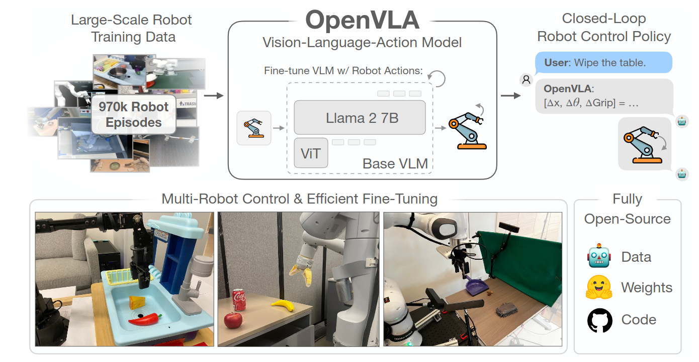

# OpenVLA

**OpenVLA** è un Vision-Language-Action model open-source da **7 miliardi** di parametri progettato per trasformare un VLM pre-addestrato in una policy robotica generalista.

Il modello riceve un'immagine dell'ambiente e un'istruzione linguistica $l$, quindi genera una sequenza di token che viene decodificata nell'azione continua $a_t$.

Il contributo va letto rispetto a RT-2. Entrambi sfruttano la conoscenza semantica di un Vision-Language Model e rappresentano le azioni nello spazio dei token linguistici. OpenVLA rende però disponibili pesi, codice PyTorch, configurazioni di training e strumenti di fine-tuning, con l'obiettivo di offrire una base riproducibile per nuovi robot e dataset.

## Dal VLM alla policy

Il backbone iniziale è **Prismatic-7B**, un VLM composto da tre blocchi:

$$
\text{visual encoder}
\rightarrow
\text{projector}
\rightarrow
\text{Llama 2 7B}.
$$

L'encoder visivo trasforma l'immagine $o_t$ in patch embedding.

Il projector porta queste feature nella stessa dimensione degli embedding testuali di Llama, permettendo al language model di elaborare congiuntamente immagine e istruzione.

Durante il robot pre-training, il target non è una risposta testuale ma la sequenza di token corrispondente all'azione dimostrata.

La formulazione rimane:

$$
\pi_\theta(a_t\mid o_t,l),
$$

dove $\theta$ indica i parametri fine-tuned del VLA. La versione originaria usa una singola immagine per query e predice un solo step di controllo, che viene poi eseguito in closed loop acquisendo una nuova osservazione.

### Fused visual encoder

Prismatic combina due Vision Transformer pre-addestrati: **DINOv2** e **SigLIP**.

DINOv2, appreso con supervisione visuale self-supervised, fornisce feature utili per struttura, corrispondenze e geometria della scena. SigLIP è invece addestrato su coppie immagine-testo e privilegia l'allineamento semantico tra contenuto visuale e linguaggio.

Le **feature dei due encoder vengono fuse prima del projector**.

L'intuizione è che il **controllo robotico richieda entrambe le proprietà**: **distinguere semanticamente l'oggetto** indicato da $l$ e **conservare dettagli spaziali** sufficienti per raggiungerlo e manipolarlo. Le ablation del lavoro mostrano che la scelta del visual backbone contribuisce in modo sostanziale alle prestazioni.

Il visual encoder non determina comunque da solo l'azione. Le patch proiettate vengono elaborate dal backbone Llama insieme ai token linguistici, così che la rappresentazione finale dipenda dall'istruzione corrente.

### Action tokenization

OpenVLA usa un action space canonico a sette componenti:

$$
a_t=
(\Delta x_t,\Delta y_t,\Delta z_t,
\Delta\phi_t,\Delta\theta_t,\Delta\psi_t,g_t),
$$

dove $\Delta x_t$, $\Delta y_t$ e $\Delta z_t$ descrivono la traslazione dell'end-effector; $\Delta\phi_t$, $\Delta\theta_t$ e $\Delta\psi_t$ ne descrivono la rotazione; $g_t$ controlla il gripper.

Le distribuzioni delle azioni cambiano tra dataset. Per ridurre l'effetto degli outlier, ogni dimensione viene normalizzata usando il primo e il novantanovesimo percentile della relativa sorgente. L'intervallo risultante viene suddiviso uniformemente in **256 bin**. Ogni valore continuo viene così sostituito dall'indice del bin più vicino.

L'action tokenizer associa questi 256 indici ai token meno usati del vocabolario Llama. Indicando con $Q_d$ la quantizzazione della componente $d$, l'azione diventa

$$
\tau(a_t)=
(Q_1(a_t^{(1)}),\dots,Q_7(a_t^{(7)})),
$$

e il language model apprende a generare autoregressivamente i sette token. In inference, il processo viene invertito usando il centro dei bin e le statistiche di normalizzazione del dataset o dell'embodiment target.

Questa scelta evita di aggiungere un decoder continuo specializzato e conserva il normale obiettivo next-token. Introduce però errore di quantizzazione e richiede sette passaggi autoregressivi per produrre una singola azione completa.

## Dataset e training

OpenVLA viene addestrato su circa **970.000 traiettorie di manipolazione real-world** provenienti da Open X-Embodiment. Il mixture, denominato nella release *Open-X Magic Soup++*, amplia e ribilancia i dati utilizzati da precedenti policy open-source e comprende scene, task ed embodiment differenti.

Ogni esempio associa immagine, istruzione e azione normalizzata. L'obiettivo è la cross-entropy sui token di azione:

$$
\mathcal{L}_{\mathrm{action}}
=
-\sum_{d=1}^{7}
\log p_\theta\left(\tau(a_t^{(d)})
\mid o_t,l,\tau(a_t^{(<d)})\right),
$$

dove $\tau(a_t^{(<d)})$ rappresenta i token delle componenti già generate. Il training del modello originale richiede 15 giorni su 64 GPU A100, un costo che chiarisce la differenza tra pre-training generalista e successivo adattamento a un singolo setup.

A differenza di RT-2, OpenVLA viene fine-tuned sui dati robotici senza continuare contemporaneamente il co-training sui dataset vision-language web. Questa soluzione semplifica la pipeline ma può provocare **catastrophic forgetting** di parte delle conoscenze semantiche originarie.

## Valutazione cross-embodiment

La valutazione out-of-the-box usa due piattaforme già rappresentate nel mixture: il **WidowX** di BridgeData V2 e il **Google Robot** della linea RT. I task misurano generalizzazione visuale, nuove pose degli oggetti, variazioni fisiche e comprensione di istruzioni o concetti non identici a quelli del training.

OpenVLA viene confrontato con RT-1-X, Octo e RT-2-X su 29 task. Il modello migliora in media rispetto alle policy generaliste considerate, pur avendo circa sette volte meno parametri del RT-2-X da 55B. I rollout mostrano anche comportamenti di recovery, come correggere una presa inizialmente instabile, ma questi risultati non equivalgono a controllo zero-shot di un embodiment arbitrario: WidowX e Google Robot appartengono alla distribuzione aggregata di Open X-Embodiment.

Nei task che richiedono concetti Internet molto specifici, RT-2-X può rimanere superiore. La differenza è coerente con le strategie di training: RT-2 conserva dati vision-language durante il co-fine-tuning, mentre OpenVLA ottimizza il VLM soltanto sulle traiettorie robotiche.

## Adattamento a nuovi setup

Il lavoro studia il fine-tuning su un Franka Emika Panda in due configurazioni. **Franka-Tabletop** usa un braccio fisso controllato a 5 Hz; **Franka-DROID** riproduce il setup di raccolta DROID e opera a 15 Hz. Questi esperimenti confrontano OpenVLA con Octo fine-tuned e Diffusion Policy addestrata da zero.

Diffusion Policy può essere più efficace su task stretti, molto precisi e associati a una sola istruzione. OpenVLA risulta invece particolarmente utile quando il dataset target comprende più oggetti e comandi linguistici, perché il pre-training fornisce un prior semantico e visuomotorio più ampio. Questo confronto mostra che una policy generalista non domina necessariamente un modello specializzato in ogni regime.

L'ablation **OpenVLA Scratch** parte direttamente dal VLM Prismatic e lo adatta ai soli dati Franka, senza il passaggio sulle 970.000 traiettorie OXE. La prestazione inferiore rispetto al checkpoint completo mostra che il vantaggio non deriva soltanto dal VLM web-pretrained: il robot-data pretraining è una componente distinta e necessaria.

## Parameter-efficient fine-tuning

Aggiornare tutti i 7 miliardi di parametri richiede molta memoria. OpenVLA valuta pertanto strategie più economiche. Congelare completamente il visual encoder o addestrare soltanto l'ultimo layer riduce troppo la capacità di adattare percezione e controllo.

**Low-Rank Adaptation (LoRA)** inserisce invece matrici a rango ridotto nei layer del modello e aggiorna circa l'1,4% dei parametri. Nel protocollo studiato raggiunge prestazioni comparabili al full fine-tuning con un consumo di memoria molto inferiore. Il checkpoint può così essere adattato su hardware più accessibile, anche se raccolta dei dati, preprocessing e inferenza del modello da 7B restano costi rilevanti.

#### Limiti

La rappresentazione per-dimension e per-timestep non modella esplicitamente la struttura temporale del movimento.

**Quantizzazione e decoding autoregressivo limitano precisione e frequenza**, specialmente per controllo bimanuale o ad alta dimensionalità.

Il modello richiede inoltre risorse considerevoli e usa un backbone Llama 2 soggetto alla relativa licenza.

Il **fine-tuning solo robotico può erodere conoscenza web**, mentre il successo out-of-the-box è più solido sugli embodiment presenti in OXE che su robot completamente nuovi.

Infine, le prestazioni dipendono dalle statistiche usate per normalizzare e de-tokenizzare le azioni, che devono essere coerenti con il setup target.
