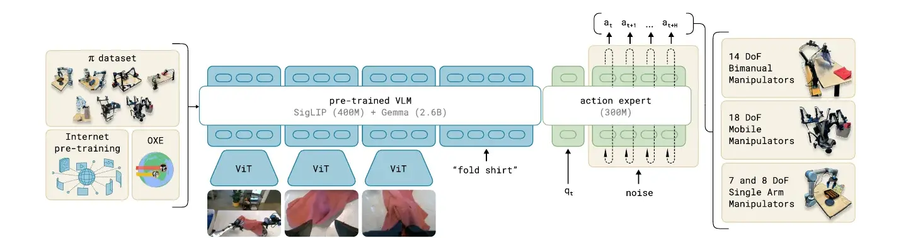
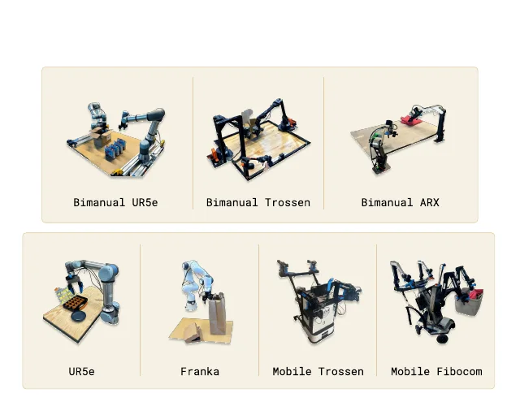

# Pi-0

**$\pi_0$** affronta un limite dei primi VLA autoregressivi: rappresentare ogni componente dell'azione come un token discreto semplifica il riuso di un language model, ma introduce quantizzazione, richiede più passaggi di decoding e si adatta con difficoltà al controllo destro ad alta frequenza. $\pi_0$ conserva la conoscenza semantica di un Vision-Language Model, ma delega la generazione motoria a un **action expert continuo addestrato tramite flow matching**.

Il modello non viene presentato soltanto come una nuova architettura. Il lavoro propone una ricetta da *robot foundation model* articolata in due fasi: un **pre-training cross-embodiment** su dati molto ampi e diversificati, seguito da un **post-training su dimostrazioni curate per acquisire esecuzioni più precise** e fluenti. Questa separazione è essenziale per interpretare i risultati: il checkpoint generalista fornisce capacità e recovery, mentre la specializzazione rimane necessaria per molti task complessi.

## Architettura generale

$\pi_0$ contiene circa **3.3 miliardi di parametri**. Il blocco principale deriva da **PaliGemma**, un VLM da 3 miliardi di parametri che combina un encoder visuale **SigLIP** da circa 400 milioni con un language model **Gemma** da 2.6 miliardi.

A questo backbone viene aggiunto un **action expert** da circa **300 milioni** di parametri, inizializzato **da zero** e **dedicato a stato propriocettivo e azioni**.

Il VLM elabora immagini e istruzione, mentre l'**action expert trasforma stato e rumore in un chunk continuo di azioni**. La stessa architettura viene usata con manipolatori singoli, bimanuali e mobili.

La separazione non rende i due moduli indipendenti. VLM e action expert appartengono allo stesso Transformer e vengono addestrati congiuntamente sui robot data.
Il design richiama una piccola mixture of experts: i token visivi e linguistici attraversano i pesi del VLM, mentre i token continui relativi a stato e azione usano i pesi robot-specifici dell'action expert.

L'attenzione permette comunque ai **token motori di condizionarsi sulle rappresentazioni prodotte dal backbone multimodale**.

## Input, output e action chunking

Al tempo $t$, l'osservazione $o_t$ può essere espressa come:

$$
o_t=\left(I_t^1,\ldots,I_t^n,l,q_t\right),
$$

dove $I_t^i$ è l'immagine della camera $i$, $l$ è l'istruzione linguistica e $q_t$ è il vettore propriocettivo del robot. A seconda dell'embodiment vengono usate due o tre immagini, tipicamente provenienti da camere fisse, montate sul polso o collocate sulla base.

L'output non è una singola azione $a_t$, ma un chunk:

$$
A_t=\left[a_t,a_{t+1},\ldots,a_{t+H-1}\right],
$$

con orizzonte $H=50$.

Predire congiuntamente cinquanta comandi riduce l'orizzonte decisionale effettivo del behavioral cloning e consente di rappresentare movimenti localmente coerenti.

Il controller può eseguire il chunk a frequenze **fino a 50 Hz** e richiamare periodicamente la policy con una nuova osservazione, combinando così pianificazione locale e controllo closed loop.

Un chunk lungo comporta però un trade-off: eseguirlo interamente riduce il costo di inferenza ma rende la policy meno reattiva; rigenerarlo frequentemente aumenta la capacità di recovery ma richiede più calcolo. Il paper documenta la generazione dei chunk, mentre i dettagli del receding horizon dipendono dal particolare deployment.

## Flow matching per azioni continue

L'action expert modella la distribuzione condizionata $p(A_t\mid o_t)$ *senza discretizzare* le coordinate.

Durante il training si campiona rumore gaussiano $\epsilon\sim\mathcal{N}(0,I)$ e si costruisce un punto intermedio $A_t^{\tau}$ tra rumore e traiettoria dimostrata:

$$
A_t^{\tau}=(1-\tau)\epsilon+\tau A_t
\qquad \tau\in[0,1]
$$

Il modello $v_\phi$ apprende il campo di velocità che, condizionato su $o_t$, trasporta $A_t^{\tau}$ verso la traiettoria pulita. Con la parametrizzazione noise-to-data, l'obiettivo può essere scritto come

$$
\mathcal{L}_{\mathrm{FM}}(\phi)
=
\mathbb{E}_{A_t,o_t,\epsilon,\tau}
\left[
\left\|v_\phi(A_t^{\tau},o_t)-(A_t-\epsilon)\right\|_2^2
\right],
$$

dove $\phi$ raccoglie i parametri aggiornati dalla loss robotica.

Il segno del target dipende dalla direzione con cui viene parametrizzato il tempo di flusso; il significato rimane quello di **apprendere una trasformazione continua tra distribuzione gaussiana e distribuzione delle azioni**.

In inferenza si parte da $A_t^0\sim\mathcal{N}(0,I)$ e si integra numericamente il campo mediante dieci passi di Eulero con passo $\delta=0{,}1$:

$$
A_t^{\tau+\delta}
=
A_t^{\tau}+\delta\,v_\phi(A_t^{\tau},o_t).
$$

Poiché immagini e linguaggio rimangono invariati durante i dieci passi, le **key e value del prefisso multimodale possono essere memorizzate in cache**.

A ogni iterazione si ricalcola principalmente la parte relativa alle azioni rumorose, riducendo il costo rispetto a dieci inferenze complete del VLM.

Il flow matching offre due vantaggi rispetto alla regressione deterministica. Può rappresentare una distribuzione multimodale, utile quando più strategie sono compatibili con la stessa scena, e mantiene la precisione delle azioni continue. Rispetto alla tokenizzazione per bin non introduce un errore di quantizzazione prefissato.

## Supporto cross-embodiment

Il dataset proprietario comprende **sette configurazioni robotiche**: UR5e, bimanual UR5e, Franka, bimanual Trossen, bimanual ARX/AgileX, mobile Trossen/ARX e mobile Fibocom. Sono presenti bracci a 6 e 7 DoF, setup bimanuali e basi mobili olonomiche o non olonomiche.

Gli spazi di stato e azione non hanno dimensionalità uniforme. $\pi_0$ usa come **interfaccia massima un vettore di 18 componenti**, sufficiente a rappresentare due bracci a 6 DoF, due gripper, base mobile e torso verticale. I robot con meno gradi di libertà vengono **zero-padded**; analogamente, gli slot delle camere mancanti vengono mascherati.

Questa soluzione permette di condividere quasi tutti i pesi senza fingere che gli action space siano semanticamente identici. Il padding uniforma la forma del tensore, ma non risolve da solo differenze di cinematica, frame di riferimento, frequenza o controller. Tali differenze devono essere assorbite dai dati e dalla codifica associata all'embodiment.

## Mixture di pre-training

Il pre-training combina dati open source e una grande raccolta interna. La componente pubblica include un subset di Open X-Embodiment, indicato come **OXE Magic Soup**, insieme a sorgenti quali BridgeData V2 e DROID. Questi dataset ampliano oggetti, scene e robot, ma operano spesso tra 2 e 10 Hz e contengono soprattutto skill di manipolazione relativamente brevi.

La raccolta proprietaria aggiunge **903 milioni di timestep**, di cui 106 milioni single-arm e 797 milioni dual-arm. Corrisponde a oltre 10.000 ore su sette configurazioni e 68 task. Il numero di task è volutamente conservativo: attività come *table bussing* comprendono molti oggetti, ricettacoli e sottocomportamenti che altri benchmark potrebbero contare come task separati.

Nel mixture effettivamente campionato, **solo circa il 9.1% degli esempi proviene dalle sorgenti open source**. Per evitare che le combinazioni robot-task più grandi dominino completamente, il peso di una combinazione con $n$ campioni è proporzionale a $n^{0{,}43}$. Il sottocampionamento relativo conserva il vantaggio dei dataset grandi, ma attenua lo squilibrio.

Le traiettorie possiedono annotazioni linguistiche a due granularità. Il nome del task descrive l'obiettivo complessivo, mentre le **segment annotation** etichettano finestre di circa due secondi con il *sottocomportamento* corrente. Queste etichette consentono sia di comandare direttamente skill brevi sia di fornire istruzioni intermedie durante procedure lunghe.

## Pre-training e post-training

Il **pre-training** mira a **massimizzare copertura e varietà**, anche accettando dimostrazioni meno uniformi. Questa diversità espone la policy a errori, configurazioni insolite e strategie differenti, favorendo **recovery e robustezza**. Il checkpoint risultante può eseguire diversi task direttamente, ma non è ottimizzato per la massima fluidità su uno specifico processo.

Il **post-training** usa invece un **dataset più piccolo e curato** per specializzare la policy. I task semplici possono richiedere circa cinque ore, mentre quelli più complessi superano cento ore. Le dimostrazioni devono **mostrare strategie coerenti e una qualità esecutiva elevata**, perché il loro ruolo non è ampliare la copertura ma insegnare come svolgere bene il task target.

Addestrare soltanto sui dati finali di alta qualità tende a produrre **policy fragili fuori dalle traiettorie ideali**; usare soltanto il checkpoint generalista può generare strategie poco fluide. Pre-training e post-training offrono rispettivamente capacità di adattamento e precisione operativa.

## Linguaggio e pianificazione gerarchica

$\pi_0$ può ricevere direttamente un **comando linguistico**, ma nei task lunghi viene anche collegato a un **VLM di alto livello**. Il planner osserva la scena e **traduce un goal ampio**, come riordinare il tavolo, **in istruzioni intermedie**, per esempio raccogliere un tovagliolo o collocare un piatto nel contenitore corretto.

Questa configurazione non implica che tutto il planning sia interno alla policy motoria. Essendo language-conditioned, l'**action expert esegue skill, conservando reattività locale**; il **VLM esterno sceglie la sequenza semantica**. Il risultato deve quindi essere attribuito al sistema gerarchico quando il task usa il planner, distinguendolo dall'esecuzione end-to-end condizionata soltanto dal comando globale.

## Adattamento a nuove skill

Il fine-tuning viene studiato su task con distanza crescente dal pre-training. Alcuni, come impilare ciotole o piegare asciugamani, riusano movimenti familiari; altri introducono oggetti o dinamiche nuove. In generale il checkpoint pre-addestrato apprende più rapidamente e raggiunge prestazioni superiori rispetto allo stesso design inizializzato da zero, con un vantaggio particolarmente evidente nei regimi con meno dimostrazioni.

I task finali comprendono folding di più indumenti, prelievo da un'asciugatrice con robot mobile, riordino di un vero tavolo, costruzione di una scatola di cartone, confezionamento di uova e chiusura di un contenitore da asporto. Durano da cinque a venti minuti e combinano decine di comportamenti, oggetti deformabili, clutter e coordinazione bimanuale.

La metrica assegna **credito parziale agli episodi incompleti**, per esempio in proporzione agli oggetti collocati correttamente. Il modello completo, con pre-training e post-training, ottiene il risultato migliore nelle ablation e supera il 50% del punteggio massimo medio sui task complessi. Questo non equivale a risolverli in modo affidabile: il paper stesso sottolinea variazioni ampie tra attività e consiglia di interpretare i punteggi insieme ai rollout video.

#### Novelty

$\pi_0$ porta il flow matching all'interno di un VLA cross-embodiment su scala molto ampia. La combinazione di **PaliGemma, action expert separato, azioni continue e chunk di 50 step** permette di conservare conoscenza semantica e produrre controllo ad alta frequenza senza tokenizzare ogni coordinata.

Il secondo contributo è la ricetta di training. Il lavoro mostra che un grande mixture robotico può creare una base riutilizzabile per embodiment e task differenti e che il post-training può trasformare questa base in policy per attività lunghe, deformabili e bimanuali. Viene così esplicitato per la robotica un paradigma analogo a pre-training e alignment dei language model.

Infine, gli esperimenti ampliano il livello di complessità delle dimostrazioni VLA: non soltanto pick-and-place, ma lavanderia, riordino, packaging e assemblaggio con episodi di molti minuti.

#### Limiti

La **riproducibilità è limitata** dalla natura proprietaria della maggior parte delle oltre 10.000 ore di dati e dall'assenza, nel lavoro originario, di una release completa di pesi e pipeline equivalente a quella di OpenVLA. Non è quindi possibile separare facilmente il contributo dell'architettura da quello della scala e qualità della raccolta interna.

La composizione del mixture non è derivata da una legge generale. Gli autori combinano le fonti disponibili e applicano un peso sublineare, ma rimane aperto quali dati producano trasferimento positivo, quali introducano interferenza e quanta copertura serva per un nuovo embodiment.

Il padding uniforma la dimensionalità, non la semantica delle azioni. Robot con diverse cinematiche, frequenze e modalità di controllo richiedono ancora preprocessing e dati compatibili. **Gli esperimenti non dimostrano universalità verso locomozione, guida autonoma o robot con sensori e attuatori radicalmente differenti**.

I task complessi richiedono quantità sostanziali di post-training e talvolta un planner esterno. Le prestazioni restano inferiori alla piena affidabilità e vengono misurate su dieci trial per molte condizioni, un campione utile ma limitato per stimare failure mode rari. Infine, dieci passi di integrazione per chunk e un backbone da 3.3 miliardi mantengono un **costo di inferenza non trascurabile**.
