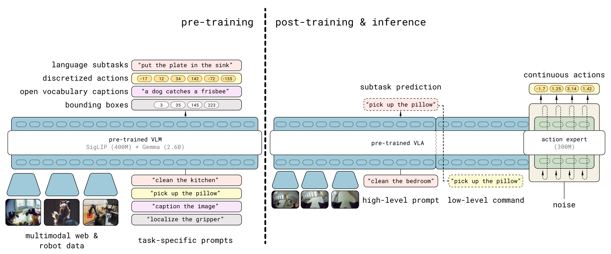
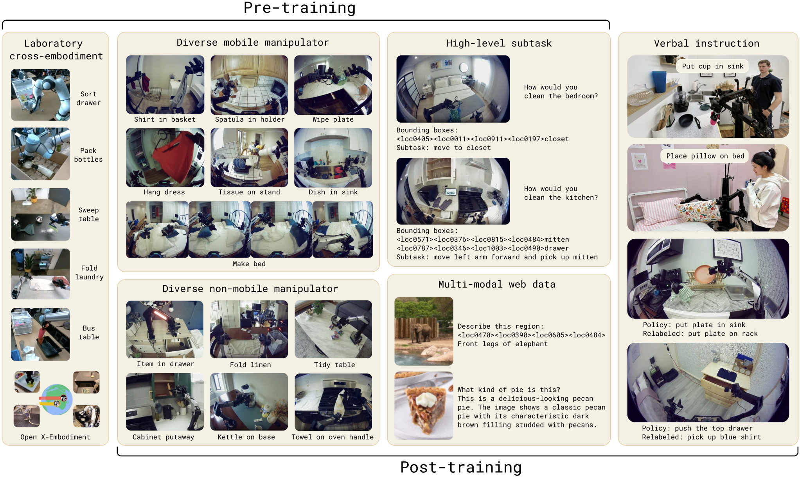
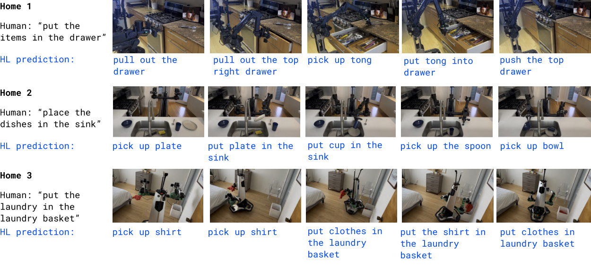

# $\pi_{0.5}$

**$\pi_{0.5}$** estende $\pi_0$ con un obiettivo diverso dalla sola acquisizione di skill motorie: portare un VLA fuori dal laboratorio e verificare se possa operare in **case mai osservate durante il training**, tra layout, oggetti e configurazioni visive nuove. 

Il lavoro non attribuisce questa capacità a un singolo aumento di scala, ma a una ricetta di **co-training eterogeneo** che combina azioni di robot diversi, annotazioni semantiche, istruzioni verbali e dati multimodali provenienti dal web.

Il target sperimentale principale è la manipolazione domestica mobile: il robot deve riordinare cucine e camere da letto, aprire cassetti, spostare stoviglie, raccogliere indumenti e sistemare letti senza disporre di una mappa o di un motion planner esterno.

## Da $\pi_0$ a una policy gerarchica

$\pi_0$ collega un VLM a un *action expert* che genera chunk di azioni continue tramite flow matching. Questa struttura produce controllo destro ad alta frequenza, ma il comando linguistico globale viene trasformato direttamente in movimento. Per task di pochi secondi questa formulazione può essere sufficiente; per attività che durano minuti diventa invece necessario decidere ripetutamente **quale subtask eseguire**.

$\pi_{0.5}$ introduce un **livello semantico esplicito**. Data l'istruzione globale $l$, il modello osserva le immagini $o_t$ e lo stato del robot $q_t$, quindi produce un subtask testuale $\hat l_t$, come "raccogli il piatto". L'action expert genera successivamente un **chunk continuo condizionato da quel subtask**:

$$
A_t=[a_t,a_{t+1},\ldots,a_{t+H-1}]
$$

Qui $A_t$ è il chunk di $H=50$ azioni future e ogni $a_t$ è un comando robotico al corrispondente istante. La fattorizzazione concettuale della policy è:

$$
\pi_\theta(A_t,\hat l_t\mid o_t,q_t,l)
=
\pi_\theta(A_t\mid o_t,q_t,\hat l_t)
\pi_\theta(\hat l_t\mid o_t,q_t,l)
$$

Il primo fattore descrive il **controllo low-level**, mentre il secondo rappresenta la **selezione high-level del subtask**. Non si tratta però di due modelli indipendenti: backbone vision-language e action expert appartengono alla stessa architettura e vengono ottimizzati con una ricetta coordinata.

## Architettura multimodale

Il backbone conserva l'impostazione PaliGemma di $\pi_0$: un encoder visuale **SigLIP da circa 400 milioni di parametri** alimenta un Transformer Gemma da circa 2.6 miliardi. Un Transformer più piccolo da **300 milioni di parametri** svolge il ruolo di action expert. Il modello complessivo rimane quindi nell'ordine dei 3.3 miliardi di parametri.

Gli input possono appartenere a tre famiglie. Le immagini vengono suddivise in patch e codificate dall'encoder visuale; testo e stato propriocettivo discretizzato diventano token; le azioni rumorose utilizzate dal flow matching sono proiettate nello spazio degli embedding mediante un layer lineare. I pesi dell'action expert elaborano questi ultimi token, ma condividono i layer di attenzione con il backbone vision-language.

Una **maschera di attenzione** impedisce che le due rappresentazioni delle azioni si contaminino. I token FAST autoregressivi vedono il prefisso multimodale e i token FAST precedenti; i token continui dell'action expert vedono il prefisso e l'intero chunk rumoroso, ma *non i token FAST*. Quindi **l'informazione fluisce dal VLM verso l'action expert, non nella direzione opposta**.

Rispetto a $\pi_0$, il timestep generativo $\tau$ non viene concatenato direttamente all'azione rumorosa. Un MLP lo proietta separatamente e lo inietta in ogni layer dell'action expert tramite **adaptive RMSNorm**. Questa modifica mantiene distinto il segnale temporale del processo di flow matching dalla rappresentazione del comando motorio.

## Azioni discrete per il training, continue per il controllo

La scelta progettuale più caratteristica consiste nell'utilizzare **due rappresentazioni compatibili della stessa traiettoria**. Durante il pre-training le azioni vengono compresse dal tokenizer FAST e **predette autoregressivamente come token discreti**. Questa interfaccia permette di trattare con la stessa cross-entropy risposte testuali, bounding box, subtask e sequenze robotiche.

Nel post-training viene aggiunto l'action expert continuo. Dato il chunk dimostrato $A_t$, si campionano rumore gaussiano $\omega\sim\mathcal{N}(0,I)$ e un tempo $\tau\in[0,1]$, quindi si costruisce l'interpolazione:

$$
A_t^{\tau,\omega}=\tau A_t+(1-\tau)\omega
$$

L'action expert $v_\theta$ apprende un campo che trasporta il rumore verso il chunk di azioni. 

Il target può essere scritto come $\omega-A_t$. La loss complessiva combina quindi next-token prediction e flow matching:

$$
\mathcal{L}(\theta)
=
\mathcal{L}_{\mathrm{CE}}(\theta)
+
\alpha\,
\mathbb{E}_{\tau,\omega}
\left[
\left\|v_\theta(A_t^{\tau,\omega},o_t,q_t,l)-(\omega-A_t)\right\|_2^2
\right]
$$

$\mathcal{L}_{\mathrm{CE}}$ supervisiona testo, localizzazioni e azioni FAST, mentre il secondo termine supervisiona il decoder continuo; $\alpha$ ne controlla il peso relativo. Nel post-training viene usato $\alpha=10.0$.

In inferenza il testo $\hat l_t$ viene decodificato autoregressivamente. Il chunk $A_t$ è poi ottenuto con **10 passi di integrazione** del campo continuo, evitando di emettere decine di token motori uno alla volta. La soluzione cerca così di unire la scalabilità del training discreto con la velocità del controllo generativo continuo.

## Mixture dei dati

La generalizzazione non viene cercata raccogliendo soltanto più episodi sul robot target. Il mixture separa fonti con ruoli differenti e le porta in un'interfaccia multimodale comune.

### Mobile manipulator in ambienti diversi

Il sottoinsieme **MM** contiene circa **400 ore** raccolte con manipolatori mobili in circa **100 abitazioni**. È la fonte più vicina alla distribuzione di deployment: include pulizia e riordino domestico, navigazione locale, manipolazione bimanuale e interazione con mobili.

Questi dati rappresentano però soltanto una piccola parte del pre-training. Il paper riporta che il **97.6% degli esempi della prima fase non proviene dal robot mobile impegnato nei task domestici target**. Il risultato va quindi letto come trasferimento da sorgenti ausiliarie, non come semplice memorizzazione di molte case.

### Manipolatori statici e cross-embodiment

Il sottoinsieme **ME** raccoglie dati di bracci singoli o doppi, non mobili, installati in numerose abitazioni. Essendo più facili da trasportare, questi setup ampliano la varietà visiva e ambientale, pur introducendo un embodiment gap rispetto al robot mobile.

Il sottoinsieme **CE** aggiunge task di laboratorio, come sparecchiare, piegare indumenti o macinare caffè, eseguiti da robot a singolo e doppio braccio, con basi statiche o mobili. Include anche Open X-Embodiment ed estende il corpus usato per $\pi_0$. Questi episodi aumentano soprattutto la copertura delle primitive motorie e dei tipi di interazione.

### Subtask, localizzazioni e web data

Per gli episodi robotici composti da più fasi, annotatori umani associano a ogni tratto una descrizione semantica. Il modello viene addestrato a predire il **subtask high-level**, le bounding box degli oggetti rilevanti e infine l'azione condizionata dal subtask. Questa supervisione **HL** collega lo stato percettivo alla struttura temporale del task.

I dati web **WD** comprendono image captioning, visual question answering e object localization. Il paper cita CapsFusion e COCO per le caption, Cambrian-7M, PixMo e VQAv2 per il question answering, oltre a immagini di ambienti interni e oggetti domestici annotate con bounding box. Il loro ruolo non è insegnare il movimento, ma conservare una semantica visuale più ampia di quella disponibile nelle traiettorie robotiche.

### Verbal instruction come teleoperazione semantica

Nel post-training viene introdotta la sorgente **VI**. Un supervisore osserva il robot e seleziona in tempo reale il prossimo comando semantico, mentre la policy low-level già appresa lo esegue. È una forma di **teleoperazione attraverso il linguaggio**: anziché specificare direttamente pose e giunti, l'esperto dimostra una sequenza di decisioni high-level.

Questa sorgente costituisce circa l'11% degli esempi high-level di mobile manipulation, ma la sua rimozione causa un peggioramento significativo. L'informazione fornita da pochi comandi ben allineati alla policy può quindi essere più utile del loro peso numerico nel mixture.

## Pre-training e post-training

Il **pre-training** dura 280,000 gradient step. Tutte le uscite, incluse le azioni, vengono rappresentate come token; il modello impara simultaneamente prediction di testo, bounding box, subtask e azioni FAST. Questa fase comprende MM, ME, CE, HL e WD.

Il **post-training** dura altri 80,000 step. L'action expert viene inizializzato casualmente e addestrato con flow matching, mentre la loss autoregressiva preserva le uscite linguistiche. Il mixture viene ristretto verso la manipolazione domestica: include MM e ME filtrati per successo e durata, web data, annotazioni high-level pertinenti e verbal instruction; i dati CE di laboratorio vengono esclusi.

Per rendere confrontabili gli action space, ogni dimensione viene normalizzata in $[-1,1]$ usando i quantili 1% e 99% del singolo dataset. I vettori vengono portati a una dimensionalità comune mediante zero-padding e il prompt specifica se il controllo è articolare o cartesiano. Come in $\pi_0$, questa normalizzazione uniforma la forma del tensore ma **non rende equivalenti le semantiche cinematiche** dei diversi robot.

## Robot e interfaccia di controllo

Gli esperimenti impiegano due manipolatori mobili bimanuali. Entrambi possiedono **due bracci a 6 DoF**, gripper paralleli, due camere monoculari sui polsi, una camera frontale e una posteriore, una base olonomica su ruote e un torso sollevabile. Lo stato e l'azione hanno 18 o 19 dimensioni in base alla piattaforma.

Per l'inferenza high-level vengono usate tutte e quattro le camere; per il controllo low-level sono sufficienti le viste dei polsi e quella frontale. La policy comanda pose target di braccia, gripper e torso, oltre alle velocità della base. Semplici controller PD inseguono questi riferimenti a **50 Hz grazie all'action chunking**.

Non vengono aggiunti pianificazione geometrica o collision avoidance esterni. Il risultato è quindi end-to-end rispetto alla decisione visuomotoria, ma non elimina la necessità di controller servo sottostanti né trasforma il VLA in un sistema di sicurezza certificato.

## Valutazione in case non viste

Il protocollo distingue ambienti domestici simulati fisicamente tramite set controllati, chiamati *mock homes*, e vere abitazioni. In entrambi i casi cucine e camere da letto non sono presenti nel training e introducono nuovi oggetti, sfondi e layout.

La valutazione quantitativa considera quattro task: collocare stoviglie nel lavello, riporre un oggetto in un cassetto, mettere un indumento nel cesto e rifare il letto. La metrica assegna credito parziale ai passaggi completati, una scelta necessaria per attività composte ma diversa da un success rate binario. Normalmente vengono eseguiti dieci trial per task e condizione.

*Esempi di rollout in tre case reali: il testo blu mostra i subtask predetti durante l'esecuzione. Fonte: paper “$\pi_{0.5}$: a Vision-Language-Action Model with Open-World Generalization”, Figura 7a.*

Nei trial reali i task misurati durano in genere **2–5 minuti**. Dimostrazioni più ampie mostrate dal lavoro arrivano a 10–15 minuti per la pulizia di una cucina o di una camera, ma questi episodi non devono essere confusi con un benchmark standardizzato di successo end-to-end sulla stessa scala temporale.

Gli esperimenti di scaling mostrano che aumentare il numero di ambienti di training migliora sia il completamento dei task sia la comprensione di oggetti non visti. La varietà delle scene agisce quindi come una forma di regolarizzazione: non insegna soltanto nuovi sfondi, ma riduce la dipendenza da correlazioni specifiche di una singola casa.

## Cosa mostrano le ablation

La rimozione di **ME** o **CE** riduce significativamente le prestazioni nelle mock homes; rimuoverli entrambi produce un calo ancora maggiore. Il trasferimento cross-embodiment non è quindi un effetto marginale, anche se l'evaluation finale usa un robot mobile differente da molti robot sorgente.

I web data hanno un effetto più selettivo. La loro rimozione non cambia in modo statisticamente significativo il punteggio medio di tutti i task domestici, ma peggiora il language following su categorie di oggetti out-of-distribution e la scelta high-level. Il risultato separa **conoscenza semantica** e **competenza motoria**: la prima aiuta soprattutto a capire che cosa manipolare, la seconda a eseguire il movimento.

Il modello completo supera $\pi_0$ e la variante $\pi_0$-FAST+Flow addestrata soltanto su dati di azione. Poiché i confronti usano lo stesso corpus cross-embodiment e un numero comparabile di update, il vantaggio sostiene il contributo di HL e WD e della ricetta ibrida, non soltanto quello di più traiettorie.

L'inferenza high-level esplicita ottiene il risultato migliore. È tuttavia importante che la variante **implicit HL**, che non emette subtask a runtime ma conserva i dati HL nel training, risulti seconda. Una parte sostanziale del beneficio deriva quindi dall'apprendere la struttura semantica dei task, non esclusivamente dall'eseguire una pipeline gerarchica durante il deployment.

## Novelty

Il contributo principale di $\pi_{0.5}$ è la dimostrazione che la **generalizzazione open-world può emergere dal trasferimento tra supervisioni eterogenee**. Azioni di altri embodiment, ambienti domestici, bounding box, caption, VQA, subtask e verbal instruction non vengono usati da moduli separati, ma co-addestrano una singola architettura multimodale.

La seconda novità è la combinazione operativa tra **tokenizzazione FAST e flow matching**. Le azioni discrete rendono scalabile il pre-training con task linguistici e percettivi; l'action expert continuo permette un controllo a 50 Hz senza decoding autoregressivo dell'intero chunk.

Infine, la policy integra pianificazione semantica e controllo nella stessa rete. Il subtask testuale rende osservabile una parte della decisione high-level e permette di correggere o supervisionare il comportamento con linguaggio, pur mantenendo il movimento end-to-end.

## Limiti

“Open-world” descrive la generalizzazione a **nuove case all'interno di un dominio domestico preparato**, non un robot capace di operare senza vincoli in qualsiasi ambiente. I task, i tipi di mobili, gli action space e le famiglie di comportamento rimangono legati alla distribuzione di training; oggetti con maniglie insolite o meccanismi fisicamente difficili causano ancora fallimenti persistenti.

La policy dispone di **contesto e memoria limitati**. Occlusioni create dal braccio possono far perdere un oggetto o una macchia, mentre **il livello high-level può ripetere subtask già completati**, come aprire e chiudere più volte lo stesso cassetto. Attività tra stanze o che richiedono ricordare dove sia stato riposto un oggetto non sono dimostrate in modo sistematico.

La **raccolta è in gran parte proprietaria e il paper non pubblica checkpoint**, dataset completo e pipeline sufficienti a replicare il risultato. Le ablation isolano alcune componenti del mixture, ma non permettono di stimare con precisione il contributo della qualità delle dimostrazioni, della scala computazionale o di tutte le scelte di filtraggio.

Il modello **non include collision avoidance e motion planning espliciti**. Affidare direttamente al VLA target di braccia e base rende il sistema reattivo, ma lascia aperti robustezza, verifica dei vincoli e sicurezza funzionale. Il language-level reasoning migliora la decomposizione del task, senza fornire garanzie sulla correttezza del piano o sull'esecuzione fisica.
