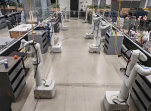

# RT-1 (2022)

**RT-1** rappresenta uno dei primi tentativi sistematici di costruire una singola policy robotica capace di eseguire centinaia di task diversi a partire da osservazioni visive e istruzioni linguistiche.

A differenza di SayCan, il modello non seleziona una skill predefinita che viene poi eseguita da una policy separata: **RT-1 riceve direttamente immagini e istruzione e produce i comandi da inviare al robot**.

La formulazione generale è:

$$
\pi(a_t \mid o_{t-k:t}, q)
$$

dove $o_{t-k:t}$ rappresenta una breve sequenza temporale di immagini, $q$ l’istruzione linguistica e $a_t$ l’azione robotica corrente.

## Dataset

Il dataset principale di RT-1 è costituito da **oltre 130.000 episodi reali** raccolti tramite una ***robot classroom***, raccolti nell’arco di **17 mesi** utilizzando una flotta di **13 robot fisici**. Non si tratta quindi di dati simulati: la parte principale del training deriva da interazioni effettivamente eseguite dai robot in ambienti reali.

Il dataset comprende **oltre 700 task**, descritti attraverso istruzioni in linguaggio naturale. Le attività includono, tra le altre:

* picking di oggetti;
* placing;
* apertura e chiusura di cassetti;
* estrazione e inserimento di oggetti nei cassetti;
* posizionamento verticale di oggetti allungati;
* abbattimento di oggetti;
* estrazione di tovaglioli;
* apertura di contenitori e barattoli.

La varietà non deriva quindi solo dal numero di task, ma dalla combinazione di **skill, oggetti, configurazioni della scena e formulazioni linguistiche differenti**.

Il robot utilizzato è un **Everyday Robots mobile manipulator**, quindi una piattaforma fisica dotata sia di base mobile sia di braccio manipolatore. Questa caratteristica è importante perché RT-1 non deve produrre soltanto azioni del braccio, ma anche decidere quando muovere la base e quando terminare il task.

Il dataset principale viene raccolto soprattutto in una **mock kitchen fisica**, cioè un ambiente reale costruito per riprodurre una cucina da ufficio. Alcune valutazioni vengono successivamente svolte in cucine fisiche differenti, mai utilizzate durante il training, per misurare il grado di generalizzazione del modello.

## Input del modello

Ad ogni timestep, RT-1 riceve due sorgenti principali di informazione:

$$
\text{images} + \text{language instruction}
$$

L’input visivo non è costituito da una singola immagine isolata, ma da una **breve history temporale di immagini RGB**. Questo permette al modello di osservare implicitamente il *movimento e l’evoluzione* recente della scena, senza utilizzare esplicitamente uno stato dinamico simbolico.

L’istruzione descrive invece il task da eseguire, ad esempio:

> *Pick the apple from the top drawer and place it on the counter.*

La policy viene quindi **condizionata sul linguaggio durante tutto il rollout**.

## Architettura

L’architettura di RT-1 contiene tre componenti principali:

$$
\text{FiLM-EfficientNet}
\rightarrow
\text{TokenLearner}
\rightarrow
\text{Transformer}
$$

Le immagini vengono inizialmente elaborate da una **EfficientNet pre-addestrata su ImageNet**.

> [!NOTE]
> EfficientNet è una famiglia di reti neurali convoluzionali (CNN) per la visione artificiale, creata da Google AI nel 2019, che offre una precisione elevata riducendo drasticamente le dimensioni e i costi di calcolo rispetto ai modelli tradizionali.

L’istruzione linguistica viene trasformata in un embedding e utilizzata per condizionare il visual encoder tramite **FiLM** (Feature-wise Linear Modulation).

Considerando una feature map intermedia:

$$
x \in \mathbb{R}^{H \times W \times C}
$$

FiLM genera, a partire dall’embedding dell’istruzione, due vettori:

$$
\gamma(q),\beta(q)\in\mathbb{R}^{C}
$$

e applica una trasformazione affine indipendente a ciascun canale:

$$
\text{FiLM}(x)=\gamma(q)\odot x+\beta(q)
$$

Questo significa che il language conditioning viene applicato direttamente alle rappresentazioni visive. Ad esempio, di fronte alla stessa immagine della cucina, le feature considerate rilevanti possono cambiare tra: *pick the apple* e *open the drawer*.

FiLM è particolarmente buono perché se impostato inizialmente come identità non altera la distribuzione delle feature fin da subito, evitando il problema di *catastrophic forgetting*.

Le feature visive risultanti sarebbero però troppo numerose per essere elaborate efficientemente dal Transformer. RT-1 utilizza quindi **TokenLearner**, un modulo che comprime le feature spaziali in un numero ridotto di token informativi.

> [!NOTE]
> TokenLearner è un modulo che utilizza un piccolo network convoluzionale per generare **mappe di attenzione** (quindi più snello di una classica cross attention) che selezionano le feature più informative da una feature map spaziale.

Il Transformer riceve infine i token prodotti dalle diverse immagini temporali e predice i token corrispondenti all’azione corrente.

Il modello contiene circa **35 milioni di parametri**, molto meno dei successivi VLA da diversi miliardi di parametri. Questa dimensione relativamente contenuta viene scelta anche per consentire inferenza sufficientemente veloce per il controllo robotico a ciclo chiuso.

Infatti a differenza di modelli successivi, RT-1 non utilizza un grande Vision-Language Model pre-addestrato sul web come backbone principale. Il modello dispone quindi di una comprensione linguistica sufficiente per distinguere i task presenti nel dataset, ma non possiede ancora la quantità di conoscenza semantica esterna che caratterizzerà RT-2.

## Action space

L’action space di RT-1 è particolarmente importante perché mostra chiaramente che l’output del modello non corrisponde direttamente alle correnti o alle coppie dei motori.

L’azione è composta da tre gruppi:

$$
a_t =
(a^{arm}_t,\,
a^{base}_t,\,
a^{mode}_t)
$$

Per il **braccio** vengono predette **7 dimensioni**:

$$
a^{arm}
=
(x,y,z,roll,pitch,yaw,gripper)
$$

Le prime sei descrivono il movimento dell’end-effector nello spazio cartesiano:

* traslazione lungo $x$;
* traslazione lungo $y$;
* traslazione lungo $z$;
* rotazione roll;
* rotazione pitch;
* rotazione yaw.

La settima dimensione controlla l’apertura del gripper.

Per la **base mobile** vengono predette altre **3 dimensioni**:

$$
a^{base}
=
(x,y,yaw)
$$

che rappresentano il movimento planare della base.

Infine viene predetta una variabile discreta di **mode**, con tre possibilità:

$$
a^{mode}
\in
\{
\text{arm},
\text{base},
\text{terminate}
\}
$$

Il modello può quindi decidere se, in quel momento, controllare il braccio, controllare la base oppure dichiarare completato il task.

Questo meccanismo evita di controllare contemporaneamente braccio e base attraverso un unico vettore continuo e rende esplicita una forma semplice di decomposizione del comportamento.

## Discretizzazione delle azioni

Un altro elemento importante di RT-1 è che le azioni continue non vengono predette direttamente **tramite regressione**.

Ogni dimensione continua viene **discretizzata in 256 bin**. Il problema di controllo viene quindi trasformato in un problema di classificazione sui possibili token di azione.

Concettualmente:

$$
a_i \in \mathbb{R}
\rightarrow
\text{quantization}
\rightarrow
a_i^{token}\in\{0,\dots,255\}
$$

Quindi il Transformer **predice token discreti**, che vengono successivamente riconvertiti nei corrispondenti valori continui prima dell’esecuzione.

Questa scelta ha due vantaggi principali:

- Permette di formulare l’action prediction in modo simile alla predizione autoregressiva di token;
- Consente di rappresentare distribuzioni di azioni potenzialmente multimodali senza ridurle necessariamente alla media prodotta da una regressione MSE.

Introduce però anche un **quantization error**, dato che uno spazio continuo viene approssimato con un numero finito di valori.

## Frequenza di controllo e closed-loop execution

RT-1 produce azioni a **3 Hz**, quindi una nuova azione viene generata approssimativamente ogni:

$$
\Delta t \approx \frac{1}{3}\,\text{s}\approx333\,\text{ms}
$$

Il modello opera in **closed loop**:

$$
o_t
\rightarrow
a_t
\rightarrow
\text{robot moves}
\rightarrow
o_{t+1}
\rightarrow
a_{t+1}
$$

Non viene quindi generata all’inizio una traiettoria completa da eseguire senza feedback.

Il ciclo continua fino a quando:

* il modello produce il token `terminate`;
* oppure viene raggiunto il numero massimo predefinito di timestep.

È importante distinguere questa frequenza di **policy inference** dalla frequenza dei controller interni del robot. RT-1 decide un nuovo target a 3 Hz, mentre i controller a livello inferiore possono operare a frequenze molto maggiori per trasformare questi target in movimento fisico stabile.

In forma schematica:

$$
\text{RT-1 @ 3 Hz}
\rightarrow
\text{Cartesian/base command}
\rightarrow
\text{low-level controller}
\rightarrow
\text{actuators}
$$

RT-1 **non sostituisce quindi il servo controller** del robot.

## Training

RT-1 viene addestrato principalmente tramite **behavioral cloning**.

Dato un dataset di dimostrazioni:

$$
D=
\{
(o_t,q,a_t)
\}_{t=1}^{N}
$$

il modello impara a predire l’azione eseguita dall'operatore o dalla policy che ha generato la dimostrazione.

Poiché le azioni sono discretizzate, il training può essere formulato tramite **cross-entropy** sui token:

$$
\mathcal{L}
=
-\sum_i
\log
P(a_i^{*}\mid o,q)
$$

dove $a_i^{*}$ rappresenta il token corretto per una determinata componente dell’azione.

Il modello non viene quindi addestrato online tramite reinforcement learning durante questa fase: principalmente **apprende a imitare le traiettorie presenti nel dataset**.

Questo comporta anche un limite tipico del behavioral cloning: durante l’esecuzione il robot può **raggiungere stati poco rappresentati nei dati** di training e commettere errori che lo portano progressivamente ancora più lontano dalla distribuzione delle dimostrazioni. Inoltre è difficile ottenere una policy migliore di quella che ha generato le dimostrazioni, perché il modello non riceve alcun feedback sul successo o fallimento del task.

## Evaluation: task già osservati e generalizzazione

RT-1 viene confrontato principalmente con **Gato**, **BC-Z** e una variante più grande di BC-Z chiamata **BC-Z XL**.

L’evaluation viene costruita per distinguere diversi tipi di generalizzazione.

Sui task già presenti nella distribuzione di training, RT-1 raggiunge circa:

$$
\mathbf{97\%}
$$

di successo sulle oltre 700 istruzioni considerate.

Sugli **unseen tasks**, cioè combinazioni di istruzioni e comportamenti non presenti direttamente nei dati di training, raggiunge circa:

$$
\mathbf{76\%}
$$

di successo.

Vengono inoltre aggiunti **distractor objects**, cioè oggetti irrilevanti che modificano la scena senza cambiare il task. RT-1 raggiunge circa:

$$
\mathbf{83\%}
$$

nei test di robustezza ai distractor.

Infine viene modificato il **background** e vengono introdotte configurazioni ambientali differenti da quelle viste durante il training. In questa condizione il successo scende a circa:

$$
\mathbf{59\%}
$$

mostrando che la generalizzazione visiva rimane significativamente più difficile.

## Valutazione in una cucina realmente nuova

Gli autori costruiscono anche una valutazione più difficile in una **office kitchen fisica diversa dall'ambiente utilizzato prevalentemente per raccogliere i dati**.

Questo test combina contemporaneamente:

* illuminazione differente;
* layout differente;
* nuovi distractor;
* oggetti in posizioni insolite;
* nuove combinazioni di task.

### Esperimento con dati simulati

Un esperimento particolarmente importante riguarda l’aggiunta di **dati simulati** al dataset reale.

Questo test va distinto chiaramente dal dataset principale: **RT-1 viene principalmente addestrato e valutato su robot fisici**, ma gli autori aggiungono dati simulati per verificare se il Transformer riesca ad assorbire informazioni provenienti da una distribuzione differente.

Vengono utilizzati oggetti disponibili soltanto in simulazione durante parte del training.

Quando il modello viene addestrato con un mix di:

$$
D_{real}+D_{sim}
$$

la generalizzazione sugli oggetti osservati soltanto in simulazione migliora significativamente, mentre la performance sugli altri oggetti diminuisce di circa **2 punti percentuali**.

Questo risultato suggerisce che RT-1 riesce a **integrare dati simulati senza compromettere in modo sostanziale** le competenze già apprese sul robot reale.
