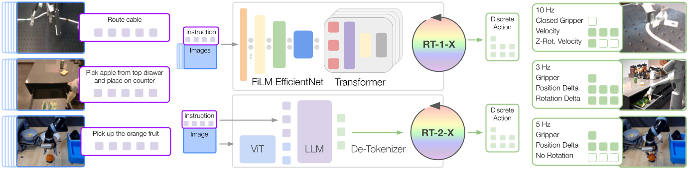

# RT-X

**RT-X** è il nome dato alla famiglia di policy robotiche ottenute addestrando architetture già esistenti su un **mixture di dati provenienti da embodiment differenti**. Il lavoro nasce insieme a Open X-Embodiment e cerca di rispondere a una domanda centrale per i robot foundation model: i dati raccolti con un robot possono migliorare una policy destinata a controllarne un altro?

Il punto di partenza è molto diverso dal paradigma tradizionale del robot learning. In un'impostazione classica, ogni piattaforma dispone del proprio dataset e viene addestrata una policy specifica:

$$
D^{(e)}
\rightarrow
\pi^{(e)}
$$

dove $e$ identifica un particolare embodiment. RT-X prova invece a costruire una singola policy utilizzando simultaneamente dati provenienti da più robot:

$$
D^{(1)} \cup D^{(2)} \cup \dots \cup D^{(E)}
\rightarrow
\pi_{X}
$$

L'obiettivo non è rendere tutti i robot fisicamente equivalenti, ma verificare se **regolarità visive, linguistiche e manipolative apprese su una piattaforma possano produrre positive transfer sulle altre**.

Il paper studia due modelli distinti:

- **RT-1-X** mantiene l'architettura compatta di RT-1 e cambia principalmente la distribuzione dei dati di training
- **RT-2-X** applica la stessa idea a RT-2, quindi a un grande Vision-Language-Action model derivato da un VLM pre-addestrato sul web

Quindi RT-X *non identifica una singola nuova architettura*, ma un esperimento di scaling dei dati robotici attraverso embodiment differenti.

## Da single-robot learning a X-robot learning

RT-1 aveva già mostrato che una singola policy Transformer poteva controllare centinaia di task differenti, ma tutte le dimostrazioni principali provenivano dalla stessa famiglia di robot. Il modello generalizzava quindi tra task, oggetti e scene, non realmente tra embodiment.

Il passaggio è meno banale di quanto possa sembrare. Due dataset robotici possono differire per:

- morfologia e cinematica del robot;
- numero di gradi di libertà;
- posizione e numero delle camere;
- frequenza di controllo;
- convenzione utilizzata per rappresentare le rotazioni;
- coordinate rispetto alle quali vengono espresse le azioni;
- semantica del comando del gripper;
- distribuzione degli oggetti e degli ambienti;
- tipo di teleoperazione o policy utilizzata per raccogliere i dati.

Di conseguenza non è sufficiente concatenare le traiettorie. È necessario costruire un'interfaccia sufficientemente comune affinché una stessa rete possa interpretare esempi raccolti da piattaforme differenti.

## Open X-Embodiment e robotics data mixture

RT-X viene presentato nello stesso lavoro che introduce **Open X-Embodiment**, una grande raccolta collaborativa di dataset robotici standardizzati.

Il dataset completo aggrega oltre **un milione di traiettorie reali**, provenienti da **22 embodiment** e da decine di dataset raccolti da istituzioni differenti. Le traiettorie coprono centinaia di skill e una forte varietà di oggetti, ambienti e configurazioni robotiche.

È però importante distinguere:

$$
\text{Open X-Embodiment completo}
\neq
\text{robotics mixture usato per RT-X}
$$

Gli esperimenti di RT-1-X e RT-2-X utilizzano infatti un subset del corpus disponibile al momento del training, composto da dati relativi a **9 manipolatori**. Tra le sorgenti considerate compaiono dataset come:

- RT-1;
- QT-Opt;
- Bridge;
- Task Agnostic Robot Play;
- Jaco Play;
- Cable Routing;
- RoboTurk;
- NYU VINN;
- Austin VIOLA;
- Berkeley AUTOLab UR5;
- TOTO;
- Language Table.

Il motivo della differenza è principalmente pratico: Open X-Embodiment cresce come risorsa condivisa, mentre i training run di RT-X vengono eseguiti su una particolare snapshot e su un insieme di dataset resi compatibili con le architetture considerate.

## Standardizzazione delle osservazioni

Ogni dataset può contenere più camere, risoluzioni differenti e segnali sensoriali eterogenei. Per rendere possibile il co-training viene selezionata una rappresentazione visiva compatibile con l'input dei modelli.

La formulazione generale rimane quella di una policy language-conditioned:

$$
\pi(a_t \mid o_{\leq t}, q)
$$

dove $o_{\leq t}$ rappresenta l'osservazione visiva corrente o una breve history temporale, $q$ è l'istruzione linguistica e $a_t$ è l'azione robotica.

Non tutti i dataset possiedono però istruzioni linguistiche annotate nello stesso modo. La costruzione del corpus richiede quindi una standardizzazione anche del task description, così che il testo possa essere utilizzato come interfaccia comune tra task provenienti da sorgenti differenti.

Questa scelta è concettualmente importante: **il linguaggio diventa una delle principali variabili attraverso cui il modello distingue comportamenti diversi all'interno di un unico mixture**.

### La standardizzazione non elimina l'embodiment

La rappresentazione comune è necessariamente approssimata. Due dataset possono descrivere entrambi un'azione come variazione cartesiana dell'end-effector, ma differire per frame, scale, control frequency e dinamiche del robot.

Per esempio, uno spostamento numericamente simile può corrispondere a una velocità, a un delta di posizione o a un target interpretato da controller differenti.

Di conseguenza il modello non riceve un action space perfettamente invariato rispetto all'embodiment. Il risultato sperimentale interessante di RT-X è precisamente che **una rete sufficientemente capace riesce comunque a sfruttare una parte della struttura condivisa tra questi domini eterogenei**.

Quindi i robot non hanno tutti la stessa dinamica, ma si cerca se esistono **pattern trasferibili nonostante dinamiche differenti**.

## Spazio delle azioni condiviso

La difficoltà maggiore riguarda le azioni. Una policy cross-embodiment non può assumere che il comando originale di ogni dataset abbia la stessa dimensionalità e lo stesso significato fisico.

RT-X riconduce le azioni a una rappresentazione centrata sull'**end-effector**. La parte continua principale viene descritta tramite sette dimensioni:

$$
a_t^{ee}
=
(x,y,z,roll,pitch,yaw,g)
$$

dove:

- $x,y,z$ descrivono traslazione o velocità traslazionale dell'end-effector;
- $roll,pitch,yaw$ descrivono rotazione o velocità rotazionale;
- $g$ rappresenta il comando del gripper.

A queste viene associata una dimensione discreta per indicare la terminazione dell'episodio, portando l'output logico a **otto componenti**.

L'aspetto importante è che questa standardizzazione non rende identiche le dinamiche dei robot. La stessa variazione cartesiana **può corrispondere a movimenti articolari molto differenti** su due manipolatori.

La pipeline è più correttamente interpretata come:

$$
\text{robot-specific action}
\rightarrow
\text{canonical end-effector representation}
\rightarrow
\text{shared model}
$$

in training, e nel verso opposto durante l'esecuzione:

$$
\text{model output}
\rightarrow
\text{robot-specific controller}
\rightarrow
\text{actuators}
$$

RT-X **non sostituisce quindi i low-level controller** dei diversi robot.

Per i dataset nei quali alcune dimensioni non vengono effettivamente utilizzate, il valore corrispondente viene posto a zero durante il training. Questo permette di mantenere una dimensionalità comune pur includendo robot con action space parzialmente differenti.

## Il guadagno è maggiore nei small-data domain

Il positive transfer non è uniforme.

Quando il dataset specifico del robot è piccolo, gli esempi provenienti dagli altri embodiment costituiscono una quantità sostanziale di esperienza aggiuntiva. Il modello può apprendere concetti come:

- raggiungere un oggetto;
- chiudere un gripper;
- spostare un oggetto verso una regione;
- interpretare istruzioni di picking e placing;
- riconoscere relazioni spaziali comuni.

Queste regolarità non dipendono completamente dalla particolare cinematica del robot.

Nei domini già dotati di grandi quantità di dati, invece, RT-1-X non mostra lo stesso vantaggio sistematico rispetto alla policy single-domain. Gli autori interpretano questo risultato come un possibile problema di **model capacity**: una rete da 35M parametri può non essere sufficientemente grande da assorbire efficacemente l'intera eterogeneità del mixture senza introdurre interferenza o underfitting.

Questo porta direttamente a RT-2-X.

## Emergent skills

L'esperimento più significativo di RT-2-X utilizza il **Google Robot** come embodiment di valutazione.

Gli autori costruiscono task contenenti skill che **non compaiono nel dataset originale del Google Robot**, ma che sono presenti nel dataset Bridge, raccolto con un robot differente, il WidowX.

Esempi qualitativi includono istruzioni come:

$$
\text{``move apple near cloth''}
$$

oppure:

$$
\text{``move apple on cloth''}
$$

e relazioni spaziali come:

$$
\text{``move apple between can and orange''}
$$

Il modello deve quindi utilizzare una competenza osservata nel mixture attraverso un altro robot e applicarla sull'embodiment Google Robot.

RT-2 standard raggiunge circa:

$$
\mathbf{27.3\%}
$$

nell'emergent skills evaluation.

RT-2-X da 55B raggiunge invece circa:

$$
\mathbf{75.8\%}
$$

ovvero quasi **tre volte** il successo del modello RT-2 di confronto.

Questo è il risultato centrale del paper: **una skill presente nei dati di un embodiment può contribuire al comportamento di un altro embodiment**, purché il modello abbia sufficiente capacità per sfruttare il mixture.

### Generalizzazione visiva ed emergent skills sono fenomeni diversi

RT-2 era già progettato per generalizzare a oggetti, background e ambienti non visti sfruttando il pre-training vision-language.

Per questo motivo RT-2-X non produce un grande miglioramento nella classica evaluation di generalizzazione visiva.

Il paper riporta circa:

$$
\text{RT-2}: 62\%
$$

contro:

$$
\text{RT-2-X}: 61\%
$$

sul benchmark di RT-2 generalization.

Il risultato non indica che RT-2-X sia meno utile. Mostra invece che **il vantaggio specifico del training X-embodiment emerge soprattutto nell'acquisizione di comportamenti presenti su altri robot**, mentre la generalizzazione a oggetti o background era già fortemente sostenuta dal VLM pre-addestrato.

In altre parole:

$$
\text{web pre-training}
\rightarrow
\text{semantic/visual generalization}
$$

mentre:

$$
\text{cross-robot demonstrations}
\rightarrow
\text{behavioral transfer}
$$

Le due sorgenti di conoscenza sono complementari.

## Limiti

Il primo limite è che gli **embodiment utilizzati rimangono relativamente vicini dal punto di vista del dominio**: il lavoro è concentrato soprattutto sulla **manipolazione con bracci robotici e mobile manipulator**. Non vengono studiate in modo sistematico piattaforme con sensing e actuation radicalmente differenti.

Il secondo limite è che **RT-X non dimostra generalizzazione zero-shot verso robot completamente nuovi**. Le evaluation mostrano trasferimento tra robot che partecipano al data mixture, non la capacità di controllare un embodiment sconosciuto senza dati target.

Il terzo limite riguarda l'action representation. Ridurre robot differenti a un vettore comune di movimento dell'end-effector facilita il co-training, ma **nasconde parte delle differenze cinematiche e dinamiche**. Questa soluzione funziona soprattutto quando i robot condividono una nozione ragionevolmente compatibile di manipolazione cartesiana.

Un ulteriore limite è la **dipendenza dalla dimensione del modello**. RT-1-X mostra che una **policy relativamente piccola non riesce necessariamente a sfruttare in modo positivo ogni aumento di eterogeneità**. RT-2-X ottiene risultati più forti, ma richiede un modello nell'ordine delle decine di miliardi di parametri e quindi costi di training e inferenza molto maggiori.

Infine, RT-X non risolve il problema della composizione ottimale del dataset. Dataset differenti vengono messi in comune, ma il lavoro non fornisce un criterio generale per stabilire **quali dati trasferiscano positivamente, quali siano ridondanti e quali possano introdurre negative transfer**.
