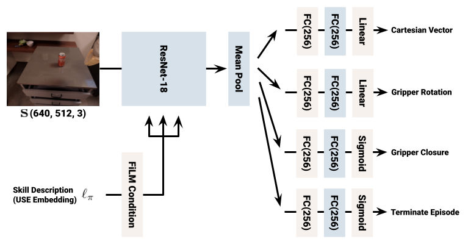

# SayCan (2022)

**SayCan** affronta direttamente il problema di collegare linguaggio e azioni robotiche, ma mantiene una separazione netta tra **reasoning ad alto livello** e **low-level control**.

Un LLM valuta una **sequenza di skill compatibili con l’istruzione** (il set di skill è definito a priori e non viene appreso dal modello):

$$
P(\text{skill} \mid \text{instruction})
$$

Ad ogni skill viene associato un valore dato da una value function appresa in modo da stimare quali skill risultano fisicamente eseguibili nello stato corrente:

$$
Q(\text{skill} \mid \text{state})
$$

La scelta viene quindi effettuata combinando plausibilità linguistica e affordance fisica.

Per esempio data l'istruzione:

$$
\text{"Portami qualcosa con cui pulire la bibita versata."}
$$

Il sistema dispone di un **insieme finito di skill già note**, per esempio:

- `find sponge`
- `pick sponge`
- `go to user`
- `open drawer`
- `pick apple`
- `put object on table`

L’LLM valuta quale di queste skill sia semanticamente sensata come prossimo passo. Quindi non produce subito un piano completo necessariamente; assegna un punteggio alle skill candidate.

Per esempio:

$$
P(\text{find sponge}\mid \text{instruction}) = 0.8
$$

$$
P(\text{pick apple}\mid \text{instruction}) = 0.05
$$

Parallelamente, per ogni skill viene stimata la fattibilità fisica nello stato corrente:

$$
Q(s,\text{find sponge}) = 0.9$$

$$
Q(s,\text{open drawer}) = 0.2
$$

Il sistema combina i due valori:

$$
\text{score(skill)} = P_{\text{LLM}}(\text{skill}\mid \text{instruction, history}) \cdot Q(s,\text{skill})
$$

e sceglie la skill con score maggiore.

Quindi il primo passo potrebbe essere:

$$
\text{find sponge}
$$

A questo punto quella skill viene effettivamente eseguita dal robot.

La skill testuale prima di essere eseguita deve essere convertita in un’azione robotica concreta. Questo viene fatto tramite un **policy pre-addestrata** che mappa la skill su azioni eseguibili.

In pratica per ogni skill esiste una policy specializzata, addestrata separatamente, che produce azioni robotiche compatibili con la skill richiesta.

- `find sponge`: $\pi_{\text{find sponge}}$
- `pick sponge`: $\pi_{\text{pick sponge}}$
- `go to user`: $\pi_{\text{go to user}}$

In particolare la policy riceve le osservazioni del robot:

$$ o_t = \{\text{camera},\text{robot state},...\} $$

e produce azioni continue:

$$ a_t = \pi_{\text{pick sponge}}(o_t) $$

per esempio comandi di movimento dell’end-effector, gripper e base mobile.

Quindi hai due livelli molto distinti:

$$ \text{LLM} \rightarrow \text{skill simbolica} $$

e poi:

$$
\text{skill simbolica} \rightarrow \text{policy specifica} \rightarrow \text{azioni robotiche}
$$

Il processo è **iterativo**, quindi dopo aver eseguito la skill `find sponge`, il robot aggiorna il suo stato e l’LLM valuta nuovamente quale skill eseguire successivamente, fino a completare l’istruzione iniziale.

Il sistema viene valutato su un **Everyday Robots mobile manipulator** all’interno di due ambienti: una **mock kitchen** (reale), utilizzata anche per addestrare le skill, e una seconda **office kitchen** (reale) usata per verificare la capacità di trasferimento in un ambiente diverso.

L’ambiente contiene 15 oggetti comuni da cucina e 5 location semanticamente rilevanti, tra cui due piani di lavoro, un tavolo, un cestino e la posizione dell’utente. Il robot dispone di un **braccio a 7 DoF**, un gripper a due dita, una base mobile e una camera RGB.

L’evaluation comprende **101 istruzioni reali**, incluse istruzioni linguisticamente nuove e task long-horizon. SayCan raggiunge, nella mock kitchen, un planning success rate dell’84% e un execution success rate del 74%.

**Novelty:** utilizzo della conoscenza contenuta negli LLM per comporre skill robotiche sulla base delle affordance del robot.

**Limiti:** il language model non produce direttamente azioni di controllo. Le skill devono essere definite e addestrate separatamente, rendendo il sistema dipendente dal repertorio disponibile.

SayCan rappresenta quindi un approccio **gerarchico**:

$$
\text{language}
\rightarrow
\text{LLM planner}
\rightarrow
\text{pre-trained skills}
\rightarrow
\text{actions}
$$

che si distingue dai successivi VLA end-to-end.
