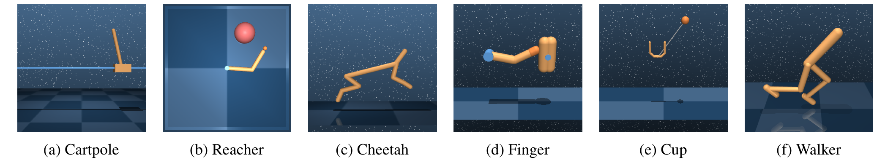
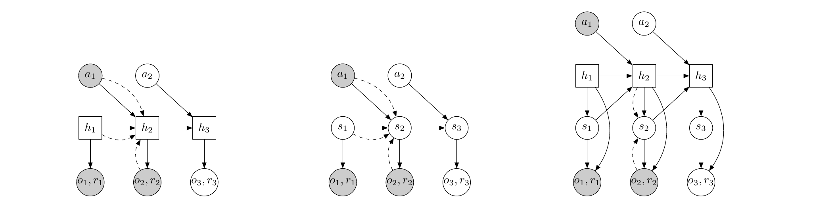
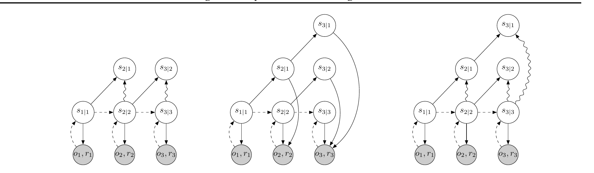
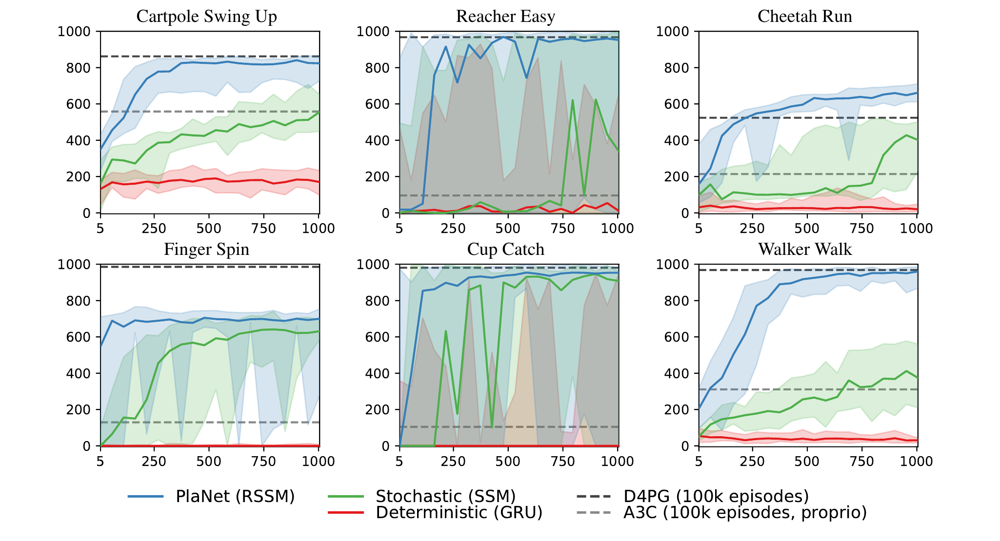

# PlaNet (2019)

Il paper [*Learning Latent Dynamics for Planning from Pixels*](https://arxiv.org/abs/1811.04551), pubblicato da Danijar Hafner e coautori nel 2019, introduce **PlaNet**, una *Deep Planning Network* che apprende la dinamica di un ambiente direttamente dalle immagini e sceglie le azioni mediante planning online nello spazio latente.

PlaNet è un agente **puramente model-based**. Non possiede una policy parametrica né una value function: ciò che viene appreso è il World Model, mentre il comportamento emerge cercando a ogni step una sequenza di azioni che massimizzi i reward predetti.

Il lavoro affronta congiuntamente tre difficoltà: inferire lo stato da osservazioni parziali, rappresentare futuri stocastici senza perdere memoria del passato ed effettuare migliaia di rollout abbastanza rapidamente da rendere praticabile il Model Predictive Control.

## Ambiente e protocollo sperimentale

PlaNet viene valutato su sei task della **DeepMind Control Suite**, tutti simulati e con action space continuo. L'agente non riceve lo stato interno del simulatore: durante l'esecuzione osserva soltanto immagini RGB in terza persona ridimensionate a $64\times64$ pixel.

*Fonte: Hafner et al., Learning Latent Dynamics for Planning from Pixels, Figura 1. Da sinistra: Cartpole Swing Up, Reacher Easy, Cheetah Run, Finger Spin, Cup Catch e Walker Walk.*

I task isolano difficoltà differenti. In Cartpole la camera è fissa e il carrello può uscire dall'inquadratura, rendendo necessaria la memoria. Reacher e Cup usano reward sparsi. Cheetah, Finger e Walker richiedono di modellare contatti, mentre Walker deve anche recuperare l'equilibrio dopo interazioni difficili con il terreno.

Non esiste un dataset statico preparato in anticipo. Il replay buffer viene inizializzato con **cinque episodi di azioni casuali** e cresce durante il training: ogni 100 aggiornamenti del modello, il planner raccoglie un nuovo episodio aggiungendo rumore gaussiano alle azioni. Il World Model influenza così la distribuzione dei dati sui quali verrà successivamente aggiornato.

## Formulazione come POMDP

Il problema viene trattato come un **Partially Observable Markov Decision Process (POMDP)**. Indichiamo con $o_t$ l'immagine osservata, con $a_t$ l'azione continua, con $r_t$ il reward scalare e con $s_t$ la componente stocastica dello stato latente.

Poiché una singola immagine non determina necessariamente lo stato fisico completo, l'agente deve approssimare una distribuzione sullo stato usando osservazioni e azioni passate. PlaNet apprende quattro componenti:

$$
\begin{aligned}
p(s_t\mid h_t) &\quad &&\text{prior sullo stato stocastico}\\
q(s_t\mid h_t,o_t) &&&\text{posterior inferito dall'osservazione}\\
p(o_t\mid h_t,s_t) &&&\text{observation model}\\
p(r_t\mid h_t,s_t) &&&\text{reward model}
\end{aligned}
$$

Il vettore $h_t$ è la componente deterministica e ricorrente dello stato. Il prior viene usato per immaginare il futuro senza nuove osservazioni; il posterior incorpora invece $o_t$ e aggiorna il belief quando l'agente riceve un nuovo frame.

## Recurrent State-Space Model

Un modello ricorrente puramente deterministico può conservare informazione a lungo, ma produce un solo futuro e tende a essere sovraconfidente. Un normale state-space model stocastico rappresenta futuri multipli, ma deve trasmettere tutta la memoria attraverso campioni rumorosi successivi.

PlaNet combina le due proprietà nel **Recurrent State-Space Model (RSSM)**, dividendo lo stato latente in una parte deterministica $h_t$ e una parte stocastica $s_t$:

$$
\begin{aligned}
h_t &= f_\theta(h_{t-1},s_{t-1},a_{t-1})\\
s_t &\sim p_\theta(s_t\mid h_t)\\
o_t &\sim p_\theta(o_t\mid h_t,s_t)\\
r_t &\sim p_\theta(r_t\mid h_t,s_t)
\end{aligned}
$$

La funzione $f_\theta$ è implementata con una GRU da 200 unità. La variabile $s_t$ segue una gaussiana diagonale di dimensione 30; prior e posterior ne predicono media e deviazione standard. Le altre funzioni usano reti feed-forward con due layer da 200 unità, mentre observation encoder e decoder sono convoluzionali.

*Fonte: Hafner et al., Learning Latent Dynamics for Planning from Pixels, Figura 2. A sinistra una RNN deterministica, al centro uno state-space model stocastico, a destra l'RSSM che mantiene entrambi i percorsi. I nodi quadrati sono deterministici e quelli circolari stocastici.*

Nel **percorso di inferenza**, l'encoder usa $o_t$ insieme a $h_t$ per costruire $q_\phi(s_t\mid h_t,o_t)$. Questo è un filtering posterior: dipende dal presente e dal passato, non da osservazioni future.

Nel **percorso generativo**, dopo aver scelto una sequenza di azioni, la GRU aggiorna $h_t$ e il prior campiona $s_t$ senza consultare nuove immagini. Reward e osservazioni future diventano quindi condizionati alla stessa traiettoria latente, anche se soltanto i reward sono necessari al planner.

## Obiettivo variazionale

Il modello viene addestrato massimizzando una evidence lower bound, o equivalentemente minimizzando una loss composta da ricostruzione, reward prediction e regolarizzazione del latent:

$$
\mathcal{L}_{\mathrm{RSSM}} =
\sum_t
\mathbb{E}_{q_\phi(s_t\mid h_t,o_t)}
\left[
-\log p_\theta(o_t\mid h_t,s_t)
-\log p_\theta(r_t\mid h_t,s_t)
\right]
+
\sum_t
D_{\mathrm{KL}}
\left(
q_\phi(s_t\mid h_t,o_t)
\,\|\,
p_\theta(s_t\mid h_t)
\right)
$$

Il primo termine insegna allo stato latente a conservare informazione sufficiente per ricostruire l'immagine. Il secondo, incluso nella stessa aspettativa, rende predicibile il reward. La divergenza di Kullback–Leibler allinea il prior, disponibile durante il planning, al posterior che ha accesso all'osservazione reale.

Il training usa batch di 50 sequenze lunghe 50 step. Le immagini vengono quantizzate a 5 bit per canale e l'ottimizzazione usa Adam. Per evitare che il posterior collassi immediatamente sul prior, la KL dispone di **3 free nats**: valori inferiori a questa soglia non vengono ulteriormente penalizzati.

L'observation model è fondamentale durante il training perché fornisce un segnale molto più ricco del solo reward, ma **non viene eseguito durante il planning**. Le sequenze candidate vengono valutate interamente tramite transizioni e reward latenti.

## Latent overshooting

L'obiettivo variazionale standard confronta il posterior di $s_t$ con una predizione prior a un solo passo. Durante il planning, invece, il modello deve applicare ricorsivamente la transizione per più step senza osservazioni intermedie. Un modello accurato localmente può quindi accumulare errori lungo il rollout.

Il **latent overshooting** estende la supervisione alle predizioni multi-step. Partendo dal posterior di un istante precedente $t-d$, il modello applica ripetutamente la dinamica per ottenere un prior a distanza $d$ e lo confronta con il posterior inferito al tempo $t$:

$$
\mathcal{L}_{\mathrm{over}} =
\sum_t\sum_{d=2}^{D}
\beta_d
D_{\mathrm{KL}}
\left(
q_\phi(s_t\mid h_t,o_t)
\,\|\,
p_{\theta,d}(s_t\mid s_{t-d},a_{t-d:t-1})
\right)
$$

Qui $D$ è la massima distanza considerata, $\beta_d$ pesa ciascun orizzonte e $p_{\theta,d}$ è la distribuzione ottenuta componendo $d$ transizioni del prior. Il posterior viene trattato come target con *stop gradient*, così è la predizione multi-step ad avvicinarsi allo stato informato dalle osservazioni.

*Fonte: Hafner et al., Learning Latent Dynamics for Planning from Pixels, Figura 3. A sinistra l'obiettivo variazionale one-step, al centro l'overshooting che decodifica tutte le osservazioni future, a destra il latent overshooting che applica i confronti multi-step direttamente nello spazio latente.*

Rispetto all'*observation overshooting*, questa strategia evita di decodificare immagini per ogni distanza e riduce il costo. È tuttavia importante separare proposta e configurazione finale: le ablation mostrano benefici su alcuni latent sequence model, ma un lieve peggioramento sull'RSSM. **L'agente PlaNet finale non usa quindi latent overshooting**.

## Planning con Cross-Entropy Method

Al tempo $t$, PlaNet parte dal posterior aggiornato con l'ultima osservazione e cerca una sequenza di azioni su un orizzonte $H$. La funzione obiettivo è il reward cumulativo previsto:

$$
J(a_{t:t+H-1}) =
\mathbb{E}
\left[
\sum_{\tau=t+1}^{t+H} r_\tau
\right]
$$

Il **Cross-Entropy Method (CEM)** mantiene una gaussiana diagonale, diversa per ogni posizione temporale, sulle sequenze candidate. A ogni iterazione campiona $J=1,000$ sequenze, genera per ciascuna una traiettoria latente e ne somma i reward predetti. Conserva le $K=100$ sequenze migliori e aggiorna media e varianza della distribuzione.

La procedura viene ripetuta per $I=10$ iterazioni con orizzonte $H=12$. Il planner esegue soltanto la prima azione della media finale. Dopo la nuova osservazione ricalcola il posterior e ricomincia da una distribuzione standard, realizzando un **Model Predictive Control closed loop**.

Le azioni vengono ripetute da 2 a 8 frame a seconda del task. L'action repeat allunga l'orizzonte fisico coperto dalle 12 transizioni e riduce il costo del planning, ma introduce una discretizzazione temporale fissata manualmente e limita la reattività.

PlaNet campiona una sola traiettoria stocastica per ogni sequenza di azioni. Il budget computazionale viene così destinato a esplorare più sequenze, invece che a stimare accuratamente l'aspettativa di ogni candidato.

## Apprendimento e raccolta online

Training del modello e raccolta dei dati si alternano. Dopo i cinque episodi iniziali, l'RSSM viene aggiornato su chunk estratti uniformemente dal replay buffer. Il planner usa poi il modello parzialmente addestrato per raccogliere un nuovo episodio, al quale viene aggiunto rumore $\epsilon\sim\mathcal{N}(0,0.3)$ per favorire esplorazione e varietà.

Questa scelta è importante perché una policy casuale non visita necessariamente gli stati rilevanti. Le ablation mostrano che la raccolta guidata dal planner migliora tutti i task ed è necessaria soprattutto per Cartpole, Finger e Walker.

Il meccanismo rimane però vulnerabile a un feedback loop: se il modello iniziale è inaccurato, il planner può preferire regioni nelle quali il reward è sovrastimato. Le osservazioni reali raccolte successivamente possono correggere l'errore, ma non esiste una stima epistemica esplicita che impedisca al planner di sfruttarlo.

## Risultati

PlaNet viene confrontato con A3C addestrato da stato propriocettivo e con D4PG addestrato da pixel. Entrambi i baseline model-free utilizzano 100,000 episodi, mentre PlaNet viene valutato fino a 1,000 episodi.

*Fonte: Hafner et al., Learning Latent Dynamics for Planning from Pixels, Figura 4. Le curve mostrano mediana e percentili dal 5 al 95 su cinque seed; il blu è PlaNet con RSSM, il verde il modello puramente stocastico e il rosso la GRU deterministica. Le linee tratteggiate riportano i risultati finali dei baseline model-free dopo 100,000 episodi.*

Dopo 1,000 episodi, PlaNet ottiene rispettivamente 821, 832, 662, 700, 930 e 951 sui sei task nell'ordine della Figura 1. Supera D4PG su Cheetah, rimane vicino su Cartpole, Reacher, Cup e Walker, e resta sensibilmente inferiore su Finger.

Il confronto tra architetture mostra che la GRU deterministica non apprende comportamenti competitivi. Il modello puramente stocastico riesce su alcuni task, ma è più lento e instabile. L'RSSM raggiunge prestazioni elevate più rapidamente, sostenendo la scelta di conservare sia memoria deterministica sia incertezza stocastica.

Gli autori stimano un guadagno medio di efficienza pari a circa **200 volte meno episodi** rispetto a D4PG per raggiungere prestazioni comparabili. Il dato va interpretato con cautela: i risultati D4PG provengono dal benchmark originale della Control Suite e il rapporto varia da 40 volte su Reacher a oltre 500 su Cheetah.

## Confronto con World Models

World Models e PlaNet condividono la compressione delle immagini e una dinamica ricorrente probabilistica, ma usano il modello in modo differente.

In World Models, VAE e MDN-RNN vengono addestrati separatamente; un controller lineare vede il latent e lo hidden state ed è ottimizzato con CMA-ES. In PlaNet, inferenza e dinamica appartengono a un unico state-space model variazionale, mentre il comportamento non viene memorizzato in un controller: **CEM calcola nuovamente l'azione a ogni step**.

PlaNet apprende inoltre un reward model e può valutare i candidati senza decodificare immagini. Questa scelta rende il latent direttamente interrogabile dal planner, ma lega maggiormente la rappresentazione ai reward osservati durante il training.

## Novelty

- **Planning latente da pixel:** dimostra che un planner può risolvere task continui e parzialmente osservabili valutando le traiettorie senza generare immagini future.
- **Recurrent State-Space Model:** combina memoria deterministica e variabili stocastiche in una dinamica che supporta sia filtering sia rollout open loop.
- **Latent overshooting:** formula una supervisione multi-step economica nello spazio latente, distinguendola dall'osservazione overshooting basata sulla decodifica dei frame.
- **Ciclo model-based completo:** integra raccolta online, aggiornamento del World Model e MPC con CEM senza actor, critic o accesso allo stato del simulatore.

## Limiti

Il planning rimane computazionalmente oneroso: ogni azione richiede $10\times1,000$ rollout latenti candidati. L'assenza di una value function limita la valutazione alle conseguenze comprese nell'orizzonte, mentre CEM è un ottimizzatore black-box che diventa più difficile da usare quando crescono dimensionalità dell'azione e lunghezza del piano.

Il reward deve essere osservato durante la raccolta e sufficientemente prevedibile dal latent. PlaNet non affronta obiettivi specificati tramite linguaggio, reward non disponibili o task nei quali il successo dipende da eventi molto più lontani dell'orizzonte del planner.

La ricostruzione dei pixel fornisce un segnale denso ma può sprecare capacità su texture e dettagli irrilevanti. Gli ambienti hanno inoltre grafica semplice, camera controllata e dinamica simulata; il lavoro non dimostra trasferimento a robot fisici, scene fotorealistiche o sensori multimodali.

La raccolta on-policy corregge gradualmente parte degli errori, ma il modello non rappresenta esplicitamente l'incertezza epistemica. CEM può quindi sfruttare predizioni inaccurate fuori distribuzione, lo stesso problema già osservato in World Models.

## Eredità concettuale

L'RSSM diventa il nucleo della successiva famiglia Dreamer. Il cambiamento principale non riguarda il modello del mondo, ma il modo in cui viene usato: Dreamer sostituisce la ricerca CEM eseguita a ogni step con actor e critic addestrati su traiettorie immaginate nel latent.

PlaNet occupa quindi una posizione intermedia fondamentale. Mantiene il planning esplicito del model-based control classico, ma sostituisce stato e dinamica noti con un belief state neurale appreso direttamente dai pixel.
