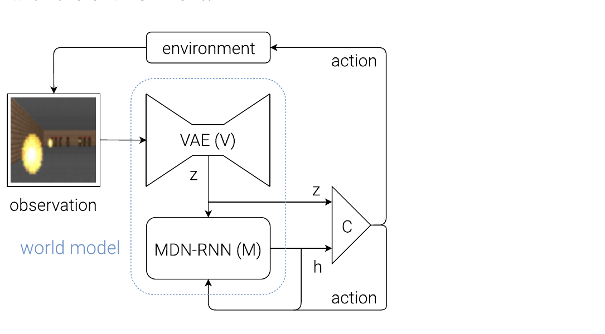
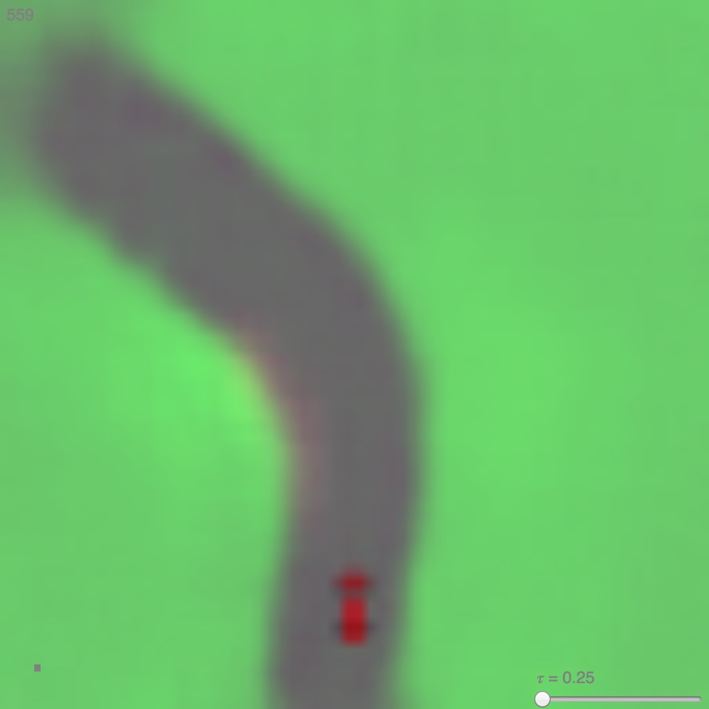
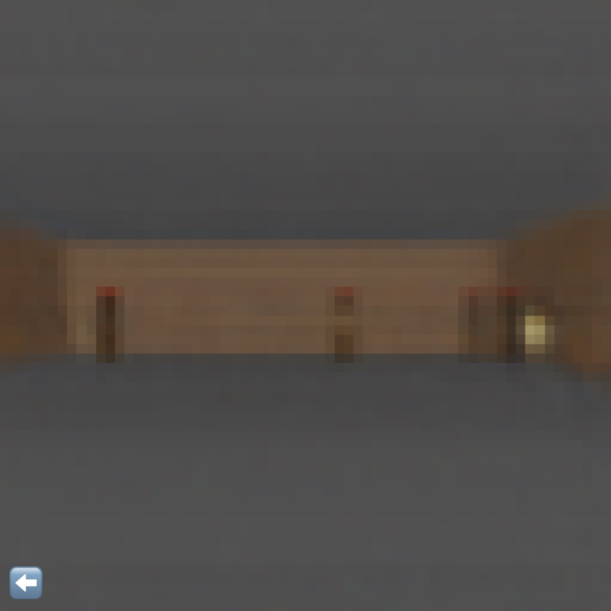

# World Models (2018)

Il paper [*World Models*](https://arxiv.org/abs/1803.10122), pubblicato da David Ha e Jürgen Schmidhuber nel 2018, propone un agente nel quale la maggior parte della capacità rappresentazionale non risiede nella policy, ma in un **modello generativo dell'ambiente** appreso dai dati.

Il titolo del lavoro ha contribuito a rendere popolare l'espressione *World Model*, ma il sistema studiato è più specifico dell'accezione moderna del termine. Non apprende un modello fisico strutturato e non effettua Model Predictive Control. Impara invece una dinamica probabilistica nello spazio latente delle immagini e ne espone lo stato al controller.

L'idea centrale è separare tre funzioni:

- **Vision (V)** comprime ogni osservazione visiva in un latent di bassa dimensionalità;
- **Memory (M)** integra la storia e predice la distribuzione del prossimo latent;
- **Controller (C)** usa rappresentazione corrente e memoria predittiva per scegliere l'azione.

Questa separazione permette di addestrare V e M con backpropagation su obiettivi supervisionati o auto-supervisionati ben definiti, lasciando all'ottimizzazione della policy soltanto un numero ridotto di parametri.

## Architettura Vision–Memory–Controller

Al tempo $t$, l'ambiente produce un'osservazione RGB $o_t$. Il VAE la converte nel latent $z_t$, mentre l'MDN-RNN aggiorna lo stato ricorrente $h_t$ usando il latent e l'azione. Il controller riceve sia $z_t$, che descrive l'osservazione corrente, sia $h_t$, che riassume la storia e contiene informazione predittiva sul futuro.

*Fonte: Ha e Schmidhuber, World Models, Figura 8. Il riquadro tratteggiato identifica il World Model formato da VAE e MDN-RNN; il controller rimane un modulo separato.*

### Vision model

Il **Convolutional Variational Autoencoder** riceve immagini ridimensionate a $64\times64$ pixel con tre canali RGB. L'encoder parametrizza una distribuzione gaussiana diagonale:

$$
q_\phi(z_t\mid o_t)=\mathcal{N}\left(\mu_\phi(o_t),\operatorname{diag}\left(\sigma_\phi^2(o_t)\right)\right)
$$

Qui $q_\phi$ è l'encoder con parametri $\phi$, mentre $\mu_\phi(o_t)$ e $\sigma_\phi(o_t)$ sono rispettivamente media e deviazione standard prodotte per l'osservazione $o_t$. Il latent viene campionato mediante reparameterization:

$$
z_t=\mu_\phi(o_t)+\sigma_\phi(o_t)\odot\epsilon
\qquad
\epsilon\sim\mathcal{N}(0,I)
$$

Il simbolo $\odot$ indica il prodotto elemento per elemento e $I$ la matrice identità. Il decoder $p_\psi(o_t\mid z_t)$, con parametri $\psi$, ricostruisce l'immagine. L'obiettivo combina errore di ricostruzione e regolarizzazione verso una normale standard:

$$
\mathcal{L}_{V} =
\mathbb{E}_{q_\phi(z_t\mid o_t)}
\left[\left\|o_t-\operatorname{Dec}_\psi(z_t)\right\|_2^2\right]
+
D_{\mathrm{KL}}
\left(q_\phi(z_t\mid o_t)\,\|\,\mathcal{N}(0,I)\right)
$$

Qui $\operatorname{Dec}_\psi$ è il decoder con parametri $\psi$ e $\|\cdot\|_2^2$ è l'errore quadratico di ricostruzione usato nel paper. Il primo termine richiede che $z_t$ conservi informazione sufficiente a ricostruire l'osservazione; la divergenza di Kullback–Leibler $D_{\mathrm{KL}}$ rende lo spazio latente regolare e riduce la probabilità che l'MDN-RNN generi codici che il decoder non sa interpretare.

Il latent ha dimensione 32 in CarRacing e 64 in VizDoom. Questa compressione è deliberatamente *lossy*: l'obiettivo non è preservare ogni pixel, ma ottenere una rappresentazione compatta sulla quale sia più semplice apprendere la dinamica.

### Memory model

Il VAE tratta ogni immagine separatamente e non descrive come il mondo cambia nel tempo. Questa funzione è affidata a una **LSTM con Mixture Density Network come output**, abbreviata MDN-RNN.

Dato lo stato ricorrente $h_t$, il latent $z_t$ e l'azione $a_t$, il modello assegna una distribuzione al latent successivo:

$$
p_\theta(z_{t+1}\mid z_t,a_t,h_t) =
\sum_{k=1}^{K}
\pi_{t,k}\,
\mathcal{N}
\left(z_{t+1};\mu_{t,k},\operatorname{diag}(\sigma_{t,k}^{2})\right)
$$

I parametri $\theta$ appartengono all'MDN-RNN. Il modello produce, per ciascuna delle $K$ componenti, il peso $\pi_{t,k}$, la media $\mu_{t,k}$ e la deviazione standard $\sigma_{t,k}$. Negli esperimenti viene usata una miscela di $K=5$ gaussiane fattorizzate.

La mixture permette di rappresentare **transizioni multimodali**. In VizDoom, per esempio, a parità di configurazione apparente un mostro può sparare oppure rimanere fermo; una media deterministica tra i due eventi produrrebbe un futuro sfocato e poco coerente.

Durante il sampling, una temperatura $\tau$ modifica l'entropia della distribuzione. Valori bassi rendono l'ambiente immaginato più deterministico, mentre valori maggiori producono transizioni più varie e difficili. La temperatura diventa così anche uno strumento per ridurre la possibilità che il controller si adatti a una singola previsione troppo regolare.

### Controller

Il controller è intenzionalmente semplice. Nel caso generale del paper consiste in una trasformazione lineare della concatenazione tra latent e memoria:

$$
a_t=W_c[z_t;h_t]+b_c
$$

Qui $W_c$ e $b_c$ sono gli unici parametri appresi dalla policy, mentre $[z_t;h_t]$ indica la concatenazione dei due vettori. Le componenti dell'azione vengono poi limitate agli intervalli ammessi dall'ambiente.

Il controller non viene addestrato tramite gradienti propagati attraverso il World Model. I parametri sono ottimizzati con **Covariance Matrix Adaptation Evolution Strategy (CMA-ES)**, usando come fitness il reward cumulativo medio di più rollout.

Questa scelta separa nettamente representation learning e credit assignment. VAE e MDN-RNN contengono milioni di parametri, ma CMA-ES deve esplorare soltanto lo spazio del piccolo controller: 867 parametri in CarRacing e 1,088 in VizDoom.

## Procedura di training

Il training non è end-to-end. I tre componenti vengono costruiti in successione, e ciascuno vede un segnale differente.

Per prima cosa, una **policy casuale raccoglie 10,000 rollout** in ciascun ambiente. Vengono memorizzate le osservazioni e le azioni, senza richiedere dimostrazioni esperte. Questa scelta rende semplice la raccolta, ma limita la copertura agli stati visitati casualmente.

Il VAE viene quindi addestrato a ricostruire i singoli frame. Dopo la codifica dell'intero dataset, l'MDN-RNN apprende le transizioni latenti con *teacher forcing*: durante il training riceve sequenze derivate dalle traiettorie reali, non le proprie predizioni ricorsive.

Infine, VAE e MDN-RNN vengono mantenuti fissi e CMA-ES ottimizza il controller. Il reward del task non supervisiona quindi il VAE. In CarRacing non supervisiona neppure l'MDN-RNN, che apprende soltanto a predire il latent futuro; in VizDoom il memory model riceve anche il target binario di terminazione necessario a trasformarlo in un ambiente virtuale completo.

Questa pipeline anticipa una distinzione importante nei World Model successivi: **apprendere una dinamica predittiva non equivale ad apprendere una rappresentazione sufficiente per il controllo**. Nel paper la distinzione viene gestita affidando al controller sia $z_t$ sia $h_t$, ma senza ottimizzare congiuntamente le tre parti.

## CarRacing-v0

CarRacing-v0 è un ambiente di guida top-down nel quale una nuova pista viene generata a ogni episodio. L'agente riceve immagini RGB e controlla tre variabili continue: sterzo, acceleratore e freno. Il reward favorisce la copertura delle tile della pista e penalizza il tempo impiegato.

Il VAE usa un latent $z_t\in\mathbb{R}^{32}$, mentre l'LSTM dell'MDN-RNN contiene 256 unità nascoste. Il World Model comprende circa 4.35 milioni di parametri nel VAE e 422,368 nell'MDN-RNN; il controller lineare ne contiene soltanto 867.

Il ruolo del World Model non consiste nell'effettuare rollout espliciti per scegliere ogni azione. La policy viene eseguita direttamente nell'ambiente reale e usa $h_t$ come **feature predittiva**. Il hidden state riassume la sequenza osservata e fornisce informazione che il singolo frame compresso in $z_t$ non contiene, come direzione e dinamica recente del veicolo.

Il controller che riceve soltanto $z_t$ ottiene $632\pm251$ su 100 episodi. L'aggiunta di un hidden layer porta il risultato a $788\pm141$, mentre il controller lineare che riceve $[z_t;h_t]$ raggiunge $906\pm21$ e supera la soglia di 900 usata dal benchmark.

L'MDN-RNN può anche essere eseguito autoregressivamente: il modello campiona $z_{t+1}$, il decoder del VAE lo rende visibile e il controller continua ad agire in questo ambiente generato.

*Fonte: Ha e Schmidhuber, World Models, Figura 13. Il frame proviene dall'ambiente CarRacing immaginato dall'MDN-RNN e renderizzato dal decoder del VAE; il parametro $\tau$ controlla la temperatura del sampling.*

Questa visualizzazione mostra che il modello ha appreso regolarità sufficienti a produrre una strada e il movimento del veicolo, ma non dimostra da sola accuratezza a lungo orizzonte. Il frame è infatti una decodifica di uno stato latente campionato, non un confronto quantitativo con il futuro reale che sarebbe seguito alla stessa sequenza di azioni.

## VizDoom: Take Cover

Nel task Take Cover l'agente si muove lateralmente per evitare le palle di fuoco lanciate dai mostri. Non esiste un reward denso distinto: la prestazione coincide con il numero di step per cui l'agente rimane vivo, fino a un massimo di 2,100. Il task è considerato risolto quando la sopravvivenza media supera 750 step su 100 episodi.

Il latent del VAE ha dimensione 64 e l'LSTM usa 512 unità nascoste. A differenza di CarRacing, l'MDN-RNN deve predire congiuntamente il prossimo latent e la probabilità di terminazione $d_{t+1}$:

$$
p_\theta(z_{t+1},d_{t+1}\mid z_t,a_t,h_t)
$$

La variabile binaria $d_{t+1}$ indica se l'agente muore al passo successivo. Questa uscita permette di racchiudere l'MDN-RNN dietro la stessa interfaccia dell'ambiente originale: il controller invia un'azione, riceve il nuovo stato latente e accumula reward finché la terminazione predetta non conclude l'episodio.

In questa fase il decoder del VAE non è necessario. Il controller viene addestrato **interamente nello spazio latente**, usando l'ambiente immaginato con temperatura $\tau=1.15$. La policy selezionata raggiunge 959 step medi su 1,024 rollout virtuali e, trasferita senza fine-tuning a VizDoom, ottiene $1,092\pm556$ su 100 episodi reali del simulatore.

Il risultato dimostra che un modello imperfetto può essere sufficiente se conserva le variabili necessarie al comportamento. Le ricostruzioni non mantengono sempre il numero esatto di mostri, ma la policy apprende comunque a reagire alle palle di fuoco e a sopravvivere.

## Model exploitation e ruolo della temperatura

L'esperimento VizDoom espone anche il limite più importante dell'approccio. Ottimizzando a lungo il reward nel modello appreso, il controller può trovare azioni che sembrano valide soltanto perché portano il simulatore latente fuori dalla distribuzione coperta dai 10,000 rollout casuali.

In alcune prove l'agente impara a muoversi in modo da impedire al modello di generare le palle di fuoco o da farle scomparire. La policy non ha imparato a evitare il pericolo: ha scoperto una **imperfezione della dinamica appresa**.

*Fonte: Ha e Schmidhuber, World Models, Figura 18. Nel rollout immaginato il controller trova una traiettoria che estingue automaticamente le palle di fuoco, comportamento non valido nell'ambiente VizDoom originale.*

La temperatura rende visibile il problema. Con $\tau=0.10$, il modello quasi deterministico soffre di mode collapse e genera raramente le palle di fuoco: la policy ottiene $2,086\pm140$ nel sogno ma soltanto $193\pm58$ nell'ambiente originale. Con $\tau=1.15$, il reward virtuale scende a $918\pm546$, mentre quello reale sale a $1,092\pm556$.

Un ambiente immaginato più rumoroso agisce quindi come una forma di **domain randomization interna**: impedisce al controller di fare affidamento su una singola traiettoria favorevole e seleziona comportamenti più robusti. Non offre però una garanzia. Se il modello omette sistematicamente un fenomeno oppure assegna probabilità errate alle conseguenze di un'azione, aumentare $\tau$ non recupera l'informazione mancante.

## Novelty

Il contributo più riconoscibile è la decomposizione **Vision–Memory–Controller**. Il paper mostra che un encoder visuale e una dinamica ricorrente possono assorbire gran parte della complessità percettiva e temporale, lasciando alla policy una trasformazione lineare con poche centinaia o migliaia di parametri.

Il secondo contributo è la dimostrazione concreta del **training in imagination**. In VizDoom il modello appreso non si limita a fornire feature o brevi predizioni: sostituisce il simulatore durante tutta l'ottimizzazione del controller, e la policy risultante viene trasferita all'ambiente originale senza ulteriore training.

Il lavoro rende infine esplicito che un World Model utile non deve riprodurre perfettamente ogni dettaglio visivo. Deve preservare le regolarità che modificano reward e decisioni, come il movimento relativo delle palle di fuoco e la probabilità di terminazione.

## Limiti

La procedura è **modulare ma non end-to-end**. Il VAE minimizza una loss di ricostruzione indipendente dal task e può dedicare capacità a dettagli irrilevanti, omettendo invece elementi piccoli ma decisivi per il controllo. Il paper osserva, per esempio, che alcune texture vengono ricostruite meglio delle tile della pista rilevanti per CarRacing.

I dati di training sono raccolti da una policy casuale. Un simile dataset può coprire ambienti semplici, ma diventa inefficiente quando stati informativi richiedono sequenze di azioni coordinate. Il controller può inoltre raggiungere regioni che la policy di raccolta non ha visitato, producendo **distribution shift all'interno del simulatore appreso**.

L'MDN-RNN predice un passo alla volta. Durante i rollout immaginati, i suoi output diventano input successivi e gli errori si accumulano. La mixture gaussiana rappresenta più esiti possibili, ma non impedisce perdita di coerenza, mode collapse o transizioni causalmente scorrette.

Gli esperimenti riguardano due videogiochi relativamente semplici. Non sono presenti robot fisici, linguaggio, percezione multi-view, propriocezione, tatto, contatti o trasferimento tra embodiment. Il passaggio dal simulatore latente a un sistema reale rimane quindi una prospettiva, non un risultato dimostrato dal paper.

Anche CMA-ES è sostenibile soprattutto perché il controller è molto piccolo. La scelta evita di differenziare attraverso il modello, ma richiede molti rollout e non scala direttamente a policy con milioni di parametri.

## Eredità concettuale

World Models stabilisce una separazione che guiderà molti lavori successivi: **rappresentazione dello stato, dinamica latente e comportamento possono essere appresi con obiettivi differenti ma utilizzati nello stesso ciclo decisionale**.

PlaNet renderà più stretta l'integrazione tra inferenza dello stato e transizione introducendo un Recurrent State-Space Model e userà il latent per il planning online. Dreamer sostituirà invece CMA-ES con actor e critic differenziabili addestrati su rollout immaginati. Entrambe le linee conservano l'intuizione fondamentale del lavoro del 2018, ma cercano di rendere la rappresentazione più utile al controllo e l'apprendimento nel modello più stabile e scalabile.
